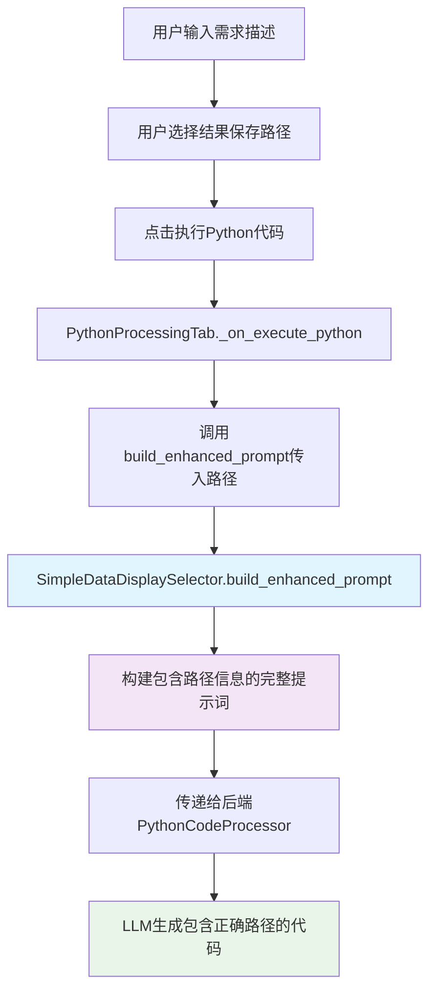

# 在初始提示词中添加结果保存路径信息

## Status
In Progress

## Objective / Summary
在Python代码处理功能的初始提示词`{requirement}`部分中新增"结果保存路径"元素，使LLM在生成代码时能够了解用户指定的输出目录，从而生成更准确的文件保存代码。

## Scope
预估修改的文件：
- `ui/python_processing_tab.py` - 修改调用`build_enhanced_prompt`方法时传入路径参数
- `ui/python_processing_tab.py` - 修改`SimpleDataDisplaySelector.build_enhanced_prompt`方法签名和实现

## Detailed Plan

### 核心修改点
1. **修改`SimpleDataDisplaySelector.build_enhanced_prompt`方法**：
   - 添加可选参数`output_path: str = ""`
   - 在提示词结构中新增"# 结果保存路径"部分
   - 保持向后兼容性

2. **修改调用点**：
   - 在`PythonProcessingTab._on_execute_python`方法中传入路径信息

### 提示词结构变更
**修改前：**
```
# 数据处理需求

{requirement}

---

# Excel文件、工作表和处理列信息

{excel_info}

---

# Excel数据样例

{sample_data}
```

**修改后：**
```
# 数据处理需求

{requirement}

---

# 结果保存路径

{output_path}

---

# Excel文件、工作表和处理列信息

{excel_info}

---

# Excel数据样例

{sample_data}
```

## Visualization



## Testing Strategy
1. **功能测试**：验证路径信息正确添加到提示词中
2. **兼容性测试**：确保不传入路径参数时功能正常
3. **集成测试**：验证整个流程从UI到代码生成的完整性

## Security Considerations
- 路径信息仅用于提示词构建，不涉及直接的文件系统操作
- 需要确保路径信息正确转义，避免注入问题

## Implementation Notes
(交付时添加)