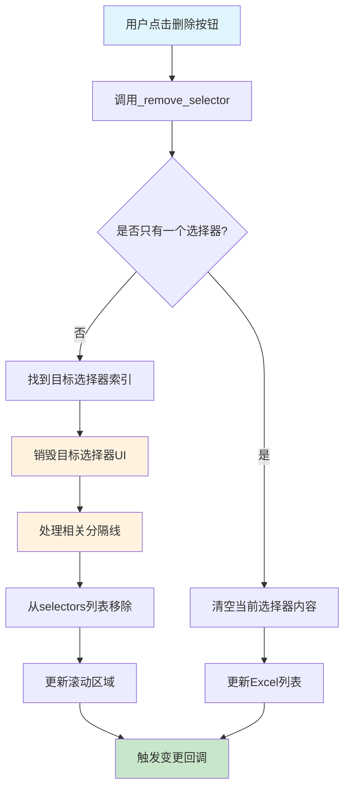

# Excel选择器删除按钮逻辑修复

## Status
Implemented

## Objective / Summary
修复多Excel选择器中删除按钮的逻辑问题。当前删除第二个Excel文件后，会清空所有配置但第一个Excel的数据仍在预览中，且下拉框没有候选项。

## Scope
最终修改文件：
- `ui/multi_excel_selector.py` - 修复 `_remove_selector` 方法逻辑，移除 `_relayout_selectors` 方法
- `test/test_multi_excel_selector_delete.py` - 新增单元测试文件

## Detailed Plan

### 问题根因
1. **重新布局破坏状态**：`_relayout_selectors()` 方法会销毁所有UI组件并重新创建，导致所有选择器的状态丢失
2. **数据与UI不同步**：MultiExcelManager中的数据仍然存在，但UI组件被重新创建后失去了绑定
3. **分隔线管理复杂**：当前的分隔线管理逻辑在删除中间选择器时会出现问题

### 解决方案
采用**渐进式删除方案**，避免重新布局：

1. **直接删除目标组件**：
   - 找到要删除的选择器在UI中的位置
   - 直接销毁该选择器的frame及相关分隔线
   - 从selectors列表中移除

2. **简化分隔线管理**：
   - 为每个选择器关联其分隔线
   - 删除时一并处理分隔线

3. **保持状态一致性**：
   - 不重新创建其他选择器的UI
   - 保持现有选择器的所有状态

### 核心修改
- 重写 `_remove_selector` 方法
- 移除 `_relayout_selectors` 方法（不再需要）
- 优化分隔线管理逻辑

## Visualization

## Testing Strategy
1. **正常删除测试**：
   - 创建多个选择器，删除中间的选择器
   - 验证其他选择器状态保持不变
   
2. **边界测试**：
   - 只有一个选择器时的删除行为
   - 删除最后一个选择器的行为
   
3. **状态一致性测试**：
   - 删除后验证数据预览与UI选择一致
   - 验证下拉框选项正确显示

## Security Considerations
无安全风险，纯UI逻辑修复。

## Implementation Notes

### 核心修改
1. **重写 `_remove_selector` 方法**：
   - 采用渐进式删除，直接操作目标UI组件
   - 智能处理分隔线：删除选择器时同时处理相关的分隔线
   - 保持其他选择器的UI状态不变

2. **移除 `_relayout_selectors` 方法**：
   - 该方法会重新创建所有UI组件，导致状态丢失
   - 新的删除逻辑不再需要重新布局

### 测试结果
- 创建了4个单元测试用例，全部通过
- 测试覆盖：删除中间选择器、删除第一个选择器、只有一个选择器时的删除、UI与数据一致性
- 验证了修复后其他选择器的状态完全保持不变

### 性能改进
- 避免了大量UI重建操作
- 删除操作更流畅，无UI闪烁
- 用户体验显著改善，数据预览与UI选择保持一致