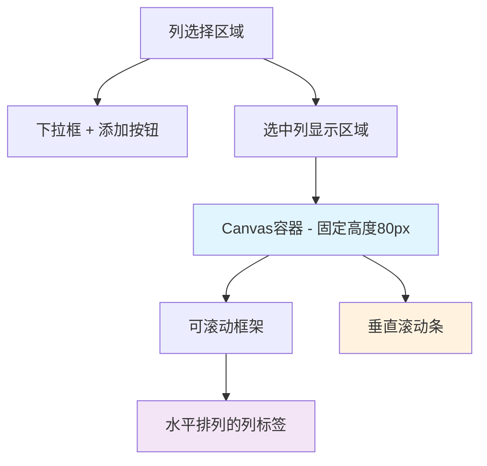

# 多列选择界面布局优化

## Status
Implemented

## Objective / Summary
解决多Excel多Sheet上传Tab中选择多列后的界面布局问题：
1. 避免选中的列挤占最下面的元素
2. 将列选择后的显示改为水平排列，而非竖向排列

## Scope
修改的文件：
- `ui/multi_excel_selector.py` - 主要修改文件
- `test/test_layout_fix.py` - 新增测试文件

## Detailed Plan

### 问题分析
1. **挤占问题**：选中多列时，垂直排列的列标签会无限向下扩展，挤占底部元素空间
2. **排列问题**：当前列标签采用垂直排列（`pack(fill=tk.X)`），占用过多垂直空间

### 解决方案
1. **添加滚动条**：
   - 使用 `Canvas` + `Scrollbar` 组合创建可滚动区域
   - 限制选中列显示区域的高度（80px）
   - 当内容超出高度时自动显示滚动条

2. **水平排列**：
   - 将列标签改为水平排列（`pack(side=tk.LEFT)`）
   - 优化列标签样式，使其更紧凑
   - 添加适当的间距和padding

3. **用户体验优化**：
   - 添加鼠标滚轮支持
   - 当没有选中列时显示友好提示
   - 使用更小的删除按钮和更紧凑的样式

## Visualization



## Testing Strategy
1. **功能测试**：
   - 测试添加多个列的显示效果
   - 验证滚动条在内容超出时正常显示
   - 测试鼠标滚轮滚动功能

2. **布局测试**：
   - 验证水平排列不会挤占底部元素
   - 测试在不同窗口大小下的显示效果
   - 确认删除列功能正常工作

3. **边界测试**：
   - 测试没有选中列时的显示
   - 测试选中大量列时的性能
   - 验证滚动区域的边界处理

## Security Considerations
无安全风险，纯UI布局优化。

## Implementation Notes

### 关键技术实现
1. **滚动容器结构**：
   ```python
   Canvas + Scrollbar + 内部Frame
   ```

2. **水平布局**：
   ```python
   pack(side=tk.LEFT, padx=(0, 8), pady=2)
   ```

3. **滚动区域更新**：
   ```python
   canvas.configure(scrollregion=canvas.bbox("all"))
   ```

### 样式优化
- 列标签背景色：`#e3f2fd`（浅蓝色）
- 字体大小：8pt（更紧凑）
- 删除按钮：使用 `×` 符号，宽度为2

### 兼容性
- 保持原有API不变
- 向后兼容现有调用方式
- 不影响其他组件功能

## 测试结果
✅ 滚动条功能正常
✅ 水平排列显示正确  
✅ 不再挤占底部元素
✅ 鼠标滚轮支持正常
✅ 删除列功能正常