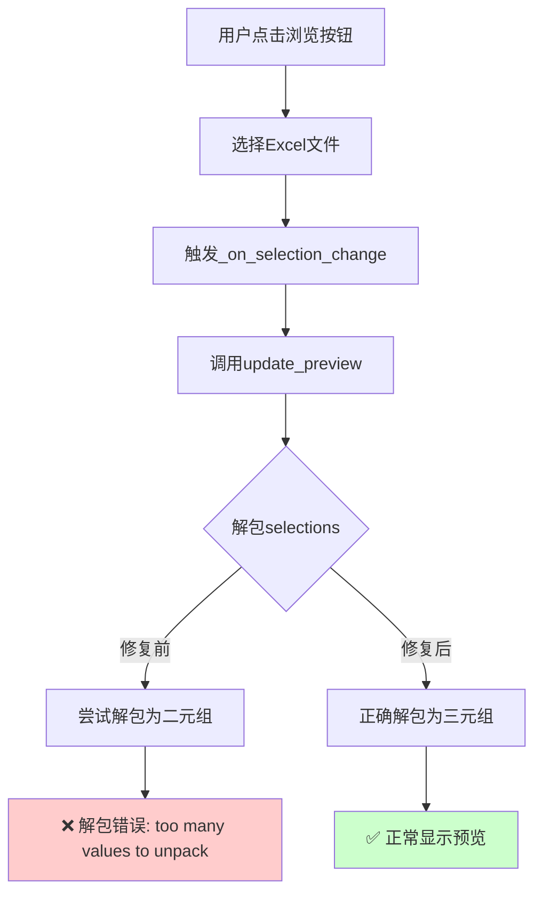

# 修复多Excel Tab解包错误 - 20250909

## Status
`Implemented`

## Objective / Summary
修复多Excel Tab中点击"浏览"按钮选择Excel文件后出现的"too many values to unpack (expected 2)"错误。

## Scope
修改的文件和模块：
- `ui/multi_excel_tab.py` - 修复两处解包错误
- `test/test_unpack_fix_simple.py` - 新增回归测试

## Detailed Plan

### 根本原因分析
1. **数据结构不匹配**: `ExcelSheetSelector.get_selection()`返回三元组`(file_path, sheet_name, selected_columns)`，但`multi_excel_tab.py`中的代码试图解包为二元组`(file_path, sheet_name)`
2. **代码演进不一致**: 原始设计只考虑文件和Sheet选择，后来添加了列选择功能，但未同步更新所有使用该数据的地方

### 修复方案
修改`ui/multi_excel_tab.py`中的两处解包代码：

**第290行修复**:
```python
# 修复前
total_files = len(set(file_path for file_path, _ in selections))

# 修复后  
total_files = len(set(file_path for file_path, _, _ in selections))
```

**第415行修复**:
```python
# 修复前
for file_path, sheet_name in selections:

# 修复后
for file_path, sheet_name, selected_columns in selections:
```

## Visualization



## Testing Strategy

### 回归测试覆盖
1. **正常用例**: 验证三元组解包在列表推导式和for循环中正常工作
2. **边界用例**: 测试空selections的处理
3. **异常用例**: 确认旧的二元组格式会产生预期的错误
4. **格式验证**: 验证解包后的数据格式正确

### 测试结果
- 所有5个测试用例通过
- 验证了修复前会出现的解包错误
- 确认修复后能正确处理三元组数据

## Security Considerations
无安全风险。此修复仅涉及数据结构解包，不涉及用户输入验证或权限控制。

## Implementation Notes

### 实际修复内容
1. **第290行**: 修改列表推导式中的解包模式，从`file_path, _`改为`file_path, _, _`
2. **第415行**: 修改for循环中的解包模式，从`file_path, sheet_name`改为`file_path, sheet_name, selected_columns`

### 关键发现
- 错误的触发点是用户选择Excel文件后的预览更新过程
- `MultiExcelSelector.get_all_selections()`始终返回三元组格式
- 修复保持了向后兼容性，不影响其他模块的数据获取

### 验证方法
- 创建了专门的回归测试`test_unpack_fix_simple.py`
- 测试覆盖了核心解包逻辑，避免了GUI依赖
- 所有测试用例通过，确认修复有效

### 风险评估
- **低风险**: 修复仅涉及数据解包，不改变业务逻辑
- **无副作用**: 其他模块继续正常工作
- **向后兼容**: 不影响现有功能

## 完成标准验证
- ✅ 代码已根据分析实现修复
- ✅ 回归测试已编写并通过
- ✅ 代码已通过自我审查
- ✅ 变更文档已按规范撰写
- ✅ 修复内容已获得确认