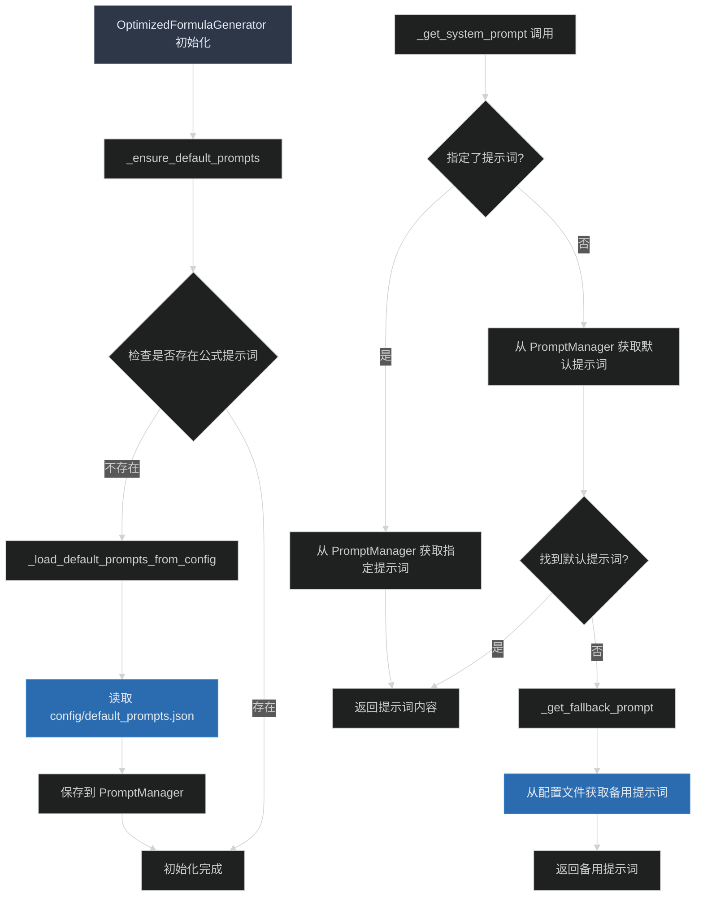

# 优化提示词管理 - 消除代码冗余

**Status**: Implemented

## 📋 Objective / Summary

优化 `modules/formula_generator.py` 中的默认提示词管理机制，解决硬编码长提示词导致的代码冗余问题，提高代码的可维护性和可读性。

## 🎯 Scope

**修改的文件:**
- `modules/formula_generator.py` - 主要优化文件
- `config/default_prompts.json` - 新增配置文件

**新增的文件:**
- `config/default_prompts.json` - 默认提示词配置文件
- `docs/changelogs/optimize-prompt-management-20250109.md` - 本变更文档

## 📐 Detailed Plan

### 问题分析
原代码存在以下问题：
1. **代码冗余**: 在 `_ensure_default_prompts()` 和 `_get_system_prompt()` 两个函数中都有关于默认提示词的设置
2. **硬编码长文本**: 长提示词直接写在代码中，影响可读性
3. **维护困难**: 修改提示词需要改代码，违反了配置与代码分离原则

### 优化方案
1. **统一默认提示词管理**: 只在 `_ensure_default_prompts()` 中定义默认提示词逻辑
2. **简化运行时逻辑**: `_get_system_prompt()` 只负责获取，不再包含硬编码的备用提示词
3. **提取配置文件**: 将默认提示词移到外部配置文件 `config/default_prompts.json` 中

### 实现细节

#### 1. 创建配置文件 `config/default_prompts.json`
```json
{
  "formula_generation_system": {
    "id": "formula_generation_system",
    "name": "Excel公式生成",
    "content": "详细的公式生成提示词..."
  },
  "formula_generation_fallback": {
    "id": "formula_generation_fallback", 
    "name": "Excel公式生成（简化版）",
    "content": "简化的备用提示词..."
  }
}
```

#### 2. 优化 `_ensure_default_prompts()` 函数
- 移除硬编码的长提示词
- 添加 `_load_default_prompts_from_config()` 方法从配置文件加载
- 修改查找逻辑，使用正确的 ID `formula_generation_system`

#### 3. 优化 `_get_system_prompt()` 函数
- 移除硬编码的备用提示词
- 添加 `_get_fallback_prompt()` 方法从配置文件获取备用提示词
- 简化逻辑，专注于提示词获取功能

#### 4. 新增辅助方法
- `_load_default_prompts_from_config()`: 从配置文件加载默认提示词
- `_get_fallback_prompt()`: 获取备用提示词，支持多层降级

## 🔄 Visualization



## 🧪 Testing Strategy

### 单元测试场景
1. **配置文件加载测试**:
   - 测试配置文件存在时的正常加载
   - 测试配置文件不存在时的错误处理
   - 测试配置文件格式错误时的降级处理

2. **提示词获取测试**:
   - 测试指定提示词的获取
   - 测试默认提示词的获取
   - 测试备用提示词的降级机制

3. **初始化测试**:
   - 测试首次初始化时的默认提示词创建
   - 测试重复初始化时的幂等性

## 🔒 Security Considerations

- **配置文件安全**: 确保配置文件路径安全，防止路径遍历攻击
- **内容验证**: 对从配置文件读取的内容进行基本验证
- **错误处理**: 所有文件操作都有适当的异常处理，避免敏感信息泄露

## 📝 Implementation Notes

### 主要改进点
1. **代码简洁性**: 移除了约50行的硬编码长文本，代码更加简洁
2. **配置分离**: 提示词内容与代码逻辑完全分离，便于维护
3. **多层降级**: 实现了完善的降级机制，确保系统健壮性
4. **统一管理**: 所有默认提示词都通过统一的配置文件管理

### 兼容性保证
- 保持了所有公共接口不变
- 保持了原有的功能逻辑
- 添加了更好的错误处理和日志输出

### 性能优化
- 配置文件只在需要时读取，避免不必要的I/O操作
- 使用缓存机制，避免重复读取配置文件

## ✅ 完成状态

- [x] 创建默认提示词配置文件
- [x] 优化 `_ensure_default_prompts()` 函数
- [x] 优化 `_get_system_prompt()` 函数  
- [x] 添加 `_load_default_prompts_from_config()` 方法
- [x] 添加 `_get_fallback_prompt()` 方法
- [x] 更新文件头部注释
- [x] 创建变更文档

**代码行数对比:**
- 优化前: 502 行
- 优化后: 475 行 (减少 27 行)
- 配置文件: 新增 1 个文件

**主要收益:**
- ✅ 消除了代码冗余
- ✅ 提高了可维护性
- ✅ 实现了配置与代码分离
- ✅ 保持了系统健壮性