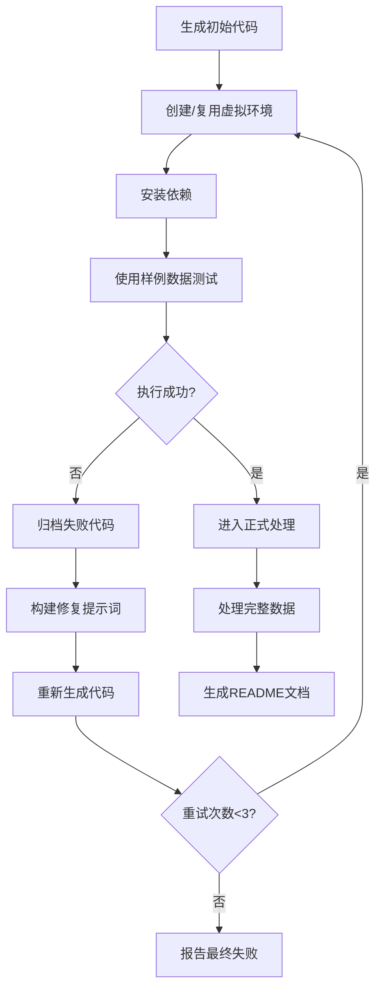
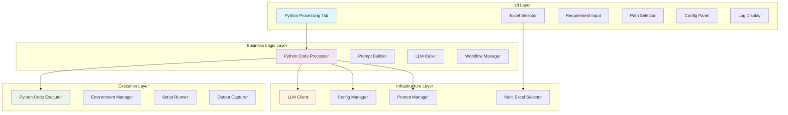

# Python代码处理功能开发

## Status
Proposal

## Objective / Summary
开发一个智能的Python代码生成和执行系统，允许用户通过自然语言描述数据处理需求，系统自动生成Python脚本、创建执行环境、自动测试修复、执行数据处理并生成完整文档。

核心流程：**需求描述 → 代码生成 → 自动测试与修复 → 正式数据处理 → 结果与文档生成**

## Scope
本次变更将新增以下文件和模块：

### 新增文件
1. `ui/python_processing_tab.py` - Python处理功能的UI界面
2. `modules/python_code_processor.py` - 主控制器，管理整个工作流
3. `modules/python_code_executor.py` - Python代码执行引擎

### 修改文件
1. `main.py` - 集成新的UI Tab（预计修改）
2. `config/prompts.json` - 已包含所需的系统提示词

### 复用组件
- `ui/multi_excel_selector.py` - Excel文件和Sheet选择
- `units/llm_client.py` - LLM API调用
- `modules/config_manager.py` - 配置管理
- `modules/prompt_manager.py` - 提示词管理

## Detailed Plan

### 1. UI设计 (`ui/python_processing_tab.py`)

#### 布局结构
采用与`formula_generation_tab.py`完全一致的左右分栏布局：

**左侧面板**：
- **Excel文件和Sheet选择**：复用`MultiExcelSelector`组件
- **需求描述**：多行文本框，用户输入自然语言处理需求
- **结果保存路径**：
  - 只读文本框显示选择的路径
  - "选择路径"按钮打开文件夹选择对话框
- **生成配置**：复用现有LLM配置组件
  - 提示词选择（默认"python代码编写"）
  - 模型选择
  - Temperature和Top_p参数
- **执行按钮**："生成并执行Python代码"

**右侧面板**：
- **实时日志**：多行文本框，显示整个流程的状态信息
- **辅助按钮**："清空日志"和"下载日志"

#### 关键UI特性
- 实时状态更新：显示当前执行阶段
- 进度指示：显示代码生成、测试、修复的进度
- 错误高亮：失败信息用红色显示
- 成功提示：完成后显示绿色成功信息

### 2. 主控制器 (`modules/python_code_processor.py`)

#### 核心职责
- 协调整个工作流程
- 管理LLM调用
- 控制代码执行器
- 处理错误和重试逻辑

#### 主要方法
```python
class PythonCodeProcessor:
    def __init__(self):
        # 初始化LLM客户端、配置管理器等
    
    def process_python_code(self, requirement, excel_selections, output_path, config):
        """主处理流程"""
        # 1. 构建初始提示词
        # 2. 生成代码
        # 3. 自动测试与修复循环
        # 4. 正式数据处理
        # 5. 生成文档
    
    def _build_initial_prompt(self, requirement, excel_data):
        """构建包含需求和样例数据的提示词"""
    
    def _generate_code(self, prompt, system_prompt, config):
        """调用LLM生成Python代码"""
    
    def _auto_test_and_fix_loop(self, code, sample_data, output_path, config):
        """自动测试与修复循环（最大3次重试）"""
    
    def _process_full_data(self, final_code, excel_selections, output_path):
        """使用最终代码处理完整数据"""
    
    def _generate_documentation(self, requirement, final_code, results, output_path):
        """生成README.md文档"""
```

#### 错误处理策略
- **可修复错误**：语法错误、导入错误、逻辑错误等，自动重新生成代码
- **不可修复错误**：系统依赖缺失、权限问题等，提供明确的用户指导
- **重试限制**：最大重试3次，避免无限循环

### 3. 代码执行引擎 (`modules/python_code_executor.py`)

#### 核心功能
```python
class PythonCodeExecutor:
    def __init__(self, work_dir):
        self.work_dir = work_dir
        self.venv_path = os.path.join(work_dir, '.venv')
    
    def setup_environment(self, requirements_content):
        """设置Python虚拟环境并安装依赖"""
        # 1. 创建或复用虚拟环境
        # 2. 安装requirements.txt中的依赖
    
    def execute_script(self, script_content, input_data=None):
        """执行Python脚本并捕获输出"""
        # 1. 写入脚本文件
        # 2. 准备输入数据
        # 3. 在虚拟环境中执行
        # 4. 捕获stdout、stderr和exit_code
    
    def cleanup_failed_attempt(self, attempt_number):
        """清理失败的尝试，归档到changelogs"""
```

#### 技术实现
- **虚拟环境管理**：使用`venv`模块创建隔离环境
- **进程执行**：使用`subprocess`模块执行Python脚本
- **输出捕获**：分别捕获标准输出和错误输出
- **文件管理**：自动管理代码文件、日志文件的创建和归档

### 4. 自动测试与修复循环

#### 流程设计


#### 版本管理
- 失败的代码自动保存到`{output_path}/changelogs/attempt_{timestamp}/`
- 包含：`main.py`、`requirements.txt`、`error.log`
- 便于用户查看和调试历史尝试

### 5. 提示词设计

#### 系统提示词
复用`config/prompts.json`中的现有提示词：
- **初始生成**：使用"python代码编写"提示词
- **错误修复**：使用"python代码修复"提示词

#### 提示词构建策略
```python
def build_enhanced_prompt(requirement, excel_info, sample_data):
    return f"""
# 数据处理需求
{requirement}

# Excel文件信息
{excel_info}

# 样例数据
{sample_data}

请生成完整的Python代码，包括：
1. main.py - 主处理逻辑
2. requirements.txt - 依赖列表
"""
```

## Visualization



## Testing Strategy

### 单元测试
1. **PythonCodeExecutor测试**：
   - 虚拟环境创建和管理
   - 依赖安装功能
   - 脚本执行和输出捕获
   - 错误处理机制

2. **PythonCodeProcessor测试**：
   - 提示词构建逻辑
   - 重试机制
   - 文档生成功能

### 集成测试
1. **端到端测试**：
   - 完整工作流测试
   - 不同类型Excel数据处理
   - 各种错误场景处理

### 测试数据
- 准备多种类型的Excel测试文件
- 设计不同复杂度的处理需求
- 模拟各种错误场景

## Security Considerations

### 代码执行安全
1. **沙箱环境**：所有代码在独立的虚拟环境中执行
2. **路径限制**：限制文件访问范围在用户指定的工作目录内
3. **依赖验证**：检查requirements.txt中的包名合法性
4. **超时控制**：设置脚本执行超时时间

### 数据安全
1. **本地处理**：所有数据处理在本地进行，不上传到外部服务
2. **临时文件清理**：及时清理临时生成的文件
3. **权限控制**：确保生成的文件具有适当的访问权限

## Implementation Notes

### 开发顺序
1. **第一阶段**：开发`PythonCodeExecutor`核心功能
2. **第二阶段**：开发`PythonCodeProcessor`主控制逻辑
3. **第三阶段**：开发UI界面并集成
4. **第四阶段**：完善错误处理和文档生成
5. **第五阶段**：全面测试和优化

### 关键技术细节
1. **虚拟环境复用**：检查现有虚拟环境的Python版本和依赖兼容性
2. **进程管理**：确保子进程正确终止，避免僵尸进程
3. **编码处理**：正确处理中文文件名和内容编码
4. **异步UI更新**：使用线程避免UI阻塞

### 错误恢复机制
1. **环境损坏恢复**：虚拟环境损坏时自动重建
2. **依赖冲突处理**：检测并解决依赖版本冲突
3. **磁盘空间检查**：执行前检查可用磁盘空间

这个设计确保了功能的完整性、安全性和用户体验，同时最大化复用现有代码，降低开发风险。