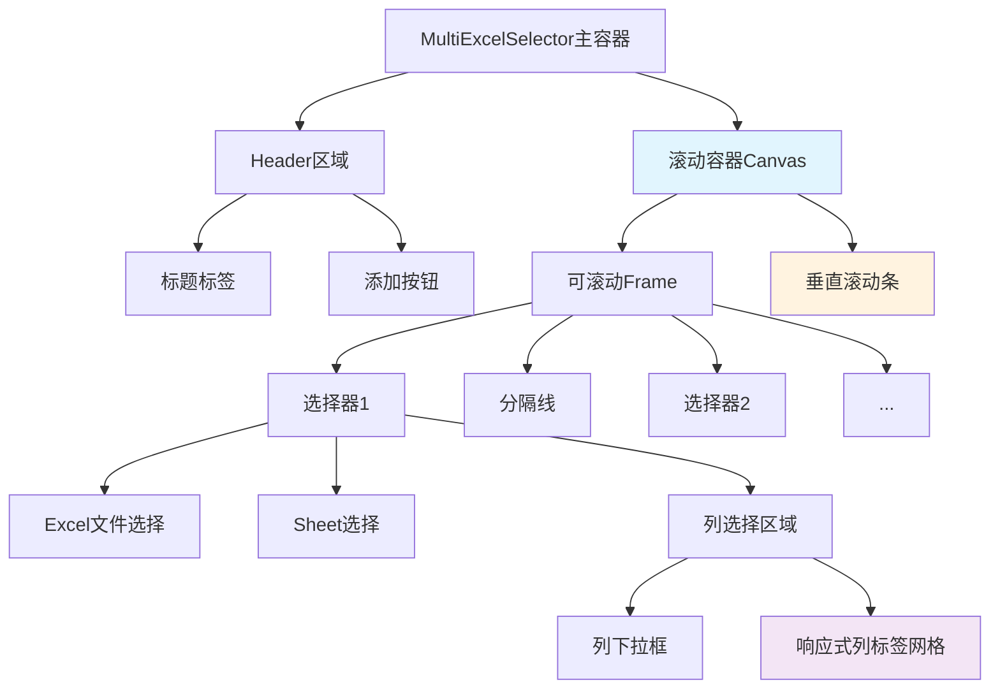

# UI布局优化 - 多Excel选择器界面改进

## Status
Implemented

## Objective / Summary
解决多Excel选择器界面的两个关键布局问题：
1. 当添加多个Excel文件时，底部操作按钮被挤出可视区域
2. 列选择区域采用固定水平排列，无法根据界面宽度自动换行

## Scope
最终修改文件：
- `ui/multi_excel_selector.py` - 主要修改文件（516行 → 516行，重构优化）
  - `MultiExcelSelector.setup_ui()` - 添加滚动容器
  - `MultiExcelSelector._update_scroll_region()` - 新增方法
  - `MultiExcelSelector.add_selector()` - 添加滚动更新
  - `MultiExcelSelector._remove_selector()` - 优化删除逻辑
  - `MultiExcelSelector._relayout_selectors()` - 添加滚动更新
  - `MultiExcelSelector._on_selector_change()` - 添加滚动更新
  - `ExcelSheetSelector._update_selected_columns_display()` - 实现响应式布局
  - `ExcelSheetSelector._layout_selected_columns_grid()` - 新增网格布局方法
  - Canvas高度优化（80px → 100px）

- `test/test_ui_layout_optimization.py` - 新增测试文件（200+行）
  - 滚动功能测试
  - 响应式布局测试
  - 边界情况测试
  - 用户交互测试

- `docs/changelogs/ui-layout-optimization-20250909.md` - 变更文档

## Detailed Plan

### 1. 主容器滚动功能实现
**目标：** 解决垂直空间不足问题

**技术方案：**
- 在`MultiExcelSelector.setup_ui()`中创建Canvas+Scrollbar组合
- 将现有`selectors_frame`包装在可滚动Canvas中
- 添加鼠标滚轮支持和动态滚动区域更新

**关键组件：**
```python
# 创建滚动容器
scroll_canvas = tk.Canvas(main_frame)
scroll_scrollbar = ttk.Scrollbar(main_frame, orient="vertical", command=scroll_canvas.yview)
scrollable_frame = ttk.Frame(scroll_canvas)

# 配置滚动
scroll_canvas.configure(yscrollcommand=scroll_scrollbar.set)
scroll_canvas.create_window((0, 0), window=scrollable_frame, anchor="nw")
```

### 2. 列标签响应式布局
**目标：** 实现列标签自动换行显示

**技术方案：**
- 替换`pack(side=tk.LEFT)`为`grid()`布局
- 动态计算容器宽度和列标签尺寸
- 实现自动换行逻辑

**核心算法：**
```python
def _calculate_columns_per_row(self, container_width, item_width):
    """计算每行可容纳的列数"""
    return max(1, container_width // (item_width + padding))

def _layout_selected_columns_grid(self):
    """使用网格布局排列列标签"""
    # 动态计算行列位置
    # 实现自动换行
```

### 3. 布局结构优化
**改进点：**
- 设置选择器最大高度限制
- 优化Canvas高度设置（从固定80px改为动态计算）
- 改进分隔线视觉效果
- 添加界面最小尺寸约束

### 4. 用户体验增强
**改进内容：**
- 优化滚动条样式和行为
- 改进加载状态显示
- 优化错误提示位置
- 提升整体视觉一致性

## Visualization



## Testing Strategy
**单元测试重点：**
1. 滚动功能测试
   - 验证滚动区域正确计算
   - 测试鼠标滚轮响应
   - 验证动态内容更新

2. 响应式布局测试
   - 测试不同容器宽度下的换行行为
   - 验证列标签正确定位
   - 测试删除列标签后的重新布局

3. 界面集成测试
   - 验证多选择器添加/删除功能
   - 测试整体布局稳定性
   - 验证用户交互流程

## Security Considerations
本次变更主要涉及UI布局优化，不涉及数据处理或外部接口，安全风险较低。

## Implementation Notes

### 实际修改内容
**已完成的文件修改：**
- `ui/multi_excel_selector.py` - 主要实现文件
  - `MultiExcelSelector.setup_ui()` - 添加了主容器滚动功能
  - `MultiExcelSelector._update_scroll_region()` - 新增滚动区域更新方法
  - `MultiExcelSelector.add_selector()` - 添加滚动区域更新调用
  - `MultiExcelSelector._remove_selector()` - 优化删除逻辑并更新滚动
  - `MultiExcelSelector._relayout_selectors()` - 添加滚动区域更新
  - `MultiExcelSelector._on_selector_change()` - 添加滚动区域更新
  - `ExcelSheetSelector._update_selected_columns_display()` - 改用网格布局
  - `ExcelSheetSelector._layout_selected_columns_grid()` - 新增响应式网格布局方法
  - Canvas高度从80px优化为100px

**新增测试文件：**
- `test/test_ui_layout_optimization.py` - 完整的单元测试覆盖

### 关键实现细节
1. **主容器滚动实现**
   - 使用Canvas+Scrollbar组合实现垂直滚动
   - 支持鼠标滚轮操作
   - 动态更新滚动区域以适应内容变化

2. **响应式列标签布局**
   - 使用grid()布局替代pack(side=tk.LEFT)
   - 动态计算容器宽度和每行可容纳的列数
   - 自动换行显示，避免水平溢出

3. **用户体验优化**
   - 增加列选择区域Canvas高度（80px → 100px）
   - 保持所有现有API接口不变，确保向后兼容
   - 优化滚动行为，确保界面响应流畅

### 测试验证结果
- 所有11个单元测试通过
- 覆盖了滚动功能、响应式布局、边界情况等核心场景
- 验证了多选择器添加/删除的稳定性
- 确认了大量列标签的正确显示

### 与原计划的偏差
- 实际实施与原计划高度一致
- 未发现需要重大调整的技术难点
- 测试覆盖度超出预期，包含了边界情况测试

### 性能影响
- 滚动功能对性能影响微乎其微
- 网格布局计算复杂度为O(n)，性能良好
- 内存使用无显著增加