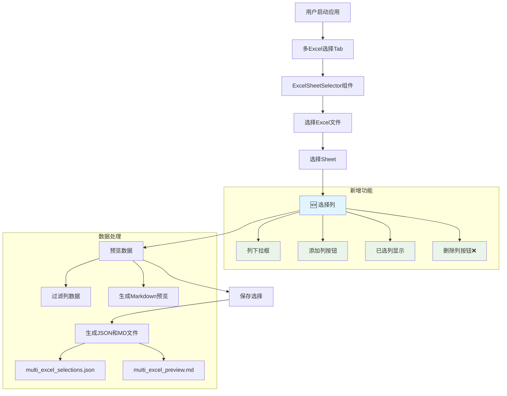
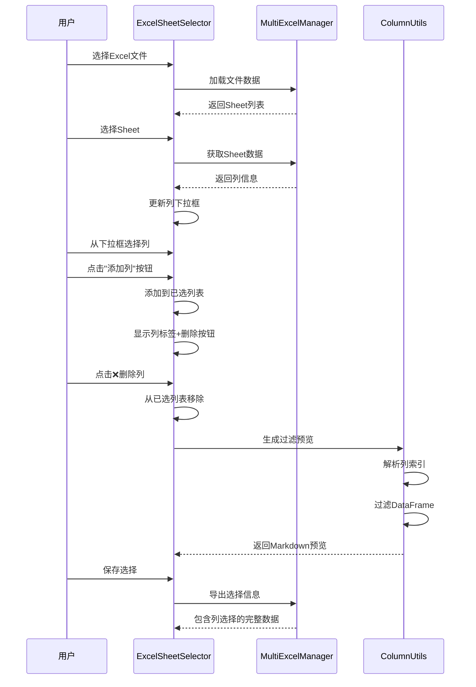
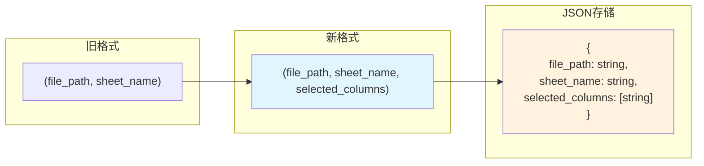
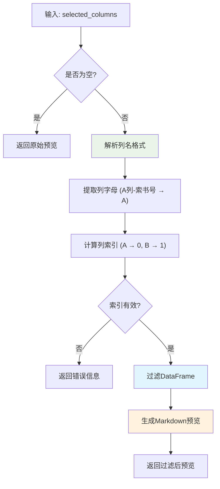
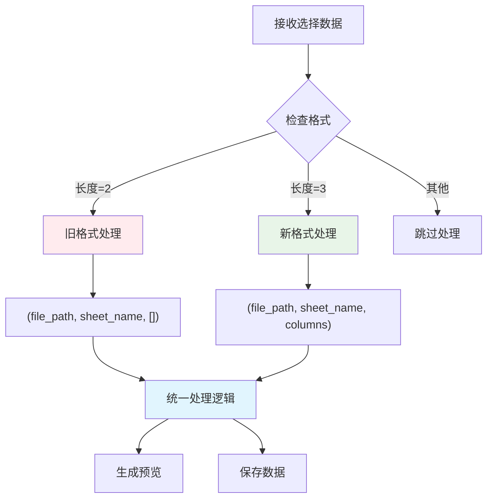
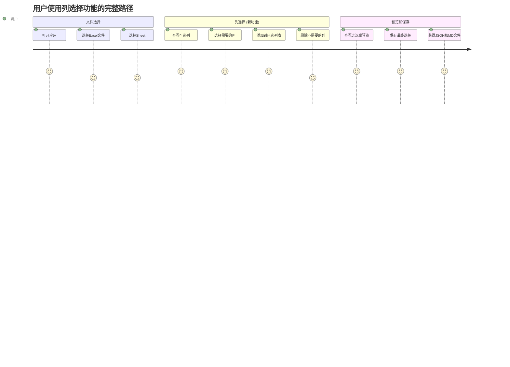

# 多Excel列选择功能工作流程

## 整体架构图

```mermaid
graph TB
    A[用户启动应用] --> B[多Excel选择Tab]
    B --> C[ExcelSheetSelector组件]
    C --> D[选择Excel文件]
    D --> E[选择Sheet]
    E --> F[🆕 选择列]
    F --> G[预览数据]
    G --> H[保存选择]
    H --> I[生成JSON和MD文件]
    
    subgraph "新增功能"
        F --> F1[列下拉框]
        F --> F2[添加列按钮]
        F --> F3[已选列显示]
        F --> F4[删除列按钮❌]
    end
    
    subgraph "数据处理"
        G --> G1[过滤列数据]
        G --> G2[生成Markdown预览]
        I --> I1[multi_excel_selections.json]
        I --> I2[multi_excel_preview.md]
    end
    
    style F fill:#e1f5fe
    style F1 fill:#e8f5e8
    style F2 fill:#e8f5e8
    style F3 fill:#e8f5e8
    style F4 fill:#e8f5e8
```

## 列选择交互流程

```mermaid
sequenceDiagram
    participant U as 用户
    participant UI as ExcelSheetSelector
    participant M as MultiExcelManager
    participant CU as ColumnUtils
    
    U->>UI: 选择Excel文件
    UI->>M: 加载文件数据
    M-->>UI: 返回Sheet列表
    
    U->>UI: 选择Sheet
    UI->>M: 获取Sheet数据
    M-->>UI: 返回列信息
    UI->>UI: 更新列下拉框
    
    U->>UI: 从下拉框选择列
    U->>UI: 点击"添加列"按钮
    UI->>UI: 添加到已选列表
    UI->>UI: 显示列标签+删除按钮
    
    U->>UI: 点击❌删除列
    UI->>UI: 从已选列表移除
    
    UI->>CU: 生成过滤预览
    CU->>CU: 解析列索引
    CU->>CU: 过滤DataFrame
    CU-->>UI: 返回Markdown预览
    
    U->>UI: 保存选择
    UI->>M: 导出选择信息
    M-->>UI: 包含列选择的完整数据
```

## 数据结构变化

```mermaid
graph LR
    subgraph "旧格式"
        A1["(file_path, sheet_name)"]
    end
    
    subgraph "新格式"
        B1["(file_path, sheet_name, selected_columns)"]
    end
    
    subgraph "JSON存储"
        C1["{<br/>file_path: string,<br/>sheet_name: string,<br/>selected_columns: [string]<br/>}"]
    end
    
    A1 --> B1
    B1 --> C1
    
    style B1 fill:#e1f5fe
    style C1 fill:#fff3e0
```

## 列过滤算法

```mermaid
flowchart TD
    A[输入: selected_columns] --> B{是否为空?}
    B -->|是| C[返回原始预览]
    B -->|否| D[解析列名格式]
    D --> E["提取列字母 (A列-索书号 → A)"]
    E --> F["计算列索引 (A → 0, B → 1)"]
    F --> G{索引有效?}
    G -->|否| H[返回错误信息]
    G -->|是| I[过滤DataFrame]
    I --> J[生成Markdown预览]
    J --> K[返回过滤后预览]
    
    style D fill:#e8f5e8
    style I fill:#e1f5fe
    style J fill:#fff3e0
```

## 兼容性处理

```mermaid
graph TD
    A[接收选择数据] --> B{检查格式}
    B -->|长度=2| C[旧格式处理]
    B -->|长度=3| D[新格式处理]
    B -->|其他| E[跳过处理]
    
    C --> F["(file_path, sheet_name, [])"]
    D --> G["(file_path, sheet_name, columns)"]
    
    F --> H[统一处理逻辑]
    G --> H
    
    H --> I[生成预览]
    H --> J[保存数据]
    
    style C fill:#ffebee
    style D fill:#e8f5e8
    style H fill:#e1f5fe
```

## 用户操作路径

```mermaid
journey
    title 用户使用列选择功能的完整路径
    section 文件选择
      打开应用: 5: 用户
      选择Excel文件: 4: 用户
      选择Sheet: 4: 用户
    section 列选择 (新功能)
      查看可选列: 5: 用户
      选择需要的列: 5: 用户
      添加到已选列表: 5: 用户
      删除不需要的列: 4: 用户
    section 预览和保存
      查看过滤后预览: 5: 用户
      保存最终选择: 5: 用户
      获得JSON和MD文件: 5: 用户
```

---

**说明**: 
- 🆕 标记表示新增功能
- 蓝色节点表示核心新功能
- 绿色节点表示UI交互组件
- 橙色节点表示数据存储