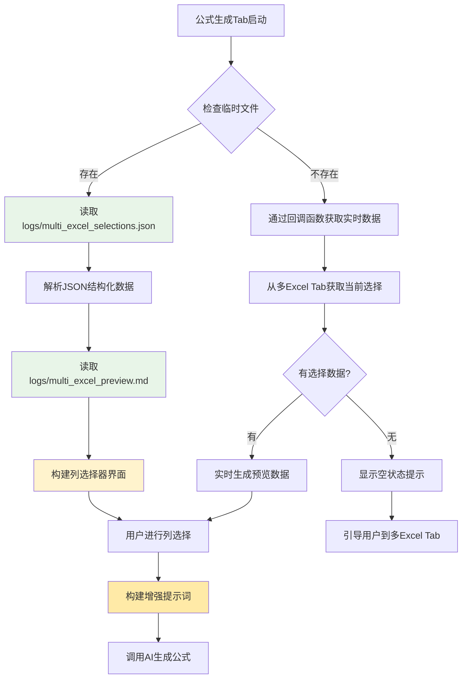
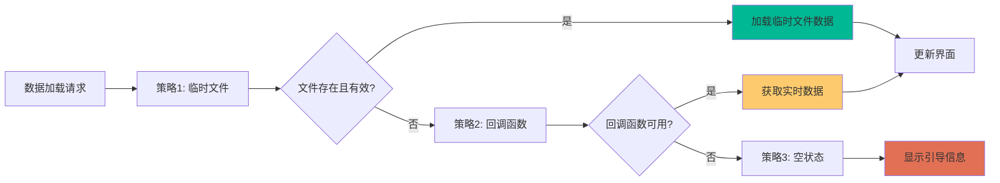

# 公式生成Tab优化指南

## 📋 概述

本文档详细说明了公式生成Tab的优化方案，重点是将简单的文本输入列选择器升级为多Excel数据驱动的结构化选择器，实现与多Excel Tab的深度集成。

## 🎯 优化目标

### 核心目标
- **数据一致性**：与多Excel Tab保持一致的数据结构和交互方式
- **优先读取机制**：优先从logs临时文件读取保存的数据
- **结构化选择**：从文本输入升级为分层的文件-Sheet-列选择
- **智能提示词**：基于完整数据结构构建更准确的AI提示词

### 用户体验提升
- **直观操作**：清晰的分层选择界面
- **数据预览**：实时显示选中数据的预览
- **状态指示**：明确显示数据来源和同步状态
- **批量操作**：支持快速选择/取消选择列

## 🔍 现状分析

### 当前问题
1. **架构不一致**：公式生成Tab使用简单文本输入，多Excel Tab使用结构化选择
2. **数据获取落后**：未充分利用多Excel Tab保存的临时文件数据
3. **用户体验割裂**：两个Tab的交互方式差异较大
4. **提示词质量低**：缺乏完整的数据结构信息

### 现有优势
- 多Excel Tab已有完善的数据保存机制
- 临时文件包含完整的结构化数据
- 回调函数提供实时数据访问能力

## 🏗️ 技术架构设计

### 数据流向图



### 数据优先级策略



## 🔧 核心组件设计

### 1. MultiExcelColumnSelector 组件

#### 基础结构
```python
class MultiExcelColumnSelector:
    """多Excel列选择器 - 优先读取临时文件"""
    
    def __init__(self, parent, get_export_data_callback=None):
        self.parent = parent
        self.get_export_data_callback = get_export_data_callback
        self.selected_columns = {}  # {file_sheet_key: [selected_columns]}
        self.excel_data = {}  # 完整的Excel数据结构
        self.preview_data = ""  # MD预览数据
        
        # 界面组件
        self.file_groups = {}  # 文件分组组件
        self.sheet_groups = {}  # Sheet分组组件
        self.column_checkboxes = {}  # 列复选框
        
        # 状态组件
        self.source_info_label = None  # 数据来源标签
        self.status_label = None  # 状态标签
        self.preview_text = None  # 预览文本框
        
        # 创建界面并加载数据
        self._create_ui()
        self._load_data_with_priority()
```

#### 数据加载机制
```python
def _load_data_with_priority(self):
    """按优先级加载数据：临时文件 > 回调函数 > 空状态"""
    try:
        # 策略1：优先读取临时文件
        if self._load_from_temp_files():
            self._update_ui_from_temp_data()
            self._show_status("✅ 已从保存的数据中加载", "success")
            return True
        
        # 策略2：通过回调函数获取实时数据
        if self._load_from_callback():
            self._update_ui_from_callback_data()
            self._show_status("🔄 已加载当前选择数据（未保存）", "warning")
            return True
        
        # 策略3：显示空状态
        self._show_empty_state()
        self._show_status("📋 请先在多Excel Tab中选择数据", "info")
        return False
        
    except Exception as e:
        print(f"加载数据失败：{e}")
        self._show_error_state(str(e))
        return False
```

#### 临时文件读取
```python
def _load_from_temp_files(self):
    """从临时文件加载数据"""
    try:
        import json
        import os
        
        # 检查临时文件是否存在
        json_file = os.path.join("logs", "multi_excel_selections.json")
        md_file = os.path.join("logs", "multi_excel_preview.md")
        
        if not (os.path.exists(json_file) and os.path.exists(md_file)):
            print("临时文件不存在，跳过临时文件加载")
            return False
        
        # 读取JSON结构化数据
        with open(json_file, 'r', encoding='utf-8') as f:
            json_data = json.load(f)
        
        # 读取MD预览数据
        with open(md_file, 'r', encoding='utf-8') as f:
            self.preview_data = f.read()
        
        # 解析JSON数据到内部结构
        self._parse_json_data(json_data)
        
        print(f"✅ 成功从临时文件加载数据：{len(self.excel_data)} 个文件-Sheet组合")
        return True
        
    except Exception as e:
        print(f"从临时文件加载数据失败：{e}")
        return False

def _parse_json_data(self, json_data):
    """解析JSON数据到内部结构"""
    self.excel_data = {}
    
    for selection in json_data.get('selections', []):
        if 'error' in selection:
            continue  # 跳过错误的选择
        
        file_name = selection['file_name']
        sheet_name = selection['sheet_name']
        key = f"{file_name}#{sheet_name}"
        
        self.excel_data[key] = {
            'file_path': selection['file_path'],
            'file_name': file_name,
            'sheet_name': sheet_name,
            'columns': selection['column_names'],
            'total_rows': selection['total_rows'],
            'column_count': selection['columns'],
            'file_size': selection.get('file_size', 0),
            'truncated': selection.get('truncated', False),
            'source': 'temp_file'  # 标记数据来源
        }
```

### 2. 界面组件设计

#### 分层选择界面
```python
def _create_ui(self):
    """创建分层选择界面"""
    # 主框架
    self.main_frame = ttk.LabelFrame(self.parent, text="📊 多Excel数据选择", padding=10)
    
    # 数据来源信息区域
    self.info_frame = ttk.Frame(self.main_frame)
    self.info_frame.pack(fill="x", pady=(0, 10))
    
    self.source_info_label = ttk.Label(
        self.info_frame,
        text="正在加载数据...",
        font=("Microsoft YaHei", 9),
        foreground="blue"
    )
    self.source_info_label.pack(anchor="w")
    
    # 刷新按钮
    self.refresh_btn = ttk.Button(
        self.info_frame,
        text="🔄 刷新数据",
        command=self.refresh_data
    )
    self.refresh_btn.pack(anchor="e")
    
    # 创建滚动区域用于显示文件-Sheet-列的分层结构
    self.canvas = tk.Canvas(self.main_frame, height=300)
    self.scrollbar = ttk.Scrollbar(self.main_frame, orient="vertical", command=self.canvas.yview)
    self.scrollable_frame = ttk.Frame(self.canvas)
    
    # 配置滚动
    self.scrollable_frame.bind(
        "<Configure>",
        lambda e: self.canvas.configure(scrollregion=self.canvas.bbox("all"))
    )
    
    self.canvas.create_window((0, 0), window=self.scrollable_frame, anchor="nw")
    self.canvas.configure(yscrollcommand=self.scrollbar.set)
    
    # 布局滚动区域
    self.canvas.pack(side="left", fill="both", expand=True)
    self.scrollbar.pack(side="right", fill="y")
    
    # 预览区域
    self.preview_frame = ttk.LabelFrame(self.main_frame, text="👁️ 数据预览", padding=5)
    self.preview_frame.pack(fill="x", pady=(10, 0))
    
    self.preview_text = tk.Text(
        self.preview_frame,
        height=6,
        wrap=tk.WORD,
        font=("Consolas", 8),
        state=tk.DISABLED
    )
    self.preview_text.pack(fill="x")
    
    # 状态区域
    self.status_label = ttk.Label(
        self.main_frame,
        text="准备就绪",
        font=("Microsoft YaHei", 8),
        foreground="gray"
    )
    self.status_label.pack(anchor="w", pady=(5, 0))

def _update_ui_from_temp_data(self):
    """基于临时文件数据更新界面"""
    try:
        # 清空现有界面
        self._clear_selection_area()
        
        # 按文件分组显示
        file_groups = self._group_by_file()
        
        for file_name, sheets in file_groups.items():
            # 创建文件分组
            file_frame = self._create_file_group(file_name)
            
            for sheet_data in sheets:
                # 创建Sheet分组
                sheet_frame = self._create_sheet_group(file_frame, sheet_data)
                
                # 创建列选择器
                self._create_column_selectors(sheet_frame, sheet_data)
        
        # 显示预览数据
        self._update_preview_display()
        
        # 显示数据来源信息
        self._show_data_source_info("temp_file")
        
    except Exception as e:
        print(f"更新界面失败：{e}")
```

#### 列选择器创建
```python
def _create_column_selectors(self, parent, sheet_data):
    """创建列选择器"""
    columns = sheet_data['columns']
    file_name = sheet_data['file_name']
    sheet_name = sheet_data['sheet_name']
    key = f"{file_name}#{sheet_name}"
    
    # 创建列选择区域
    column_frame = ttk.LabelFrame(
        parent, 
        text=f"📊 列选择 ({len(columns)} 列)",
        padding=5
    )
    column_frame.pack(fill="x", pady=5)
    
    # 创建列选择的滚动区域
    col_canvas = tk.Canvas(column_frame, height=120)
    col_scrollbar = ttk.Scrollbar(column_frame, orient="vertical", command=col_canvas.yview)
    col_scrollable_frame = ttk.Frame(col_canvas)
    
    # 为每列创建复选框
    self.selected_columns[key] = []
    column_vars = {}
    
    for i, column in enumerate(columns):
        var = tk.BooleanVar()
        column_vars[column] = var
        
        # 创建复选框
        cb = ttk.Checkbutton(
            col_scrollable_frame,
            text=f"[{file_name}-{sheet_name}] {column}",
            variable=var,
            command=lambda k=key, c=column, v=var: self._on_column_selected(k, c, v)
        )
        cb.grid(row=i, column=0, sticky="w", padx=5, pady=2)
    
    # 添加批量选择按钮
    button_frame = ttk.Frame(col_scrollable_frame)
    button_frame.grid(row=len(columns), column=0, sticky="ew", pady=10)
    
    ttk.Button(
        button_frame,
        text="全选",
        command=lambda: self._select_all_columns(key, column_vars)
    ).pack(side="left", padx=5)
    
    ttk.Button(
        button_frame,
        text="清空",
        command=lambda: self._clear_all_columns(key, column_vars)
    ).pack(side="left", padx=5)
    
    # 配置滚动
    col_scrollable_frame.bind(
        "<Configure>",
        lambda e: col_canvas.configure(scrollregion=col_canvas.bbox("all"))
    )
    
    col_canvas.create_window((0, 0), window=col_scrollable_frame, anchor="nw")
    col_canvas.configure(yscrollcommand=col_scrollbar.set)
    
    col_canvas.pack(side="left", fill="both", expand=True)
    col_scrollbar.pack(side="right", fill="y")
    
    # 存储组件引用
    self.column_checkboxes[key] = column_vars
```

### 3. 数据同步和状态管理

#### 状态显示机制
```python
def _show_data_source_info(self, source_type):
    """显示数据来源信息"""
    if source_type == "temp_file":
        # 读取保存时间
        try:
            import json
            json_file = os.path.join("logs", "multi_excel_selections.json")
            with open(json_file, 'r', encoding='utf-8') as f:
                json_data = json.load(f)
            
            saved_at = json_data.get('metadata', {}).get('saved_at', '')
            if saved_at:
                from datetime import datetime
                dt = datetime.fromisoformat(saved_at)
                time_str = dt.strftime('%Y-%m-%d %H:%M')
                
                self.source_info_label.config(
                    text=f"📁 数据来源：已保存的选择 (保存时间: {time_str})",
                    foreground="green"
                )
            else:
                self.source_info_label.config(
                    text="📁 数据来源：已保存的选择",
                    foreground="green"
                )
        except:
            self.source_info_label.config(
                text="📁 数据来源：已保存的选择",
                foreground="green"
            )
    
    elif source_type == "callback":
        self.source_info_label.config(
            text="🔄 数据来源：当前选择 (未保存，建议先保存)",
            foreground="orange"
        )
    
    else:
        self.source_info_label.config(
            text="❌ 无数据：请先在多Excel Tab中选择文件和Sheet",
            foreground="red"
        )

def refresh_data(self):
    """刷新数据 - 重新按优先级加载"""
    try:
        # 清空当前数据
        self.excel_data = {}
        self.selected_columns = {}
        self.preview_data = ""
        
        # 重新加载数据
        success = self._load_data_with_priority()
        
        if success:
            self._show_status("🔄 数据已刷新", "success")
        else:
            self._show_status("❌ 刷新失败，请检查数据源", "error")
        
        return success
        
    except Exception as e:
        print(f"刷新数据失败：{e}")
        self._show_status(f"❌ 刷新失败：{str(e)}", "error")
        return False
```

### 4. 智能提示词构建

#### 增强提示词生成
```python
def build_enhanced_prompt(self, requirement_text):
    """构建增强的用户提示词"""
    try:
        selected_info = self.get_selected_columns_info()
        
        if not selected_info:
            return requirement_text
        
        # 构建结构化提示词
        prompt_parts = [
            "## 📋 数据处理需求",
            requirement_text,
            "",
            "## 📊 数据结构信息"
        ]
        
        # 添加选中列的详细信息
        for file_sheet_key, columns in selected_info.items():
            sheet_data = self.excel_data[file_sheet_key]
            file_name = sheet_data['file_name']
            sheet_name = sheet_data['sheet_name']
            total_rows = sheet_data['total_rows']
            
            prompt_parts.extend([
                f"",
                f"### 📁 {file_name} - {sheet_name} ({total_rows}行数据)",
                f"**选中的列：**"
            ])
            
            for column in columns:
                prompt_parts.append(f"- `{column}`")
        
        # 添加预览数据（如果有）
        if self.preview_data:
            prompt_parts.extend([
                "",
                "## 👁️ 数据预览",
                "```markdown",
                self.preview_data[:2000] + ("..." if len(self.preview_data) > 2000 else ""),
                "```"
            ])
        
        # 添加处理要求
        prompt_parts.extend([
            "",
            "## 🎯 处理要求",
            "请基于以上数据结构和预览信息，生成相应的Excel公式来实现需求。",
            "注意考虑数据的实际格式和内容特征。"
        ])
        
        return "\n".join(prompt_parts)
        
    except Exception as e:
        print(f"构建提示词失败：{e}")
        return requirement_text

def get_selected_columns_info(self):
    """获取选中列的详细信息"""
    selected_info = {}
    
    for file_sheet_key, columns in self.selected_columns.items():
        if columns:  # 只返回有选中列的
            selected_info[file_sheet_key] = columns
    
    return selected_info
```

## 🔄 集成到FormulaGenerationTab

### 主要修改点

#### 1. 替换列选择器
```python
# 在FormulaGenerationTab的_setup_left_panel方法中
def _setup_left_panel(self):
    """设置左侧面板"""
    # 使用新的多Excel列选择器替换原有的ColumnSelector
    self.column_selector = MultiExcelColumnSelector(
        self.left_frame, 
        get_export_data_callback=self.get_export_data_callback
    )
    self.column_selector.on_selection_changed = self._on_column_selection_changed
    self.column_selector.get_widget().pack(fill="both", expand=True, pady=(0, 10))
    
    # 其余UI组件保持不变...
```

#### 2. 更新回调函数设置
```python
def __init__(self, parent, multi_excel_tab=None):
    """初始化公式生成Tab"""
    self.parent = parent
    self.multi_excel_tab = multi_excel_tab
    
    # 设置回调函数
    self.get_export_data_callback = None
    if multi_excel_tab:
        self.get_export_data_callback = multi_excel_tab.get_export_data
    
    # 其余初始化代码...
```

#### 3. 优化公式生成逻辑
```python
def _on_generate_formula(self):
    """生成公式按钮点击事件 - 使用增强的提示词"""
    try:
        # 获取选中的列信息
        selected_info = self.column_selector.get_selected_columns_info()
        requirement = self.requirement_text.get("1.0", tk.END).strip()
        
        if not selected_info:
            messagebox.showwarning("警告", "请至少选择一列数据")
            return
        
        # 验证需求描述
        if not requirement or len(requirement) < 10:
            messagebox.showwarning("警告", "请输入详细的需求描述（至少10个字符）")
            return
        
        # 使用增强的提示词构建
        enhanced_prompt = self.column_selector.build_enhanced_prompt(requirement)
        
        # 获取配置参数
        selected_prompt = self.prompt_var.get()
        selected_model = self.model_var.get()
        temperature = float(self.temperature_var.get())
        top_p = float(self.top_p_var.get())
        
        # 显示生成状态
        self.result_display.show_generating_status()
        self.generate_button.config(state=tk.DISABLED, text="生成中...")
        self.status_label.config(text="正在生成公式...")
        
        # 异步生成公式（使用增强的提示词）
        self.formula_generator.generate_formula_async(
            requirement=enhanced_prompt,  # 使用增强的提示词
            columns=list(selected_info.keys()),  # 传递文件-Sheet键
            sample_data="",  # 预览数据已包含在enhanced_prompt中
            selected_prompt=selected_prompt,
            selected_model=selected_model,
            temperature=temperature,
            top_p=top_p,
            success_callback=self._on_formula_generated,
            error_callback=self._on_formula_error,
            progress_callback=self._on_generation_progress
        )
        
    except Exception as e:
        messagebox.showerror("错误", f"生成公式时出错：{str(e)}")
        self._reset_generate_button()
```

## 📋 实施步骤

### 第一阶段：基础架构升级 (1-2天)
1. **创建MultiExcelColumnSelector组件**
   - 实现基础的UI框架
   - 添加数据加载机制
   - 实现临时文件读取功能

2. **数据结构设计**
   - 定义内部数据结构
   - 实现JSON数据解析
   - 添加数据验证机制

### 第二阶段：界面集成 (2-3天)
1. **替换现有组件**
   - 在FormulaGenerationTab中集成新组件
   - 更新回调函数设置
   - 调整界面布局

2. **交互逻辑实现**
   - 实现列选择事件处理
   - 添加批量操作功能
   - 实现数据预览显示

### 第三阶段：智能化增强 (2-3天)
1. **智能提示词构建**
   - 实现增强提示词生成
   - 集成预览数据
   - 优化数据结构展示

2. **状态管理优化**
   - 添加数据来源指示
   - 实现状态同步机制
   - 添加错误处理和恢复

### 第四阶段：测试和优化 (1-2天)
1. **全面测试**
   - 测试临时文件读取机制
   - 验证数据同步功能
   - 测试各种边界情况

2. **性能优化**
   - 优化大数据量处理
   - 改进界面响应速度
   - 添加缓存机制

## 🎯 预期效果

### 用户体验提升
- **一致性**：与多Excel Tab保持一致的交互方式
- **直观性**：分层选择，清晰的数据结构展示
- **智能化**：自动读取保存数据，减少重复操作
- **可靠性**：多重数据获取策略，提高可用性

### 功能增强
- **数据完整性**：充分利用保存的结构化数据
- **预览集成**：实时数据预览，提高准确性
- **批量操作**：提高列选择效率
- **智能提示词**：基于完整数据结构的AI提示

### 技术优势
- **松耦合**：通过回调函数实现模块间通信
- **容错性**：多重数据获取策略，提高可靠性
- **扩展性**：为未来功能扩展预留接口
- **维护性**：清晰的代码结构，便于维护

## 🔍 关键技术点

### 1. 临时文件优先读取机制
- 检查`logs/multi_excel_selections.json`和`logs/multi_excel_preview.md`
- 解析JSON结构化数据到内部数据结构
- 读取MD预览数据用于显示和AI处理

### 2. 数据同步策略
- 优先级：临时文件 > 回调函数 > 空状态
- 智能回退机制确保数据可用性
- 清晰的状态指示和错误处理

### 3. 界面组件设计
- 分层的文件-Sheet-列选择结构
- 滚动区域支持大量数据显示
- 批量操作提高用户效率

### 4. 智能提示词构建
- 基于完整数据结构的提示词生成
- 集成预览数据提供上下文信息
- 结构化格式便于AI理解和处理

## 📝 注意事项

### 开发注意点
1. **向后兼容**：确保现有功能不受影响
2. **错误处理**：完善的异常处理和用户提示
3. **性能考虑**：大数据量时的界面响应优化
4. **用户引导**：清晰的操作指引和状态提示

### 测试重点
1. **数据一致性**：临时文件与实时数据的一致性
2. **边界情况**：文件不存在、数据损坏等情况
3. **用户体验**：各种操作场景的流畅性
4. **集成测试**：与多Excel Tab的协同工作

这个优化方案将公式生成Tab从简单的文本输入升级为结构化的数据驱动界面，实现与多Excel Tab的深度集成，大幅提升用户体验和功能完整性。通过优先读取临时文件的机制，确保用户保存的数据能够被充分利用，提供更准确和智能的公式生成服务。