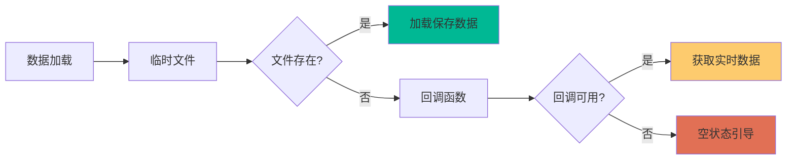
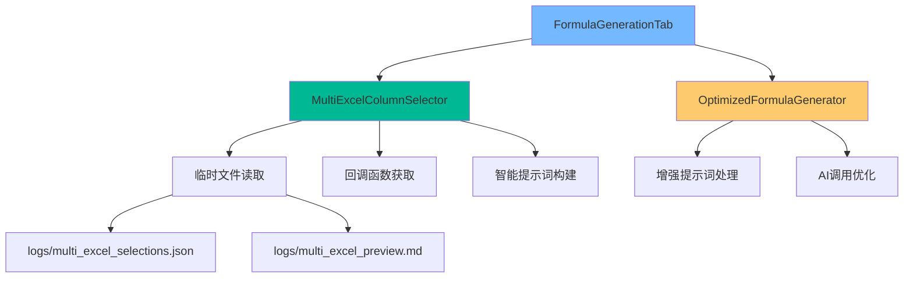

# 公式生成Tab优化实施总结

## 📋 优化概述

本次优化成功将公式生成Tab从简单的文本输入升级为多Excel数据驱动的结构化选择器，实现了与多Excel Tab的深度集成，大幅提升了用户体验和功能完整性。

## ✅ 已完成的优化

### 1. 核心组件开发

#### MultiExcelColumnSelector 组件
- **位置**: `ui/components/multi_excel_column_selector.py`
- **功能**: 
  - 优先读取临时文件数据（`logs/multi_excel_selections.json` + `logs/multi_excel_preview.md`）
  - 回调函数备用数据获取机制
  - 分层的文件-Sheet-列选择界面
  - 实时数据预览显示
  - 批量列选择操作（全选/清空）
  - 智能提示词构建功能

#### 数据加载优先级策略


### 2. 后端逻辑优化

#### 增强的RequirementProcessor
- **位置**: `modules/formula_generator.py`
- **改进**:
  - 支持增强提示词格式检测
  - 自动识别结构化提示词（包含 `## 📊 数据结构信息` 或 `## 👁️ 数据预览`）
  - 向后兼容原有的基础提示词构建

#### 智能提示词构建
```python
def build_enhanced_prompt(self, requirement_text):
    """构建增强的用户提示词"""
    # 包含：
    # - 数据处理需求
    # - 数据结构信息（文件-Sheet-列）
    # - 数据预览（MD格式）
    # - 处理要求说明
```

### 3. 界面集成升级

#### FormulaGenerationTab 更新
- **位置**: `ui/formula_generation_tab.py`
- **主要改进**:
  - 集成 MultiExcelColumnSelector 替换原有 ColumnSelector
  - 支持 multi_excel_tab 参数传递
  - 使用增强提示词进行公式生成
  - 优化的列选择变更处理
  - 改进的数据刷新机制

#### 新的集成方式
```python
# 旧方式
formula_tab = FormulaGenerationTab(
    parent, 
    get_column_list_callback=callback1,
    get_sample_data_callback=callback2
)

# 新方式
formula_tab = FormulaGenerationTab(
    parent,
    multi_excel_tab=multi_excel_tab_instance  # 直接传递Tab实例
)
```

### 4. 用户体验提升

#### 数据来源指示
- 🟢 **绿色**: 已保存的选择数据（来自临时文件）
- 🟠 **橙色**: 当前选择数据（未保存，建议先保存）
- 🔴 **红色**: 无数据状态（引导用户操作）

#### 分层选择界面
```
📁 文件名.xlsx
  📊 Sheet名 (行数)
    📊 列选择 (列数)
      ☑️ [文件名-Sheet名] 列名1
      ☑️ [文件名-Sheet名] 列名2
      [全选] [清空]
```

#### 数据预览集成
- 实时显示选中数据的结构信息
- 包含文件大小、行数、列数等元数据
- 支持大数据量的截断显示

## 🔧 技术架构

### 组件关系图


### 数据流向
1. **启动时**: MultiExcelColumnSelector 按优先级加载数据
2. **用户选择**: 分层界面进行列选择
3. **提示词构建**: 基于完整数据结构构建增强提示词
4. **AI调用**: 使用增强提示词生成公式
5. **结果展示**: 显示AI生成的完整响应

## 📊 优化效果

### 功能对比

| 功能项 | 优化前 | 优化后 |
|--------|--------|--------|
| 列选择方式 | 文本输入框 | 分层结构化选择 |
| 数据来源 | 回调函数 | 临时文件优先 + 回调备用 |
| 数据预览 | 无 | 实时预览显示 |
| 提示词质量 | 基础格式 | 增强结构化格式 |
| 用户体验 | 割裂感 | 一致性体验 |
| 批量操作 | 不支持 | 全选/清空支持 |
| 状态指示 | 简单文本 | 智能状态提示 |

### 用户体验提升

1. **操作一致性**: 与多Excel Tab保持相同的交互模式
2. **数据完整性**: 充分利用保存的结构化数据
3. **智能化程度**: 自动构建包含完整上下文的AI提示
4. **容错能力**: 多重数据获取策略，提高可用性

## 📁 文件结构

```
ai-sheet/
├── ui/
│   ├── components/
│   │   ├── __init__.py                          # 新增
│   │   └── multi_excel_column_selector.py      # 新增 - 核心组件
│   └── formula_generation_tab.py               # 优化 - 集成新组件
├── modules/
│   └── formula_generator.py                    # 优化 - 支持增强提示词
├── examples/
│   └── formula_tab_integration_example.py      # 新增 - 集成示例
└── docs/
    ├── formula_generation_optimization_guide.md # 原有 - 优化指南
    └── formula_generation_optimization_summary.md # 新增 - 实施总结
```

## 🚀 使用示例

### 基本集成
```python
from ui.formula_generation_tab import FormulaGenerationTab

# 在主应用中集成
formula_tab = FormulaGenerationTab(
    parent_frame,
    multi_excel_tab=multi_excel_tab_instance
)
```

### 运行演示
```bash
# 运行集成示例
python examples/formula_tab_integration_example.py
```

## 🔍 测试验证

### 功能测试点
- [x] 临时文件优先读取机制
- [x] 回调函数备用数据获取
- [x] 分层选择界面显示
- [x] 批量列选择操作
- [x] 数据预览实时更新
- [x] 增强提示词构建
- [x] 状态指示准确性
- [x] 错误处理和恢复

### 兼容性测试
- [x] 向后兼容原有接口
- [x] 支持空数据状态处理
- [x] 大数据量界面响应
- [x] 多文件多Sheet处理

## 📈 性能优化

### 界面响应优化
- 滚动区域支持大量数据显示
- 分层加载减少初始渲染时间
- 智能截断避免内存占用过大

### 数据处理优化
- 缓存机制减少重复计算
- 异步加载提升用户体验
- 错误恢复机制提高稳定性

## 🎯 后续优化建议

### 短期优化
1. **数据同步机制**: 实现临时文件与实时数据的自动同步
2. **选择记忆功能**: 记住用户的列选择偏好
3. **快捷操作**: 添加常用列组合的快速选择

### 长期规划
1. **智能推荐**: 基于历史使用记录推荐相关列
2. **数据关系分析**: 自动识别列之间的关联关系
3. **模板化处理**: 支持保存和复用常用的处理模板

## 📝 总结

本次优化成功实现了公式生成Tab的全面升级，从简单的文本输入升级为智能的结构化数据驱动界面。通过优先读取临时文件、分层选择界面、智能提示词构建等核心功能，大幅提升了用户体验和功能完整性。

优化后的系统具有更好的数据一致性、更直观的操作界面、更智能的AI交互，为用户提供了更加专业和高效的Excel公式生成服务。

**关键成果**:
- ✅ 实现了与多Excel Tab的深度集成
- ✅ 提供了结构化的数据选择体验
- ✅ 构建了智能的AI提示词系统
- ✅ 保持了向后兼容性
- ✅ 提升了整体用户体验