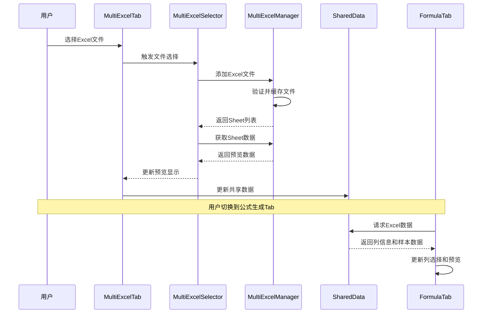
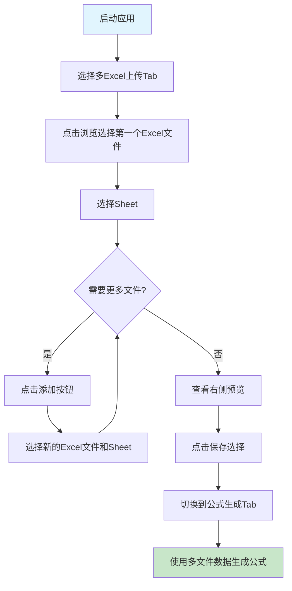

# 多Excel多Sheet功能架构设计

## 系统架构图

```mermaid
graph TB
    subgraph "用户界面层 (UI Layer)"
        A[单Excel上传Tab<br/>ExcelUploadTab] 
        B[多Excel上传Tab<br/>MultiExcelTab]
        C[公式生成Tab<br/>FormulaGenerationTab]
        D[其他Tab...]
    end
    
    subgraph "UI组件层 (UI Components)"
        E[多Excel选择器<br/>MultiExcelSelector]
        F[单个选择器<br/>ExcelSheetSelector]
        G[Markdown预览<br/>MarkdownText]
    end
    
    subgraph "业务逻辑层 (Business Logic)"
        H[多Excel管理器<br/>MultiExcelManager]
        I[Excel工具<br/>excel_utils]
        J[数据验证器<br/>DataValidator]
    end
    
    subgraph "数据存储层 (Data Storage)"
        K[内存缓存<br/>excel_files{}]
        L[临时文件<br/>logs/*.md, *.json]
        M[共享数据<br/>shared_data{}]
    end
    
    subgraph "配置层 (Configuration)"
        N[配置管理器<br/>MultiModelConfigManager]
    end
    
    %% 连接关系
    B --> E
    E --> F
    B --> G
    E --> H
    H --> I
    H --> J
    H --> K
    H --> L
    B --> M
    C --> M
    I --> N
    
    %% 数据流
    A -.->|单文件数据| M
    B -.->|多文件数据| M
    M -.->|列信息/样本数据| C
    
    %% 样式
    classDef uiClass fill:#e1f5fe,stroke:#01579b,stroke-width:2px
    classDef componentClass fill:#f3e5f5,stroke:#4a148c,stroke-width:2px
    classDef logicClass fill:#e8f5e8,stroke:#1b5e20,stroke-width:2px
    classDef dataClass fill:#fff3e0,stroke:#e65100,stroke-width:2px
    classDef configClass fill:#fce4ec,stroke:#880e4f,stroke-width:2px
    
    class A,B,C,D uiClass
    class E,F,G componentClass
    class H,I,J logicClass
    class K,L,M dataClass
    class N configClass
```

## 核心组件说明

### 1. 多Excel管理器 (MultiExcelManager)

**职责：**
- 管理多个Excel文件的加载和缓存
- 提供Sheet数据的读取和预览
- 生成组合预览和导出数据

**主要方法：**
```python
add_excel_file(file_path) -> (bool, str, List[str])  # 添加Excel文件
get_sheet_data(file_path, sheet_name) -> Dict        # 获取Sheet数据
generate_combined_preview(selections) -> str         # 生成组合预览
export_selections_info(selections) -> Dict           # 导出选择信息
```

### 2. 多Excel选择器 (MultiExcelSelector)

**职责：**
- 提供动态添加/删除Excel-Sheet选择组合的UI
- 管理用户的文件和Sheet选择
- 实时更新预览数据

**主要功能：**
- 动态添加选择器组合
- 文件浏览和Sheet选择
- 选择变化事件处理
- 数据导出和预览

### 3. 多Excel上传Tab (MultiExcelTab)

**职责：**
- 整合多Excel选择器和预览功能
- 提供完整的多文件处理界面
- 与其他Tab进行数据共享

**界面布局：**
- 左侧：文件和Sheet选择区域
- 右侧：数据预览区域
- 底部：操作按钮（刷新、清除、保存）

## 数据流设计



## 与现有系统的集成

### 1. 向后兼容性
- 保留原有单Excel功能 (`ExcelUploadTab`)
- 新增多Excel功能 (`MultiExcelTab`)
- 公式生成Tab智能选择数据源（优先多Excel）

### 2. 数据共享机制
```python
# 共享数据结构
shared_data = {
    'excel_path': str,              # 单Excel文件路径
    'multi_excel_data': {           # 多Excel数据
        'selections': List[Tuple],   # 选择的文件-Sheet组合
        'export_data': Dict,         # 导出数据
        'timestamp': str             # 时间戳
    }
}
```

### 3. 临时文件管理
```
logs/
├── excel_sample_data.md          # 单Excel样本数据
├── excel_path.txt               # 单Excel文件路径
├── multi_excel_preview.md       # 多Excel组合预览
└── multi_excel_selections.json  # 多Excel选择信息
```

## 使用流程

### 基本使用流程



### 高级功能

1. **动态管理选择器**
   - 添加：点击"➕ 添加"按钮
   - 删除：点击选择器右侧"删除"按钮
   - 最少保留一个选择器

2. **数据预览**
   - 实时显示选择的文件-Sheet组合
   - 每个Sheet显示前5行数据
   - 包含文件名、Sheet名、行数、列数信息

3. **与公式生成集成**
   - 列信息格式：`[文件名-Sheet名] A列-列名`
   - 样本数据包含所有选择的Sheet预览
   - 智能数据源选择（多Excel优先）

## 扩展性设计

### 1. 插件化架构
- 选择器组件可独立复用
- 管理器支持不同数据源扩展
- 预览组件支持多种格式

### 2. 配置化支持
- 文件大小限制可配置
- 预览行数可配置
- 支持的文件格式可扩展

### 3. 性能优化
- 数据缓存机制
- 懒加载Sheet数据
- 临时文件管理

## 测试覆盖

### 单元测试
- ✅ 文件验证功能
- ✅ 管理器基本操作
- ✅ 预览生成功能
- ✅ 导出功能
- ✅ UI组件导入

### 集成测试
- 文件选择和Sheet加载
- 多选择器协同工作
- 数据共享机制
- 临时文件管理

### 用户测试场景
1. 单个Excel文件多个Sheet
2. 多个Excel文件单个Sheet
3. 多个Excel文件多个Sheet
4. 大文件处理
5. 错误文件处理
6. 与公式生成Tab集成

## 总结

新的多Excel多Sheet功能完全满足了需求：

✅ **支持多个Excel文件上传** - 通过MultiExcelManager实现  
✅ **每个Excel文件可选择多个Sheet** - 通过动态选择器实现  
✅ **动态添加/删除Excel-Sheet选择组合** - 通过MultiExcelSelector实现  
✅ **解析预览显示文件-Sheet-前5行数据** - 通过组合预览实现  
✅ **考虑在公式生成Tab中的复用** - 通过数据共享机制实现  

系统设计遵循了模块化、可扩展、向后兼容的原则，为未来功能扩展奠定了良好基础。