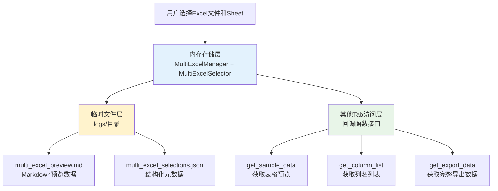
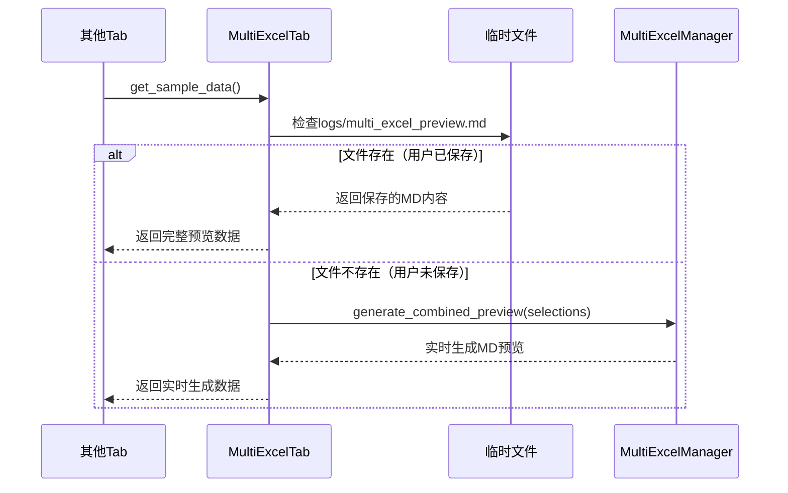
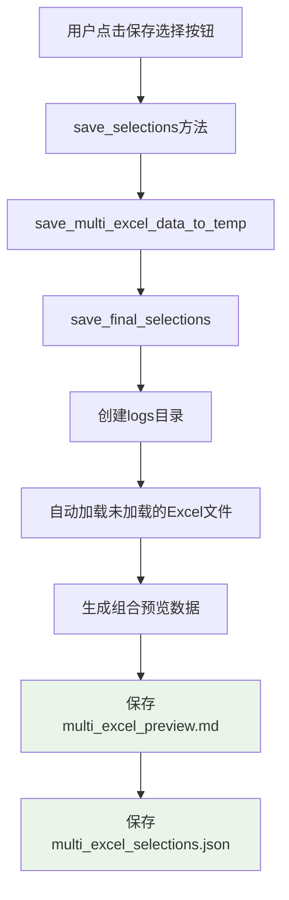

# 多Excel数据获取机制指南

## 概述

本文档详细说明了多Excel Tab的数据获取机制，供其他Tab页面开发时参考。理解这个机制对于正确集成多Excel数据至关重要。

## 核心机制

### 数据存储层次



### 关键发现：保存按钮非必需

**重要：** 其他Tab可以正常获取数据，无论用户是否点击了"保存选择"按钮！

## 数据获取接口

### 1. get_sample_data() - 获取表格预览数据

**功能：** 获取Markdown格式的表格预览数据，用于显示和AI处理

**智能回退机制：**

```python
def get_sample_data(self):
    """获取样本数据，供公式生成模块使用"""
    try:
        # 策略1：优先从临时文件读取（如果用户已保存）
        temp_file_path = os.path.join("logs", "multi_excel_preview.md")
        if os.path.exists(temp_file_path):
            with open(temp_file_path, 'r', encoding='utf-8') as f:
                return f.read()
        
        # 策略2：实时生成（如果用户未保存）
        return self.get_combined_preview()
        
    except Exception as e:
        print(f"获取样本数据失败：{e}")
        return ""
```

**数据流向：**



**返回数据格式示例：**

```markdown
# 多Excel数据预览

## 📊 总体信息
- **文件数量**: 2
- **Sheet数量**: 3
- **生成时间**: 2025-01-08 11:30:45

## 📋 详细数据

### 📁 员工信息.xlsx - Sheet1 (1000行 x 8列)

| 姓名 | 年龄 | 部门 | 薪资 | 入职日期 | 绩效 | 状态 | 备注 |
|------|------|------|------|----------|------|------|------|
| 张三 | 28 | 技术部 | 15000 | 2023-01-15 | A | 在职 | 优秀员工 |
| 李四 | 32 | 销售部 | 12000 | 2022-08-20 | B | 在职 | 业绩良好 |
...

### 📁 销售数据.xlsx - 2023年度 (500行 x 6列)

| 产品名称 | 销售额 | 数量 | 客户 | 日期 | 区域 |
|----------|--------|------|------|------|------|
| 产品A | 50000 | 100 | 客户1 | 2023-01-01 | 华东 |
| 产品B | 30000 | 60 | 客户2 | 2023-01-02 | 华南 |
...
```

### 2. get_column_list() - 获取列名列表

**功能：** 获取所有选择的Excel文件和Sheet的列名，用于公式生成等功能

**特点：** 始终从内存实时获取，不依赖临时文件

```python
def get_column_list(self):
    """获取所有选择的列列表，供公式生成模块使用"""
    try:
        selections = self.get_all_selections()  # 从内存获取当前选择
        if not selections:
            return []
        
        all_columns = []
        for file_path, sheet_name in selections:
            try:
                # 直接从内存中的manager获取数据
                sheet_data = self.manager.get_sheet_data(file_path, sheet_name)
                file_name = os.path.basename(file_path)
                
                # 为每列添加文件和Sheet信息
                for col in sheet_data['columns']:
                    formatted_col = f"[{file_name}-{sheet_name}] {col}"
                    all_columns.append(formatted_col)
                    
            except Exception as e:
                print(f"获取列信息失败 {file_path}-{sheet_name}: {e}")
                continue
        
        return all_columns
        
    except Exception as e:
        print(f"获取列列表失败：{e}")
        return []
```

**返回数据格式示例：**

```python
[
    "[员工信息.xlsx-Sheet1] 姓名",
    "[员工信息.xlsx-Sheet1] 年龄", 
    "[员工信息.xlsx-Sheet1] 部门",
    "[员工信息.xlsx-Sheet1] 薪资",
    "[销售数据.xlsx-2023年度] 产品名称",
    "[销售数据.xlsx-2023年度] 销售额",
    "[销售数据.xlsx-2023年度] 数量"
]
```

### 3. get_export_data() - 获取完整导出数据

**功能：** 获取完整的结构化数据，包含文件信息、Sheet信息、列信息等

**特点：** 从内存实时获取，返回完整的数据结构

```python
def get_export_data(self):
    """获取导出数据，供其他模块使用"""
    if self.excel_selector is not None:
        return self.excel_selector.get_export_data()
    else:
        return {}
```

**返回数据结构：**

```python
{
    'total_files': 2,
    'total_sheets': 3,
    'combined_preview': '# 多Excel数据预览\n...',
    'selections': [
        {
            'file_path': 'C:/data/员工信息.xlsx',
            'file_name': '员工信息.xlsx',
            'file_size': 1024000,
            'sheet_name': 'Sheet1',
            'total_rows': 1000,
            'columns': 8,
            'column_names': ['姓名', '年龄', '部门', '薪资', '入职日期', '绩效', '状态', '备注'],
            'truncated': False,
            'preview_data': [
                ['张三', 28, '技术部', 15000, '2023-01-15', 'A', '在职', '优秀员工'],
                ['李四', 32, '销售部', 12000, '2022-08-20', 'B', '在职', '业绩良好']
            ]
        }
    ]
}
```

## 临时文件机制

### 文件生成时机

临时文件只在用户点击"保存选择"按钮时生成：



### 临时文件结构

#### logs/multi_excel_preview.md
- **内容：** Markdown格式的表格预览数据
- **用途：** 供其他Tab显示和AI处理使用
- **特点：** 包含完整的表格数据预览

#### logs/multi_excel_selections.json
- **内容：** 结构化的元数据信息
- **用途：** 保存状态检查、数据恢复
- **结构：**

```json
{
  "metadata": {
    "saved_at": "2025-01-08T11:30:45.123456",
    "total_files": 2,
    "total_sheets": 3,
    "is_final": true
  },
  "selections": [
    {
      "file_path": "C:/data/员工信息.xlsx",
      "file_name": "员工信息.xlsx",
      "file_size": 1024000,
      "sheet_name": "Sheet1",
      "total_rows": 1000,
      "columns": 8,
      "column_names": ["姓名", "年龄", "部门", "薪资", "入职日期", "绩效", "状态", "备注"],
      "truncated": false
    }
  ]
}
```

## 其他Tab集成指南

### 1. 在Tab初始化时获取回调函数

```python
class YourTab:
    def __init__(self, parent, multi_excel_tab=None):
        self.parent = parent
        self.multi_excel_tab = multi_excel_tab
        
        # 获取数据访问回调函数
        self.get_sample_data_callback = None
        self.get_column_list_callback = None
        self.get_export_data_callback = None
        
        if multi_excel_tab:
            self.get_sample_data_callback = multi_excel_tab.get_sample_data
            self.get_column_list_callback = multi_excel_tab.get_column_list
            self.get_export_data_callback = multi_excel_tab.get_export_data
```

### 2. 使用数据获取接口

```python
def load_excel_data(self):
    """加载Excel数据"""
    try:
        # 获取表格预览数据（Markdown格式）
        if self.get_sample_data_callback:
            sample_data = self.get_sample_data_callback()
            if sample_data:
                self.display_preview(sample_data)
        
        # 获取列名列表
        if self.get_column_list_callback:
            columns = self.get_column_list_callback()
            if columns:
                self.populate_column_selector(columns)
        
        # 获取完整数据结构
        if self.get_export_data_callback:
            export_data = self.get_export_data_callback()
            if export_data:
                self.process_structured_data(export_data)
                
    except Exception as e:
        print(f"加载Excel数据失败：{e}")
```

### 3. 错误处理和回退机制

```python
def safe_get_excel_data(self):
    """安全获取Excel数据，带回退机制"""
    
    # 方法1：通过回调函数获取
    if self.get_sample_data_callback:
        try:
            data = self.get_sample_data_callback()
            if data:
                return data
        except Exception as e:
            print(f"通过回调获取数据失败：{e}")
    
    # 方法2：直接读取临时文件
    try:
        temp_file = os.path.join("logs", "multi_excel_preview.md")
        if os.path.exists(temp_file):
            with open(temp_file, 'r', encoding='utf-8') as f:
                return f.read()
    except Exception as e:
        print(f"读取临时文件失败：{e}")
    
    # 方法3：提示用户
    return "请先在多Excel Tab中选择文件和Sheet"
```

## 保存状态检查机制

### 保存状态信息获取

```python
from modules.multi_excel_utils import get_save_status_info

def check_excel_save_status(self):
    """检查Excel数据保存状态"""
    try:
        # 获取当前选择
        if self.multi_excel_tab:
            current_selections = self.multi_excel_tab.get_all_selections()
            
            # 获取保存状态信息
            status_info = get_save_status_info(current_selections)
            
            return status_info
    except Exception as e:
        print(f"检查保存状态失败：{e}")
        return None
```

### 状态信息结构

```python
{
    # UI显示控制
    'show_reminder': bool,           # 是否显示提醒
    'reminder_type': str,            # 提醒类型: 'warning'|'success'|'info'
    'reminder_title': str,           # 提醒标题
    'reminder_message': str,         # 提醒消息
    'button_text': str,              # 按钮文本
    'button_style': str,             # 按钮样式
    
    # 原始状态信息
    'is_saved': bool,                # 是否已保存
    'has_changes': bool,             # 是否有变更
    'saved_count': int,              # 已保存数量
    'current_count': int,            # 当前选择数量
    'last_saved': str,               # 最后保存时间
    'status_message': str            # 状态消息
}
```

## 最佳实践

### 1. 数据获取优先级

1. **优先使用回调函数** - 确保获取最新数据
2. **临时文件作为备选** - 当回调不可用时使用
3. **提供用户提示** - 当数据不可用时给出明确指导

### 2. 错误处理

```python
def robust_data_access(self):
    """健壮的数据访问模式"""
    try:
        # 检查数据可用性
        if not self.multi_excel_tab:
            return self.show_setup_guide()
        
        selections = self.multi_excel_tab.get_all_selections()
        if not selections:
            return self.show_selection_prompt()
        
        # 获取数据
        data = self.get_sample_data_callback()
        if not data:
            return self.show_data_error()
        
        return self.process_data(data)
        
    except Exception as e:
        return self.handle_error(e)
```

### 3. 性能优化

- **缓存数据** - 避免重复获取相同数据
- **按需加载** - 只在需要时获取数据
- **异步处理** - 对于大数据量使用异步加载

## 常见问题

### Q: 用户没有点击保存按钮，能获取到数据吗？
**A:** 能！数据获取接口会自动从内存实时生成数据，保存按钮只是为了数据持久化。

### Q: 如何判断用户是否已经选择了Excel数据？
**A:** 调用`get_all_selections()`检查返回列表是否为空。

### Q: 临时文件什么时候会被清除？
**A:** 用户点击"清除所有"按钮时，或调用`clear_multi_excel_temp_files()`函数时。

### Q: 如何处理Excel文件路径变化的情况？
**A:** MultiExcelManager会自动处理文件加载，如果文件不存在会给出错误提示。

## 总结

多Excel数据获取机制设计了智能的回退策略，确保其他Tab能够可靠地获取数据，无论用户是否执行了保存操作。理解这个机制对于开发集成多Excel功能的Tab页面至关重要。

关键要点：
1. **保存非必需** - 数据获取不依赖保存操作
2. **智能回退** - 优先临时文件，回退到实时生成
3. **实时获取** - 列信息和导出数据始终实时获取
4. **错误处理** - 提供完善的错误处理和用户提示机制