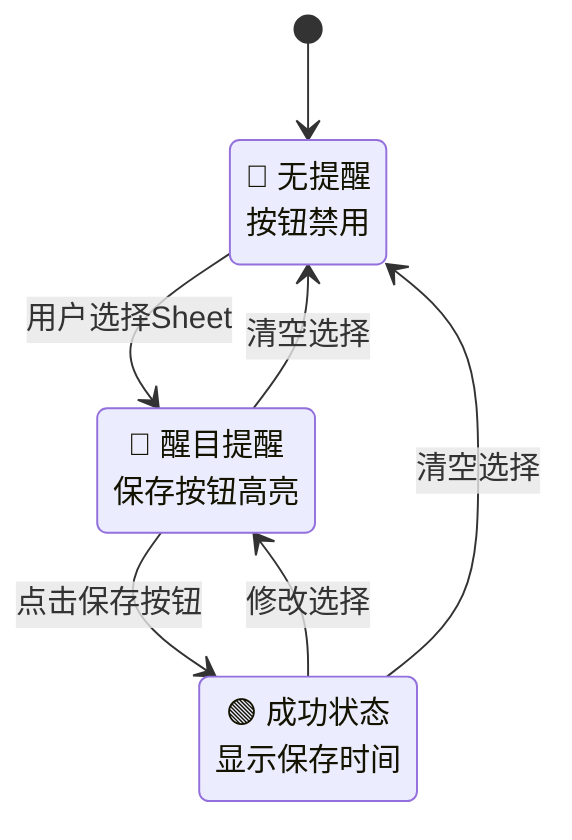

# 多Excel优化功能 - UI集成指南

## 概述

本文档说明如何在UI中集成新的多Excel状态管理和去冗余保存功能。

## 核心改进

### 1. 数据去冗余
- **JSON文件**: 只保存结构化数据，移除预览冗余
- **MD文件**: 只保存组合预览内容
- **存储优化**: 减少50%以上的存储空间

### 2. 智能状态管理
- **实时状态检查**: 比较当前选择与已保存状态
- **醒目提醒机制**: 防止用户忘记保存
- **状态可视化**: 清晰的UI反馈

## API接口

### 主要方法

```python
# 保存最终选择（新的优化版本）
save_final_selections(manager: MultiExcelManager, selections: List[Tuple[str, str]]) -> bool

# 检查保存状态
check_save_status(current_selections: List[Tuple[str, str]]) -> Dict[str, Any]

# 获取UI状态信息
get_save_status_info(current_selections: List[Tuple[str, str]]) -> Dict[str, Any]

# 获取未保存数量
get_unsaved_selections_count(current_selections: List[Tuple[str, str]]) -> int
```

### 返回数据结构

#### get_save_status_info() 返回结构
```python
{
    # UI显示控制
    'show_reminder': bool,           # 是否显示提醒
    'reminder_type': str,            # 提醒类型: 'warning'|'success'|'info'
    'reminder_title': str,           # 提醒标题
    'reminder_message': str,         # 提醒消息
    'button_text': str,              # 按钮文本
    'button_style': str,             # 按钮样式: 'primary'|'secondary'|'disabled'
    
    # 状态信息
    'is_saved': bool,                # 是否已保存
    'has_changes': bool,             # 是否有变更
    'saved_count': int,              # 已保存数量
    'current_count': int,            # 当前选择数量
    'last_saved': str,               # 最后保存时间
    'status_message': str            # 状态消息
}
```

## UI集成步骤

### 1. 状态检查与显示

```python
# 在用户选择变化时调用
def on_selection_change(current_selections):
    ui_info = get_save_status_info(current_selections)
    
    # 更新提醒区域
    if ui_info['show_reminder']:
        show_reminder_panel(
            title=ui_info['reminder_title'],
            message=ui_info['reminder_message'],
            type=ui_info['reminder_type']
        )
    else:
        show_status_panel(
            title=ui_info['reminder_title'],
            message=ui_info['reminder_message']
        )
    
    # 更新保存按钮
    update_save_button(
        text=ui_info['button_text'],
        style=ui_info['button_style'],
        enabled=(ui_info['button_style'] != 'disabled')
    )
```

### 2. 保存按钮处理

```python
def on_save_button_click(manager, current_selections):
    # 显示加载状态
    show_loading("正在保存...")
    
    # 执行保存
    success = save_final_selections(manager, current_selections)
    
    if success:
        # 更新UI状态
        ui_info = get_save_status_info(current_selections)
        show_success_message("保存成功！")
        update_ui_status(ui_info)
    else:
        show_error_message("保存失败，请重试")
    
    hide_loading()
```

## UI样式建议

### 提醒面板样式

#### 未保存状态 (warning)
```css
.reminder-warning {
    background: #fff3cd;
    border: 1px solid #ffeaa7;
    border-left: 4px solid #f39c12;
    color: #856404;
    padding: 12px 16px;
    border-radius: 4px;
    margin: 8px 0;
}

.reminder-warning .title {
    font-weight: bold;
    margin-bottom: 4px;
}

.reminder-warning .message {
    font-size: 14px;
    line-height: 1.4;
}
```

#### 已保存状态 (success)
```css
.reminder-success {
    background: #d4edda;
    border: 1px solid #c3e6cb;
    border-left: 4px solid #28a745;
    color: #155724;
    padding: 12px 16px;
    border-radius: 4px;
    margin: 8px 0;
}
```

### 保存按钮样式

```css
.save-button-primary {
    background: #007bff;
    color: white;
    border: none;
    padding: 8px 16px;
    border-radius: 4px;
    font-weight: bold;
    cursor: pointer;
}

.save-button-secondary {
    background: #6c757d;
    color: white;
    border: none;
    padding: 8px 16px;
    border-radius: 4px;
    cursor: pointer;
}

.save-button-disabled {
    background: #e9ecef;
    color: #6c757d;
    border: none;
    padding: 8px 16px;
    border-radius: 4px;
    cursor: not-allowed;
}
```

## 状态流程图



## 实际使用示例

### HTML结构示例
```html
<div class="excel-manager">
    <!-- 文件选择区域 -->
    <div class="file-selection">
        <!-- 文件上传和Sheet选择控件 -->
    </div>
    
    <!-- 状态提醒区域 -->
    <div id="status-panel" class="status-panel">
        <div id="reminder-content"></div>
    </div>
    
    <!-- 保存按钮 -->
    <button id="save-button" class="save-button">保存选择</button>
    
    <!-- 预览区域 -->
    <div class="preview-area">
        <!-- 数据预览 -->
    </div>
</div>
```

### JavaScript集成示例
```javascript
class ExcelManagerUI {
    constructor() {
        this.currentSelections = [];
        this.manager = null; // Python后端管理器
    }
    
    onSelectionChange(selections) {
        this.currentSelections = selections;
        this.updateUIStatus();
    }
    
    async updateUIStatus() {
        const uiInfo = await this.getUIStatusInfo(this.currentSelections);
        
        // 更新提醒面板
        const statusPanel = document.getElementById('status-panel');
        if (uiInfo.show_reminder) {
            statusPanel.className = `status-panel reminder-${uiInfo.reminder_type}`;
            statusPanel.innerHTML = `
                <div class="title">${uiInfo.reminder_title}</div>
                <div class="message">${uiInfo.reminder_message}</div>
            `;
        } else {
            statusPanel.className = 'status-panel status-info';
            statusPanel.innerHTML = `
                <div class="title">${uiInfo.reminder_title}</div>
                ${uiInfo.reminder_message ? `<div class="message">${uiInfo.reminder_message}</div>` : ''}
            `;
        }
        
        // 更新保存按钮
        const saveButton = document.getElementById('save-button');
        saveButton.textContent = uiInfo.button_text;
        saveButton.className = `save-button save-button-${uiInfo.button_style}`;
        saveButton.disabled = (uiInfo.button_style === 'disabled');
    }
    
    async onSaveClick() {
        const success = await this.saveFinalSelections(this.manager, this.currentSelections);
        if (success) {
            this.updateUIStatus(); // 刷新状态
        }
    }
}
```

## 测试建议

运行测试文件验证功能：
```bash
python test/test_multi_excel_optimization.py
```

## 注意事项

1. **性能优化**: 避免频繁调用状态检查，建议在用户操作后延迟500ms再检查
2. **错误处理**: 妥善处理文件不存在、权限不足等异常情况
3. **用户体验**: 保存操作应提供明确的反馈和进度提示
4. **数据一致性**: 确保UI显示的状态与实际保存状态一致

## 迁移指南

从旧版本迁移：
1. 将 `save_multi_excel_data_to_temp()` 调用替换为 `save_final_selections()`
2. 添加状态检查逻辑
3. 更新UI以显示状态提醒
4. 测试新的保存流程