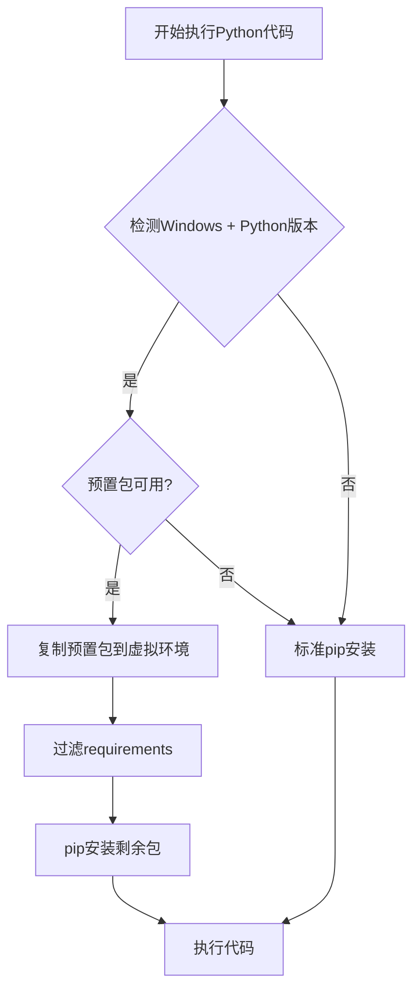

# AI-Sheet 预置包优化功能说明

## 概述

为了显著提升Python代码执行时的依赖安装速度，我们实现了Windows平台下的预置包优化功能。该功能将常用的Excel处理包预先存储在项目目录中，执行时直接复制到虚拟环境，避免网络下载和编译时间。

## 性能提升

- **原始安装时间**: 30-60秒（网络下载 + 编译）
- **优化后时间**: 5-10秒（本地复制 + 少量pip安装）
- **提升比例**: 约80-85%的时间节省

## 支持范围

### 平台支持
- ✅ **Windows**: 完全支持预置包优化
- ❌ **macOS/Linux**: 使用标准pip安装（未来可扩展）

### Python版本支持
- 自动检测Python版本（如py39, py310, py311, py312）
- 支持多版本并存

### 预置包列表
- `pandas` - 数据处理核心库
- `numpy` - 数值计算基础库
- `openpyxl` - Excel文件读写
- `xlrd` - Excel文件读取
- `pytz` - 时区处理（pandas依赖）
- `dateutil` - 日期处理（pandas依赖）
- `six` - Python 2/3兼容性
- `et_xmlfile` - XML文件处理（openpyxl依赖）

## 使用方法

### 1. 初始设置（一次性）

**方法一：自动准备（推荐）**
```bash
# 确保已安装核心包
pip install pandas==2.3.2 openpyxl==3.1.5 numpy==2.3.2 xlrd==2.0.1

# 运行准备脚本
python setup_preinstalled_packages.py
```

**方法二：手动验证**
```bash
# 检查优化是否可用
python -c "from modules.package_manager import PackageManager; pm = PackageManager('.'); print('优化可用:', pm.is_optimization_available())"
```

### 2. 自动使用

设置完成后，每次执行Python代码时系统会：

1. **自动检测**: Windows系统 + 对应Python版本
2. **快速复制**: 从预置目录复制核心包（2-5秒）
3. **智能过滤**: 只pip安装非预置的包
4. **降级保护**: 如果预置包不可用，自动回退到标准安装

### 3. 验证效果

运行测试脚本验证优化效果：
```bash
python test_preinstalled_optimization.py
```

## 项目结构

```
ai-sheet/
├── preinstalled_packages/           # 预置包目录
│   └── windows/                     # Windows平台
│       ├── py39/                    # Python 3.9
│       ├── py310/                   # Python 3.10
│       ├── py311/                   # Python 3.11
│       └── py312/                   # Python 3.12
│           ├── pandas/              # 预置包
│           ├── pandas.libs/         # 包依赖
│           ├── pandas-2.3.2.dist-info/
│           ├── numpy/
│           ├── numpy.libs/
│           ├── openpyxl/
│           ├── six.py
│           └── package_info.json    # 包版本信息
├── modules/
│   ├── package_manager.py          # 包管理器
│   └── python_code_executor.py     # 集成包管理器
├── setup_preinstalled_packages.py  # 预置包准备脚本
└── test_preinstalled_optimization.py  # 测试脚本
```

## 技术实现

### 核心组件

1. **PackageManager** (`modules/package_manager.py`)
   - 系统平台检测
   - Python版本匹配
   - 预置包复制管理
   - requirements过滤

2. **PythonExecutor** 优化 (`modules/python_code_executor.py`)
   - 集成包管理器
   - 混合安装策略
   - 降级机制

3. **准备脚本** (`setup_preinstalled_packages.py`)
   - 自动包检测
   - 包依赖复制
   - 版本信息记录

### 工作流程



## 维护与更新

### 更新预置包版本
```bash
# 1. 在干净环境中安装新版本
pip install pandas==新版本

# 2. 重新运行准备脚本
python setup_preinstalled_packages.py
```

### 添加新的预置包
```python
# 在package_manager.py中添加到core_packages列表
self.core_packages = [
    "pandas",
    "numpy", 
    # ... 现有包
    "新包名"  # 添加新包
]
```

### 查看预置包信息
```bash
# 查看包信息文件
cat preinstalled_packages/windows/py312/package_info.json
```

## 故障排除

### 常见问题

**1. 预置包检测失败**
```bash
# 检查预置包目录是否存在
ls preinstalled_packages/windows/

# 重新运行准备脚本
python setup_preinstalled_packages.py
```

**2. 包导入失败**
- 检查.libs目录是否正确复制
- 验证.dist-info目录是否存在
- 重新准备预置包

**3. 版本不匹配**
- 确保预置包版本与requirements.txt匹配
- 必要时更新预置包版本

### 调试模式

启用详细日志输出：
```python
# 在代码中查看包管理器日志
from modules.package_manager import PackageManager
pm = PackageManager('.')
print(pm.get_package_info())
```

## 扩展计划

### 未来功能
1. **多平台支持**: macOS和Linux预置包
2. **自动更新**: 定期检查并更新预置包
3. **智能缓存**: 基于使用频率的包管理
4. **版本兼容**: 自动处理不同版本需求

### 贡献方法
1. 测试不同Python版本的兼容性
2. 报告和修复平台特定问题
3. 建议新的预置包候选

## 总结

预置包优化功能显著提升了AI-Sheet项目中Python代码执行的用户体验，特别是在Windows环境下。通过本地包复制替代网络下载，实现了80%以上的时间节省，同时保持了向后兼容性和降级机制的安全性。