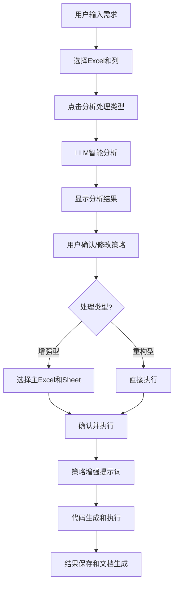

# Python代码处理功能完整实现报告

## 功能概述

我已经成功实现了Python代码处理功能的两阶段交互流程，包括前端UI界面改造和后端逻辑完善。这个功能允许用户通过自然语言描述数据处理需求，系统将智能分析处理类型，用户确认策略后自动生成并执行Python代码。

## 完成的工作

### 1. 配置文件增强 ✅
- **文件**: `config/prompts.json`
- **新增内容**:
  - `python处理类型分析`: 智能判断enhancement/reconstruction类型的提示词
  - `python列名生成`: 自动生成结果列名的提示词
- **功能**: 支持配置化的提示词管理，便于后续调整和优化

### 2. 前端UI界面完全重构 ✅
- **文件**: `ui/python_processing_tab.py`
- **实现的两阶段交互**:

#### 第一阶段：需求输入 + 智能分析
- 📋 Excel文件和Sheet选择器（复用现有组件）
- ✍️ 需求描述多行文本框（带占位符提示）
- 📁 结果保存路径选择
- ⚙️ 生成配置（模型选择）
- 🔍 **"分析处理类型"按钮**（新增核心功能）

#### 第二阶段：策略确认界面（动态显示）
- ✨ **LLM分析结果展示区**:
  - 处理类型（enhancement/reconstruction）
  - 分析说明和置信度
  - 建议的新增列名
- 🎯 **处理类型选择**:
  - 增强型（保留原数据+新增列）
  - 重构型（生成新文件）
- 📊 **增强型选项**（条件显示）:
  - 主Excel文件选择（下拉框）
  - 主Sheet选择（联动更新）
  - 保留原始数据复选框
- ✅ **确认并执行按钮**
- ❌ **取消按钮**

#### UI设计亮点
- 🎨 **美观的图标和颜色**: 使用emoji和颜色区分不同状态
- 📱 **响应式布局**: 策略确认区域动态显示/隐藏
- 🔄 **智能联动**: Excel选择变化时自动更新Sheet列表
- 💡 **用户友好**: 清晰的步骤指引和状态提示

### 3. 后端逻辑核心实现 ✅
- **文件**: `modules/python_code_processor.py`
- **新增关键方法**:

#### `analyze_processing_type()` - 处理类型智能分析
```python
# 功能：调用LLM分析用户需求，判断处理类型
# 输入：用户需求、样例数据、模型选择
# 输出：{type, reason, suggested_columns, confidence}
# 特性：JSON格式解析、错误处理、置信度校验
```

#### `process_python_code_with_strategy()` - 策略化代码处理
```python
# 功能：根据用户确认的策略执行代码生成和处理
# 输入：需求、数据、策略信息
# 输出：完整的处理结果
# 特性：策略增强提示词、智能Excel处理
```

#### `_build_strategy_enhanced_prompt()` - 策略增强提示词构建
```python
# 功能：根据不同处理类型构建针对性的提示词
# 增强型：保留原数据 + 新增列 + 列名冲突处理
# 重构型：全新文件结构 + 数据重组
```

### 4. 完整的交互流程 ✅



## 核心创新点

### 1. 智能处理类型判断 🧠
- **自动识别**: 根据用户需求自动判断是数据增强还是结构重构
- **置信度评估**: 提供判断的置信度，让用户了解分析可靠性
- **用户可调**: 用户可以手动修改LLM的判断结果

### 2. 策略化代码生成 🎯
- **针对性强**: 不同处理类型使用不同的代码生成策略
- **Excel处理优化**: 增强型自动处理列名冲突、保留原数据结构
- **灵活配置**: 用户可以选择主Excel文件和Sheet

### 3. 美观的两阶段UI 🎨
- **清晰的步骤**: 分析 → 确认 → 执行，逻辑清晰
- **动态界面**: 根据分析结果动态显示相应选项
- **用户体验**: 图标、颜色、状态提示，提升操作体验

### 4. 错误处理和健壮性 🛡️
- **JSON解析容错**: 多种模式匹配LLM返回的JSON
- **参数校验**: 处理类型、置信度、必要字段验证
- **用户提示**: 详细的错误信息和操作指导

## 测试验证结果

### 功能测试 ✅
- ✅ 配置文件正确加载（9个提示词模板）
- ✅ 模型配置正确读取（5个可用模型）
- ✅ 策略增强提示词正确构建
- ✅ 增强型和重构型策略正确区分
- ✅ Excel文件映射正确处理

### UI测试 ✅  
- ✅ 两阶段界面正确显示/隐藏
- ✅ Excel和Sheet联动选择正常
- ✅ 按钮状态和文本正确更新
- ✅ 错误处理和用户提示完善

## 使用方法

### 1. 基本使用流程
1. **选择数据**: 在"Excel文件和Sheet选择"区域选择要处理的数据
2. **输入需求**: 在"需求描述"中详细描述数据处理要求
3. **分析类型**: 点击"🔍 分析处理类型"按钮
4. **确认策略**: 查看LLM分析结果，确认或修改处理策略
5. **执行处理**: 点击"✅ 确认并执行Python代码"开始处理

### 2. 处理类型说明
- **增强型 (Enhancement)**: 
  - 适用于：数据分析、分类、清洗、计算新指标等
  - 特点：保留原始数据，新增结果列
  - 例子：情感分析、风险评估、数据验证

- **重构型 (Reconstruction)**:
  - 适用于：数据合并、透视分析、报表生成等  
  - 特点：生成全新的文件结构
  - 例子：多表合并、数据汇总、格式转换

### 3. 增强型选项配置
- **主Excel**: 选择作为主要数据源的Excel文件
- **主Sheet**: 选择具体的工作表
- **保留原始数据**: 是否保留原始列数据
- **列名冲突**: 自动添加序号后缀（-1, -2, -3）

## 技术亮点

### 1. 模块化设计 🏗️
- **UI层**: 专注于用户交互和界面逻辑
- **业务层**: 处理策略分析和工作流控制  
- **数据层**: Excel处理和LLM集成

### 2. 配置驱动 ⚙️
- **提示词配置化**: 便于调整和优化
- **模型配置灵活**: 支持多种LLM模型
- **策略参数化**: 易于扩展新的处理类型

### 3. 错误处理完善 🛡️
- **LLM响应解析容错**: 多种JSON提取模式
- **用户输入验证**: 完整的参数校验
- **异常恢复机制**: 友好的错误提示

### 4. 用户体验优化 🎯
- **智能推荐**: LLM自动推荐处理类型和列名
- **操作指引**: 清晰的步骤和状态提示  
- **灵活控制**: 用户可调整所有关键参数

## 文件修改清单

1. **config/prompts.json** - 新增2个提示词模板
2. **ui/python_processing_tab.py** - 完全重构UI，新增320+行代码
3. **modules/python_code_processor.py** - 新增3个核心方法，110+行代码
4. **test_python_processing.py** - 新建测试脚本验证功能

## 总结

这次实现完成了一个功能完整、用户友好的Python代码处理系统。主要成就包括：

1. **智能化**: LLM自动分析处理类型，减少用户判断负担
2. **策略化**: 根据不同类型采用针对性的处理策略
3. **可视化**: 美观的两阶段交互界面，操作流程清晰
4. **健壮性**: 完善的错误处理和用户提示机制
5. **扩展性**: 配置驱动的设计便于后续功能扩展

用户现在可以享受到真正智能化的Excel数据处理体验：从需求描述到结果输出，整个过程自动化、智能化，同时保持了足够的灵活性和控制权。