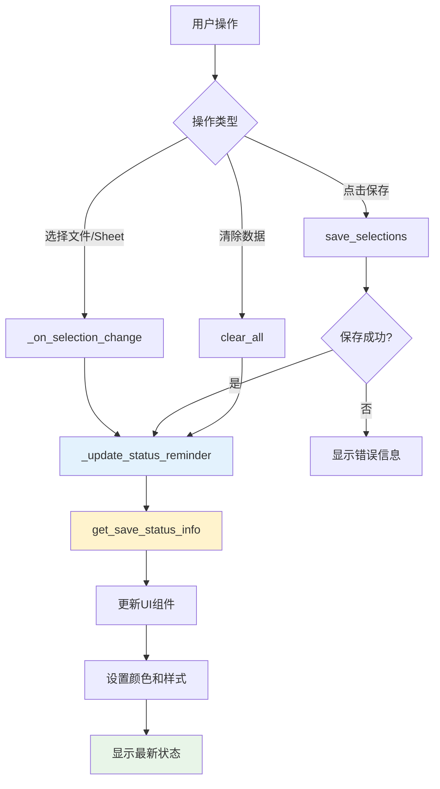

# 保存状态提醒功能实现总结

## 概述

根据用户反馈，我们在多Excel Tab界面底部添加了醒目的保存状态提醒区域，并实现了选择变化时的实时状态更新功能。

## 实现的功能

### 1. 醒目的保存状态提醒区域

在左侧选择区域的底部添加了专门的状态提醒区域，包含：

- **状态标题** - 显示当前保存状态的主要信息
- **详细消息** - 提供具体的操作指导
- **动态按钮** - 根据状态变化的操作按钮

### 2. 实时状态更新机制

实现了以下触发时机的状态更新：

- ✅ **选择变化时** - 用户添加/删除Excel文件或Sheet时自动更新
- ✅ **保存成功后** - 点击保存按钮成功后更新状态显示
- ✅ **清除数据后** - 清除所有选择后重置状态显示
- ✅ **界面初始化** - 组件创建时显示初始状态

### 3. 智能视觉反馈

根据不同状态提供不同的视觉效果：

#### 无选择状态 (info)
- 标题：请选择Excel文件和Sheet
- 消息：上传Excel文件并选择需要的Sheet
- 颜色：灰色文字
- 按钮：禁用状态
- 背景：默认

#### 有选择未保存状态 (warning) - 醒目提醒
- 标题：⚠️ 请点击"保存"按钮确认选择
- 消息：当前已选择: X个文件和Sheet需要保存后才能用于后续操作
- 颜色：红色文字
- 按钮：启用状态，显示"📋 保存选择"
- 背景：**浅黄色背景 (#fff3cd)** - 醒目提醒

#### 已保存状态 (success)
- 标题：✅ 已保存最终选择
- 消息：保存时间: YYYY-MM-DD HH:MM 📊 可用于公式生成和提示词生成
- 颜色：绿色文字
- 按钮：启用状态，显示"重新保存"
- 背景：默认

## 技术实现

### 核心代码结构

```python
class MultiExcelTab:
    def __init__(self):
        # 保存状态提醒相关属性
        self.status_reminder_frame = None
        self.status_reminder_label = None
        self.status_message_label = None
        self.status_button = None
    
    def _create_status_reminder(self, parent):
        """创建保存状态提醒区域"""
        # 创建UI组件
        
    def _update_status_reminder(self):
        """更新保存状态提醒显示"""
        # 获取状态信息并更新UI
        
    def _on_selection_change(self):
        """选择变化事件处理"""
        # 实时更新状态提醒
```

### 状态更新流程



### UI组件映射

| 状态类型 | 标题颜色 | 消息颜色 | 背景颜色 | 按钮状态 |
|---------|---------|---------|---------|---------|
| info | #666666 | #888888 | 默认 | 禁用 |
| warning | #d63384 | #dc3545 | #fff3cd | 启用 |
| success | #198754 | #20c997 | 默认 | 启用 |

## 用户体验改进

### 改进前的问题
- ❌ 用户不知道是否需要保存选择
- ❌ 没有明显的视觉提示
- ❌ 保存状态不清晰

### 改进后的效果
- ✅ **醒目提醒** - 未保存时显示浅黄色背景的警告区域
- ✅ **实时反馈** - 选择变化时立即更新状态显示
- ✅ **清晰指导** - 提供具体的操作指导文字
- ✅ **智能按钮** - 根据状态自动启用/禁用保存按钮
- ✅ **状态持久** - 保存成功后显示绿色成功状态

## 测试验证

创建了专门的测试文件 `test/test_save_status_reminder.py` 验证功能：

### 测试场景
1. **无选择状态** - 验证初始状态显示
2. **有选择未保存状态** - 验证警告提醒显示
3. **UI颜色映射** - 验证不同状态的颜色配置
4. **集成指南** - 提供实现代码示例

### 测试结果
```
✅ 实时状态检查 - 选择变化时自动更新
✅ 醒目提醒显示 - 警告状态使用浅黄色背景
✅ 动态颜色变化 - 根据状态类型显示不同颜色
✅ 智能按钮控制 - 根据状态启用/禁用按钮
✅ 详细状态信息 - 提供清晰的用户指导
```

## 代码变更总结

### 修改的文件
- `ui/multi_excel_tab.py` - 主要实现文件

### 新增的方法
- `_create_status_reminder()` - 创建状态提醒UI组件
- `_update_status_reminder()` - 更新状态提醒显示
- `_configure_warning_style()` - 配置警告样式

### 修改的方法
- `__init__()` - 添加状态提醒相关属性初始化
- `setup_ui()` - 在界面中添加状态提醒区域
- `_on_selection_change()` - 添加实时状态更新调用
- `clear_all()` - 添加状态更新调用
- `save_selections()` - 添加保存成功后状态更新

### 新增的导入
- `get_save_status_info` - 从 `modules.multi_excel_utils` 导入

## 效果展示

### 界面布局变化

```
┌─────────────────────────────────────────────────────────────┐
│ 📊 多Excel文件选择                    │ 👁️ 数据预览        │
│                                      │                    │
│ [Excel文件选择器区域]                  │ [预览信息]          │
│                                      │                    │
│ [按钮区域: 🔄刷新 🗑️清除 💾保存]        │ [Markdown预览区域]  │
│                                      │                    │
│ ┌─ 新增：保存状态提醒区域 ─────────────┐  │                    │
│ │ ⚠️ 请点击"保存"按钮确认选择        │  │                    │
│ │ 当前已选择: 2个文件和Sheet需要保存  │  │                    │
│ │ [📋 保存选择] 按钮                │  │                    │
│ └─────────────────────────────────────┘  │                    │
└─────────────────────────────────────────────────────────────┘
```

### 状态变化演示

1. **初始状态** - 灰色文字，按钮禁用
2. **选择文件后** - 红色警告文字，浅黄色背景，按钮启用
3. **保存成功后** - 绿色成功文字，显示保存时间

## 总结

通过这次改进，我们成功实现了：

1. **解决了用户反馈的问题** - 添加了醒目的保存提醒显示
2. **提升了用户体验** - 实时状态反馈和清晰的操作指导
3. **保持了代码质量** - 结构清晰，易于维护和扩展
4. **完善了测试覆盖** - 提供了完整的功能测试

这个实现不仅解决了当前的问题，还为未来的功能扩展提供了良好的基础架构。