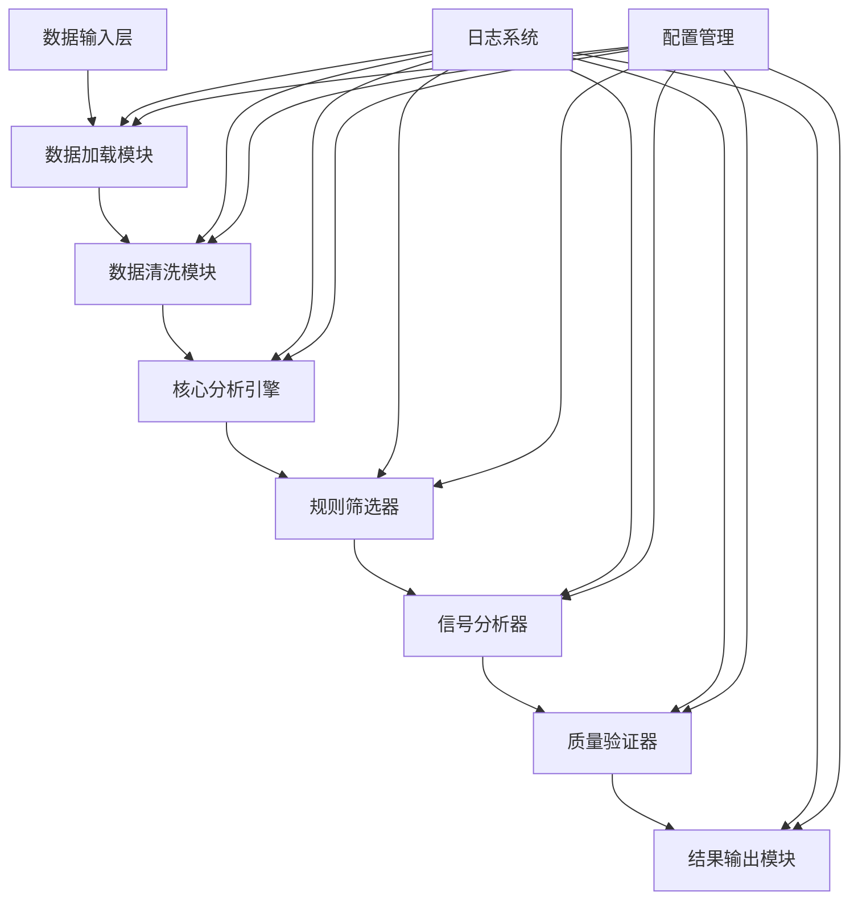
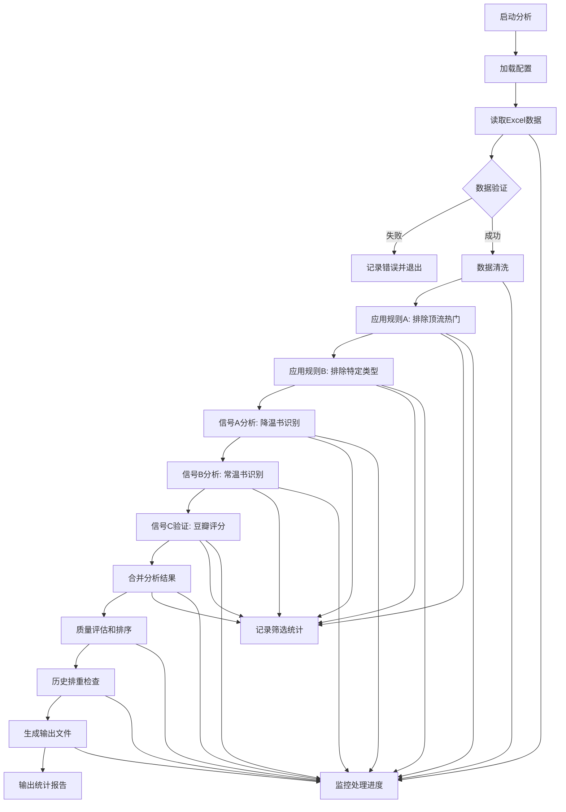

# 借阅数据分析模块开发计划

**项目名称**: 书海回响 (Echoes of the Book Sea)  
**模块名称**: 借阅数据分析  
**文档版本**: v1.0  
**创建日期**: 2025-10-30  
**负责人**: [待指派]

---

## 📋 项目概述

本模块是书海回响项目的第一大核心模块，负责从原始Excel数据中提取图书借阅信息，通过多层次的筛选规则和信号分析，识别出具有价值的"降温书"和"常温书"，为最终的智能推荐提供数据基础。

### 🎯 核心目标
- 处理近三个月借阅数据和月归还数据
- 实现四步筛选流程：智能降噪 → 信号捕捉 → 质量验证 → 终审排重
- 生成结构化的分析结果Excel文件
- 构建可复用、可扩展的数据处理框架

### 📊 输入数据
- **近三月借阅数据**: `data/近三月借阅.xlsx`
- **月归还数据**: `data/月归还.xlsx`
- **配置文件**: `config/setting.yaml`
- **日志系统**: `src/utils/logger.py`

### 📤 输出结果
- **分析结果**: `runtime/outputs/借阅数据分析结果.xlsx`
- **详细日志**: `runtime/logs/`
- **状态报告**: 处理进度和统计信息

---

## 🏗️ 技术架构设计

### 整体架构原则
严格遵循代码工艺标准：**简洁至上 (Simplicity First)**

#### 核心设计理念
1. **KISS原则**: 优先保证代码简洁易懂，避免过度设计
2. **高内聚低耦合**: 模块化设计，功能单一职责
3. **最小化修改**: 以最小化影响原则设计模块接口
4. **测试先行**: 关键功能必须有完整的单元测试覆盖

### 系统架构图



---

## 📁 代码组织结构

### 模块文件结构

```
src/
├── core/                          # 核心模块
│   ├── __init__.py               # 模块初始化
│   ├── data_loader.py            # 数据加载器
│   ├── data_cleaner.py           # 数据清洗器
│   ├── analysis_engine.py        # 分析引擎
│   ├── rule_filter.py            # 规则筛选器
│   ├── signal_analyzer.py        # 信号分析器
│   ├── quality_validator.py      # 质量验证器
│   └── result_exporter.py        # 结果导出器
├── utils/                        # 工具模块
│   ├── __init__.py
│   ├── logger.py                 # 日志系统(已有)
│   ├── config_manager.py         # 配置管理器
│   └── excel_handler.py          # Excel处理工具
├── tests/                        # 测试模块
│   ├── __init__.py
│   ├── test_data_loader.py       # 数据加载测试
│   ├── test_analysis_engine.py   # 分析引擎测试
│   ├── test_rule_filter.py       # 规则筛选测试
│   └── test_signal_analyzer.py   # 信号分析测试
└── main.py                       # 主入口文件
```

### 核心模块职责定义

#### 1. 数据加载器 (`data_loader.py`)
**职责**: 安全、高效地加载Excel数据文件
- 支持多格式Excel文件读取
- 数据验证和完整性检查
- 编码处理和异常捕获
- 加载进度监控和日志记录

#### 2. 数据清洗器 (`data_cleaner.py`)
**职责**: 标准化和清理原始数据
- 去除重复记录和异常值
- 数据类型转换和格式化
- 缺失值处理策略
- 数据标准化和归一化

#### 3. 分析引擎 (`analysis_engine.py`)
**职责**: 协调各个处理步骤的执行
- 流程控制和时间监控
- 错误处理和恢复机制
- 性能监控和资源管理
- 阶段结果缓存和持久化

#### 4. 规则筛选器 (`rule_filter.py`)
**职责**: 应用业务规则进行初步筛选
- **规则A**: 排除顶流热门(借阅量前15%)
- **规则B**: 排除特定类型(专业性过强的书籍)
- 规则配置化和参数化
- 筛选结果统计和报告

#### 5. 信号分析器 (`signal_analyzer.py`)
**职责**: 识别和分析图书的"降温"和"常温"信号
- **信号A**: 借阅量趋势分析(降温书识别)
- **信号B**: 稳定性分析(常温书识别)
- 统计建模和模式识别
- 评分算法和排序机制

#### 6. 质量验证器 (`quality_validator.py`)
**职责**: 通过外部数据源验证图书质量
- **信号C**: 豆瓣评分集成和验证
- 质量阈值设定和动态调整
- 验证结果缓存和更新机制
- 异常处理和降级策略

#### 7. 结果导出器 (`result_exporter.py`)
**职责**: 生成结构化的分析结果文件
- Excel格式结果输出
- 多工作表支持和格式化
- 统计摘要和可视化图表
- 历史版本管理和排重逻辑

---

## 🔄 数据处理流程

### 核心业务流程图



### 详细处理步骤

#### 阶段1: 数据准备 (Data Preparation)
1. **配置加载**
   - 从 `config/setting.yaml` 读取路径配置
   - 验证数据文件存在性和权限
   - 初始化日志系统

2. **数据加载**
   - 加载 `近三月借阅.xlsx` 文件
   - 加载 `月归还.xlsx` 文件
   - 验证数据完整性和格式

3. **数据清洗**
   - 去除重复记录
   - 处理缺失值和异常值
   - 数据类型标准化

#### 阶段2: 智能降噪 (Smart Filtering)
4. **规则A应用: 排除顶流热门**
   - 计算近三个月总借阅次数
   - 识别馆内排名前15%的图书
   - 从候选池中移除这些图书

5. **规则B应用: 排除特定类型**
   - 通过中图法分类号(CLC)过滤
   - 关键词匹配排除
   - 移除技术、教辅、考试用书等

#### 阶段3: 信号捕捉 (Signal Detection)
6. **信号A分析: 降温书识别**
   - 分析借阅量趋势变化
   - 识别平缓或下降趋势的图书
   - 计算趋势强度和置信度

7. **信号B分析: 常温书识别**
   - 分析借阅量稳定性
   - 识别持续稳定借阅的图书
   - 计算稳定性指标

8. **信号C验证: 外部质量验证**
   - 集成豆瓣评分API
   - 保留评分高于7.6分的图书
   - 获取评价质量和评分分布

#### 阶段4: 结果生成 (Result Generation)
9. **结果合并和排序**
   - 整合所有分析结果
   - 应用评分算法排序
   - 生成候选书单

10. **历史排重检查**
    - 对比历史推荐记录
    - 确保推荐内容不重复
    - 更新历史数据库

11. **输出文件生成**
    - 生成结构化Excel结果
    - 包含多工作表详细信息
    - 添加统计摘要和可视化

---

## 🧪 测试策略

### 测试原则
严格遵循代码工艺标准中的**可测试性设计与验证**要求：

- **测试先行**: 开发新功能时优先考虑测试
- **全面覆盖**: 核心功能必须有单元测试
- **场景明确**: 至少覆盖正常、边界、异常三种用例

### 测试分类

#### 1. 单元测试 (Unit Tests)
**测试范围**: 每个模块的核心函数
**测试文件**: `test/` 目录下对应测试文件

```python
# 测试覆盖要求
- 数据加载测试 (test_data_loader.py)
  ✓ 文件存在性验证
  ✓ 数据格式验证
  ✓ 异常文件处理
  ✓ 大文件性能测试

- 分析引擎测试 (test_analysis_engine.py)
  ✓ 流程控制验证
  ✓ 错误处理测试
  ✓ 性能监控测试
  ✓ 内存使用测试

- 规则筛选测试 (test_rule_filter.py)
  ✓ 规则A正确性验证
  ✓ 规则B边界测试
  ✓ 组合规则测试
  ✓ 配置参数测试

- 信号分析测试 (test_signal_analyzer.py)
  ✓ 趋势分析准确性
  ✓ 稳定性计算验证
  ✓ 边界值处理
  ✓ 算法性能测试
```

#### 2. 集成测试 (Integration Tests)
**测试范围**: 模块间交互和端到端流程
**测试场景**:
- 完整数据处理流程测试
- 错误恢复和降级测试
- 大数据集性能测试
- 内存和CPU资源测试

#### 3. 数据质量测试 (Data Quality Tests)
**测试内容**:
- 输入数据完整性验证
- 输出结果正确性检查
- 边界条件和异常数据处理
- 历史排重功能验证

### 测试执行策略
```bash
# 测试执行命令
python -m pytest tests/ -v --cov=src/core --cov-report=html

# 测试报告要求
- 代码覆盖率 ≥ 85%
- 所有核心功能100%覆盖
- 性能测试通过基准
- 内存泄漏检测通过
```

---

## 🛠️ 开发规范

### 代码规范要求

#### 1. 函数设计原则
- **单一职责**: 每个函数只负责一个明确的功能
- **短小精悍**: 函数长度控制在50行以内
- **可复用性**: 优先设计通用和可复用的函数
- **DRY原则**: 严格避免重复代码

#### 2. 文档和注释要求
- **中文优先**: 所有注释、文档字符串使用中文
- **API文档**: 所有公开函数必须有完整的docstring
- **复杂逻辑**: 算法和业务规则必须添加解释性注释
- **TODO标记**: 使用标准格式标记待办事项

```python
def analyze_cooling_books(borrowing_data):
    """
    分析降温书籍信号
    
    识别近三个月借阅量呈平缓或下降趋势的图书，
    这些图书曾经获得关注但现已淡出热点，适合再发现。
    
    Args:
        borrowing_data (pd.DataFrame): 近三个月借阅数据
        
    Returns:
        pd.DataFrame: 降温书籍列表及评分
        
    Raises:
        ValueError: 当输入数据格式不正确时
        DataQualityError: 当数据质量不满足要求时
    """
    pass
```

#### 3. 日志记录规范
- **使用共享日志系统**: 所有模块使用 `src/utils/logger.py`
- **结构化日志**: 采用键值对格式记录
- **分级记录**: 正确使用 DEBUG、INFO、WARNING、ERROR、CRITICAL
- **上下文信息**: 记录关键变量和处理状态

```python
from src.utils.logger import get_logger

logger = get_logger(__name__)

def load_borrowing_data(file_path):
    """加载借阅数据"""
    try:
        logger.info(f"开始加载数据文件: {file_path}")
        # 加载逻辑...
        logger.info(f"数据加载完成，共{len(data)}条记录")
        return data
    except Exception as e:
        logger.error(f"数据加载失败: {str(e)}", extra={"file_path": file_path})
        raise
```

#### 4. 错误处理策略
- **分级处理**: 不同类型错误采用不同处理策略
- **优雅降级**: 关键功能失败时提供备选方案
- **详细记录**: 错误信息包含完整上下文
- **用户友好**: 向用户提供可理解的错误信息

### 性能要求

#### 1. 数据处理性能
- **处理速度**: 支持万级记录在可接受时间内完成
- **内存使用**: 避免内存泄漏和过度占用
- **并发安全**: 多线程环境下数据一致性

#### 2. 可扩展性设计
- **配置化**: 规则参数可配置调整
- **插件化**: 新增分析算法易于集成
- **数据源**: 支持多种数据源格式

---


## 🚨 风险评估和应对策略

### 潜在技术风险

#### 1. 数据质量问题
**风险**: 原始Excel数据存在格式不一致、缺失值等质量问题
**应对策略**:
- 实施严格的数据验证机制
- 设计灵活的数据清洗策略
- 建立数据质量监控和报告

#### 2. 性能瓶颈
**风险**: 大数据量处理可能导致性能问题
**应对策略**:
- 采用分批处理策略
- 实现内存优化和数据流处理
- 设计进度监控和中断恢复

#### 3. 外部依赖风险
**风险**: 豆瓣API等外部服务不可用
**应对策略**:
- 设计降级和缓存机制
- 实现离线验证策略
- 提供配置化开关控制

### 业务逻辑风险

#### 1. 规则配置不当
**风险**: 筛选规则过于严格或宽松影响结果质量
**应对策略**:
- 建立规则参数配置系统
- 提供多种预设配置方案
- 实现A/B测试和效果评估

#### 2. 算法准确性
**风险**: 趋势分析和稳定性计算算法可能存在偏差
**应对策略**:
- 多算法对比验证
- 人工抽样验证
- 持续优化和调参

---

## 📞 项目沟通

### 技术支持
- **代码规范咨询**: 参考 `.rules/agents.md`
- **架构设计讨论**: 建议使用本开发计划文档作为基础
- **性能优化指导**: 根据实际运行数据调整优化策略

### 变更管理
- **需求变更**: 通过项目负责人审批后更新计划
- **技术方案调整**: 在不影响核心架构的前提下可灵活调整
- **时间计划调整**: 重大变更需要更新时间表和里程碑