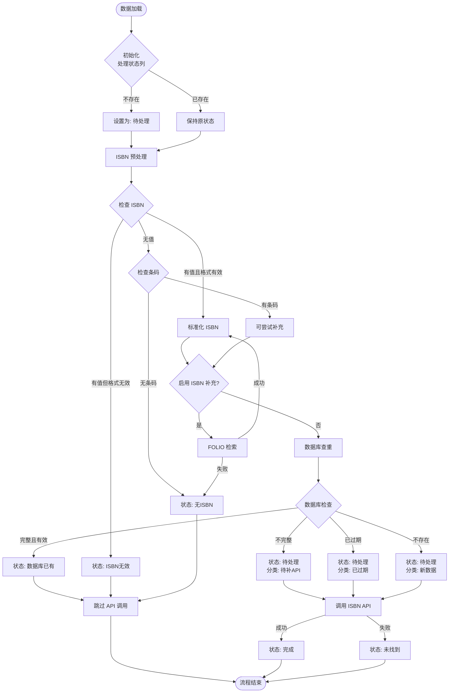

# 豆瓣 ISBN API 模块 - 状态管理优化

## 修改日期
2025-12-03

## 问题描述

在豆瓣 ISBN API 模块中,存在以下两个状态管理问题:

1. **重复处理问题**: 状态为 `未找到` 的记录会被重复调用 API,浪费资源
2. **无明确终态**: ISBN 为空且无法通过 FOLIO 补充的记录,状态一直保持 `待处理`,没有明确的终态标识

## 解决方案

### 1. 新增状态值

在 `ProcessStatus` 类中新增 `NO_ISBN` 状态:

```python
class ProcessStatus:
    """处理状态常量."""
    
    PENDING = "待处理"          # 初始状态,等待处理
    DONE = "完成"               # API 成功获取数据
    NOT_FOUND = "未找到"        # API 调用失败或未找到图书
    INVALID_ISBN = "ISBN无效"   # ISBN 格式无效
    FROM_DB = "数据库已有"      # 从数据库获取的数据
    NO_ISBN = "无ISBN"          # ISBN 为空且无法补充
```

### 2. 状态流转逻辑

#### 数据流转图



#### 2.1 ISBN 预处理阶段 (`isbn_preprocessor.py`)

**场景 1: ISBN 格式无效**
- 条件: ISBN 有值但格式不符合规范
- 状态: `待处理` → `ISBN无效`

**场景 2: ISBN 为空且无条码**
- 条件: ISBN 为空,且没有条码(无法通过 FOLIO 补充)
- 状态: `待处理` → `无ISBN`

#### 2.2 ISBN 补充阶段 (`isbn_preprocessor.supplement_isbn`)

**场景: FOLIO 补充失败**
- 条件: 经过 FOLIO 检索后仍然无法获取 ISBN
- 状态: `待处理` → `无ISBN`

#### 2.3 API 调用阶段 (`api_caller.py`)

**过滤逻辑**: 跳过以下终态状态,避免重复处理:
- `完成` (DONE): 已成功获取数据
- `数据库已有` (FROM_DB): 从数据库获取的完整数据
- `未找到` (NOT_FOUND): 已经尝试过 API 调用但失败
- `ISBN无效` (INVALID_ISBN): ISBN 格式无效,无法调用 API
- `无ISBN` (NO_ISBN): ISBN 为空且无法补充,无法调用 API

## 状态说明

| 状态 | 说明 | 是否终态 | 是否调用 API |
|------|------|----------|--------------|
| 待处理 | 初始状态,等待处理 | 否 | 是 |
| 完成 | API 成功获取数据 | 是 | 否 |
| 未找到 | API 调用失败或未找到图书 | 是 | 否 |
| ISBN无效 | ISBN 格式无效 | 是 | 否 |
| 数据库已有 | 从数据库获取的**完整且有效**数据 | 是 | 否 |
| 无ISBN | ISBN 为空且无法补充 | 是 | 否 |

### 数据库已有 (FROM_DB) 状态的判定条件

该状态需要**同时满足**以下所有条件:

1. **数据存在**: 数据库中存在该条码的记录
2. **未过期**: 记录的更新时间在 `stale_days` 天数内(默认 180 天)
3. **必备字段完整**: 包含配置中 `required_fields` 指定的所有字段,默认为:
   - `douban_title` (豆瓣书名)
   - `douban_summary` (豆瓣内容简介)
   - `douban_cover_image` (豆瓣封面图片链接)
4. **URL 检查** (可选): 如果 `crawl_empty_url=false`,则 `douban_url` 不能为空

**不满足以上条件的情况**:
- 数据过期 → 标记为 `待处理`,分类为 `existing_stale`,需要重新调用 API
- 缺少必备字段 → 标记为 `待处理`,分类为 `existing_valid_incomplete`,需要调用 API 补充
- 强制更新模式 (`force_update=true`) → 所有数据库记录都标记为 `待处理`,需要重新获取

**相关配置** (`config/setting.yaml`):
```yaml
douban:
  database:
    refresh_strategy:
      enabled: true
      stale_days: 180           # 过期天数
      force_update: false       # 强制更新
      crawl_empty_url: false    # URL 为空时是否重新爬取
      required_fields:          # 必备字段列表
        - douban_title
        - douban_summary
        - douban_cover_image
```

## 修改文件

### 1. `src/core/douban/pipelines/isbn_api_steps/constants.py`
- 新增 `NO_ISBN` 状态常量

### 2. `src/core/douban/pipelines/isbn_api_steps/isbn_preprocessor.py`
- 在预处理阶段,对无条码的空 ISBN 记录标记为 `NO_ISBN`
- 在 FOLIO 补充失败后,将状态更新为 `NO_ISBN`

### 3. `src/core/douban/pipelines/isbn_api_steps/api_caller.py`
- 更新过滤逻辑,跳过所有终态状态(包括 `NO_ISBN`)

### 4. `src/core/douban/pipelines/isbn_api_steps/database_checker.py` ⭐ 核心修改
- **问题**: 数据库查重时无条件覆盖 Excel 中的原有状态,导致终态记录(如 `未找到`)被重新标记为 `待处理`,从而被重复调用 API
- **修改**: 在四个处理方法中添加终态保护逻辑:
  - `_process_existing_valid`: 只有当前状态为 `待处理` 时才更新为 `数据库已有`
  - `_process_existing_incomplete`: 只有当前状态为 `待处理` 时才保持 `待处理`
  - `_process_existing_stale`: 只有当前状态为 `待处理` 时才保持 `待处理`
  - `_process_new`: 只有当前状态为 `待处理` 时才保持 `待处理`
- **统计**: 添加终态保护计数,记录有多少条记录因为是终态而被保护
- **日志**: 添加 debug 级别日志,记录每条被保护的记录信息

## 核心逻辑示例

```python
# 修改前
def _process_new(self, df: pd.DataFrame, categories: Dict) -> None:
    for item in categories.get("new", []):
        idx = item.get("_index")
        df.at[idx, "处理状态"] = ProcessStatus.PENDING  # ❌ 无条件覆盖
        self.row_category_map[idx] = "new"

# 修改后
def _process_new(self, df: pd.DataFrame, categories: Dict) -> int:
    protected_count = 0
    for item in categories.get("new", []):
        idx = item.get("_index")
        current_status = df.at[idx, "处理状态"]
        
        # ✅ 只有当前状态为 PENDING 时才保持 PENDING
        # 如果是终态(完成/未找到/ISBN无效/无ISBN/数据库已有),则保持不变
        if current_status != ProcessStatus.PENDING:
            protected_count += 1
            logger.debug(f"终态保护 - idx={idx}, 状态={current_status}, 分类=new")
        
        self.row_category_map[idx] = "new"
    
    return protected_count
```

## 效果

1. **避免重复处理**: `未找到` 状态的记录不会再被重复调用 API
2. **明确终态**: ISBN 为空且无法补充的记录有明确的 `无ISBN` 状态
3. **提高效率**: 减少不必要的 API 调用和 FOLIO 检索
4. **状态清晰**: 每条记录的处理状态更加明确,便于后续分析和统计
5. **中断恢复安全**: 中断继续时,已完成或已失败的记录状态不会被覆盖

## 场景验证

### 场景 1: 全新 Excel
```
初始化: 所有记录 → 待处理
预处理: 无效 ISBN → ISBN无效, 无 ISBN 且无条码 → 无ISBN
数据库查重: 待处理 → 根据数据库情况分类
API 调用: 只处理 待处理 状态
结果: ✅ 正常处理
```

### 场景 2: 中断继续 - 已完成记录
```
Excel 状态: 完成 (上次已获取数据)
数据库查重: 状态保持 完成 (终态保护)
API 调用: 跳过 (状态是终态)
数据库写入:
  - 如果数据库中已有 → 跳过 (分类=existing_valid)
  - 如果数据库中没有 → 写入 (分类=new)
结果: ✅ 不会重复调用 API,数据库写入逻辑正确
```

### 场景 3: 中断继续 - 已失败记录
```
Excel 状态: 未找到 (上次 API 调用失败)
数据库查重: 状态保持 未找到 (终态保护) ⭐ 关键修改
API 调用: 跳过 (状态是终态)
数据库写入: 跳过 (状态不是"完成")
结果: ✅ 不会重复调用 API
```

### 场景 4: 中断继续 - 待处理记录
```
Excel 状态: 待处理 (上次未完成)
数据库查重: 根据数据库情况分类
  - 数据库有完整数据 → 数据库已有
  - 数据库有不完整数据 → 待处理
  - 数据库没有 → 待处理
API 调用: 只处理 待处理 状态
结果: ✅ 正常处理未完成的记录
```

## 兼容性

- 现有数据中的 `待处理` 状态记录仍然会被正常处理
- 现有的其他状态值不受影响
- 新增的 `无ISBN` 状态不会影响已有的业务逻辑
- 中断继续场景下,终态记录得到保护,不会被重复处理

## 验证方法

1. **查看日志**: 运行时查看是否有 "终态保护: X 条记录保持原状态不变" 的日志
2. **对比 API 调用数**: 中断继续时,API 调用数应该只包含未完成的记录
3. **检查状态变化**: 对比中断前后的 Excel 文件,终态状态应该保持不变
