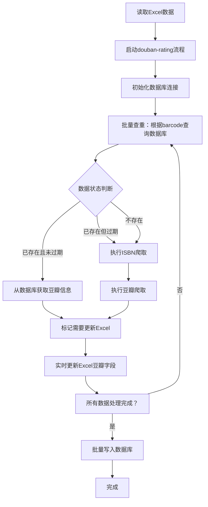

# 豆瓣评分模块数据库功能开发文档（集成版）

## 概述

本文档描述豆瓣评分模块数据库功能的开发设计，通过**无缝集成**到现有的 `douban-rating` 主流程中，实现：
1. **智能查重** - 根据barcode自动检查数据库，避免重复爬取
2. **自动更新** - 根据数据创建时间智能刷新豆瓣信息
3. **流程集成** - 在ISBN获取→豆瓣爬取→Excel更新的完整流程中自动嵌入数据库操作
4. **灵活配置** - 通过 `config/setting.yaml` 配置查重和刷新策略

## 业务流程图



## 与现有模块的集成点

### 主入口命令

通过 `douban-rating` 命令实现完整流程：

```bash
# 完整流程（推荐）
python src/core/douban/douban_main.py douban-rating --excel-file "借阅数据.xlsx"

# 带测试模式
python src/core/douban/douban_main.py douban-rating --excel-file "借阅数据.xlsx" --test

# 指定刷新策略
python src/core/douban/douban_main.py douban-rating --excel-file "借阅数据.xlsx" --force-update
```

## 核心功能需求

### 1. 数据库查重功能（增量更新）

- **功能描述**：根据 `barcode`（书目条码）批量查询数据库
- **返回结果**：
  - `existing_valid`：已存在且有效的数据（直接使用数据库豆瓣信息）
  - `existing_stale`：已存在但过期需要更新的数据（重新爬取）
  - `new`：数据库中不存在的新数据（完整流程：ISBN爬取+豆瓣爬取）

- **刷新策略配置**：
```yaml
# config/setting.yaml
douban:
  database:
    refresh_strategy:
      enabled: true
      # 超过该天数的数据需要重新爬取（豆瓣评分可能更新）
      stale_days: 30  # 默认30天
      # 强制更新模式（忽略时间限制）
      force_update: false
```

### 2. 数据写入功能
将以下三类数据写入数据库：
- **books表**：基础信息 + 豆瓣信息（1:1关系）
- **borrow_records表**：借阅记录（1:多关系）
- **borrow_statistics表**：统计信息（1:多关系，按月度）

### 3. Excel更新功能
根据查重结果更新Excel：
- **已存在且有效数据**：从数据库提取豆瓣字段，写入Excel
- **过期/新数据**：将爬取的豆瓣信息写入Excel

### 4. 流程控制（无缝集成）

在现有 `isbn_async_processor.py` 中集成数据库功能：
- 在异步处理前执行查重
- 在Excel更新时嵌入数据库操作
- 完成后批量写入数据库

## 配置文件设计（config/setting.yaml）

### 数据库配置

```yaml
douban:
  # 数据库相关配置
  database:
    # 数据库文件路径
    db_path: "runtime/outputs/books_history.db"

    # 查重策略
    duplicate_check:
      enabled: true
      # 查询字段：基于barcode查重
      key_field: "barcode"
      # 是否启用批量查询（推荐：true，性能更好）
      batch_query: true

    # 数据刷新策略
    refresh_strategy:
      enabled: true
      # 超过该天数的数据需要重新爬取（豆瓣评分可能更新）
      stale_days: 30  # 默认30天
      # 强制更新模式（忽略时间限制）
      force_update: false
      # 更新方式：merge（保留原记录其他字段）或 overwrite（完全覆盖）
      update_mode: "merge"

    # 写入策略
    write_strategy:
      # 批量写入大小（提高性能）
      batch_size: 100
      # 是否启用事务（保证数据一致性）
      use_transaction: true
      # 写入完成后是否创建备份
      create_backup: true

    # 日志策略
    logging:
      # 是否记录详细的SQL操作
      log_sql: false
      # 是否记录性能统计
      log_performance: true
```

## Python文件设计

### 1. `database_manager.py` - 数据库管理器

**职责**：封装所有数据库操作

**主要功能**：
- 初始化数据库（创建表、索引）
- 批量查重（根据barcode列表+刷新策略）
- 批量写入三类数据
- 查询完整的书籍信息

**关键方法**：
```python
class DatabaseManager:
    def init_database(self, db_path: str = "books_history.db")
    def batch_check_duplicates(self, barcodes: List[str], stale_days: int = 30) -> Dict:
        """
        批量查重，返回分类结果

        Returns:
        {
            'existing_valid': [{'barcode': 'B001', 'data': book_data}, ...],
            'existing_stale': [{'barcode': 'B002', 'data': book_data}, ...],
            'new': ['B003', 'B004', ...]
        }
        """
    def batch_save_data(self, books_data, borrow_records_list, statistics_list)
    def get_book_by_barcode(self, barcode: str)
    def update_book_douban_info(self, barcode: str, douban_data: Dict)
    def close(self)
```

---

### 2. `data_checker.py` - 查重处理器

**职责**：封装查重逻辑，与异步处理器协作

**主要功能**：
- 调用DatabaseManager进行批量查重
- 根据刷新策略分类数据
- 返回分类结果供上层使用

**关键方法**：
```python
class DataChecker:
    def __init__(self, db_manager: DatabaseManager, refresh_config: Dict)

    def check_and_categorize_books(self, excel_data: List[Dict]) -> Dict:
        """
        检查并分类书籍

        返回:
        {
            'existing_valid': [book_data1, book_data2, ...],  # 从DB直接获取
            'existing_stale': [book_data3, book_data4, ...],  # 需要重新爬取
            'new': [book_data5, book_data6, ...]              # 需要完整流程
        }
        """
```

---

### 3. `excel_updater.py` - Excel更新器

**职责**：将查询结果更新到Excel文件

**主要功能**：
- 读取Excel文件
- 根据查重结果更新豆瓣字段
- 写入Excel文件
- 支持多种豆瓣字段映射

**关键方法**：
```python
class ExcelUpdater:
    def __init__(self, excel_path: str)

    def update_from_database(self, books_data: List[Dict])
    def update_from_crawler(self, books_data: List[Dict])
    def save(self, output_path: str = None)
```

**豆瓣字段映射**：
```python
DOUBAN_FIELDS_MAPPING = {
    'douban_url': 'douban_url',
    'douban_rating': 'douban_rating',
    'douban_title': 'douban_title',
    'douban_subtitle': 'douban_subtitle',
    'douban_original_title': 'douban_original_title',
    'douban_author': 'douban_author',
    'douban_translator': 'douban_translator',
    'douban_publisher': 'douban_publisher',
    'douban_pages': 'douban_pages',
    'douban_binding': 'douban_binding',
    'douban_pub_year': 'douban_pub_year',
    'douban_rating_count': 'douban_rating_count',
    'douban_summary': 'douban_summary',
    # ... 更多字段
}
```

---

### 3. 在 `isbn_async_processor.py` 中集成数据库

**新增功能**：
- 在异步处理器中集成数据库查重和保存
- 在处理过程中自动从数据库获取有效数据
- 在Excel更新时自动写入数据库

**集成点**：
```python
class ISBNAsyncProcessor:
    def __init__(self, ..., enable_database: bool = False, db_config: Dict = None):
        # ... 现有逻辑
        self.database_enabled = enable_database
        if enable_database:
            self.db_manager = DatabaseManager()
            self.data_checker = DataChecker(self.db_manager, db_config)

    async def process_isbn_async(..., save_to_database: bool = False):
        """新增：save_to_database参数"""

        # 步骤1：查重（仅当启用数据库且save_to_database=True时）
        if self.database_enabled and save_to_database:
            categories = self.data_checker.check_and_categorize_books(excel_data)

            # 处理已有有效数据（直接从数据库获取）
            await self._process_existing_valid_books(categories['existing_valid'], ...)

            # 处理过期数据和新数据（完整流程：ISBN爬取+豆瓣爬取）
            stale_and_new = categories['existing_stale'] + categories['new']
            await self._process_stale_and_new_books(stale_and_new, ...)

        else:
            # 原有逻辑（直接处理所有数据）
            await self._process_all_books(excel_data, ...)

        # 步骤2：保存到数据库（所有数据处理完成后）
        if self.database_enabled and save_to_database:
            await self._batch_save_to_database()

    async def _process_existing_valid_books(self, books, ...):
        """处理已有有效数据（从数据库获取，不爬取）"""

    async def _process_stale_and_new_books(self, books, ...):
        """处理过期数据和新数据（完整爬取流程）"""

    async def _batch_save_to_database(self):
        """批量保存到数据库"""
```

---

### 4. `process_controller.py` - 流程控制器（简化版）

**职责**：协调数据库功能与现有流程

**关键方法**：
```python
class DoubanRatingProcessController:
    def __init__(self, excel_path: str, enable_db: bool = True, db_config: Dict = None):
        self.excel_path = excel_path
        self.db_enabled = enable_db
        if enable_db:
            self.db_manager = DatabaseManager()
            self.db_manager.init_database(db_config.get('db_path'))

    async def run_full_process(self):
        """执行完整流程：ISBN获取+豆瓣爬取+数据库保存"""

        # 调用异步处理器（集成数据库功能）
        output_file, stats = await process_isbn_async(
            excel_file_path=self.excel_path,
            enable_database=self.db_enabled,
            save_to_database=self.db_enabled,
            db_config=self.db_config,
            # ... 其他参数
        )

        return output_file, stats
```

---

## 数据库表设计（SQLite）

### 1. books表（基础信息+豆瓣信息）

```sql
CREATE TABLE books (
    id INTEGER PRIMARY KEY AUTOINCREMENT,   -- 自增主键
    barcode TEXT UNIQUE NOT NULL,           -- 书目条码（唯一索引）

    -- ============ 书籍基础信息（不变）===========
    call_no TEXT NOT NULL,                  -- 索书号
    book_title TEXT NOT NULL,               -- 书名
    additional_info TEXT,                   -- 附加信息
    isbn TEXT,                              -- ISBN号

    -- ============ 豆瓣信息（1对1，不变）===========
    douban_url TEXT,                        -- 豆瓣链接
    douban_rating REAL,                     -- 豆瓣评分
    douban_title TEXT,                      -- 豆瓣书名
    douban_subtitle TEXT,                   -- 豆瓣副标题
    douban_original_title TEXT,             -- 豆瓣原作名
    douban_author TEXT,                     -- 豆瓣作者
    douban_translator TEXT,                 -- 豆瓣译者
    douban_publisher TEXT,                  -- 豆瓣出版社
    douban_producer TEXT,                   -- 豆瓣出品方
    douban_series TEXT,                     -- 豆瓣丛书
    douban_series_link TEXT,                -- 豆瓣丛书链接
    douban_price TEXT,                      -- 豆瓣定价
    douban_isbn TEXT,                       -- 豆瓣ISBN
    douban_pages INTEGER,                   -- 豆瓣页数
    douban_binding TEXT,                    -- 豆瓣装帧
    douban_pub_year INTEGER,                -- 豆瓣出版年
    douban_rating_count INTEGER,            -- 豆瓣评价人数
    douban_summary TEXT,                    -- 豆瓣内容简介
    douban_author_intro TEXT,               -- 豆瓣作者简介
    douban_catalog TEXT,                    -- 豆瓣目录
    douban_cover_image TEXT,                -- 豆瓣封面图片链接

    -- ============ 元数据 ============
    data_version TEXT DEFAULT '1.0',        -- 数据版本
    created_at TEXT NOT NULL,               -- 创建时间
    updated_at TEXT                         -- 更新时间
);

-- 索引
CREATE INDEX idx_books_barcode ON books(barcode);
CREATE INDEX idx_books_isbn ON books(isbn);
CREATE INDEX idx_books_douban_isbn ON books(douban_isbn);
CREATE INDEX idx_books_title ON books(book_title);
```

### 2. borrow_records表（借阅记录）

```sql
CREATE TABLE borrow_records (
    id INTEGER PRIMARY KEY AUTOINCREMENT,   -- 自增主键
    barcode TEXT NOT NULL,                  -- 外键，关联books表

    -- ============ 借阅记录信息 ============
    reader_card_no TEXT NOT NULL,           -- 读者卡号
    submit_time TEXT,                       -- 提交时间
    return_time TEXT,                       -- 归还时间
    storage_time TEXT,                      -- 入库时间

    -- ============ 元数据 ============
    created_at TEXT NOT NULL,               -- 记录创建时间

    FOREIGN KEY (barcode) REFERENCES books(barcode) ON DELETE CASCADE
);

-- 索引
CREATE INDEX idx_borrow_records_barcode ON borrow_records(barcode);
CREATE INDEX idx_borrow_records_reader ON borrow_records(reader_card_no);
CREATE INDEX idx_borrow_records_return_time ON borrow_records(return_time);
```

### 3. borrow_statistics表（统计信息）

```sql
CREATE TABLE borrow_statistics (
    id INTEGER PRIMARY KEY AUTOINCREMENT,   -- 自增主键
    barcode TEXT NOT NULL,                  -- 外键，关联books表

    -- ============ 统计周期信息 ============
    stat_period TEXT NOT NULL,              -- 统计周期标识（如"2024-10"）
    stat_year INTEGER NOT NULL,             -- 统计年份
    stat_month INTEGER NOT NULL,            -- 统计月份（1-12）
    period_start TEXT,                      -- 周期开始时间
    period_end TEXT,                        -- 周期结束时间

    -- ============ 借阅次数统计 ============
    borrow_count_3m INTEGER,                -- 近三个月总次数
    borrow_count_m1 INTEGER,                -- 第一月借阅次数
    borrow_count_m2 INTEGER,                -- 第二月借阅次数
    borrow_count_m3 INTEGER,                -- 第三月借阅次数

    -- ============ 元数据 ============
    created_at TEXT NOT NULL,               -- 记录创建时间
    updated_at TEXT,                        -- 记录更新时间

    FOREIGN KEY (barcode) REFERENCES books(barcode) ON DELETE CASCADE,
    UNIQUE(barcode, stat_year, stat_month)  -- 确保同一本书在同一统计周期只有一条记录
);

-- 索引
CREATE INDEX idx_borrow_statistics_barcode ON borrow_statistics(barcode);
CREATE INDEX idx_borrow_statistics_period ON borrow_statistics(stat_year, stat_month);
CREATE INDEX idx_borrow_statistics_barcode_period ON borrow_statistics(barcode, stat_year, stat_month);
```

## 数据流向详细说明

### 1. 查重阶段
```
Excel.barcode → database_manager.batch_check_duplicates()
                ↓
             books表WHERE barcode IN (...) AND created_at > datetime('now', '-30 days')
                ↓
           返回: [已有有效数据列表, 已有过期数据列表, 新数据列表]
```

### 2. 更新阶段（已有有效数据）
```
books表 ← SELECT douban_* FROM books WHERE barcode = ?
    ↓
提取豆瓣字段（douban_url, douban_rating, ...）
    ↓
Excel文件 ← 直接更新对应行（不爬取，不调用ISBN获取）
```

### 3. 更新阶段（过期/新数据）
```
ISBN爬取 → 获得isbn
    ↓
豆瓣爬取 → 获得douban_xxx信息
    ↓
标记到"待写入数据库"列表
    ↓
Excel文件 ← 更新豆瓣字段
```

### 4. 写入阶段（所有数据处理完成后）
```
三类数据:
├─ books表 ← 基础信息 + 豆瓣信息（INSERT OR REPLACE）
├─ borrow_records表 ← 借阅记录
└─ borrow_statistics表 ← 统计信息

执行时机：所有Excel数据处理完毕后，批量提交
写入策略：REPLACE INTO（存在则更新，不存在则插入）
```

## 异常处理策略

### 1. 数据库异常
```python
try:
    db_manager.batch_save_data(...)
except sqlite3.Error as e:
    logger.error(f"数据库操作失败: {e}")
    # 回滚事务
    conn.rollback()
    # 记录失败的barcodes，重试或跳过
```

### 2. 爬取异常
```python
try:
    douban_info = crawler.crawl(isbn)
except CrawlerException as e:
    logger.warning(f"爬取失败，跳过: {e}")
    # 跳过该条记录，继续处理下一条
    continue
```

### 3. Excel写入异常
```python
try:
    excel_updater.save(output_path)
except Exception as e:
    logger.error(f"Excel保存失败: {e}")
    # 保存备份文件
    excel_updater.save_backup()
```

## 性能优化建议

### 1. 批量操作
- **查重**：`IN (...)` 批量查询，避免循环单条查询
- **写入**：使用`executemany()`批量插入
- **事务**：合并多个操作为一个事务（默认batch_size=100）

### 2. 索引优化
- `books.barcode`：查重关键字段，**必须索引**（UNIQUE）
- `books.created_at`：数据刷新查询
- `borrow_records.barcode`：查询借阅记录
- `borrow_statistics(barcode, stat_year, stat_month)`：复合索引
- `books.isbn` + `books.douban_isbn`：ISBN查询优化

### 3. 缓存策略
- **已有有效数据**：直接从数据库获取，不爬取（大幅节省时间）
- **结果缓冲区**：异步处理中的结果缓冲区（避免并发冲突）

### 4. 并发控制
- **数据库连接池**：单个数据库连接，多线程安全访问
- **锁机制**：数据库写入时使用事务锁

## 异常处理策略

### 1. 数据库异常
```python
try:
    db_manager.batch_save_data(...)
except sqlite3.Error as e:
    logger.error(f"数据库操作失败: {e}")
    # 回滚事务
    conn.rollback()
    # 记录失败的barcodes，重试或跳过
```

### 2. 查重异常
```python
try:
    categories = data_checker.check_and_categorize_books(...)
except Exception as e:
    logger.warning(f"查重失败，跳过数据库功能: {e}")
    # 降级到原有流程（不使用数据库）
    await self._process_all_books_without_db(...)
```

### 3. Excel写入异常
```python
try:
    excel_updater.save(output_path)
except Exception as e:
    logger.error(f"Excel保存失败: {e}")
    # 保存备份文件
    excel_updater.save_backup()
    # 数据库写入不受影响（继续执行）
```

## 与现有模块的集成

### 在 `douban_main.py` 中新增命令

```python
def process_douban_rating_command(args):
    """处理douban-rating命令"""
    if not validate_excel_file(args.excel_file):
        return

    # 获取数据库配置
    db_config = {}
    if not args.disable_database:
        config_manager = get_config_manager()
        douban_config = config_manager.get_douban_config()
        db_config = douban_config.get('database', {})
        db_config['refresh_strategy']['force_update'] = args.force_update

    print(f"🎯 豆瓣评分流程开始")
    print(f"📄 源文件: {args.excel_file}")
    print(f"💾 数据库功能: {'启用' if not args.disable_database else '禁用'}")
    if not args.disable_database:
        print(f"   刷新策略: {db_config['refresh_strategy']['stale_days']}天")

    # 调用流程控制器（集成数据库功能）
    controller = DoubanRatingProcessController(
        excel_path=args.excel_file,
        enable_db=not args.disable_database,
        db_config=db_config
    )

    # 执行完整流程
    output_file, stats = controller.run_full_process()

    # 显示结果
    print(f"\n✅ 流程完成!")
    print(f"📁 输出文件: {output_file}")
    print(f"📈 统计信息: {stats}")

    # 显示数据库统计（如果启用）
    if not args.disable_database:
        db_stats = controller.get_database_stats()
        print(f"💾 数据库操作:")
        print(f"   查重发现: {db_stats['existing_count']}条已存在")
        print(f"   爬取新增: {db_stats['new_count']}条新数据")
        print(f"   刷新更新: {db_stats['stale_count']}条过期更新")
        print(f"   DB路径: {db_config['db_path']}")
```

### 新增命令行参数

```python
parser.add_argument('--excel-file', required=True, help='Excel文件路径')
parser.add_argument('--disable-database', action='store_true', help='禁用数据库功能（仅爬取和更新Excel）')
parser.add_argument('--force-update', action='store_true', help='强制更新所有数据（忽略时间限制）')
parser.add_argument('--db-path', help='数据库文件路径（可选，默认从配置读取）')
```

## 日志和监控

### 1. 日志级别
- `INFO`：正常流程信息（开始、结束、处理数量）
- `WARNING`：可恢复的异常（某条记录失败，继续处理）
- `ERROR`：严重错误（数据库连接失败、需要人工处理）

### 2. 关键指标
- 总处理记录数
- 成功/失败数量
- 查重比例（重复 vs 新数据）
- 爬取成功率
- 处理耗时
- 数据库写入统计（写入数量、回滚次数）

### 3. 进度跟踪
```python
logger.info(f"进度: {processed}/{total} ({processed/total*100:.1f}%)")
logger.info(f"数据库状态: {existing_valid}条有效，{existing_stale}条过期，{new}条新数据")
```

## 使用示例

### 1. 完整流程（推荐）
```bash
# 自动查重+爬取+数据库保存
python src/core/douban/douban_main.py douban-rating --excel-file "借阅数据.xlsx"
```

### 2. 测试模式（验证流程）
```bash
# 仅处理前5条记录，验证流程正确性
python src/core/douban/douban_main.py douban-rating --excel-file "借阅数据.xlsx" --test
```

### 3. 强制刷新模式
```bash
# 忽略数据库中的数据，强制重新爬取所有记录
python src/core/douban/douban_main.py douban-rating --excel-file "借阅数据.xlsx" --force-update
```

### 4. 禁用数据库功能
```bash
# 仅执行ISBN获取和豆瓣爬取，不使用数据库
python src/core/douban/douban_main.py douban-rating --excel-file "借阅数据.xlsx" --disable-database
```

### 5. 自定义数据库路径
```bash
# 指定数据库文件路径
python src/core/douban/douban_main.py douban-rating --excel-file "借阅数据.xlsx" --db-path "/path/to/custom.db"
```

## 配置文件示例（完整版）

```yaml
# config/setting.yaml
douban:
  # 数据库相关配置
  database:
    # 数据库文件路径
    db_path: "runtime/outputs/books_history.db"

    # 查重策略
    duplicate_check:
      enabled: true
      key_field: "barcode"
      batch_query: true

    # 数据刷新策略（重要）
    refresh_strategy:
      enabled: true
      # 超过30天的数据需要重新爬取（豆瓣评分可能更新）
      stale_days: 30
      force_update: false  # 设置为true则忽略时间限制，强制更新所有
      update_mode: "merge"  # merge保留原记录，overwrite完全覆盖

    # 写入策略
    write_strategy:
      batch_size: 100
      use_transaction: true
      create_backup: true

    # 日志策略
    logging:
      log_sql: false
      log_performance: true

  # 异步处理器配置（现有）
  isbn_processor:
    strategy: "balanced"
    max_concurrent: 3
    save_interval: 1
```

## 目录结构

```
src/core/douban/
├── database/
│   ├── __init__.py
│   ├── database_manager.py    # 数据库管理器
│   ├── data_checker.py        # 查重处理器
│   ├── excel_updater.py       # Excel更新器
│   └── process_controller.py  # 流程控制器
├── isbn_async_processor.py    # 异步处理器（集成数据库功能）
└── douban_main.py             # 主程序（新增douban-rating命令）

# 数据库工具脚本
src/tools/
└── init_database.py           # 数据库初始化脚本（已存在）
```

## 数据库初始化

在首次使用数据库功能前，需要先初始化数据库表结构：

```bash
# 使用默认配置（从config/setting.yaml读取）
python src/tools/init_database.py

# 指定自定义数据库路径
python src/tools/init_database.py --db-path "runtime/outputs/books_history.db"

# 强制重新创建（覆盖已存在的数据库）
python src/tools/init_database.py --db-path "runtime/outputs/books_history.db" --force
```

初始化完成后将创建：
- `books` 表：书籍基础信息和豆瓣信息
- `borrow_records` 表：借阅记录历史
- `borrow_statistics` 表：每月统计汇总

所有表将自动创建必要的索引和外键约束。

## 版本信息

- **版本**：2.0（集成版）
- **创建时间**：2025-11-05
- **作者**：豆瓣评分模块开发组
- **文档状态**：待开发

## 后续工作项

- [ ] 实现database_manager.py（数据库管理器）
- [ ] 实现data_checker.py（查重处理器）
- [ ] 集成数据库功能到isbn_async_processor.py
- [ ] 在douban_main.py中新增douban-rating命令
- [ ] 更新配置文件（config/setting.yaml）添加数据库配置
- [ ] 单元测试编写
- [ ] 集成测试验证
- [ ] 性能优化和调优
- [ ] 部署和文档完善

## 参考文档

- [历史数据查重数据库设计](./历史数据查重数据库设计.md)
- [第一模块文档](./第一模块文档.md)
- [第二模块文档](./第二模块文档.md)
- [豆瓣爬虫接口文档](../豆瓣爬虫接口文档.md)
