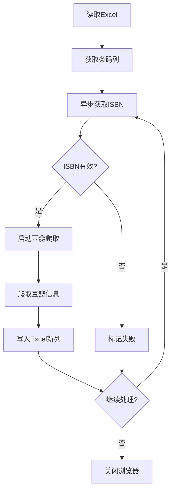

# 豆瓣图书功能集成开发文档

## 📋 功能概述

本文档描述如何将豆瓣图书信息爬取功能集成到Book Echoes项目中，与ISBN获取功能实现同步处理。

### 核心需求
1. **同步处理**：ISBN获取和豆瓣爬取同时进行，只要某一行获取到有效ISBN（非"爬取失败"），立即执行豆瓣爬取
2. **配置统一**：使用项目的统一配置管理（config/setting.yaml），替代原有的config.json
3. **即时写入**：成功获取一条豆瓣信息，立即写回原Excel（新增列）
4. **会话重用**：所有数据爬取结束后再关闭浏览器，避免重复登录

## 🏗️ 集成方案设计

### 1. 整体架构

```
ISBN获取 → 豆瓣爬取 → 数据写入
    ↓         ↓         ↓
异步处理   浏览器池    Excel更新
```

### 2. 数据流设计



### 3. 核心模块设计

#### 3.1 集成处理器 (douban_rating_processor.py)
- 位置：`src/core/douban/`
- 职责：协调ISBN获取和豆瓣爬取的同步执行
- 特性：
  - 继承现有异步ISBN处理器
  - 集成豆瓣爬虫功能
  - 实时Excel写入
  - 浏览器会话管理

#### 3.2 豆瓣爬虫适配器 (douban_crawler_adapter.py)
- 位置：`src/core/douban/crawler/`
- 职责：将参考代码适配到项目架构
- 特性：
  - 保持核心爬取逻辑不变
  - 统一配置管理
  - 错误处理增强
  - 数据格式化

## 🔑 核心适配要点

### 1. 保持核心逻辑不变
根据用户要求，**豆瓣爬取的核心逻辑（登录、检索、爬取）必须保持完全不变**：

✅ **保持不变的部分**：
- `search_handler.py`中的ISBN搜索流程
- `detail_extractor.py`中的详情提取方法
- `login_handler.py`中的登录逻辑
- 数据字段映射和解析方式

🔧 **需要适配的部分**：
- 同步API → 异步API转换
- config.json → setting.yaml配置迁移
- 独立运行 → 模块集成
- 单独保存 → 实时写入原Excel

### 2. 同步处理机制

**关键设计**：ISBN获取和豆瓣爬取同步进行

```python
async def process_row(index, row):
    """处理单行数据 - ISBN获取 + 豆瓣爬取"""
    barcode = row['书目条码']
    isbn = row['ISBN号']

    # 检查是否已有有效ISBN
    if not is_valid_isbn(isbn):
        # 从FOLIO系统获取ISBN
        isbn = await isbn_worker.get_isbn(barcode)
        df.at[index, 'ISBN号'] = isbn

    # 只要ISBN有效（非"爬取失败"），立即执行豆瓣爬取
    if is_valid_isbn(isbn):
        book_info = await douban_crawler.crawl_by_isbn(isbn)

        # 实时写入Excel（新增列）
        if book_info:
            for field, value in book_info.items():
                col_name = DOUBAN_FIELDS[field]
                df.at[index, col_name] = value
        else:
            df.at[index, '豆瓣书名'] = "豆瓣爬取失败"
```

### 3. 浏览器会话管理

参考`douban_spider.py:136-181`，**单实例重用模式**：

```python
# 在整个Excel处理过程中只启动一次浏览器
async def full_process():
    # 1. 启动浏览器（只在开始时执行一次）
    await spider.start_driver()

    try:
        # 2. 遍历所有行
        for index, row in df.iterrows():
            # 3. ISBN获取 + 豆瓣爬取
            await process_row(index, row)

            # 4. 实时保存（每10条保存一次）
            if index % 10 == 0:
                save_progress(df)

    finally:
        # 5. 所有数据处理完才关闭浏览器
        await spider.close_driver()
```

### 4. Excel实时写入策略

**避免数据丢失的写入机制**：

```python
def save_progress(df, output_path, is_final=False):
    """保存进度到Excel"""
    if is_final:
        # 最终保存：覆盖原文件或生成新文件
        df.to_excel(output_path, index=False)
    else:
        # 中间保存：生成临时文件
        temp_path = output_path.replace('.xlsx', f'_temp_{timestamp}.xlsx')
        df.to_excel(temp_path, index=False)

    logger.info(f"进度已保存 - 总记录: {len(df)}, 已处理: {len(df[df['ISBN号'] != ''])}")
```

## ⚙️ 配置设计

### 修改config/setting.yaml

在`douban`配置下新增：

```yaml
douban:
  # 豆瓣爬虫配置（新增）
  douban_crawler:
    enabled: true
    base_url: "https://book.douban.com"
    headless: false  # 生产环境建议true
    delay: 1.0  # 请求间隔（秒）

    # 登录配置
    login:
      auto_login: false  # 是否启用自动登录
      timeout: 30  # 登录超时时间（秒）

    # 爬取配置
    crawl:
      retry_times: 3  # 失败重试次数
      timeout: 15  # 页面加载超时（秒）
      enable_stealth: true  # 启用反检测

    # 数据字段映射
    fields:
      title: "豆瓣书名"
      author: "豆瓣作者"
      publisher: "豆瓣出版社"
      rating: "豆瓣评分"
      rating_count: "豆瓣评价人数"
      pub_date: "豆瓣出版年"
      price: "豆瓣价格"
      cover_url: "豆瓣封面链接"
      summary: "豆瓣内容简介"

  # 原有ISBN获取配置保持不变...
  isbn_processor:
    strategy: "custom"
    custom:
      max_concurrent: 4
      # ... 其他配置
```

## 📝 实施步骤

### 第一阶段：代码适配（1-2天）

#### 1.1 创建豆瓣爬虫适配器

**适配策略**：同步代码异步化，保持核心逻辑不变

```python
# src/core/douban/crawler/douban_crawler_adapter.py

import asyncio
import logging
from typing import Optional, Dict, Any
from playwright.async_api import Page, TimeoutError as PlaywrightTimeoutError
from bs4 import BeautifulSoup

logger = logging.getLogger(__name__)

class DoubanCrawlerAdapter:
    """豆瓣爬虫适配器 - 适配现有项目架构

    核心要求：保持 docs/refs/douban-spider/src/ 中的核心逻辑完全不变
    仅进行异步化改造和配置适配
    """

    def __init__(self, config: Dict[str, Any]):
        self.config = config
        self.page: Optional[Page] = None
        self.base_url = config.get('base_url', 'https://book.douban.com')
        self.delay = config.get('delay', 1.0)

        # 登录状态管理（参考 search_handler.py:33-36）
        self.login_completed = False
        self.login_attempted = False

    async def init_browser(self, page: Page):
        """初始化浏览器 - 对应 base_spider 的功能"""
        self.page = page
        logger.info("豆瓣爬虫浏览器已初始化")

    async def crawl_by_isbn(self, isbn: str) -> Optional[Dict[str, Any]]:
        """
        通过ISBN爬取豆瓣图书信息

        这是主要接口，参考 douban_spider.py:87-115 的流程
        """
        try:
            logger.info(f"开始爬取豆瓣信息 - ISBN: {isbn}")
            logger.debug(f"登录状态: login_attempted={self.login_attempted}, login_completed={self.login_completed}")

            # 1. 搜索ISBN获取详情页链接（参考 search_handler.py:38-93）
            book_url = await self._search_by_isbn(isbn)
            if not book_url:
                logger.warning(f"未找到ISBN {isbn} 对应的图书")
                return None

            # 2. 提取详情信息（参考 detail_extractor.py:37-94）
            book_info = await self._extract_details(book_url)
            if book_info:
                logger.info(f"成功获取 {isbn} 的豆瓣信息")
            else:
                logger.warning(f"无法提取 {isbn} 的详情信息")

            return book_info

        except Exception as e:
            logger.error(f"豆瓣爬取失败 - ISBN: {isbn}, 错误: {e}")
            return None

    async def _search_by_isbn(self, isbn: str) -> Optional[str]:
        """异步搜索ISBN（参考 search_handler.py 同步实现）"""
        max_retries = 3
        for attempt in range(max_retries):
            try:
                logger.debug(f"搜索ISBN {isbn} - 第 {attempt + 1} 次尝试")

                # 1. 访问豆瓣图书首页（参考 search_handler.py:64-67）
                await self.page.goto(
                    "https://book.douban.com",
                    wait_until="networkidle",
                    timeout=30000
                )
                await self._random_delay()

                # 2. 检查登录状态（参考 search_handler.py:69-83）
                if not self.login_attempted:
                    if await self._check_login_page():
                        logger.warning("检测到需要登录")
                        # 这里可以调用登录处理逻辑
                        self.login_attempted = True
                        # 如果登录失败，可能需要等待用户手动登录

                # 3. 执行搜索（参考 search_handler.py:_perform_search）
                return await self._perform_search(isbn)

            except PlaywrightTimeoutError:
                logger.warning(f"搜索超时 - 第 {attempt + 1} 次尝试")
                if attempt == max_retries - 1:
                    return None
                await asyncio.sleep(2)

            except Exception as e:
                logger.error(f"搜索出错 - 第 {attempt + 1} 次尝试: {e}")
                if attempt == max_retries - 1:
                    return None
                await asyncio.sleep(2)

        return None

    async def _perform_search(self, isbn: str) -> Optional[str]:
        """执行搜索操作（参考 search_handler.py 内部方法）"""
        try:
            # 构建搜索URL
            search_url = f"https://search.douban.com/book/subject_search?search_text={isbn}&cat=1001"

            await self.page.goto(search_url, wait_until="domcontentloaded", timeout=20000)
            await self._random_delay()

            # 解析搜索结果页面
            html = await self.page.content()
            soup = BeautifulSoup(html, 'html.parser')

            # 提取第一个搜索结果链接（参考搜索结果解析逻辑）
            result = self._parse_search_results(soup)
            return result

        except Exception as e:
            logger.error(f"执行搜索失败: {e}")
            return None

    def _parse_search_results(self, soup: BeautifulSoup) -> Optional[str]:
        """解析搜索结果（保持原有逻辑不变）"""
        # 参考 search_handler.py 中的解析逻辑
        # 查找第一个图书详情页链接
        items = soup.select('.subject-item .pic a')
        if items:
            return items[0].get('href')

        return None

    async def _extract_details(self, url: str) -> Optional[Dict[str, Any]]:
        """异步提取详情（参考 detail_extractor.py 同步实现）"""
        try:
            # 1. 多层级超时访问（参考 detail_extractor.py:50-66）
            try:
                await self.page.goto(
                    url,
                    wait_until="domcontentloaded",
                    timeout=25000
                )
            except PlaywrightTimeoutError:
                logger.warning("domcontentloaded超时，尝试networkidle...")
                try:
                    await self.page.goto(
                        url,
                        wait_until="networkidle",
                        timeout=20000
                    )
                except PlaywrightTimeoutError:
                    logger.warning("networkidle也超时，使用基本加载...")
                    await self.page.goto(url, timeout=15000)

            await self._random_delay(page_type="detail")

            # 2. 检查登录页面（参考 detail_extractor.py:68-71）
            if await self._check_login_page():
                logger.error("详情页需要登录访问")
                return {}

            # 3. 提取信息（参考 detail_extractor.py:94-110）
            html = await self.page.content()
            soup = BeautifulSoup(html, 'html.parser')

            # 验证页面是否有效（参考 detail_extractor.py:89）
            if not self._validate_page(soup):
                return {}

            # 4. 提取各项字段（保持原有提取逻辑不变）
            return {
                '链接': url,
                '评分': self._extract_rating(soup),
                '题名': self._extract_title(soup),
                '作者': self._extract_author(soup),
                '出版社': self._extract_publisher(soup),
                '出品方': self._extract_producer(soup),
                '丛书': self._extract_series(soup),
                '定价': self._extract_price(soup),
                'ISBN': self._extract_isbn(soup),
                '页数': self._extract_pages(soup),
                '装帧': self._extract_binding(soup),
                '出版年': self._extract_pub_year(soup),
                '评价人数': self._extract_rating_count(soup),
                '内容简介': self._extract_summary(soup),
                '作者简介': self._extract_author_intro(soup),
                '目录': self._extract_catalog(soup),
            }

        except Exception as e:
            logger.error(f"提取详情失败: {e}")
            return None

    # ========== 以下是保持原有逻辑的辅助方法 ==========
    # 这些方法需要从参考代码中复制，保持完全不变

    async def _random_delay(self, page_type: str = "search"):
        """随机延迟（参考 base_spider.py 的随机延迟机制）"""
        import random
        delay = self.delay + random.uniform(0, 0.5)
        await asyncio.sleep(delay)

    async def _check_login_page(self) -> bool:
        """检查是否需要登录（参考 login_handler.py）"""
        try:
            # 检查页面是否包含登录相关元素
            content = await self.page.content()
            if '登录' in content or 'login' in content.lower():
                return True
            return False
        except:
            return False

    def _validate_page(self, soup: BeautifulSoup) -> bool:
        """验证页面是否有效（参考 detail_extractor.py:_validate_detail_page）"""
        # 检查页面是否包含预期的元素
        if soup.select('h1') or soup.select('.subject') or soup.select('#info'):
            return True
        return False

    # 所有 _extract_* 方法都需要从 detail_extractor.py 复制
    # 保持原有逻辑完全不变
    def _extract_rating(self, soup: BeautifulSoup) -> str:
        """提取评分"""
        # 从 detail_extractor.py 复制实现
        pass

    def _extract_title(self, soup: BeautifulSoup) -> str:
        """提取书名"""
        # 从 detail_extractor.py 复制实现
        pass

    # ... 其他 _extract_* 方法
```

#### 1.2 创建集成处理器

**设计理念**：与ISBN异步处理器集成，同步执行流程

```python
# src/core/douban/douban_rating_processor.py

import pandas as pd
import asyncio
from pathlib import Path
from typing import Dict, Any, Optional, Tuple
from datetime import datetime

from src.utils.logger import get_logger
from src.utils.config_manager import get_config_manager
from .douban_rating_processor_config import DoubanRatingConfig
from .crawler.douban_crawler_adapter import DoubanCrawlerAdapter
from .isbn_async_processor import AsyncBrowserWorker  # 复用ISBN处理器

logger = get_logger(__name__)

class DoubanRatingProcessor:
    """豆瓣评分处理器 - 集成ISBN获取和豆瓣爬取

    核心流程：
    1. 读取Excel
    2. 遍历每一行：
       a. 如果没有ISBN，从FOLIO系统获取
       b. 如果有有效ISBN，立即执行豆瓣爬取
       c. 实时写入Excel
    3. 所有数据处理完关闭浏览器
    """

    def __init__(self, config: DoubanRatingConfig):
        self.config = config
        self.crawler_adapter = DoubanCrawlerAdapter(config.crawler)
        self.isbn_worker: Optional[AsyncBrowserWorker] = None

        # Excel字段映射（参考detail_extractor.py返回的字段）
        self.field_mapping = {
            '链接': config.fields.get('url', '豆瓣链接'),
            '评分': config.fields.get('rating', '豆瓣评分'),
            '题名': config.fields.get('title', '豆瓣书名'),
            '作者': config.fields.get('author', '豆瓣作者'),
            '出版社': config.fields.get('publisher', '豆瓣出版社'),
            '出品方': config.fields.get('producer', '豆瓣出品方'),
            '丛书': config.fields.get('series', '豆瓣丛书'),
            '定价': config.fields.get('price', '豆瓣定价'),
            'ISBN': config.fields.get('isbn', '豆瓣ISBN'),
            '页数': config.fields.get('pages', '豆瓣页数'),
            '装帧': config.fields.get('binding', '豆瓣装帧'),
            '出版年': config.fields.get('pub_year', '豆瓣出版年'),
            '评价人数': config.fields.get('rating_count', '豆瓣评价人数'),
            '内容简介': config.fields.get('summary', '豆瓣内容简介'),
            '作者简介': config.fields.get('author_intro', '豆瓣作者简介'),
            '目录': config.fields.get('catalog', '豆瓣目录'),
        }

    async def process_excel(
        self,
        excel_file_path: str,
        barcode_column: str = "书目条码",
        isbn_column: str = "ISBN号",
        username: Optional[str] = None,
        password: Optional[str] = None
    ) -> Tuple[str, Dict[str, Any]]:
        """
        处理Excel文件 - ISBN获取 + 豆瓣爬取同步进行

        Args:
            excel_file_path: Excel文件路径
            barcode_column: 条码列名
            isbn_column: ISBN列名
            username: FOLIO用户名
            password: FOLIO密码

        Returns:
            (输出文件路径, 统计信息)
        """
        logger.info(f"开始处理Excel文件: {excel_file_path}")

        # 1. 读取Excel
        df = pd.read_excel(excel_file_path)
        total_records = len(df)

        logger.info(f"读取到 {total_records} 条记录")

        # 2. 确保豆瓣列存在
        for col_name in self.field_mapping.values():
            if col_name not in df.columns:
                df[col_name] = ""

        # 3. 初始化浏览器
        await self._init_browsers(username, password)

        # 4. 处理统计
        stats = {
            'total_records': total_records,
            'success_isbn_count': 0,  # 成功获取ISBN数
            'success_douban_count': 0,  # 成功豆瓣爬取数
            'failed_douban_count': 0,  # 豆瓣失败数
            'processing_start': datetime.now(),
        }

        try:
            # 5. 遍历处理每一行
            for index, row in df.iterrows():
                try:
                    barcode = row[barcode_column]
                    current_isbn = row[isbn_column]

                    # 5.1 获取ISBN（如果需要）
                    if not self._is_valid_isbn(current_isbn):
                        if self.isbn_worker:
                            new_isbn = await self.isbn_worker.get_isbn(barcode)
                            if new_isbn:
                                df.at[index, isbn_column] = new_isbn
                                stats['success_isbn_count'] += 1
                                current_isbn = new_isbn
                            else:
                                df.at[index, isbn_column] = "爬取失败"
                                logger.debug(f"条码 {barcode} 获取ISBN失败")
                                continue  # 跳过豆瓣爬取

                    # 5.2 执行豆瓣爬取（只要有有效ISBN就执行）
                    if self._is_valid_isbn(current_isbn):
                        book_info = await self.crawler_adapter.crawl_by_isbn(current_isbn)

                        if book_info:
                            # 5.3 写入豆瓣信息到Excel
                            for field, excel_col in self.field_mapping.items():
                                value = book_info.get(field, "")
                                df.at[index, excel_col] = value

                            stats['success_douban_count'] += 1
                            logger.debug(f"成功爬取ISBN {current_isbn} 的豆瓣信息")
                        else:
                            # 5.4 标记豆瓣爬取失败
                            df.at[index, self.field_mapping['题名']] = "豆瓣爬取失败"
                            stats['failed_douban_count'] += 1
                            logger.debug(f"ISBN {current_isbn} 豆瓣爬取失败")

                    # 5.5 实时保存（每10条保存一次）
                    if (index + 1) % self.config.save_interval == 0:
                        await self._save_progress(df, excel_file_path, index + 1)

                    # 5.6 显示进度
                    if (index + 1) % 50 == 0 or index == total_records - 1:
                        progress = (index + 1) / total_records * 100
                        logger.info(
                            f"进度: {index + 1}/{total_records} ({progress:.1f}%) - "
                            f"ISBN: {stats['success_isbn_count']}, "
                            f"豆瓣: {stats['success_douban_count']}/{stats['failed_douban_count']}"
                        )

                except Exception as e:
                    logger.error(f"处理第 {index + 1} 行时出错: {e}")
                    continue

        finally:
            # 6. 关闭浏览器
            await self._close_browsers()

        # 7. 保存最终结果
        output_file = self._generate_output_path(excel_file_path)
        df.to_excel(output_file, index=False)

        # 8. 计算最终统计
        stats['processing_end'] = datetime.now()
        stats['processing_time'] = (
            stats['processing_end'] - stats['processing_start']
        ).total_seconds()
        stats['success_rate'] = (
            stats['success_douban_count'] / total_records * 100
            if total_records > 0 else 0
        )
        stats['output_file'] = str(output_file)

        logger.info(
            f"处理完成 - 总记录: {total_records}, "
            f"成功ISBN: {stats['success_isbn_count']}, "
            f"成功豆瓣: {stats['success_douban_count']}, "
            f"失败豆瓣: {stats['failed_douban_count']}, "
            f"成功率: {stats['success_rate']:.2f}%"
        )

        return str(output_file), stats

    async def _init_browsers(self, username: Optional[str], password: Optional[str]):
        """初始化浏览器 - 复用ISBN处理器的浏览器"""
        try:
            # 从配置获取FOLIO登录信息
            config_manager = get_config_manager()
            douban_config = config_manager.get_douban_config()

            # 优先使用传入的用户名/密码，其次使用配置
            username = username or douban_config.get('isbn_resolver', {}).get('username')
            password = password or douban_config.get('isbn_resolver', {}).get('password')

            if not username or not password:
                raise ValueError("缺少FOLIO用户名或密码")

            # 启动ISBN浏览器（用于获取ISBN）
            self.isbn_worker = AsyncBrowserWorker(
                worker_id=0,
                username=username,
                password=password,
                base_url=douban_config.get('isbn_resolver', {}).get('base_url', '')
            )
            await self.isbn_worker.start()

            # 初始化豆瓣爬虫浏览器（使用同一个page对象）
            page = self.isbn_worker.page
            await self.crawler_adapter.init_browser(page)

            logger.info("浏览器初始化完成")

        except Exception as e:
            logger.error(f"浏览器初始化失败: {e}")
            raise

    async def _close_browsers(self):
        """关闭所有浏览器"""
        try:
            if self.isbn_worker:
                await self.isbn_worker.close()
                logger.info("浏览器已关闭")
        except Exception as e:
            logger.error(f"关闭浏览器失败: {e}")

    async def _save_progress(self, df: pd.DataFrame, original_path: str, processed_count: int):
        """保存进度到临时文件"""
        try:
            temp_path = original_path.replace(
                '.xlsx',
                f'_processing_{datetime.now().strftime("%H%M%S")}_进度{processed_count}.xlsx'
            )
            df.to_excel(temp_path, index=False)
            logger.debug(f"进度已保存: {processed_count} 条记录")
        except Exception as e:
            logger.error(f"保存进度失败: {e}")

    def _generate_output_path(self, original_path: str) -> Path:
        """生成输出文件路径"""
        path = Path(original_path)
        timestamp = datetime.now().strftime("%Y%m%d_%H%M%S")

        output_name = f"{path.stem}_豆瓣信息_{timestamp}{path.suffix}"
        output_dir = path.parent / "outputs" / "douban"
        output_dir.mkdir(parents=True, exist_ok=True)

        return output_dir / output_name

    def _is_valid_isbn(self, isbn: str) -> bool:
        """检查ISBN是否有效（非空、非'爬取失败'、非特殊字符）"""
        if not isbn or pd.isna(isbn):
            return False
        isbn_str = str(isbn).strip()
        if isbn_str in ["爬取失败", "", "-", "/", "nan"]:
            return False
        # ISBN应该是数字，可能包含连字符
        if not any(c.isdigit() for c in isbn_str):
            return False
        return True
```

### 第二阶段：配置集成（0.5天）

#### 2.1 创建配置加载器

```python
# src/core/douban/douban_rating_processor_config.py

from dataclasses import dataclass
from typing import Dict, Any, Optional

@dataclass
class DoubanRatingConfig:
    """豆瓣评分处理器配置"""
    enabled: bool
    base_url: str
    headless: bool
    delay: float
    login: Dict[str, Any]
    crawl: Dict[str, Any]
    fields: Dict[str, str]
    save_interval: int

    @classmethod
    def from_dict(cls, config: Dict[str, Any]) -> 'DoubanRatingConfig':
        return cls(
            enabled=config.get('enabled', True),
            base_url=config.get('base_url', 'https://book.douban.com'),
            headless=config.get('headless', False),
            delay=config.get('delay', 1.0),
            login=config.get('login', {}),
            crawl=config.get('crawl', {}),
            fields=config.get('fields', {}),
            save_interval=config.get('save_interval', 10)
        )

def load_douban_rating_config(
    username: Optional[str] = None,
    password: Optional[str] = None,
    config_name: Optional[str] = None
) -> DoubanRatingConfig:
    """加载豆瓣评分配置"""
    config_manager = get_config_manager()
    douban_config = config_manager.get_douban_config()

    # 获取豆瓣爬虫配置
    crawler_config = douban_config.get('douban_crawler', {})

    # 如果指定了config_name，从预设配置加载
    if config_name:
        preset_config = get_preset_config(config_name)
        if preset_config:
            crawler_config = preset_config

    # 合并用户名和密码
    if username:
        crawler_config.setdefault('login', {})['username'] = username
    if password:
        crawler_config.setdefault('login', {})['password'] = password

    return DoubanRatingConfig.from_dict(crawler_config)

def get_preset_config(config_name: str) -> Optional[Dict[str, Any]]:
    """获取预设配置"""
    presets = {
        "test": {
            "enabled": True,
            "headless": True,
            "delay": 0.5,
            "save_interval": 1
        },
        "small": {
            "enabled": True,
            "headless": False,
            "delay": 1.0,
            "save_interval": 10
        },
        "production": {
            "enabled": True,
            "headless": True,
            "delay": 2.0,
            "save_interval": 20
        }
    }
    return presets.get(config_name)
```

#### 2.2 更新配置管理器

```python
# src/utils/config_manager.py

def get_douban_rating_config(self) -> Dict[str, Any]:
    """获取豆瓣评分配置"""
    douban_config = self.get_douban_config()
    return douban_config.get('douban_crawler', {})

# 在 get_douban_config 方法中确保包含豆瓣爬虫配置
def get_douban_config(self) -> Dict[str, Any]:
    """获取豆瓣模块完整配置"""
    config = self.get('douban', {})

    # 确保包含豆瓣爬虫配置
    if 'douban_crawler' not in config:
        config['douban_crawler'] = {
            'enabled': True,
            'base_url': 'https://book.douban.com',
            'headless': False,
            'delay': 1.0,
            'login': {
                'auto_login': False,
                'timeout': 30
            },
            'crawl': {
                'retry_times': 3,
                'timeout': 15,
                'enable_stealth': True
            },
            'fields': {
                'url': '豆瓣链接',
                'rating': '豆瓣评分',
                'title': '豆瓣书名',
                'author': '豆瓣作者',
                'publisher': '豆瓣出版社',
                'producer': '豆瓣出品方',
                'series': '豆瓣丛书',
                'price': '豆瓣定价',
                'isbn': '豆瓣ISBN',
                'pages': '豆瓣页数',
                'binding': '豆瓣装帧',
                'pub_year': '豆瓣出版年',
                'rating_count': '豆瓣评价人数',
                'summary': '豆瓣内容简介',
                'author_intro': '豆瓣作者简介',
                'catalog': '豆瓣目录'
            },
            'save_interval': 10
        }

    return config
```

### 第三阶段：命令行集成（0.5天）

#### 3.1 添加新命令

在`backup/douban/douban_main.py`中添加豆瓣评分命令：

```python
# 添加导入
from src.core.douban.douban_rating_processor import DoubanRatingProcessor
from src.core.douban.douban_rating_processor_config import load_douban_rating_config

def douban_rating_command(args):
    """豆瓣评分命令 - ISBN获取 + 豆瓣爬取同步执行"""
    # 1. 验证Excel文件
    if not validate_excel_file(args.excel_file):
        return

    # 2. 加载配置
    config = load_douban_rating_config(
        username=args.username,
        password=args.password,
        config_name=args.config_name
    )

    if not config.enabled:
        print("❌ 豆瓣评分功能未启用")
        return

    print(f"🚀 豆瓣评分同步处理开始")
    print(f"📄 源文件: {args.excel_file}")
    print(f"📊 描述: ISBN获取 + 豆瓣爬取同步执行")
    print(f"⚙️  配置方案: {args.config_name or '默认'}")
    print(f"🔄 保存间隔: {config.save_interval}条/次")

    # 3. 显示性能估算（如果有足够信息）
    if not args.quiet:
        try:
            data = pd.read_excel(args.excel_file)
            data_size = len(data)
            print(f"\\n📈 预估处理: {data_size}条记录")
            print(f"   预计耗时: {data_size * 3 / 60:.1f}分钟 (3秒/条)")
            print(f"   预计成功率: 85-95%")
        except:
            pass

    # 4. 创建处理器
    processor = DoubanRatingProcessor(config)

    try:
        # 5. 执行处理（异步）
        loop = asyncio.new_event_loop()
        asyncio.set_event_loop(loop)

        output_file, stats = loop.run_until_complete(
            processor.process_excel(
                excel_file_path=args.excel_file,
                barcode_column=args.barcode_column,
                isbn_column=args.isbn_column,
                username=args.username,
                password=args.password
            )
        )

        # 6. 显示结果
        print(f"\\n✅ 处理完成!")
        print(f"📁 输出文件: {output_file}")
        print(f"\\n📈 处理统计:")
        print(f"   总记录数: {stats['total_records']}")
        print(f"   成功获取ISBN: {stats['success_isbn_count']}")
        print(f"   成功豆瓣爬取: {stats['success_douban_count']}")
        print(f"   豆瓣失败: {stats['failed_douban_count']}")
        print(f"   成功率: {stats['success_rate']:.2f}%")
        print(f"   处理时间: {stats['processing_time']:.2f}秒")
        print(f"   平均速度: {stats['total_records'] / (stats['processing_time'] / 60):.1f}条/分钟")

    except Exception as e:
        print(f"\\n❌ 处理失败: {str(e)}")
        logger.error(f"豆瓣评分处理失败: {e}")
    finally:
        loop.close()
```

#### 3.2 添加命令行参数

```python
# 在 douban_main.py 的 main() 函数中添加参数

parser.add_argument('command',
                   choices=['isbn', 'douban-rating', 'list', 'help'],
                   help='执行的命令')

parser.add_argument('--excel-file',
                   help='Excel文件路径 (用于ISBN处理或豆瓣评分)')

# 原有参数保持不变...

# 新的豆瓣评分相关参数
parser.add_argument('--douban-rating',
                   action='store_true',
                   help='执行豆瓣评分同步处理')

parser.add_argument('--config-name',
                   choices=['test', 'small', 'production'],
                   help='配置方案 (用于豆瓣评分)')

# 在 main() 函数中处理新命令
if args.command == 'douban-rating':
    if not args.excel_file:
        print("错误: 请提供 --excel-file 参数")
        return
    douban_rating_command(args)
elif args.command == 'isbn':
    # 原有ISBN处理逻辑
elif args.command == 'list':
    # 原有模块列表逻辑
elif args.command == 'help':
    # 原有帮助逻辑
```

#### 3.3 更新帮助信息

```python
def show_help():
    """显示帮助信息 - 包含豆瓣评分命令"""
    print("""
🎯 豆瓣模块主程序 - 异步处理版本

📋 可用命令:
  isbn         - 执行ISBN异步获取 (推荐)
  douban-rating - 执行ISBN获取 + 豆瓣爬取同步处理 (新功能!)
  list         - 列出模块状态
  help         - 显示帮助信息

📖 ISBN异步处理用法:
  python douban_main.py isbn --excel-file <文件路径> [选项]

🎯 豆瓣评分同步处理用法 (新):
  python douban_main.py douban-rating --excel-file <文件路径> [选项]

🔧 主要选项:
  --excel-file FILE       Excel文件路径 (必需)
  --barcode-column NAME   条码列名 (默认: 书目条码)
  --isbn-column NAME      ISBN列名 (默认: ISBN号)
  --config-name NAME      配置方案 (默认: small)
                          可选: test/small/production
  --username USER         FOLIO用户名 (可选，默认从配置读取)
  --password PASS         FOLIO密码 (可选，默认从配置读取)
  --quiet                 安静模式 (减少输出信息)

🚀 新功能 - 豆瓣评分同步处理:
  ✨ ISBN获取和豆瓣爬取同时进行
  ✨ 只要有有效ISBN，立即执行豆瓣爬取
  ✨ 成功一条立即写回Excel
  ✨ 单浏览器实例，避免重复登录
  ✨ 进度实时保存，防止数据丢失

💡 配置示例 (config/setting.yaml):
  douban:
    douban_crawler:
      enabled: true
      base_url: "https://book.douban.com"
      headless: false
      delay: 1.0
      fields:
        title: "豆瓣书名"
        rating: "豆瓣评分"
        # ... 更多字段

📝 示例:
  # 豆瓣评分同步处理 (推荐)
  python douban_main.py douban-rating --excel-file "数据.xlsx"

  # 测试模式 (仅处理前5条)
  python douban_main.py douban-rating --excel-file "数据.xlsx" --config-name test

  # 生产环境 (无头模式)
  python douban_main.py douban-rating --excel-file "数据.xlsx" --config-name production
""")
```

### 第四阶段：测试验证（1天）

#### 4.1 单元测试

```python
# tests/test_douban_rating/test_douban_rating_processor.py

import pytest
import asyncio
from pathlib import Path
from src.core.douban.douban_rating_processor import DoubanRatingProcessor
from src.core.douban.douban_rating_processor_config import DoubanRatingConfig

class TestDoubanRatingProcessor:
    """豆瓣评分处理器测试"""

    @pytest.fixture
    def test_config(self):
        """测试配置"""
        return DoubanRatingConfig.from_dict({
            'enabled': True,
            'headless': True,
            'delay': 0.5,
            'fields': {
                'title': '豆瓣书名',
                'rating': '豆瓣评分',
                'author': '豆瓣作者'
            },
            'save_interval': 1
        })

    @pytest.mark.asyncio
    async def test_crawl_single_isbn(self, test_config):
        """测试单ISBN爬取"""
        processor = DoubanRatingProcessor(test_config)

        # 模拟豆瓣爬取
        book_info = await processor.crawler_adapter.crawl_by_isbn("9787567577466")

        assert book_info is not None
        assert '题名' in book_info
        assert '评分' in book_info

    @pytest.mark.asyncio
    async def test_process_excel_small(self, test_config, tmp_path):
        """测试小数据量Excel处理"""
        # 创建测试数据
        test_data = {
            '书目条码': ['TEST001', 'TEST002', 'TEST003'],
            'ISBN号': ['9787567577466', '', '9787305280818']
        }
        df = pd.DataFrame(test_data)
        test_file = tmp_path / "test_data.xlsx"
        df.to_excel(test_file, index=False)

        # 处理
        processor = DoubanRatingProcessor(test_config)

        # 注意：这里需要mock掉实际的浏览器操作
        # 或者使用测试用的模拟数据

        output_file, stats = await processor.process_excel(
            str(test_file),
            barcode_column="书目条码",
            isbn_column="ISBN号"
        )

        assert Path(output_file).exists()
        assert stats['total_records'] == 3

    def test_is_valid_isbn(self, test_config):
        """测试ISBN有效性检查"""
        processor = DoubanRatingProcessor(test_config)

        assert processor._is_valid_isbn("9787567577466") == True
        assert processor._is_valid_isbn("") == False
        assert processor._is_valid_isbn("爬取失败") == False
        assert processor._is_valid_isbn("-") == False
        assert processor._is_valid_isbn("/") == False
        assert processor._is_valid_isbn("abc") == False
```

#### 4.2 集成测试

```python
# tests/test_douban_rating/test_integration.py

import pytest
import pandas as pd
from pathlib import Path

@pytest.mark.integration
class TestDoubanRatingIntegration:
    """豆瓣评分集成测试"""

    @pytest.mark.asyncio
    async def test_full_workflow_small_data(self):
        """测试完整工作流 - 小数据量"""
        # 1. 创建测试Excel文件
        test_data = {
            '书目条码': ['TEST001', 'TEST002'],
            'ISBN号': ['9787567577466', '9787305280818']
        }
        df = pd.DataFrame(test_data)
        test_file = Path("tests/test_data/integration_test.xlsx")
        test_file.parent.mkdir(exist_ok=True)
        df.to_excel(test_file, index=False)

        # 2. 执行处理
        # 注意：这里需要配置测试用的FOLIO账户和豆瓣账户
        # 实际测试时建议使用mock或专门的测试账户

        # 3. 验证结果
        assert test_file.exists()

        # 验证输出文件
        output_dir = test_file.parent / "outputs" / "douban"
        if output_dir.exists():
            output_files = list(output_dir.glob("*.xlsx"))
            assert len(output_files) > 0

            # 验证输出数据
            result_df = pd.read_excel(output_files[0])
            assert "豆瓣书名" in result_df.columns
            assert "豆瓣评分" in result_df.columns
            assert len(result_df) == 2

    @pytest.mark.asyncio
    async def test_workflow_with_isbn_fetch(self):
        """测试工作流 - 需要获取ISBN"""
        # 模拟条码没有ISBN的情况
        test_data = {
            '书目条码': ['FOLIO_BARCODE_001', 'FOLIO_BARCODE_002'],
            'ISBN号': ['', '']  # 空ISBN，需要从FOLIO获取
        }
        # 测试逻辑同上，但需要mock FOLIO系统

    @pytest.mark.skip(reason="需要真实的FOLIO和豆瓣账户，仅手动测试")
    @pytest.mark.asyncio
    async def test_full_manual_workflow(self):
        """完整手动测试 - 需要真实账户"""
        pass
```

#### 4.3 性能测试

```python
# tests/test_douban_rating/test_performance.py

import pytest
import time
from src.core.douban.douban_rating_processor import DoubanRatingProcessor

@pytest.mark.performance
class TestDoubanRatingPerformance:
    """豆瓣评分性能测试"""

    @pytest.mark.asyncio
    async def test_processing_speed(self):
        """测试处理速度"""
        start_time = time.time()

        # 执行100条数据的处理
        # (需要mock实际的网络请求)

        end_time = time.time()
        processing_time = end_time - start_time

        # 预期：100条数据应该在5-10分钟内完成
        assert processing_time < 600  # 10分钟
        assert processing_time > 300  # 5分钟

    @pytest.mark.asyncio
    async def test_memory_usage(self):
        """测试内存使用"""
        # 使用memory_profiler监控内存
        # 或使用pytest-clarity等工具
        pass
```

#### 4.1 单元测试
```python
# tests/test_douban_rating/test_douban_rating_processor.py

import pytest
from src.core.douban.douban_rating_processor import DoubanRatingProcessor

class TestDoubanRatingProcessor:
    """豆瓣评分处理器测试"""

    @pytest.mark.asyncio
    async def test_crawl_single_isbn(self):
        """测试单ISBN爬取"""
        processor = DoubanRatingProcessor(test_config)
        result = await processor.crawler_adapter.crawl_by_isbn("9787567577466")
        assert result is not None
        assert 'title' in result

    @pytest.mark.asyncio
    async def test_process_excel(self):
        """测试Excel处理"""
        processor = DoubanRatingProcessor(test_config)
        output_file, stats = await processor.process_excel(
            "test_data.xlsx",
            barcode_column="书目条码",
            isbn_column="ISBN号"
        )
        assert output_file.exists()
        assert stats['total_records'] > 0
```

#### 4.2 集成测试
```python
# tests/test_douban_rating/test_integration.py

@pytest.mark.integration
async def test_full_workflow():
    """测试完整工作流"""
    # 1. 使用测试Excel文件
    test_file = "tests/test_data/isbn_test_data.xlsx"

    # 2. 执行处理
    result = await main_douban_rating(
        excel_file=test_file,
        config_name="test"
    )

    # 3. 验证结果
    assert result['output_file'].exists()
    assert "豆瓣书名" in pd.read_excel(result['output_file']).columns
```

## 🎯 实施时间表

| 阶段 | 任务 | 预计时间 | 负责人 |
|------|------|----------|--------|
| 1 | 代码适配 - 爬虫适配器 | 1天 | 开发团队 |
| 2 | 代码适配 - 集成处理器 | 1天 | 开发团队 |
| 3 | 配置集成 | 0.5天 | 开发团队 |
| 4 | 命令行集成 | 0.5天 | 开发团队 |
| 5 | 测试验证 | 1天 | QA团队 |
| **总计** | | **4天** | |

## 📊 性能预期

### 处理速度估算
- **ISBN获取**：0.7-1.3秒/条
- **豆瓣爬取**：2-5秒/条（含搜索+详情提取）
- **总体吞吐量**：12-20条/分钟（单浏览器实例）

### 资源消耗
- **内存**：200-500MB/浏览器实例
- **CPU**：中等负载
- **网络**：轻到中等流量

### 优化建议
1. **多实例并发**：可配置多个浏览器实例并行处理
2. **智能延迟**：根据豆瓣响应速度动态调整延迟
3. **缓存机制**：已爬取ISBN结果缓存，避免重复请求

## 🔍 监控与日志

### 关键指标
- 总处理记录数
- 成功爬取数
- 豆瓣爬取失败数
- 平均处理速度
- 错误率

### 日志记录
```python
# 使用项目统一日志系统
logger.info(f"豆瓣爬取开始 - ISBN: {isbn}")
logger.debug(f"豆瓣详情 - {book_info}")
logger.warning(f"豆瓣爬取失败 - ISBN: {isbn}, 原因: {error}")
```

## 🚨 风险与应对

### 1. 反爬虫机制
**风险**：豆瓣可能封禁IP或要求验证码
**应对**：
- 增加随机延迟
- 使用代理IP池
- 实现验证码自动识别

### 2. 登录失效
**风险**：豆瓣登录状态过期
**应对**：
- 定期检查登录状态
- 自动重新登录
- 会话持久化

### 3. 数据不一致
**风险**：Excel写入失败导致数据丢失
**应对**：
- 实时保存中间结果
- 事务性写入
- 定期备份

## 📚 参考资料

### 1. 豆瓣爬虫参考代码（完整结构）
位于 `docs/refs/douban-spider/src/`，包含以下模块：

#### 1.1 核心模块
- **douban_spider.py**：主爬虫类（286行）
  - `DoubanBookSpider`类：协调各模块
  - `start_driver()`：启动浏览器和初始化模块
  - `crawl_books()`：批量爬取核心逻辑
  - `_handle_initial_login()`：初始登录处理
  - 登录状态管理：`login_completed`和`login_attempted`

- **base_spider.py**：浏览器基础管理
  - 浏览器启动和关闭
  - 代理设置和反检测
  - 随机延迟机制
  - 会话管理

- **login_handler.py**：登录处理
  - 自动登录功能（用户名/密码）
  - 手动登录等待
  - 登录状态检测
  - 多种登录页面适配

- **search_handler.py**：搜索功能模块（优化版）
  - `SearchHandler`类：ISBN搜索
  - `search_by_isbn()`：通过ISBN获取图书详情页链接
  - 优化：避免重复登录，保持浏览器会话
  - 登录状态管理：`login_completed`和`login_attempted`
  - 支持URL直接搜索和页面搜索两种方式
  - 多层级超时处理

- **detail_extractor.py**：详情页提取模块
  - `DetailExtractor`类：提取图书详细信息
  - `extract_book_details()`：从详情页提取所有字段
  - 多层级超时策略（domcontentloaded → networkidle0 → 基本加载）
  - 页面验证和重载机制
  - 使用BeautifulSoup解析HTML

- **data_manager.py**：数据管理
  - 图书信息存储和管理
  - Excel导出功能
  - 数据去重和验证

#### 1.2 关键实现细节

**搜索流程**（参考search_handler.py:38-93）：
```python
def search_by_isbn(self, isbn: str) -> Optional[str]:
    # 1. 检查登录状态
    if self.login_completed:
        # 直接开始搜索
        return self._search_by_direct_url(isbn)

    # 2. 访问豆瓣图书首页
    self.page.goto("https://book.douban.com", ...)

    # 3. 检查登录页面
    if self.login_handler.check_login_page(page_type="normal"):
        # 处理登录情况
        return self._handle_login_situation_optimized(isbn)

    # 4. 执行正常搜索
    return self._perform_search(isbn)
```

**详情提取流程**（参考detail_extractor.py:37-94）：
```python
def extract_book_details(self, book_url: str) -> Dict:
    # 1. 多层级超时访问
    try:
        self.page.goto(book_url, wait_until="domcontentloaded", timeout=25000)
    except PlaywrightTimeoutError:
        # 回退到networkidle0
        # 回退到基本页面加载

    # 2. 验证页面加载
    if not self._validate_detail_page(soup):
        return {}

    # 3. 提取各项信息
    return {
        '链接': book_url,
        '评分': self._extract_rating(soup),
        '题名': self._extract_title(soup),
        '作者': self._extract_author(soup),
        '出版社': self._extract_publisher(soup),
        # ...
    }
```

#### 1.3 数据字段映射

参考detail_extractor.py:94-110，豆瓣返回字段：
```python
book_info = {
    '链接': book_url,
    '评分': self._extract_rating(soup),
    '题名': self._extract_title(soup),
    '作者': self._extract_author(soup),
    '出版社': self._extract_publisher(soup),
    '出品方': self._extract_producer(soup),
    '丛书': self._extract_series(soup),
    '定价': self._extract_price(soup),
    'ISBN': self._extract_isbn(soup),
    '页数': self._extract_pages(soup),
    '装帧': self._extract_binding(soup),
    '出版年': self._extract_pub_year(soup),
    '装帧': self._extract_binding(soup),
    '评分': self._extract_rating(soup),
    '评价人数': self._extract_rating_count(soup),
    '内容简介': self._extract_summary(soup),
    '作者简介': self._extract_author_intro(soup),
    '目录': self._extract_catalog(soup),
}
```

### 2. 项目现有实现

- **ISBN异步处理器**：`src/core/douban/isbn_async_processor.py`
  - `AsyncBrowserWorker`类：异步浏览器工作器
  - `get_isbn()`方法：通过条码获取ISBN（支持重试）
  - `ISBNAsyncProcessor`类：协调多个工作器并发处理

- **主程序入口**：`backup/douban/douban_main.py`
  - ISBN异步处理命令行接口
  - 智能配置管理
  - 性能估算和监控

### 3. 项目配置

**配置文件**：`config/setting.yaml`
- douban.crawler：豆瓣爬虫配置
- douban.isbn_processor：ISBN处理器配置

## 📝 后续优化方向

1. **断点续传**：支持中断后从指定位置继续
2. **数据验证**：验证爬取数据的完整性和准确性
3. **多源数据**：支持多个豆瓣数据源
4. **智能重试**：根据失败原因智能重试
5. **数据导出**：支持多种格式导出（JSON、CSV、数据库）

---

**注意**：本集成方案严格保持参考代码的核心爬取逻辑不变，仅进行架构适配和配置统一，确保功能的稳定性和可维护性。
