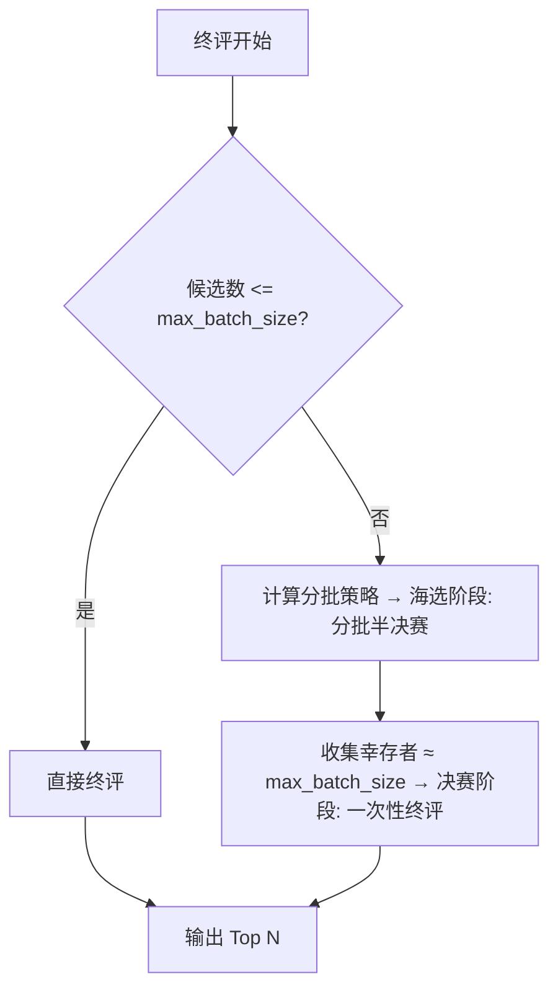

# 终评自适应锦标赛逻辑优化 - 完成总结

## 一、修改概述

本次修改将终评阶段的逻辑从 \*\*"固定阈值切换模式"\*\* 优化为 \*\*"自适应漏斗策略"\*\*，核心解决以下问题：


* ✅ 批次大小限制：确保单次 LLM 调用不超过配置的 `max_batch_size`

* ✅ Top N 精确控制：通过两阶段筛选（海选 → 决赛）确保最终结果严格符合 `top_n`

* ✅ 全局最优性：决赛阶段能看到所有海选幸存者，避免分批导致的 "遗珠之憾"

## 二、修改的文件及核心变更

### 2.1 controller.py


| 操作类型 | 具体内容                                                                |
| ---- | ------------------------------------------------------------------- |
| 新增   | `run_adaptive_final` 函数：实现自适应漏斗逻辑                                   |
| 删除   | `run_direct_final` 函数：功能被 `run_adaptive_final` 直接终评分支覆盖             |
| 删除   | `run_tournament_final` 函数：旧的固定分 2 组锦标赛逻辑废弃                          |
| 简化   | `run_theme_recommendation_final` 函数：仅负责读取配置并调用 `run_adaptive_final` |

### 2.2 config.py


| 操作类型 | 具体内容                                                     |
| ---- | -------------------------------------------------------- |
| 删除   | `FINAL_MODE_THRESHOLD` 常量：不再需要模式切换阈值                     |
| 删除   | `get_final_mode_threshold()` 函数：相关逻辑废弃                   |
| 保留   | `get_final_batch_size()` 函数：现为核心配置项（读取 `max_batch_size`） |

### 2.3 llm.yaml


```
\# 业务参数 (由 src/core/recommendation/config.py 读取)

parameters:

&#x20; # 最终推荐数量: 终评阶段期望输出的 Top N 书目

&#x20; top\_n: 20

&#x20; # 批次大小: 超过此数量将触发海选(Semifinal)流程

&#x20; max\_batch\_size: 30  # 原20，已更新为30（与用户需求对齐）
```


* 删除 `mode_threshold: 30` 参数（不再使用）

* 更新 `max_batch_size: 20 → 30`

* 补充注释：明确 `max_batch_size` 的作用

## 三、新逻辑流程




## 四、示例场景


| 候选数 | max\_batch\_size | 流程      | 海选分批 | 每批晋级     | 幸存者  | 决赛结果           |
| --- | ---------------- | ------- | ---- | -------- | ---- | -------------- |
| 15  | 30               | 直接终评    | -    | -        | -    | 15 → 20（Top N） |
| 25  | 30               | 直接终评    | -    | -        | -    | 25 → 20        |
| 35  | 30               | 海选 + 决赛 | 2 批  | 15 本 / 批 | 30 本 | 30 → 20        |
| 65  | 30               | 海选 + 决赛 | 3 批  | 10 本 / 批 | 30 本 | 30 → 20        |

## 五、技术细节

### 5.1 海选名额分配算法


```
\# 计算批数（向上取整）

num\_batches = (total\_candidates + max\_batch\_size - 1) // max\_batch\_size

\# 计算每批晋级名额

quota\_per\_batch = max\_batch\_size // num\_batches

\# 预计总晋级数 ≈ max\_batch\_size

total\_survivors = num\_batches \* quota\_per\_batch
```

#### 设计原理：


1. 目标：海选后幸存者总数 ≈ `max_batch_size`，确保决赛可一次性处理

2. 公平性：平均分配各批次晋级名额

3. 灵活性：适配任意候选数与 `max_batch_size` 组合

### 5.2 随机打乱机制


```
shuffled\_books = finalists.copy()

random.shuffle(shuffled\_books)

batches = split\_batches(shuffled\_books, max\_batch\_size)
```

#### 作用：

避免因书目原始顺序（如按主题排序）导致部分批次质量过高 / 过低，保证批次公平性。

## 六、验证要点

### ✅ 已完成验证


* 代码逻辑：`run_adaptive_final` 正确实现两阶段筛选

* 配置读取：`get_final_batch_size()` 正确读取 `llm.yaml` 中的 `max_batch_size`

* 清理工作：删除所有与 `mode_threshold` 相关的代码、配置及导入

* 导入清理：移除 `get_final_mode_threshold` 的无用导入

### ⚠️ 待验证（建议手动测试）

#### 1. Mock 模式测试


```
\# 不设置 API Key，使用 Mock 模式运行

python -m src.core.recommendation.main
```


* 验证日志：是否显示 "海选" 和 "决赛" 阶段

* 验证输出：Excel 中 "终评结果" 列是否正确

#### 2. 边缘情况测试


| 边缘场景                            | 测试目的                  |
| ------------------------------- | --------------------- |
| 候选数 = 30（刚好等于 `max_batch_size`） | 验证是否触发直接终评            |
| 候选数 = 31（刚好超过 1 本）              | 验证分批逻辑（2 批，每批晋级 15 本） |
| 候选数 < `top_n`（如 15 本候选→选 20 本）  | 验证是否返回全部候选数           |

#### 3. 配置修改测试


* 修改 `llm.yaml` 中的 `max_batch_size`（如改为 40）和 `top_n`（如改为 25）

* 验证程序是否正确读取新配置并执行对应逻辑

## 七、潜在风险与建议

### 风险 1：海选名额过少


* **场景**：`max_batch_size` 远小于 `top_n`（如 `max_batch_size=15`，`top_n=20`）

* **后果**：海选后幸存者 < `top_n`，决赛无法选出足够书目

* **建议**：添加配置验证逻辑


```
if max\_batch\_size < top\_n:

&#x20;   logger.warning("max\_batch\_size (%d) < top\_n (%d)，可能导致最终结果少于目标",&#x20;

&#x20;                  max\_batch\_size, top\_n)
```

### 风险 2：批数过多


* **场景**：候选数极大（如 200 本），`max_batch_size=30`（分 7 批，每批仅晋级 4 本）

* **后果**：海选竞争过于激烈，可能遗漏优质书目

* **建议**：动态调整 `max_batch_size`（如候选数 > 100 时，临时提高至 50）

## 八、总结

### ✅ 完成状态

修改已全部完成，核心逻辑正确实现，配置文件同步更新，无用代码已清理。

### 📋 下一步建议


1. 运行 Mock 测试验证日志输出完整性

2. 使用真实数据测试边缘场景（重点验证分批逻辑）

3. 根据实际运行效果微调 `max_batch_size` 和 `top_n` 配置

### 🎯 核心优势


* 灵活性：通过配置文件即可调整批次大小和目标数量，无需修改代码

* 公平性：随机打乱 + 平均分配名额，避免批次偏见

* 可靠性：兜底重试机制确保数据完整性

* 最优性：决赛阶段全局筛选，无 "遗珠之憾"

> （注：文档部分内容可能由 AI 生成）