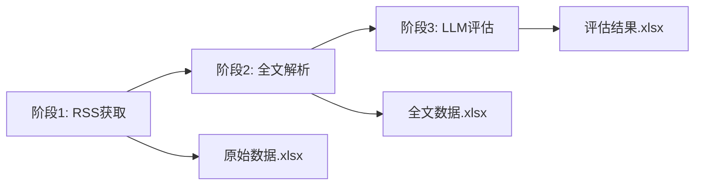

# 模块7-主题书目 重构方案：三阶段解耦

## 1. 重构背景

### 1.1 当前问题
- RSS获取、全文解析、LLM评估三个阶段耦合在一起
- 每次测试都要跑完整流程，效率低下
- 不同RSS源需要不同的全文提取策略，当前代码无法灵活处理
- 无法查看中间结果，调试困难

### 1.2 重构目标
1. **阶段解耦**: 将流程拆分为三个独立阶段，每个阶段可独立运行和测试
2. **策略模式**: 为不同RSS源实现不同的全文提取器
3. **数据持久化**: 每个阶段结果都写入Excel，便于查看和断点续传
4. **命令行解耦**: 在主菜单中提供细粒度的子选项

## 2. 三阶段架构设计

### 2.1 阶段划分



#### 阶段1: RSS获取 (Fetch)
- **输入**: RSS源配置 (`config/subject_bibliography.yaml`)
- **处理**: 使用 `feedparser` 抓取RSS内容
- **输出**: Excel文件，包含列:
  - `source` (来源)
  - `title` (标题)
  - `link` (链接)
  - `published_date` (发布时间)
  - `fetch_date` (抓取时间)
  - `summary` (RSS摘要)
  - `content` (RSS原始内容)

#### 阶段2: 全文解析 (Extract)
- **输入**: 阶段1的Excel文件
- **处理**: 根据RSS源类型，使用对应的提取器获取全文
- **输出**: 在原Excel基础上新增列:
  - `full_text` (提取的全文)
  - `extract_status` (提取状态: success/failed/skipped)
  - `extract_error` (错误信息，如有)

#### 阶段3: LLM评估 (Analyze)
- **输入**: 阶段2的Excel文件
- **处理**: 使用LLM对 `full_text` 进行分析
- **输出**: 在原Excel基础上新增列:
  - `llm_score` (评分 1-10)
  - `llm_tags` (标签列表)
  - `llm_keywords` (关键词列表)
  - `llm_summary` (总结)
  - `llm_logic` (逻辑分析)
  - `llm_raw_response` (原始响应)

### 2.2 目录结构

```
src/core/subject_bibliography/
├── __init__.py
├── rss_fetcher.py              # 阶段1: RSS获取
├── content_extractors/         # 阶段2: 全文提取器
│   ├── __init__.py
│   ├── base.py                 # 抽象基类 BaseContentExtractor
│   ├── pengpai.py              # 澎湃思想市场提取器
│   ├── bigthink.py             # Big Think提取器 (需要无头浏览器)
│   ├── wikipedia.py            # Wikipedia提取器
│   └── factory.py              # 提取器工厂类
├── processor.py                # 阶段3: LLM评估
├── storage.py                  # 数据存储管理
└── pipeline.py                 # 流程控制器 (支持分阶段运行)
```

## 3. 全文提取器设计

### 3.1 抽象基类

```python
# content_extractors/base.py
from abc import ABC, abstractmethod
from typing import Dict, Any

class BaseContentExtractor(ABC):
    """全文提取器抽象基类"""
    
    @abstractmethod
    def extract(self, article: Dict[str, Any]) -> Dict[str, Any]:
        """
        提取全文
        
        Args:
            article: 包含 source, title, link, content 等字段的字典
            
        Returns:
            包含 full_text, extract_status, extract_error 的字典
        """
        pass
    
    @abstractmethod
    def can_handle(self, source_name: str) -> bool:
        """判断是否能处理该RSS源"""
        pass
```

### 3.2 具体提取器实现

#### 3.2.1 澎湃思想市场 (PengpaiExtractor)
- **策略**: 直接从 `content` 列解析HTML获取全文
- **实现**: 使用 `BeautifulSoup` 清理HTML标签
- **难度**: ⭐ (最简单)

#### 3.2.2 Wikipedia每日首页文章 (WikipediaExtractor)
- **策略**: 从 `content` 列提取全文URL，然后爬取
- **实现**: 
  1. 解析 `content` 获取Wikipedia文章URL
  2. 使用 `requests` + `BeautifulSoup` 爬取文章正文
- **难度**: ⭐⭐

#### 3.2.3 Big Think (BigThinkExtractor)
- **策略**: 根据 `link` 使用无头浏览器爬取
- **实现**: 
  1. 使用 Playwright 打开链接
  2. 等待页面加载完成
  3. 提取正文内容
- **难度**: ⭐⭐⭐

### 3.3 提取器工厂

```python
# content_extractors/factory.py
class ExtractorFactory:
    """提取器工厂类"""
    
    _extractors = []  # 注册的提取器列表
    
    @classmethod
    def register(cls, extractor_class):
        """注册提取器"""
        cls._extractors.append(extractor_class())
    
    @classmethod
    def get_extractor(cls, source_name: str) -> BaseContentExtractor:
        """根据RSS源名称获取对应的提取器"""
        for extractor in cls._extractors:
            if extractor.can_handle(source_name):
                return extractor
        return None  # 或返回默认提取器
```

## 4. 配置文件增强

### 4.1 新增字段

```yaml
# config/subject_bibliography.yaml

rss_feeds:
  - name: "澎湃思想市场"
    url: "http://wechat2rss.vip.cpolar.top/feed/3587489630.xml"
    enabled: true
    extractor: "pengpai"  # 新增: 指定提取器类型
    
  - name: "Big Think"
    url: "https://bigthink.buzzing.cc/feed.xml"
    enabled: true
    extractor: "bigthink"
    
  - name: "Wikipedia每日首页文章"
    url: "https://en.wikipedia.org/w/api.php?action=featuredfeed&feed=featured&feedformat=atom"
    enabled: true
    extractor: "wikipedia"

# 新增: 全文提取设置
extraction_settings:
  timeout: 30  # 爬取超时时间(秒)
  retry_times: 3  # 失败重试次数
  browser_headless: true  # 无头浏览器模式
```

## 5. 命令行解耦设计

### 5.1 主菜单调整

```
9. 模块7: 主题书目每日追踪
   9.1 阶段1: RSS获取
   9.2 阶段2: 全文解析
   9.3 阶段3: LLM评估
   9.4 完整流程 (1→2→3)
```

### 5.2 命令行参数支持

```bash
# 运行单个阶段
python -m src.core.subject_bibliography.pipeline --stage fetch
python -m src.core.subject_bibliography.pipeline --stage extract
python -m src.core.subject_bibliography.pipeline --stage analyze

# 运行完整流程
python -m src.core.subject_bibliography.pipeline --stage all

# 指定输入文件 (用于阶段2、3)
python -m src.core.subject_bibliography.pipeline --stage extract --input "path/to/fetch_result.xlsx"
```

## 6. 数据流转示例

### 6.1 文件命名规范

```
runtime/outputs/subject_bibliography/
├── 2025-12-02_fetch.xlsx      # 阶段1输出
├── 2025-12-02_extract.xlsx    # 阶段2输出
└── 2025-12-02_analyze.xlsx    # 阶段3输出(最终结果)
```

### 6.2 Excel列结构演进

**阶段1输出** (7列):
```
source | title | link | published_date | fetch_date | summary | content
```

**阶段2输出** (10列):
```
source | title | link | published_date | fetch_date | summary | content | full_text | extract_status | extract_error
```

**阶段3输出** (16列):
```
source | title | link | published_date | fetch_date | summary | content | full_text | extract_status | extract_error | llm_score | llm_tags | llm_keywords | llm_summary | llm_logic | llm_raw_response
```

## 7. 实现计划

### 7.1 第一步: 基础框架
- [ ] 创建 `content_extractors/` 目录
- [ ] 实现 `BaseContentExtractor` 抽象基类
- [ ] 实现 `ExtractorFactory` 工厂类
- [ ] 调整 `storage.py` 支持分阶段写入

### 7.2 第二步: 提取器实现
- [ ] 实现 `PengpaiExtractor` (最简单，先测试)
- [ ] 实现 `WikipediaExtractor`
- [ ] 实现 `BigThinkExtractor` (需要安装 Playwright)

### 7.3 第三步: 流程重构
- [ ] 重构 `pipeline.py` 支持 `--stage` 参数
- [ ] 调整 `main.py` 菜单，增加子选项
- [ ] 更新 `config/subject_bibliography.yaml`

### 7.4 第四步: 测试验证
- [ ] 测试阶段1: RSS获取
- [ ] 测试阶段2: 全文解析 (逐个提取器测试)
- [ ] 测试阶段3: LLM评估
- [ ] 测试完整流程

## 8. 技术依赖

### 8.1 新增依赖
```txt
beautifulsoup4>=4.12.0  # HTML解析
lxml>=4.9.0             # BeautifulSoup后端
playwright>=1.40.0      # 无头浏览器 (可选，用于Big Think)
```

### 8.2 Playwright安装
```bash
pip install playwright
playwright install chromium  # 安装浏览器驱动
```

## 9. 优势总结

### 9.1 开发效率
- ✅ 每个阶段可独立开发和测试
- ✅ 调试时只需运行特定阶段，节省时间
- ✅ 中间结果可视化，便于排查问题

### 9.2 可维护性
- ✅ 代码职责清晰，符合单一职责原则
- ✅ 新增RSS源只需实现对应提取器
- ✅ 提取器之间互不影响，降低耦合

### 9.3 灵活性
- ✅ 可以只运行部分阶段 (如只更新全文，不重新评估)
- ✅ 支持断点续传 (从中间阶段开始)
- ✅ 便于后续扩展 (如增加数据清洗阶段)

## 10. 注意事项

### 10.1 数据一致性
- 每个阶段都基于前一阶段的Excel文件
- 需要在 `storage.py` 中实现增量更新逻辑
- 避免重复处理已有数据

### 10.2 错误处理
- 提取器失败时，记录错误但不中断流程
- 在 `extract_status` 列标记失败状态
- 阶段3可以跳过 `extract_status=failed` 的行

### 10.3 性能优化
- 阶段2的爬取可以考虑并发 (使用线程池)
- 阶段3的LLM调用已有异步支持 (如果 `UnifiedLLMClient` 支持)
- 大批量数据建议分批处理
