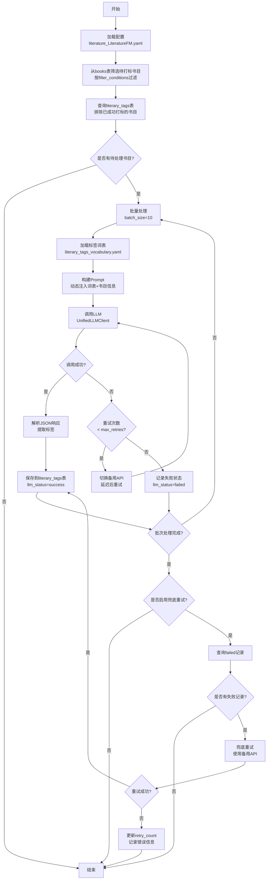

# 模块8-Phase2-LLM打标功能开发文档

**Status**: Approved  
**Date**: 2025-12-28  
**Author**: AI Architect  
**Version**: v2.0  
**Phase**: Phase 2 - LLM标签生成

---

## 1. 目标与背景

### 1.1 业务目标
为文学类书目自动生成情境化标签，通过LLM分析书目元数据（简介、评分、作者等），为每本书打上"阅读情境、文本质感、时空氛围、情绪基调"等多维度标签，支持后续的情境化推荐。

### 1.2 核心问题
- **问题1**：如何配置化筛选需要打标的书目（索书号、评分、字段完整性）
- **问题2**：如何实现断点续传，避免重复调用LLM
- **问题3**：如何处理LLM调用失败（主备API切换、错误重试、兜底逻辑）
- **问题4**：如何维护标签词表，便于非技术人员调整

### 1.3 与Phase 1的关系
- **Phase 1**：基础筛选（已完成）- 从books表筛选文学类书目并输出Excel
- **Phase 2**：LLM打标（本文档）- 为筛选后的书目生成情境标签
- **Phase 3**：向量化检索（未来）- 基于标签进行相似度推荐

---

## 2. 详细设计

### 2.1 模块结构

```
src/core/LiteratureFM/              # 模块8核心目录
├── __init__.py
├── pipeline.py                   # 主流程编排器（已有）
├── literary_filter.py            # 文学类筛选器（已有）
├── llm_tagger.py                 # 【新增】LLM打标器
├── tag_manager.py                # 【新增】标签状态管理器
└── db_init.py                    # 【新增】数据库表初始化脚本

config/
├── literature_fm.yaml    # 【更新】新增llm_tagging配置节点
├── literary_tags_vocabulary.yaml # 【新增】标签词表配置
└── llm.yaml                      # 【更新】新增literary_tagging任务

prompts/
└── literary_tagging.md           # 【新增】LLM打标基础Prompt模板

runtime/database/
└── books_history.db              # 【更新】新增literary_tags表
```

### 2.2 数据库设计

#### 新增表：literary_tags

```sql
CREATE TABLE IF NOT EXISTS literary_tags (
    id INTEGER PRIMARY KEY AUTOINCREMENT,
    book_id INTEGER NOT NULL,                    -- 关联books表的id
    call_no TEXT,                                -- 冗余字段：索书号
    title TEXT,                                  -- 冗余字段：书名
    
    -- 标签数据（JSON格式）
    tags_json TEXT,                              -- LLM生成的标签
    /*
    JSON结构示例：
    {
      "reading_context": ["暮色四合时"],
      "text_texture": ["诗意流动"],
      "spatial_atmosphere": ["都市孤独"],
      "emotional_tone": ["忧郁沉思"],
      "confidence_scores": {
        "reading_context": 0.85,
        "text_texture": 0.90,
        "spatial_atmosphere": 0.88,
        "emotional_tone": 0.92
      }
    }
    */
    
    -- LLM调用元数据
    llm_model TEXT,                              -- 使用的模型名称（如qwen3-max）
    llm_provider TEXT,                           -- API提供商（如oneapi-qwen3）
    llm_status TEXT DEFAULT 'pending',           -- 状态：pending/success/failed
    retry_count INTEGER DEFAULT 0,               -- 重试次数
    error_message TEXT,                          -- 错误信息
    
    -- 时间戳
    created_at TIMESTAMP DEFAULT CURRENT_TIMESTAMP,
    updated_at TIMESTAMP DEFAULT CURRENT_TIMESTAMP,
    
    -- 外键约束
    FOREIGN KEY (book_id) REFERENCES books(id),
    
    -- 唯一约束（避免重复打标）
    UNIQUE(book_id)
);

-- 索引优化
CREATE INDEX IF NOT EXISTS idx_literary_tags_book_id ON literary_tags(book_id);
CREATE INDEX IF NOT EXISTS idx_literary_tags_status ON literary_tags(llm_status);
CREATE INDEX IF NOT EXISTS idx_literary_tags_call_no ON literary_tags(call_no);
```

**设计说明**：
1. **独立表设计**：与books表解耦，便于扩展（如多版本标签、人工校验）
2. **冗余字段**：call_no和title冗余存储，便于查询和调试
3. **JSON存储**：标签数据以JSON格式存储，灵活支持多维度标签
4. **状态管理**：llm_status字段支持断点续传和兜底重试
5. **唯一约束**：book_id唯一，避免重复打标

### 2.3 核心逻辑流程



### 2.4 配置文件设计

#### config/literature_LiteratureFM.yaml（新增节点）

```yaml
# =============================================================================
# LLM打标配置
# =============================================================================
llm_tagging:
  # 是否启用LLM打标功能
  enabled: true
  
  # 标签词表配置文件路径
  vocabulary_file: "config/literary_tags_vocabulary.yaml"
  
  # 数据筛选条件（所有条件为AND关系）
  filter_conditions:
    # 索书号前缀（留空或null则不过滤）
    call_no_prefix: "I"
    
    # 最低豆瓣评分（留空或null则不过滤）
    min_douban_rating: 7.3
    
    # 必填字段列表（留空或null则不过滤）
    required_fields:
      - douban_summary        # 必须有内容简介
      - douban_cover_image    # 必须有封面图片
  
  # 批处理配置
  batch_processing:
    # 每批处理数量
    batch_size: 10
    
    # 批次间延迟（秒）
    delay_between_batches: 2
    
    # 是否显示进度条
    show_progress: true
  
  # 重试策略
  retry_strategy:
    # 单个API最大重试次数（由llm.yaml中的retry配置控制）
    max_retries_per_api: 3
    
    # 是否启用兜底重试（主流程结束后，对失败记录再次重试）
    fallback_retry_enabled: true
    
    # 兜底重试次数
    fallback_max_retries: 2
    
    # 兜底重试延迟（秒）
    fallback_delay: 5
  
  # Prompt配置
  prompt:
    # Langfuse提示词名称（优先使用）
    langfuse_name: "文学情境标签生成"
    
    # 本地兜底文件（Langfuse不可用时使用）
    fallback_file: "prompts/literary_tagging.md"
  
  # 输出配置
  output:
    # 是否导出打标结果到Excel
    export_to_excel: true
    
    # 输出目录
    output_dir: "runtime/outputs/literary_tagging"
    
    # 文件名模板
    filename_template: "文学标签结果_{timestamp}.xlsx"
```

#### config/literary_tags_vocabulary.yaml（新建）

```yaml
# =============================================================================
# 文学情境标签词表
# =============================================================================
# 版本: v1.0
# 更新日期: 2025-12-28
# 说明: 本文件定义了LLM打标时可选择的标签候选词

# 标签维度定义
tag_dimensions:
  
  # 维度1: 阅读情境（何时读？）
  reading_context:
    description: "适合阅读的时间场景或心理状态"
    candidates:
      - label: "暮色四合时"
        description: "黄昏时分，适合沉思的氛围"
      - label: "深夜独处"
        description: "夜深人静，适合内省的时刻"
      - label: "午后慵懒"
        description: "午后时光，轻松惬意的阅读"
      - label: "通勤路上"
        description: "碎片时间，适合短篇或轻快节奏"
      - label: "周末晨光"
        description: "周末早晨，精力充沛的阅读时段"
      - label: "雨天窗前"
        description: "雨天室内，适合情绪化的阅读"
      - label: "旅途中"
        description: "旅行途中，适合轻松或冒险题材"
  
  # 维度2: 文本质感（怎么写的？）
  text_texture:
    description: "文本的语言风格和叙事特征"
    candidates:
      - label: "诗意流动"
        description: "语言优美，富有诗意和韵律感"
      - label: "冷峻克制"
        description: "文字简洁，情感内敛"
      - label: "絮语呢喃"
        description: "意识流风格，碎片化叙事"
      - label: "戏谑幽默"
        description: "轻松诙谐，富有趣味"
      - label: "史诗宏大"
        description: "叙事恢弘，结构复杂"
      - label: "细腻温柔"
        description: "细节丰富，情感细腻"
      - label: "锐利犀利"
        description: "批判性强，语言尖锐"
  
  # 维度3: 时空氛围（在哪里？）
  spatial_atmosphere:
    description: "故事发生的空间场景和氛围感"
    candidates:
      - label: "都市孤独"
        description: "现代都市背景，个体疏离感"
      - label: "乡土温情"
        description: "乡村田园，人情温暖"
      - label: "异域漂泊"
        description: "异国他乡，文化碰撞"
      - label: "历史回响"
        description: "历史背景，时代变迁"
      - label: "虚构奇境"
        description: "幻想世界，超现实空间"
      - label: "小镇日常"
        description: "小城镇生活，平淡中见真情"
      - label: "边缘地带"
        description: "社会边缘，非主流空间"
  
  # 维度4: 情绪基调（什么感觉？）
  emotional_tone:
    description: "作品的主导情绪色彩"
    candidates:
      - label: "忧郁沉思"
        description: "悲伤、忧郁、沉重"
      - label: "温暖治愈"
        description: "温馨、感动、抚慰心灵"
      - label: "激昂振奋"
        description: "激情、热血、鼓舞人心"
      - label: "荒诞讽刺"
        description: "黑色幽默、讽刺、批判"
      - label: "平静淡然"
        description: "平和、淡泊、禅意"
      - label: "紧张悬疑"
        description: "悬念迭起，扣人心弦"
      - label: "浪漫柔情"
        description: "爱情、浪漫、柔美"

# Prompt构建配置
prompt_config:
  # 是否在Prompt中包含候选词描述
  include_descriptions: true
  
  # 标签选择策略
  selection_strategy:
    # 选择模式：single_select=每维度单选, multi_select=每维度多选
    mode: "multi_select"
    
    # 每个维度最多选择的标签数
    max_tags_per_dimension: 2
    
    # 是否要求所有维度都必须打标
    require_all_dimensions: false
  
  # 置信度阈值
  confidence_threshold: 0.7           # 低于此阈值的标签将被过滤
```

#### config/llm.yaml（新增任务）

```yaml
tasks:
  # ... 其他任务配置 ...
  
  # ----------------------------------------------------------------------------
  # 任务: 文学情境标签生成 (literary_tagging)
  # 逻辑位置: src/core/LiteratureFM/llm_tagger.py
  # ----------------------------------------------------------------------------
  literary_tagging:
    provider_type: text
    temperature: 0.4
    top_p: 0.9
    prompt:
      type: langfuse
      langfuse_name: "文学情境标签生成"
      fallback_file: "prompts/literary_tagging.md"
    
    retry:
      max_retries: 3
      base_delay: 1.5
      max_delay: 15
      enable_provider_switch: true
      jitter: true
    
    json_repair:
      enabled: true
      strict_mode: false
      output_format: json
    
    langfuse:
      enabled: true
      name: "文学标签生成"
      tags: ["book-echoes", "模块8", "文学标签"]
      metadata:
        project: "book-echoes"
        module: "模块8"
```

#### prompts/literary_tagging.md（新建）

```markdown
# 文学书目情境标签生成任务

你是一位资深的文学编辑和阅读推广专家。请根据书目信息，为这本书打上合适的情境标签。

## 任务要求

1. 仔细阅读书目的内容简介和元数据
2. 从以下维度为书目选择最合适的标签（每个维度可选1-2个标签）
3. 为每个维度给出置信度评分（0-1之间，保留2位小数）
4. 输出严格的JSON格式结果

## 标签维度与候选词

{TAGS_VOCABULARY}

## 输出格式要求

请严格按照以下JSON格式输出，不要添加任何额外的文字说明：

```json
{
  "reading_context": ["暮色四合时"],
  "text_texture": ["诗意流动", "细腻温柔"],
  "spatial_atmosphere": ["都市孤独"],
  "emotional_tone": ["忧郁沉思"],
  "confidence_scores": {
    "reading_context": 0.85,
    "text_texture": 0.90,
    "spatial_atmosphere": 0.88,
    "emotional_tone": 0.92
  }
}
```

## 注意事项

1. **标签选择**：应基于书目的核心特征，而非表面信息
2. **置信度评分**：应反映你对标签选择的确定程度
3. **维度留空**：如果某个维度实在无法判断，可以设置为空数组 []
4. **标签数量**：每个维度最多选择2个标签
5. **JSON格式**：必须输出有效的JSON，不要包含注释或额外文字
```

### 2.5 核心类与接口设计

#### TagManager（标签状态管理器）

```python
"""标签状态管理器"""

import sqlite3
from typing import List, Dict, Optional
from pathlib import Path
from src.utils.logger import get_logger

logger = get_logger(__name__)


class TagManager:
    """管理literary_tags表的CRUD操作"""
    
    def __init__(self, db_path: str = "runtime/database/books_history.db"):
        """
        Args:
            db_path: 数据库文件路径
        """
        self.db_path = db_path
        self._ensure_table_exists()
    
    def _ensure_table_exists(self) -> None:
        """确保literary_tags表存在"""
        # 执行db_init.py中的建表SQL
        pass
    
    def get_tagged_book_ids(self, status: str = 'success') -> List[int]:
        """
        获取已打标的book_id列表
        
        Args:
            status: 状态过滤（success/failed/pending）
            
        Returns:
            List[int]: book_id列表
        """
        pass
    
    def save_tags(
        self,
        book_id: int,
        call_no: str,
        title: str,
        tags_json: str,
        llm_model: str,
        llm_provider: str,
        llm_status: str = 'success',
        error_message: Optional[str] = None
    ) -> bool:
        """
        保存标签数据
        
        Args:
            book_id: 书目ID
            call_no: 索书号
            title: 书名
            tags_json: 标签JSON字符串
            llm_model: 模型名称
            llm_provider: API提供商
            llm_status: 状态
            error_message: 错误信息
            
        Returns:
            bool: 是否成功
        """
        pass
    
    def update_status(
        self,
        book_id: int,
        llm_status: str,
        error_message: Optional[str] = None,
        increment_retry: bool = False
    ) -> bool:
        """
        更新打标状态
        
        Args:
            book_id: 书目ID
            llm_status: 新状态
            error_message: 错误信息
            increment_retry: 是否增加重试计数
            
        Returns:
            bool: 是否成功
        """
        pass
    
    def get_failed_records(self, max_retry_count: int = 3) -> List[Dict]:
        """
        获取失败记录（用于兜底重试）
        
        Args:
            max_retry_count: 最大重试次数过滤
            
        Returns:
            List[Dict]: 失败记录列表
        """
        pass
    
    def export_to_dataframe(self) -> 'pd.DataFrame':
        """
        导出标签数据为DataFrame
        
        Returns:
            pd.DataFrame: 标签数据
        """
        pass
```

#### LLMTagger（LLM打标器）

```python
"""LLM打标器"""

import json
import time
from typing import Dict, List, Optional
from pathlib import Path
import yaml

from src.utils.logger import get_logger
from src.utils.llm import UnifiedLLMClient
from .tag_manager import TagManager

logger = get_logger(__name__)


class LLMTagger:
    """负责调用LLM为书目生成标签"""
    
    def __init__(self, config: dict):
        """
        Args:
            config: llm_tagging配置字典
        """
        self.config = config
        self.llm_client = UnifiedLLMClient()
        self.tag_manager = TagManager()
        self.vocabulary = self._load_vocabulary()
    
    def _load_vocabulary(self) -> dict:
        """加载标签词表"""
        vocab_path = self.config.get('vocabulary_file')
        if not vocab_path:
            raise ValueError("vocabulary_file未配置")
        
        with open(vocab_path, 'r', encoding='utf-8') as f:
            return yaml.safe_load(f)
    
    def tag_books(self, books: List[Dict]) -> Dict[str, int]:
        """
        批量打标
        
        Args:
            books: 书目列表，每个元素包含book_id, title, author, douban_summary等
            
        Returns:
            Dict[str, int]: 统计信息 {'success': 10, 'failed': 2}
        """
        batch_size = self.config.get('batch_processing', {}).get('batch_size', 10)
        delay = self.config.get('batch_processing', {}).get('delay_between_batches', 2)
        
        stats = {'success': 0, 'failed': 0}
        
        for i in range(0, len(books), batch_size):
            batch = books[i:i+batch_size]
            logger.info(f"处理批次 {i//batch_size + 1}/{(len(books)-1)//batch_size + 1}")
            
            for book in batch:
                success = self._tag_single_book(book)
                if success:
                    stats['success'] += 1
                else:
                    stats['failed'] += 1
            
            # 批次间延迟
            if i + batch_size < len(books):
                time.sleep(delay)
        
        return stats
    
    def _tag_single_book(self, book: Dict) -> bool:
        """
        为单本书打标
        
        Args:
            book: 书目信息字典
            
        Returns:
            bool: 是否成功
        """
        try:
            # 1. 构建Prompt
            user_prompt = self._build_user_prompt(book)
            
            # 2. 调用LLM
            response = self.llm_client.call(
                task_name='literary_tagging',
                user_prompt=user_prompt
            )
            
            # 3. 解析响应
            tags_data = self._parse_response(response)
            
            # 4. 保存到数据库
            self.tag_manager.save_tags(
                book_id=book['id'],
                call_no=book.get('call_no', ''),
                title=book.get('title', ''),
                tags_json=json.dumps(tags_data, ensure_ascii=False),
                llm_model='qwen3-max',  # 从llm.yaml读取
                llm_provider='oneapi-qwen3',
                llm_status='success'
            )
            
            logger.info(f"✓ 打标成功: {book.get('title', 'Unknown')}")
            return True
            
        except Exception as e:
            logger.error(f"✗ 打标失败: {book.get('title', 'Unknown')} - {str(e)}")
            
            # 记录失败状态
            self.tag_manager.save_tags(
                book_id=book['id'],
                call_no=book.get('call_no', ''),
                title=book.get('title', ''),
                tags_json='',
                llm_model='',
                llm_provider='',
                llm_status='failed',
                error_message=str(e)[:500]
            )
            
            return False
    
    def _build_user_prompt(self, book: Dict) -> str:
        """
        构建用户提示词（动态注入词表）
        
        Args:
            book: 书目信息
            
        Returns:
            str: 完整的用户提示词
        """
        # 1. 构建标签候选词部分
        tags_section = self._build_tags_section()
        
        # 2. 构建书目信息部分
        book_section = f"""
## 待打标书目信息

- **书名**: {book.get('title', 'Unknown')}
- **作者**: {book.get('author', 'Unknown')}
- **出版年份**: {book.get('douban_pub_year', 'Unknown')}
- **豆瓣评分**: {book.get('douban_rating', 'N/A')}
- **内容简介**: 
{book.get('douban_summary', '无简介')}
"""
        
        # 3. 组装完整Prompt
        return f"{tags_section}\n\n{book_section}"
    
    def _build_tags_section(self) -> str:
        """构建标签候选词部分"""
        dimensions = self.vocabulary['tag_dimensions']
        include_desc = self.vocabulary['prompt_config']['include_descriptions']
        
        sections = []
        for dim_key, dim_data in dimensions.items():
            section = f"### {dim_data['description']}\n"
            for candidate in dim_data['candidates']:
                if include_desc:
                    section += f"- **{candidate['label']}**: {candidate['description']}\n"
                else:
                    section += f"- {candidate['label']}\n"
            sections.append(section)
        
        return "\n".join(sections)
    
    def _parse_response(self, response: str) -> dict:
        """
        解析LLM响应
        
        Args:
            response: LLM返回的JSON字符串
            
        Returns:
            dict: 解析后的标签数据
        """
        # UnifiedLLMClient已启用json_repair，这里直接解析
        if isinstance(response, str):
            return json.loads(response)
        return response
    
    def fallback_retry(self) -> Dict[str, int]:
        """
        兜底重试（对失败记录重新打标）
        
        Returns:
            Dict[str, int]: 重试统计 {'success': 5, 'failed': 1}
        """
        if not self.config.get('retry_strategy', {}).get('fallback_retry_enabled'):
            logger.info("兜底重试未启用，跳过")
            return {'success': 0, 'failed': 0}
        
        max_retries = self.config.get('retry_strategy', {}).get('fallback_max_retries', 2)
        delay = self.config.get('retry_strategy', {}).get('fallback_delay', 5)
        
        # 获取失败记录
        failed_records = self.tag_manager.get_failed_records(max_retry_count=max_retries)
        
        if not failed_records:
            logger.info("没有需要兜底重试的记录")
            return {'success': 0, 'failed': 0}
        
        logger.info(f"开始兜底重试，共 {len(failed_records)} 条记录")
        
        stats = {'success': 0, 'failed': 0}
        
        for record in failed_records:
            time.sleep(delay)
            
            # 重新打标
            success = self._tag_single_book(record)
            
            if success:
                stats['success'] += 1
            else:
                # 更新重试计数
                self.tag_manager.update_status(
                    book_id=record['id'],
                    llm_status='failed',
                    increment_retry=True
                )
                stats['failed'] += 1
        
        return stats
```

#### LiteratureFMPipeline（更新）

```python
"""模块8主流程编排器"""

import time
from pathlib import Path
import pandas as pd
import sqlite3

from src.utils.logger import get_logger
from src.utils.config_manager import get_config
from .llm_tagger import LLMTagger
from .tag_manager import TagManager

logger = get_logger(__name__)


class LiteratureFMPipeline:
    """模块8主流程编排器"""
    
    def __init__(self):
        self.config = self._load_config()
        self.tag_manager = TagManager()
    
    def _load_config(self) -> dict:
        """加载配置"""
        # 从config/literature_LiteratureFM.yaml加载
        pass
    
    def run_llm_tagging(self) -> bool:
        """
        运行LLM打标流程
        
        Returns:
            bool: 是