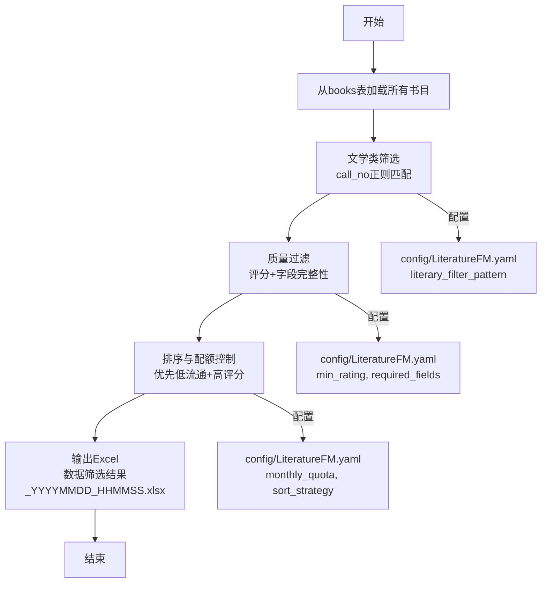
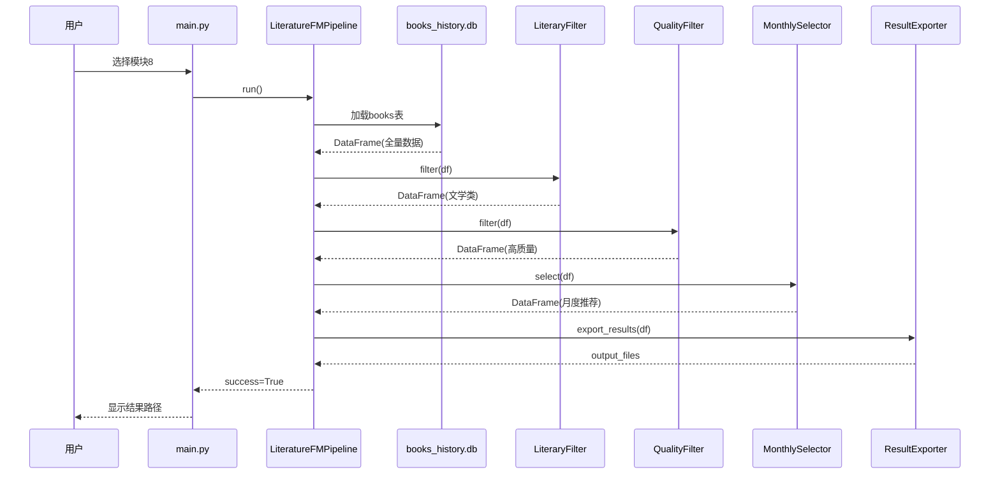

# 模块8-文学情境推荐（文学FM）设计文档

**Status**: Proposal  
**Date**: 2025-12-28  
**Author**: AI Architect  
**Version**: v1.0

---

## 1. 目标与背景

### 1.1 业务目标
为纯文学类馆藏构建"情境化非目的性浏览"推荐机制，让这类在传统检索系统中处于结构性劣势的图书，通过"氛围标签+月度书架"的方式进入读者视野。

### 1.2 核心问题
- **问题1**：纯文学缺乏明确的"功利性检索词"（如考试、技能），难以被主动发现
- **问题2**：传统推荐依赖借阅量，导致冷门佳作被埋没
- **问题3**：读者需要"此刻的我需要什么书"的情境化推荐，而非"大家都在读什么"

### 1.3 与其他模块的差异化定位

| 维度 | 月份牌 | 睡美人 | 主题卡 | **文学FM（模块8）** |
|------|--------|--------|--------|---------------------|
| 推荐对象 | 跨学科 | 跨学科（排除纯文学） | 学术/专业类 | **纯文学** |
| 发现逻辑 | 时间周期性 | 零借阅遗珠 | 知识聚类 | **情境化浏览** |
| 用户心智 | "这个时候大家都在读" | "被遗忘的宝藏" | "系统学习某主题" | **"此刻的我需要"** |
| 更新频率 | 月度 | 月度 | 月度 | **月度** |
| 推荐数量 | ≈20本 | ≈15本 | ≈10本 | **5-8本/书架** |

---

## 2. 详细设计

### 2.1 模块结构

```
src/core/LiteratureFM/              # 模块8核心目录
├── __init__.py
├── pipeline.py                   # 主流程编排器
├── literary_filter.py            # 文学类书目筛选器
├── quality_filter.py             # 质量过滤器（评分、字段完整性）
├── monthly_selector.py           # 月度选书器（配额控制）
└── README.md                     # 模块说明文档

config/
├── LiteratureFM.yaml               # 模块8专属配置（新建）
└── setting.yaml                  # 全局配置（新增LiteratureFM节点）

docs/changelogs/模块8-文学情境推荐/
├── 文学书目情境化推荐初始需求.md  # 已有
└── 模块8-文学情境推荐开发文档.md  # 本文档
```

### 2.2 核心逻辑流程



### 2.3 数据流设计

#### 输入
- **数据源**：`runtime/database/books_history.db` → `books`表
- **关键字段**：
  - `call_no`：索书号（用于文学类判断）
  - `cleaned_call_no`：清理后索书号
  - `douban_rating`：豆瓣评分
  - `douban_summary`：内容简介
  - `douban_cover_image`：封面图片链接
  - `douban_pub_year`：出版年份

#### 处理逻辑
1. **文学类筛选**：
   ```python
   # 正则表达式匹配（可配置）
   pattern = r'^I[0-9]'  # I类文学
   df = df[df['cleaned_call_no'].str.match(pattern, na=False)]
   ```

2. **质量过滤**：
   ```python
   # 评分阈值（按学科配置）
   min_rating = config.get('LiteratureFM.min_rating.I', 7.3)
   df = df[df['douban_rating'] >= min_rating]
   
   # 必填字段验证
   required_fields = ['douban_summary', 'douban_cover_image']
   for field in required_fields:
       df = df[df[field].notna() & (df[field] != '')]
   ```

3. **排序策略**：
   ```python
   # 发现性优先：低流通 + 高评分
   df['discovery_score'] = (
       0.6 * (1 / (1 + np.log1p(df['circulation_count']))) +  # 反向流通率
       0.4 * ((df['douban_rating'] - 7.0) / 3.0)              # 归一化评分
   )
   df = df.sort_values('discovery_score', ascending=False)
   ```

4. **配额控制**：
   ```python
   monthly_quota = config.get('LiteratureFM.monthly_quota', 8)
   df = df.head(monthly_quota)
   ```

#### 输出
- **文件名**：`数据筛选结果_{timestamp}.xlsx`
- **新增列**：
  - `评选批次`：当前年月（如"2025-12"）
  - `数据来源`：固定值"文学情境推荐"
  - `发现性分数`：discovery_score（用于调试）

### 2.4 配置文件设计

#### config/LiteratureFM.yaml（新建）
```yaml
# 模块8-文学情境推荐配置

# 文学类筛选规则
literary_filter:
  enabled: true
  # 索书号正则表达式（匹配I类文学）
  call_no_pattern: '^I[0-9]'
  # 目标列名
  target_column: 'cleaned_call_no'

# 质量过滤规则
quality_filter:
  # 最低评分（按学科分类）
  min_rating:
    I: 7.3  # 文学类
    default: 7.5
  
  # 必填字段验证
  required_fields:
    - column: 'douban_summary'
      description: '排除没有内容简介的图书'
    - column: 'douban_cover_image'
      description: '排除没有封面图片的图书'
  
  # 出版年过滤（可选）
  pub_year_filter:
    enabled: false
    # 近N年出版
    recent_years: 3

# 月度选书策略
monthly_selection:
  # 月度配额
  quota: 8
  
  # 排序策略权重
  sort_strategy:
    discovery_weight: 0.6  # 发现性权重（反向流通率）
    quality_weight: 0.4    # 质量权重（评分）
  
  # 流通量阈值（优先推荐）
  max_circulation_priority: 5  # 流通量<5的优先

# 输出配置
output:
  # 是否添加评选批次列
  add_batch_column: true
  # 数据来源标识
  data_source_label: '文学情境推荐'
  # 是否输出发现性分数（调试用）
  include_discovery_score: true
```

#### config/setting.yaml（新增节点）
```yaml
# 在现有配置文件末尾添加

# =============================================================================
# 模块8：文学情境推荐配置
# =============================================================================
LiteratureFM:
  # 是否启用模块
  enabled: true
  
  # 配置文件路径
  config_file: "config/LiteratureFM.yaml"
  
  # 数据库配置（复用现有）
  database:
    db_path: "runtime/database/books_history.db"
    table_name: "books"
```

### 2.5 核心类与接口设计

#### LiteraryFilter（文学类筛选器）
```python
class LiteraryFilter:
    """文学类书目筛选器"""
    
    def __init__(self, config: dict):
        """
        Args:
            config: 配置字典（来自LiteratureFM.yaml）
        """
        self.pattern = config.get('call_no_pattern', r'^I[0-9]')
        self.target_column = config.get('target_column', 'cleaned_call_no')
    
    def filter(self, df: pd.DataFrame) -> pd.DataFrame:
        """
        筛选文学类书目
        
        Args:
            df: 输入DataFrame
            
        Returns:
            pd.DataFrame: 筛选后的DataFrame
        """
        pass
```

#### QualityFilter（质量过滤器）
```python
class QualityFilter:
    """质量过滤器（评分+字段完整性）"""
    
    def __init__(self, config: dict):
        self.min_rating = config.get('min_rating', {})
        self.required_fields = config.get('required_fields', [])
    
    def filter(self, df: pd.DataFrame) -> pd.DataFrame:
        """
        质量过滤
        
        Args:
            df: 输入DataFrame
            
        Returns:
            pd.DataFrame: 筛选后的DataFrame
        """
        pass
```

#### MonthlySelector（月度选书器）
```python
class MonthlySelector:
    """月度选书器（排序+配额控制）"""
    
    def __init__(self, config: dict):
        self.quota = config.get('quota', 8)
        self.sort_strategy = config.get('sort_strategy', {})
    
    def select(self, df: pd.DataFrame) -> pd.DataFrame:
        """
        月度选书
        
        Args:
            df: 输入DataFrame
            
        Returns:
            pd.DataFrame: 选中的书目
        """
        pass
```

#### LiteratureFMPipeline（主流程编排器）
```python
class LiteratureFMPipeline:
    """模块8主流程编排器"""
    
    def __init__(self):
        self.config = self._load_config()
        self.literary_filter = LiteraryFilter(self.config['literary_filter'])
        self.quality_filter = QualityFilter(self.config['quality_filter'])
        self.monthly_selector = MonthlySelector(self.config['monthly_selection'])
    
    def run(self) -> bool:
        """
        运行完整流程
        
        Returns:
            bool: 是否成功
        """
        pass
```

### 2.6 可视化图表

#### 数据流时序图


---

## 3. 测试策略

### 3.1 单元测试

#### tests/test_literary_filter.py
```python
def test_literary_filter_basic():
    """测试基础文学类筛选"""
    # 准备测试数据
    df = pd.DataFrame({
        'cleaned_call_no': ['I207', 'H319', 'I247', 'B84'],
        'book_title': ['诗集', '英语', '小说', '哲学']
    })
    
    # 执行筛选
    config = {'call_no_pattern': r'^I[0-9]', 'target_column': 'cleaned_call_no'}
    filter = LiteraryFilter(config)
    result = filter.filter(df)
    
    # 断言
    assert len(result) == 2
    assert all(result['cleaned_call_no'].str.startswith('I'))
```

#### tests/test_quality_filter.py
```python
def test_quality_filter_rating():
    """测试评分过滤"""
    df = pd.DataFrame({
        'douban_rating': [8.5, 7.0, 9.2, 6.8],
        'cleaned_call_no': ['I207', 'I247', 'I267', 'I287']
    })
    
    config = {'min_rating': {'I': 7.3}}
    filter = QualityFilter(config)
    result = filter.filter(df)
    
    assert len(result) == 2  # 只有8.5和9.2通过
```

### 3.2 集成测试

#### tests/test_LiteratureFM_pipeline.py
```python
def test_pipeline_end_to_end():
    """测试完整流程"""
    pipeline = LiteratureFMPipeline()
    success = pipeline.run()
    
    assert success == True
    # 验证输出文件存在
    # 验证输出数据格式正确
```

### 3.3 边界条件测试
- 空数据集
- 所有书目都不满足条件
- 配额大于候选数量
- 缺失必填字段

---

## 4. 实施计划

### Phase 1：基础筛选（MVP）
**目标**：实现基本的文学类筛选和输出功能

**任务清单**：
- [ ] 创建模块目录结构
- [ ] 实现LiteraryFilter
- [ ] 实现QualityFilter
- [ ] 实现MonthlySelector
- [ ] 实现LiteratureFMPipeline
- [ ] 编写配置文件
- [ ] 在main.py中添加模块8入口
- [ ] 编写单元测试
- [ ] 端到端测试

**预计工时**：4-6小时

### Phase 2：LLM标签提取（可选）
**目标**：使用LLM为书目打上情境标签

**任务清单**：
- [ ] 设计标签体系（3维标签）
- [ ] 编写LLM Prompt
- [ ] 实现TagExtractor
- [ ] 集成到Pipeline
- [ ] 人工校验样本

**预计工时**：6-8小时

### Phase 3：向量化检索（未来扩展）
**目标**：基于氛围相似度推荐

**任务清单**：
- [ ] 生成书目Embedding
- [ ] 实现相似度检索
- [ ] 优化推荐算法

**预计工时**：8-10小时

---

## 5. 风险与依赖

### 5.1 技术风险
- **风险1**：books表中文学类书目数量不足
  - **缓解措施**：降低评分阈值或扩大出版年范围
  
- **风险2**：circulation_count字段缺失
  - **缓解措施**：仅使用评分排序

### 5.2 依赖项
- 数据库：`runtime/database/books_history.db`（已有）
- 豆瓣元数据：必须先运行模块3-B获取
- 配置管理：`src/utils/config_manager.py`（已有）
- 日志系统：`src/utils/logger.py`（已有）

---

## 6. 验收标准

### 6.1 功能验收
- [ ] 能够从books表筛选出文学类书目
- [ ] 能够按评分和字段完整性过滤
- [ ] 能够按配额输出月度推荐
- [ ] 输出Excel格式正确，包含必要列

### 6.2 质量验收
- [ ] 单元测试覆盖率 > 80%
- [ ] 代码符合`@.rules/00_STANDARDS.md`规范
- [ ] 日志输出清晰，使用中文
- [ ] 配置文件结构合理，易于维护

### 6.3 性能验收
- [ ] 处理10000条数据 < 10秒
- [ ] 内存占用 < 500MB

---

## 7. 后续优化方向

1. **标签系统**：引入LLM自动打标签（阅读情境、文本质感、时空氛围）
2. **策展逻辑**：支持主题书架（如"暮色四合时"）
3. **向量检索**：基于氛围相似度推荐
4. **人工校验**：提供Web界面进行标签校验
5. **A/B测试**：对比不同排序策略的效果

---

## 附录A：配置示例

### 完整的LiteratureFM.yaml
```yaml
# 模块8-文学情境推荐配置
# 版本: v1.0
# 更新日期: 2025-12-28

# 文学类筛选规则
literary_filter:
  enabled: true
  call_no_pattern: '^I[0-9]'
  target_column: 'cleaned_call_no'

# 质量过滤规则
quality_filter:
  min_rating:
    I: 7.3
    default: 7.5
  
  required_fields:
    - column: 'douban_summary'
      description: '排除没有内容简介的图书'
    - column: 'douban_cover_image'
      description: '排除没有封面图片的图书'
  
  pub_year_filter:
    enabled: false
    recent_years: 3

# 月度选书策略
monthly_selection:
  quota: 8
  sort_strategy:
    discovery_weight: 0.6
    quality_weight: 0.4
  max_circulation_priority: 5

# 输出配置
output:
  add_batch_column: true
  data_source_label: '文学情境推荐'
  include_discovery_score: true
```

---

**文档结束**

---

## 第三步：等待批准

亲爱的用户，我已经完成了模块8的详细设计文档。

**该设计方案是否通过？**

如果通过，我将提示你切换到【开发专家模式】（`@.rules/02_DEVELOPER.md`）开始编码实现。

如果需要修改，请告诉我具体的调整方向，我会更新设计文档。