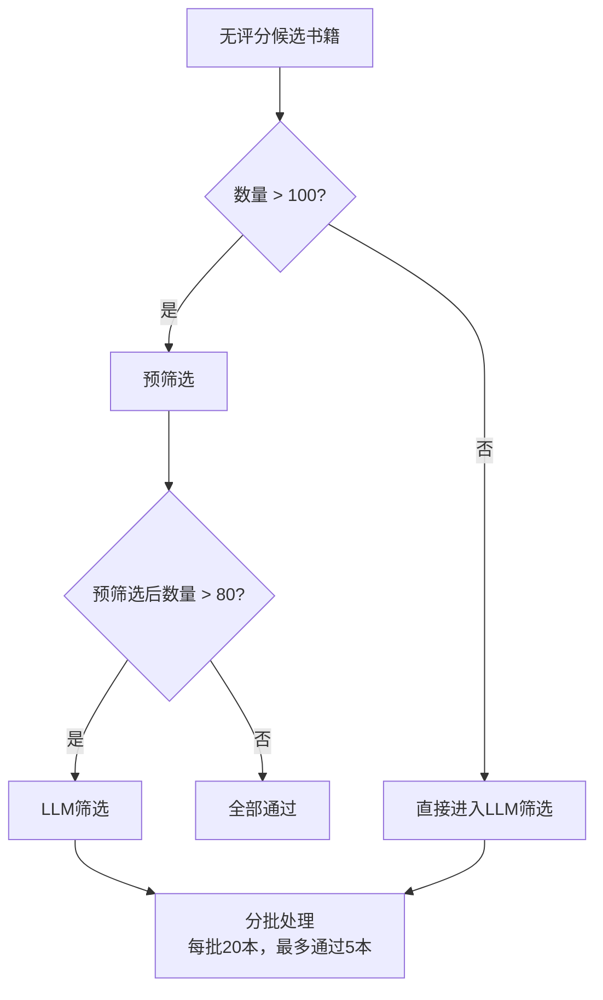
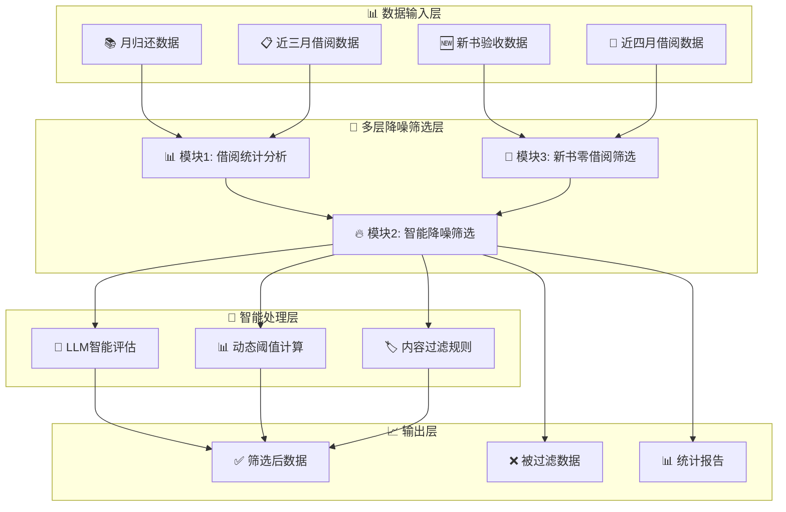

# 第三章 多层降噪筛选 - 技术详解

## 📋 章节概述

本章详细分析"书海回响"系统中的多层降噪筛选机制，该机制是整个图书推荐系统的核心组成部分，负责从海量图书数据中筛选出具有推荐价值的候选图书。多层降噪筛选包含三个主要模块：

1. **借阅统计分析模块** - 分析图书的借阅行为模式
2. **智能降噪筛选模块** - 排除热门书和低质量内容
3. **新书零借阅筛选模块** - 发现被忽视的优质新书

---

## 📊 模块1：借阅统计分析模块

### 🔍 核心功能

借阅统计分析模块通过 [`BorrowingStatisticsCorrected`](src/core/statistics.py:21) 类实现，负责计算每本书在近三个月内的借阅统计数据。

### 📈 统计指标

系统计算以下关键指标：

```python
# 统计指标 (statistics.py:26-32)
new_columns = [
    '近三个月总次数',    # 📊 总借阅次数
    '第一个月借阅次数',  # 📅 第一个月借阅次数
    '第二个月借阅次数',  # 📅 第二个月借阅次数
    '第三个月借阅次数',  # 📅 第三个月借阅次数
    '借阅人数'          # 👥 唯一借阅用户数
]
```

### ⏰ 时间窗口计算

系统通过 [`TimeUtils.get_recent_three_months_from_config()`](src/utils/time_utils.py:117) 实现灵活的时间窗口计算：

- **📅 配置驱动**：通过 `target_month` 参数指定目标月份
- **🔄 动态计算**：基于目标月份自动计算前三个月的时间范围
- **🛠️ 灵活调整**：支持多种计算模式（当前时间/指定月份/上个月模式）

### 🎯 借阅趋势分析

虽然没有明确定义"常温书"与"降温书"，但可以通过三个月的借阅次数变化趋势来分析：

| 趋势类型 | 特征 | 示例 | 含义 |
|---------|------|------|------|
| 📈 **上升型** | 借阅次数逐月增加 | 2→4→8 | 受欢迎程度逐渐提升 |
| 📉 **下降型** | 借阅次数逐月减少 | 8→4→2 | 可能是"降温书" |
| 📊 **稳定型** | 三个月借阅次数相对稳定 | 5→5→6 | 可能是"常温书" |
| 🌊 **波动型** | 借阅次数不规则波动 | 3→7→2 | 借阅行为不稳定 |

### 👥 精确去重算法

系统采用 [`groupby()`](src/core/statistics.py:199) 方法进行精确的用户去重：

```python
# 使用groupby一次性计算所有索书号的借阅人数
borrowers_count = borrowing_data.groupby(cleaned_call_column)[user_id_column].nunique().to_dict()
```

**🔍 异常情况处理**：
- **同一读者同日多次借还**：通过 `nunique()` 方法自动去重
- **用户标识列缺失**：自动尝试多种可能的用户标识列名
- **数据清洗**：过滤掉索书号为空的记录

---

## 🎯 模块2：智能降噪筛选模块

### 🔥 热门书排除算法

系统通过 [`HotBooksFilter`](src/core/filters/hot_books_filter.py:14) 类实现动态分位数算法：

```python
# 动态阈值计算 (hot_books_filter.py:52-82)
def _calculate_dynamic_threshold(self, borrowing_counts: pd.Series) -> int:
    non_zero_data = borrowing_counts[borrowing_counts > 0]
    
    if self.config['methods']['percentile']['enabled']:
        percentile = self.config['methods']['percentile']['threshold_percentile']
        threshold = np.percentile(non_zero_data, 100 - percentile)
        
        # 如果分位数结果过小，使用75%分位数
        if threshold < 5:
            threshold = np.percentile(non_zero_data, 75)
        
        return int(threshold)
```

### 📊 配置参数

| 参数 | 默认值 | 说明 |
|------|--------|------|
| 🎯 `threshold_percentile` | 15 | 排除前15%最高借阅次数的图书 |
| 🔄 `fallback_count` | 20 | 后备方案：当数据全为0时使用 |
| 📊 `enabled` | true | 是否启用分位数方法 |

### 🏷️ 内容过滤规则

系统实现了多层次的内容过滤机制：

#### 📚 题名关键词过滤
通过 [`config/filters/title_keywords.txt`](config/filters/title_keywords.txt) 定义了397个过滤关键词：

| 类别 | 示例关键词 | 数量 |
|------|------------|------|
| 💻 **技术类** | Python, Java, JavaScript, Excel, PPT | 45个 |
| 📖 **教辅类** | 考试, 教材, 习题, 考研, 四六级 | 30个 |
| 🛠️ **专业工具类** | 年鉴, 词典, 用户手册, 实操手册 | 35个 |
| 🏛️ **红色主题类** | 党员, 干部, 一带一路, 党建 | 18个 |
| 📚 **其他类别** | 医药, 法律, 经管, 工业等 | 269个 |

#### 🏷️ 索书号/CLC号过滤
通过 [`config/filters/call_number_clc.txt`](config/filters/call_number_clc.txt) 定义了复杂的索书号过滤规则：

```
# 优先级处理：DROP! > KEEP > DROP
DROP! .*[#*].*                    # 高优先级排除
KEEP ^D[0-1](?!35).*              # 保留特定政治类
KEEP ^F11.*                       # 保留特定经济类
DROP ^A.*                         # 排除马克思主义类
DROP ^C[5-8].*                    # 排除特定社会科学类
```

### 🔍 数据库查重机制

系统通过 [`DbDuplicateFilter`](src/core/filters/db_duplicate_filter.py) 实现业务查重：

```yaml
# 查重配置 (setting.yaml:91-103)
rule_db_duplicate:
  enabled: true
  target_column: "书目条码"
  db_table: "recommendation_results"
  db_column: "barcode"
  filter_condition:
    column: "manual_selection"
    value: "通过"
```

**🔍 查重逻辑**：
- **📋 查重字段**：基于 `书目条码` 进行精确匹配
- **🗄️ 查重范围**：查询 `recommendation_results` 表
- **✅ 查重条件**：筛选 `manual_selection='通过'` 的记录

### 📝 智能过滤原因追踪

系统通过 [`_get_filter_reason_description()`](src/core/data_filter.py:102) 方法智能生成过滤原因：

| 过滤器类型 | 过滤原因示例 |
|-----------|-------------|
| 🔥 **热门书过滤** | "热门书排除（借阅≥25次）" |
| 🏷️ **题名关键词** | "题名关键词排除（15个关键词）" |
| 📚 **索书号规则** | "索书号/CLC号模式排除（8个模式）" |
| 📊 **列值验证** | "附加信息9位数字格式校验" |

---

## 🌟 模块3：新书零借阅筛选模块

### 📚 零借阅验证机制

系统通过 [`ZeroBorrowingFilter`](src/core/new_sleeping/filter.py:14) 类实现零借阅验证：

```python
# 零借阅筛选核心逻辑 (filter.py:62-67)
# 筛选零借阅图书：在新书中但不在借阅数据中
zero_borrowing_mask = ~normalized_new_barcodes.isin(borrowed_barcodes)

# 同时排除书目条码为空的记录
valid_barcode_mask = normalized_new_barcodes.notna()
zero_borrowing_mask = zero_borrowing_mask & valid_barcode_mask
```

### 📊 数据来源

| 数据源 | 文件路径 | 用途 |
|--------|----------|------|
| 📚 **新书验收数据** | `data/new/验收.xlsx` | 新书基本信息 |
| 📋 **近四月借阅数据** | `data/new/近四月借阅.xlsx` | 验证是否被借阅 |

### 🎯 宽松评分阈值

新书零借阅筛选采用更宽松的评分阈值：

| 学科 | 普通图书阈值 | 新书零借阅阈值 | 宽松程度 |
|------|-------------|---------------|----------|
| 📚 **文学(I)** | 7.3 | 7.3 | 相同 |
| 🏛️ **历史(K)** | 8.0 | 8.0 | 相同 |
| 💻 **工业技术(T)** | 7.6 | 7.6 | 相同 |
| 📊 **其他学科** | 7.5 | 7.2 | 更宽松 |

### 🤖 LLM智能评估

对于无评分书籍，系统通过LLM进行智能评估：

#### 📋 评估维度

1. **📖 书名吸引力**：书名是否有趣、有深度、有话题性
2. **📝 内容简介质量**：简介是否清晰、有吸引力、能激发阅读兴趣
3. **✍️ 作者知名度**：作者是否知名或有影响力
4. **🏢 出版社信誉**：是否来自知名、专业的出版社
5. **🎯 学科价值**：该学科领域是否需要更多推荐

#### 🔄 三层判断逻辑



#### 📊 评分规则

| 分数区间 | 评级 | 含义 |
|---------|------|------|
| 🌟 **80-100分** | 强烈推荐 | 具有明显的阅读价值 |
| 👍 **60-79分** | 可以推荐 | 有一定价值 |
| ❌ **0-59分** | 不推荐 | 价值不明显 |

---

## 🎯 技术实现亮点

### 🚀 性能优化

1. **⚡ 批量处理**：使用 `groupby()` 替代逐行搜索，大幅提升统计效率
2. **🔄 并发处理**：支持多线程并发处理，提高系统吞吐量
3. **💾 内存优化**：预先过滤有效数据，减少内存占用

### 🛡️ 数据质量保障

1. **🔍 多层数据验证**：检查必需列、处理空值、标准化数据格式
2. **🏷️ 智能列名匹配**：自动识别不同数据源中的等效列名
3. **📊 详细日志记录**：提供完整的处理过程日志，便于问题排查

### 🎨 用户体验优化

1. **📈 可视化统计**：提供丰富的统计图表和数据可视化
2. **📝 详细报告**：生成完整的处理报告和过滤原因说明
3. **🔧 灵活配置**：支持通过配置文件调整各种参数和规则

---

## 📊 系统架构图



---

## 📋 总结

多层降噪筛选机制是"书海回响"系统的核心组成部分，通过三个模块的协同工作，实现了从海量图书数据中精准筛选有价值候选图书的目标。

### 🎯 核心价值

1. **📊 数据驱动**：基于真实的借阅数据进行统计分析，确保筛选结果的客观性
2. **🤖 智能筛选**：结合规则引擎和AI技术，提高筛选的准确性和效率
3. **🔄 持续优化**：通过配置化的设计，支持根据实际需求调整筛选策略
4. **📈 效果可衡量**：提供详细的统计报告和过滤原因，便于评估和优化

### 🚀 技术创新

1. **🎯 动态阈值算法**：根据数据分布自动调整筛选阈值，适应不同数据规模
2. **🏷️ 多层次过滤规则**：从热门书到内容类型的全方位过滤
3. **🤖 LLM智能评估**：对无评分书籍进行多维度智能评估
4. **📊 精确去重机制**：避免重复推荐已入选图书

多层降噪筛选机制的成功实施，为整个图书推荐系统奠定了坚实的数据基础，确保后续的AI评选和推荐卡片生成能够基于高质量的数据进行，最终实现"发现被时间沉淀的智慧遗珠"的系统目标。