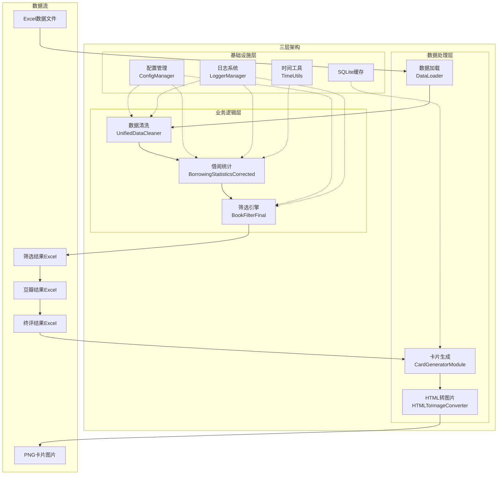
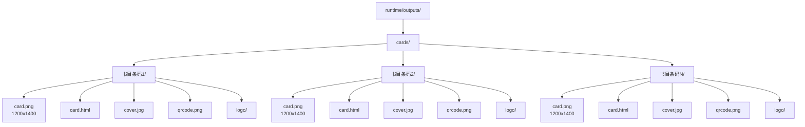
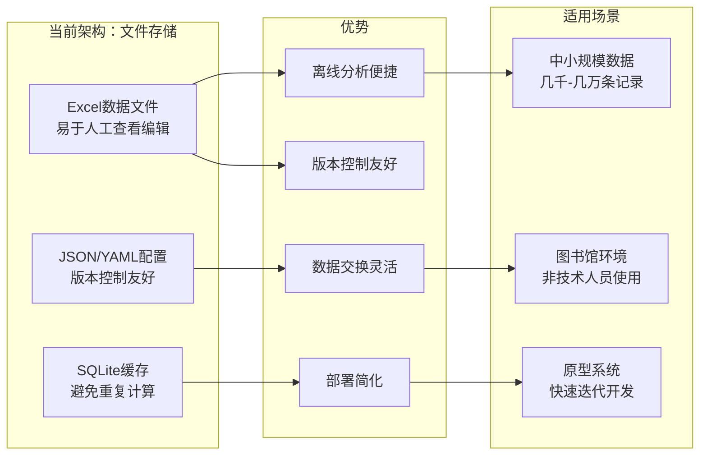

# 模块1：借阅统计分析与可视化卡片模块详解

## 系统架构概览



## 三层架构映射

### 基础设施层（Infrastructure Layer）

**配置管理系统**：
- 项目确实使用了通用的配置管理类来读取YAML文件，具体实现在 [`src/utils/config_manager.py`](src/utils/config_manager.py:1) 中的 [`ConfigManager`](src/utils/config_manager.py:38) 类
- 该类负责加载和管理 [`config/setting.yaml`](config/setting.yaml:1) 配置文件，支持环境变量和.env文件
- 配置管理器提供了统一的配置访问接口，如 [`get_douban_config()`](src/utils/config_manager.py:167)、[`get_statistics_config()`](src/utils/config_manager.py:247) 等专用方法

**日志系统**：
- [`src/utils/logger.py`](src/utils/logger.py:1) 实现了完整的日志系统，支持中文日志格式、按日期轮转和分级存储
- 提供了 [`LoggerManager`](src/utils/logger.py:73) 类和 [`get_logger()`](src/utils/logger.py:161) 函数供全项目使用

**时间工具**：
- [`src/utils/time_utils.py`](src/utils/time_utils.py:1) 提供了时间解析、格式化和筛选等功能
- 特别是 [`get_recent_three_months_from_config()`](src/utils/time_utils.py:117) 方法基于配置文件计算近三个月时间范围

**数据库缓存**：
- 使用SQLite作为缓存数据库，路径为 `runtime/database/books_history.db`
- [`src/core/card_generator/recommendation_writer.py`](src/core/card_generator/recommendation_writer.py:1) 中的 [`RecommendationResultsWriter`](src/core/card_generator/recommendation_writer.py:19) 类负责数据库操作

### 业务逻辑层（Business Logic Layer）

**借阅统计核心逻辑**：
- 借阅统计的核心逻辑确实封装在独立的Service类中，即 [`src/core/statistics.py`](src/core/statistics.py:1) 中的 [`BorrowingStatisticsCorrected`](src/core/statistics.py:21) 类
- 该类提供了 [`calculate_borrowing_statistics_from_borrowing_data()`](src/core/statistics.py:34) 方法执行核心统计算法
- 统计逻辑使用pandas的groupby操作进行高效计算，如第196-199行所示：
```python
# 使用groupby一次性计算所有索书号的借阅人数
borrowers_count = borrowing_data.groupby(cleaned_call_column)[user_id_column].nunique().to_dict()
```

**数据清洗逻辑**：
- [`src/core/data_cleaner.py`](src/core/data_cleaner.py:1) 中的 [`UnifiedDataCleaner`](src/core/data_cleaner.py:49) 类封装了数据清洗逻辑
- 提供了 [`clean_call_number()`](src/core/data_cleaner.py:62) 方法标准化索书号，处理特殊字符和格式

**筛选逻辑**：
- [`src/core/data_filter.py`](src/core/data_filter.py:1) 中的 [`BookFilterFinal`](src/core/data_filter.py:16) 类实现了多层次的筛选逻辑
- 支持动态加载筛选器，通过配置文件控制筛选行为

### 数据处理层（Data Processing Layer）

**数据加载**：
- [`src/core/data_loader.py`](src/core/data_loader.py:1) 中的 [`DataLoader`](src/core/data_loader.py:18) 类负责Excel文件的加载和验证
- 提供了便捷函数如 [`load_monthly_return_data()`](src/core/data_loader.py:162) 和 [`load_recent_three_months_borrowing_data()`](src/core/data_loader.py:187)

**卡片生成**：
- [`src/core/card_generator/card_main.py`](src/core/card_generator/card_main.py:1) 中的 [`CardGeneratorModule`](src/core/card_generator/card_main.py:37) 类负责整个卡片生成流程
- 包括HTML生成、图片转换和资源管理等功能

## 全链路数据闭环

### 数据流程图


### 自动化流程衔接

**模块1到模块5的衔接**：
1. 模块1生成"筛选结果Excel"后，通过 [`export_filtered_results()`](main.py:131) 函数保存到 `runtime/outputs/` 目录
2. 文件命名格式为 `数据筛选结果_YYYYMMDD_HHMMSS.xlsx`，包含时间戳确保唯一性
3. 模块5通过 [`find_latest_module4_excel()`](main.py:97) 函数自动查找最新的终评结果Excel文件
4. 在 [`run_module5()`](main.py:534) 函数中，系统自动定位并使用该文件作为输入

**豆瓣结果Excel的处理**：
1. 模块3生成的豆瓣结果Excel文件命名格式为 `数据筛选结果_YYYYMMDD_HHMMSS_豆瓣结果_YYYYMMDD_HHMMSS.xlsx`
2. [`find_latest_module3_excel()`](main.py:58) 函数能够识别这种复杂命名模式并找到最新文件
3. 系统支持多种文件格式的自动识别，包括完整格式和简化格式

### PNG图片自动归档

**目录结构管理**：


- [`src/core/card_generator/directory_manager.py`](src/core/card_generator/directory_manager.py) 中的 [`DirectoryManager`](src/core/card_generator/directory_manager.py:1) 类负责创建和管理目录结构
- 每本书的卡片资源存储在独立的目录中，路径为 `runtime/outputs/cards/{书目条码}/`

**资源管理流程**：
1. 在 [`process_single_book()`](src/core/card_generator/card_main.py:504) 方法中，系统首先调用 [`create_book_directory()`](src/core/card_generator/directory_manager.py) 创建目录结构
2. 然后通过 [`check_existing_files()`](src/core/card_generator/card_main.py:670) 检查哪些资源已存在，避免重复生成
3. 生成的PNG图片（1200x1400）保存在每个图书目录中，文件名通常为 `card.png`

**前端显示准备**：
- 卡片生成完成后，通过 [`_write_recommendation_results_task()`](src/core/card_generator/card_main.py:292) 将成功生成卡片的图书信息写入数据库
- 数据库记录包含书目条码、评选批次等信息，便于前端系统查询和显示
- 图片路径遵循统一规范，便于前端系统构建访问URL

## 技术路径选型理由

### 多线程并发选择

**ThreadPoolExecutor的使用**：


- 在 [`_generate_cards_task()`](src/core/card_generator/card_main.py:237) 方法中，系统使用 [`ThreadPoolExecutor`](src/core/card_generator/card_main.py:11) 进行并发处理
- 选择多线程而非多进程的主要原因：
  1. 卡片生成主要是I/O密集型任务（网络下载、文件操作、浏览器渲染），而非CPU密集型
  2. 多线程可以共享内存空间，减少数据复制开销
  3. Python的GIL（全局解释器锁）对I/O密集型任务影响较小

**与Playwright的配合**：
- [`HTMLToImageConverter`](src/core/card_generator/html_to_image_converter.py:16) 类实现了线程安全的浏览器管理
- 通过 [`thread_safe`](src/core/card_generator/html_to_image_converter.py:25) 参数启用线程本地存储，每个线程有独立的浏览器实例
- 使用 [`threading.local()`](src/core/card_generator/html_to_image_converter.py:45) 确保线程间浏览器实例隔离
- 在 [`start_browser()`](src/core/card_generator/html_to_image_converter.py:53) 方法中，每个线程创建独立的Playwright浏览器实例

### Excel/JSON文件存储选择

**存储架构对比**：


**选择文件存储的原因**：
1. **离线分析便捷性**：Excel文件便于图书馆工作人员直接查看、编辑和分析，无需专门的数据库工具
2. **数据交换灵活性**：Excel是图书馆系统的通用数据交换格式，便于与其他系统集成
3. **版本控制友好**：文件可以轻松进行版本控制和历史追踪
4. **简化部署**：避免了数据库服务器的部署和维护复杂性

**JSON的使用场景**：
- 配置文件和元数据存储使用YAML/JSON格式，便于版本控制和手动编辑
- 临时数据和中间结果使用JSON格式，便于程序间交换

**性能考虑**：
- 对于中小规模数据（通常几千到几万条记录），Excel/JSON文件的性能完全足够
- 系统通过pandas的优化操作和索引技术提高数据处理效率
- 对于大规模数据，系统仍然保留了SQLite缓存机制，避免重复计算

## 总结

模块1的设计体现了清晰的分层架构，基础设施层提供了配置管理、日志系统和时间工具等通用功能；业务逻辑层封装了借阅统计、数据清洗和筛选等核心业务规则；数据处理层负责文件加载、卡片生成等具体操作。

全链路数据闭环通过标准化的文件命名规范和自动查找机制实现，确保各模块间的无缝衔接。PNG图片的自动归档和目录管理为前端显示提供了良好的基础。

技术选型上，多线程并发适合I/O密集型的卡片生成任务，而Excel/JSON文件存储则优先考虑了图书馆工作人员的使用习惯和系统的部署简便性。