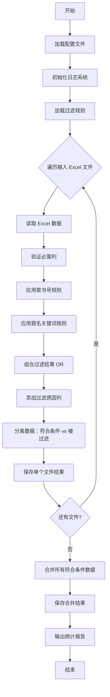
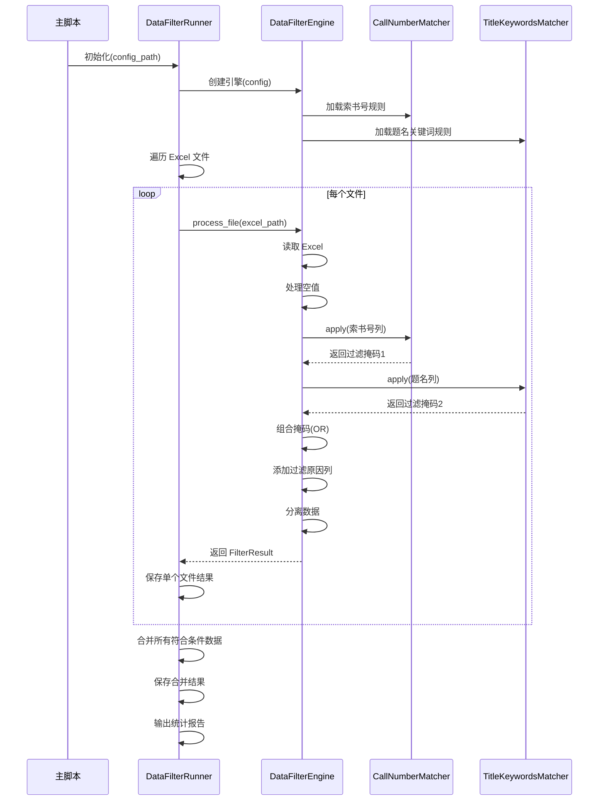
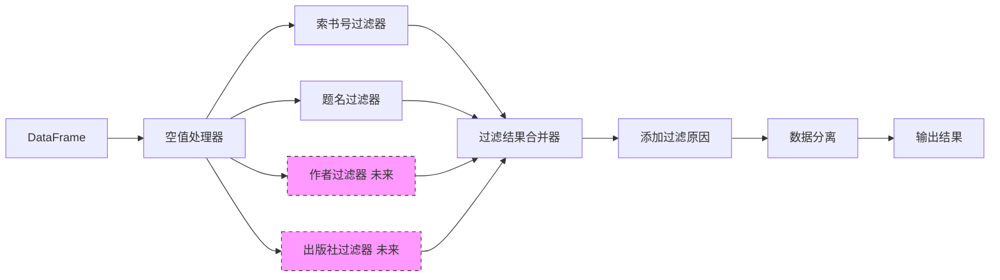

# 全量书目数据过滤脚本 设计文档

- **Status**: Proposal
- **Date**: 2025-12-13
- **Author**: AI Architect

---

## 1. 目标与背景

### 1.1 目标
开发一个独立运行的数据过滤脚本，用于批量处理图书馆书目 Excel 数据，根据配置的过滤规则（索书号、题名关键词）筛选数据，并输出符合条件和被过滤的数据集。

### 1.2 解决的问题
- **批量处理需求**：需要对多个 Excel 文件进行统一的过滤处理
- **规则复用**：复用现有的 `config/filters` 下的过滤规则配置
- **结果追溯**：需要明确标注每条数据的过滤原因
- **数据整合**：多个 Excel 的符合条件数据需要最终合并为一个总表

### 1.3 非目标
- 不集成到主程序 `main.py` 中
- 不涉及 API 调用或数据库操作
- 不进行数据清洗或转换（仅过滤）

---

## 2. 详细设计

### 2.1 模块结构

#### 新增文件
```
src/scripts/
  └── data_filter.py              # 主脚本入口（独立运行）

config/
  └── data_filter.yaml            # 独立配置文件

runtime/outputs/filtered_data/    # 输出目录（自动创建）
  ├── 数据筛选结果_20251213_160000.xlsx      # 单个文件的符合条件数据
  ├── 被过滤数据_20251213_160000.xlsx        # 单个文件的被过滤数据
  └── 合并结果_20251213_160500.xlsx          # 所有符合条件数据的合并文件
```

#### 复用模块
- `src/utils/rule_file_parser.py`：加载和应用过滤规则
- `src/utils/logger.py`：统一日志输出
- `config/filters/call_number_clc.txt`：索书号规则
- `config/filters/title_keywords.txt`：题名关键词规则

---

### 2.2 配置文件设计

**文件路径**：`config/data_filter.yaml`

```yaml
# 全量书目数据过滤配置

# 输入配置
input:
  # Excel 文件路径列表（支持绝对路径和相对路径）
  excel_files:
    - "data/books_2023.xlsx"
    - "data/books_2024.xlsx"
  
  # 必需的列名（用于验证输入文件）
  required_columns:
    - "索书号"
    - "题名"

# 过滤规则配置
filters:
  # 索书号规则文件路径
  call_number_rules: "config/filters/call_number_clc.txt"
  
  # 题名关键词规则文件路径
  title_keywords_rules: "config/filters/title_keywords.txt"
  
  # 字段映射（支持不同 Excel 的列名差异）
  field_mapping:
    call_number: "索书号"      # Excel 中的索书号列名
    title: "题名"              # Excel 中的题名列名
  
  # 空值处理策略
  null_handling:
    call_number: "filter"      # 索书号为空时：filter=过滤, keep=保留
    title: "filter"            # 题名为空时：filter=过滤, keep=保留
  
  # 过滤逻辑（OR=满足任一规则即过滤，AND=需同时满足）
  logic: "OR"

# 输出配置
output:
  # 输出目录
  output_dir: "runtime/outputs/filtered_data"
  
  # 文件名模板（支持时间戳占位符）
  filename_template:
    passed: "数据筛选结果_{timestamp}.xlsx"      # 符合条件的数据
    filtered: "被过滤数据_{timestamp}.xlsx"      # 被过滤的数据
    merged: "合并结果_{timestamp}.xlsx"          # 合并后的总表
  
  # 是否添加过滤原因列
  add_filter_reason: true
  
  # 过滤原因列名
  filter_reason_column: "过滤原因"
  
  # 是否合并所有符合条件的数据
  merge_passed_data: true
  
  # 合并时是否添加来源文件列
  add_source_file_column: true
  source_file_column: "来源文件"

# 日志配置
logging:
  # 日志级别（DEBUG, INFO, WARNING, ERROR）
  level: "INFO"
  
  # 是否输出详细统计信息
  verbose_stats: true

# 扩展配置（预留）
extensions:
  # 未来可添加其他过滤字段
  # author_filter: "config/filters/author_keywords.txt"
  # publisher_filter: "config/filters/publisher_keywords.txt"
```

---

### 2.3 核心逻辑设计

#### 2.3.1 主流程



#### 2.3.2 过滤逻辑详解

**输入**：单个 Excel 的 DataFrame

**处理步骤**：
1. **空值预处理**
   - 根据 `null_handling` 配置，将空值行标记为过滤或保留
   - 空值过滤原因：`"索书号为空"` 或 `"题名为空"`

2. **索书号规则过滤**
   - 调用 `CallNumberMatcher.apply(df['索书号'])`
   - 返回布尔掩码 `mask_call_number`（True=需过滤）
   - 记录过滤原因：`"索书号匹配排除规则: {匹配的规则}"`

3. **题名关键词过滤**
   - 调用 `TitleKeywordsMatcher.apply(df['题名'])`
   - 返回布尔掩码 `mask_title`（True=需过滤）
   - 记录过滤原因：`"题名包含排除关键词: {匹配的关键词}"`

4. **组合过滤结果**
   - OR 逻辑：`final_mask = mask_call_number | mask_title`
   - 如果同时匹配多个规则，过滤原因用分号拼接

5. **数据分离**
   - 符合条件数据：`df[~final_mask]`（未被过滤）
   - 被过滤数据：`df[final_mask]`（被过滤）

**输出**：
- `passed_df`：符合条件的 DataFrame
- `filtered_df`：被过滤的 DataFrame（包含过滤原因列）

---

### 2.4 数据结构定义

#### 2.4.1 配置类

```python
from dataclasses import dataclass
from typing import List, Dict, Literal

@dataclass
class InputConfig:
    """输入配置"""
    excel_files: List[str]
    required_columns: List[str]

@dataclass
class FilterConfig:
    """过滤规则配置"""
    call_number_rules: str
    title_keywords_rules: str
    field_mapping: Dict[str, str]
    null_handling: Dict[str, Literal["filter", "keep"]]
    logic: Literal["OR", "AND"]

@dataclass
class OutputConfig:
    """输出配置"""
    output_dir: str
    filename_template: Dict[str, str]
    add_filter_reason: bool
    filter_reason_column: str
    merge_passed_data: bool
    add_source_file_column: bool
    source_file_column: str

@dataclass
class DataFilterConfig:
    """总配置"""
    input: InputConfig
    filters: FilterConfig
    output: OutputConfig
    logging: Dict
    extensions: Dict
```

#### 2.4.2 过滤结果类

```python
@dataclass
class FilterResult:
    """单个文件的过滤结果"""
    source_file: str                    # 来源文件路径
    passed_data: pd.DataFrame           # 符合条件的数据
    filtered_data: pd.DataFrame         # 被过滤的数据
    passed_count: int                   # 符合条件数量
    filtered_count: int                 # 被过滤数量
    filter_reasons: Dict[str, int]      # 过滤原因统计 {"索书号匹配": 10, "题名关键词": 5}
```

---

### 2.5 核心类设计

#### 2.5.1 DataFilterEngine（过滤引擎）

```python
class DataFilterEngine:
    """数据过滤引擎"""
    
    def __init__(self, config: DataFilterConfig):
        """
        初始化过滤引擎
        
        Args:
            config: 配置对象
        """
        self.config = config
        self.logger = get_logger(__name__)
        
        # 加载过滤规则
        self.call_number_matcher = CallNumberMatcher(
            RuleFileParser.load_call_number_rules(config.filters.call_number_rules)
        )
        self.title_matcher = TitleKeywordsMatcher(
            RuleFileParser.load_title_keywords(config.filters.title_keywords_rules)
        )
    
    def process_file(self, excel_path: str) -> FilterResult:
        """
        处理单个 Excel 文件
        
        Args:
            excel_path: Excel 文件路径
            
        Returns:
            FilterResult 过滤结果
        """
        pass
    
    def _apply_filters(self, df: pd.DataFrame) -> tuple[pd.Series, pd.Series]:
        """
        应用过滤规则
        
        Args:
            df: 输入 DataFrame
            
        Returns:
            (filter_mask, filter_reasons) 过滤掩码和原因
        """
        pass
    
    def _handle_null_values(self, df: pd.DataFrame) -> pd.Series:
        """处理空值"""
        pass
    
    def _add_filter_reason_column(self, df: pd.DataFrame, reasons: pd.Series) -> pd.DataFrame:
        """添加过滤原因列"""
        pass
```

#### 2.5.2 DataFilterRunner（运行器）

```python
class DataFilterRunner:
    """数据过滤运行器"""
    
    def __init__(self, config_path: str):
        """
        初始化运行器
        
        Args:
            config_path: 配置文件路径
        """
        self.config = self._load_config(config_path)
        self.engine = DataFilterEngine(self.config)
        self.logger = get_logger(__name__)
    
    def run(self) -> None:
        """执行完整的过滤流程"""
        pass
    
    def _process_all_files(self) -> List[FilterResult]:
        """处理所有文件"""
        pass
    
    def _merge_results(self, results: List[FilterResult]) -> pd.DataFrame:
        """合并所有符合条件的数据"""
        pass
    
    def _save_results(self, results: List[FilterResult], merged_df: pd.DataFrame) -> None:
        """保存所有结果"""
        pass
    
    def _print_statistics(self, results: List[FilterResult]) -> None:
        """打印统计信息"""
        pass
```

---

### 2.6 可视化流程图

#### 2.6.1 过滤逻辑时序图



#### 2.6.2 扩展性设计



**扩展点设计**：
- 使用**策略模式**：每个过滤器实现统一接口 `FilterStrategy`
- 配置文件中通过 `extensions` 节点动态注册新过滤器
- 过滤器链可配置执行顺序

---

## 3. 接口定义

### 3.1 命令行接口

```bash
# 基本用法
python src/scripts/data_filter.py

# 指定配置文件
python src/scripts/data_filter.py --config config/data_filter.yaml

# 覆盖输出目录
python src/scripts/data_filter.py --output-dir runtime/outputs/custom_dir

# 仅处理指定文件（覆盖配置）
python src/scripts/data_filter.py --files data/books_2023.xlsx data/books_2024.xlsx

# 调试模式
python src/scripts/data_filter.py --log-level DEBUG
```

### 3.2 配置文件接口

参见 2.2 节的 YAML 配置示例。

### 3.3 输出文件格式

#### 符合条件数据 Excel
| 原始列1 | 原始列2 | ... | 索书号 | 题名 | ... | 来源文件（可选） |
|---------|---------|-----|--------|------|-----|------------------|
| 数据    | 数据    | ... | TP312  | Python | ... | books_2023.xlsx |

#### 被过滤数据 Excel
| 原始列1 | 原始列2 | ... | 索书号 | 题名 | ... | 过滤原因 |
|---------|---------|-----|--------|------|-----|----------|
| 数据    | 数据    | ... | I247.5 | 教辅 | ... | 题名包含排除关键词: 教辅 |
| 数据    | 数据    | ... | (空)   | 数学 | ... | 索书号为空 |

---

## 4. 错误处理

### 4.1 输入验证
| 错误场景 | 处理策略 |
|----------|----------|
| 配置文件不存在 | 抛出 `FileNotFoundError`，提示用户检查路径 |
| Excel 文件不存在 | 记录警告日志，跳过该文件，继续处理其他文件 |
| 必需列缺失 | 记录错误日志，跳过该文件 |
| 规则文件不存在 | 记录警告日志，该规则不生效 |

### 4.2 运行时错误
| 错误场景 | 处理策略 |
|----------|----------|
| Excel 读取失败（格式错误） | 捕获异常，记录错误日志，跳过该文件 |
| 内存不足（文件过大） | 建议使用分块读取（`pd.read_excel(chunksize=...)`） |
| 输出目录无写权限 | 抛出 `PermissionError`，提示用户检查权限 |

### 4.3 日志示例

```
2025-12-13 16:00:00 [INFO] 开始数据过滤任务
2025-12-13 16:00:01 [INFO] 加载配置文件: config/data_filter.yaml
2025-12-13 16:00:02 [INFO] 加载索书号规则: 高优先级排除: 5 条, 保留: 10 条, 普通排除: 20 条
2025-12-13 16:00:02 [INFO] 加载题名关键词: 15 条
2025-12-13 16:00:03 [INFO] 处理文件 1/2: data/books_2023.xlsx
2025-12-13 16:00:05 [INFO] 读取数据: 1000 行
2025-12-13 16:00:06 [INFO] 过滤结果: 符合条件 800 行, 被过滤 200 行
2025-12-13 16:00:06 [INFO] 保存结果: runtime/outputs/filtered_data/数据筛选结果_20251213_160000.xlsx
2025-12-13 16:00:07 [INFO] 处理文件 2/2: data/books_2024.xlsx
2025-12-13 16:00:09 [INFO] 读取数据: 1500 行
2025-12-13 16:00:10 [INFO] 过滤结果: 符合条件 1200 行, 被过滤 300 行
2025-12-13 16:00:11 [INFO] 合并所有符合条件数据: 2000 行
2025-12-13 16:00:12 [INFO] 保存合并结果: runtime/outputs/filtered_data/合并结果_20251213_160012.xlsx
2025-12-13 16:00:12 [INFO] 
========== 统计报告 ==========
总处理文件数: 2
总数据行数: 2500
符合条件: 2000 (80.0%)
被过滤: 500 (20.0%)

过滤原因分布:
  - 索书号匹配排除规则: 300 (60.0%)
  - 题名包含排除关键词: 150 (30.0%)
  - 索书号为空: 50 (10.0%)
==============================
```

---

## 5. 测试策略

### 5.1 单元测试

**测试文件**：`tests/test_data_filter.py`

**测试用例**：

| 测试类 | 测试方法 | 测试目标 |
|--------|----------|----------|
| `TestDataFilterEngine` | `test_apply_filters_or_logic` | 验证 OR 逻辑正确性 |
| | `test_handle_null_call_number` | 验证索书号为空时的过滤 |
| | `test_handle_null_title` | 验证题名为空时的过滤 |
| | `test_add_filter_reason_column` | 验证过滤原因列添加 |
| | `test_multiple_filter_reasons` | 验证多原因拼接 |
| `TestDataFilterRunner` | `test_merge_results` | 验证数据合并逻辑 |
| | `test_add_source_file_column` | 验证来源文件列添加 |
| | `test_missing_excel_file` | 验证文件不存在时的处理 |
| | `test_missing_required_columns` | 验证必需列缺失时的处理 |

### 5.2 集成测试

**测试场景**：
1. **正常路径**：2个 Excel 文件，包含索书号和题名列，部分数据匹配规则
2. **边界条件**：
   - 空 Excel 文件（0行数据）
   - 所有数据都被过滤
   - 所有数据都符合条件
   - 包含空值的数据
3. **异常路径**：
   - 配置文件格式错误
   - Excel 文件损坏
   - 规则文件不存在

### 5.3 测试数据

**准备测试数据**：`tests/fixtures/data_filter/`

```
tests/fixtures/data_filter/
  ├── test_books_1.xlsx          # 测试数据1（100行）
  ├── test_books_2.xlsx          # 测试数据2（50行）
  ├── test_config.yaml           # 测试配置
  ├── test_call_number.txt       # 测试索书号规则
  └── test_title_keywords.txt    # 测试题名关键词
```

---

## 6. 性能考虑

### 6.1 性能目标
- 单个 10 万行 Excel 文件处理时间 < 30 秒
- 内存占用 < 500 MB（单个文件）

### 6.2 优化策略
1. **分块读取**：对于超大文件，使用 `pd.read_excel(chunksize=10000)`
2. **向量化操作**：使用 Pandas 的向量化方法，避免 Python 循环
3. **规则编译**：预编译正则表达式（已在 `CallNumberMatcher` 中实现）
4. **并行处理**：如果需要处理大量文件，可使用 `multiprocessing` 并行处理

---

## 7. 部署与运维

### 7.1 依赖项
- Python >= 3.8
- pandas >= 1.3.0
- openpyxl >= 3.0.0（Excel 读写）
- PyYAML >= 5.4.0（配置文件解析）

### 7.2 安装步骤
```bash
# 已在 requirements.txt 中包含所需依赖
pip install -r requirements.txt
```

### 7.3 使用文档
在 `docs/全量书目数据过滤与API/` 目录下提供：
- `使用手册.md`：面向最终用户的操作指南
- `配置说明.md`：详细的配置文件参数说明

---

## 8. 未来扩展

### 8.1 短期扩展（v1.1）
- [ ] 支持 CSV 格式输入/输出
- [ ] 支持自定义过滤原因模板
- [ ] 提供 GUI 界面（基于 Tkinter）

### 8.2 中期扩展（v1.2）
- [ ] 支持作者、出版社等字段过滤
- [ ] 支持复杂的组合逻辑（如 `(索书号 AND 题名) OR 作者`）
- [ ] 提供 Web API 接口

### 8.3 长期扩展（v2.0）
- [ ] 集成机器学习模型进行智能过滤
- [ ] 支持分布式处理（处理 TB 级数据）

---

## 9. 风险与依赖

### 9.1 技术风险
| 风险 | 影响 | 缓解措施 |
|------|------|----------|
| Excel 文件格式不统一 | 列名映射失败 | 提供灵活的 `field_mapping` 配置 |
| 规则文件语法错误 | 过滤逻辑失效 | 加载时进行语法验证，记录警告日志 |
| 大文件内存溢出 | 程序崩溃 | 实现分块读取机制 |

### 9.2 外部依赖
- 依赖 `src/utils/rule_file_parser.py` 的稳定性
- 依赖 `config/filters/` 下规则文件的正确性

---

## 10. 验收标准

### 10.1 功能验收
- [ ] 能够成功处理多个 Excel 文件
- [ ] 过滤结果准确（符合 OR 逻辑）
- [ ] 输出文件包含过滤原因列
- [ ] 合并结果包含来源文件列
- [ ] 空值按配置正确处理

### 10.2 质量验收
- [ ] 单元测试覆盖率 >= 80%
- [ ] 所有测试用例通过
- [ ] 代码符合 `00_STANDARDS.md` 规范
- [ ] 日志输出清晰、完整

### 10.3 文档验收
- [ ] 设计文档完整
- [ ] 使用手册清晰易懂
- [ ] 配置文件有详细注释

---

## 附录

### A. 配置文件完整示例

参见 2.2 节。

### B. 命令行参数说明

```
usage: data_filter.py [-h] [--config CONFIG] [--output-dir OUTPUT_DIR]
                      [--files FILES [FILES ...]] [--log-level LOG_LEVEL]

全量书目数据过滤脚本

optional arguments:
  -h, --help            显示帮助信息
  --config CONFIG       配置文件路径（默认: config/data_filter.yaml）
  --output-dir OUTPUT_DIR
                        输出目录（覆盖配置文件）
  --files FILES [FILES ...]
                        输入 Excel 文件列表（覆盖配置文件）
  --log-level LOG_LEVEL
                        日志级别（DEBUG, INFO, WARNING, ERROR）
```

### C. 过滤原因代码表

| 代码 | 说明 |
|------|------|
| `NULL_CALL_NUMBER` | 索书号为空 |
| `NULL_TITLE` | 题名为空 |
| `CALL_NUMBER_HIGH_PRIORITY` | 索书号匹配高优先级排除规则 |
| `CALL_NUMBER_EXCLUDE` | 索书号匹配普通排除规则 |
| `TITLE_KEYWORD` | 题名包含排除关键词 |

---

**文档版本**: v1.0  
**最后更新**: 2025-12-13  
**审批状态**: 待审批
