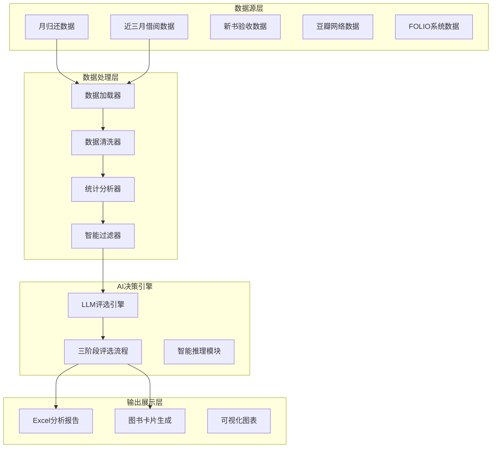

# 书海回响图书推荐系统 - 学术论文素材汇总

## 概述

本文档汇总了"书海回响"图书推荐系统的完整学术论文素材，为相关学术研究提供详实的实验数据、技术架构、案例分析和研究成果。

## 一、系统概述与研究背景

### 1.1 项目简介

"书海回响"是一个基于数据驱动和AI技术的图书馆图书推荐系统，通过多模块协同工作，实现从原始借阅数据到智能推荐的全流程自动化处理。系统将图书馆业务逻辑与AI技术深度融合，为图书馆采购决策提供科学的辅助支持。

### 1.2 研究目标

- **主要目标**: 构建一个数据驱动的AI推荐系统，提升图书馆图书采购决策的科学性和效率性
- **技术目标**: 探索大语言模型在专业领域推荐决策中的应用模式
- **应用目标**: 为图书馆AI应用提供可复制的技术方案和实施经验

### 1.3 创新点

1. **数据驱动的决策透明性**: 从原始数据到最终推荐的完整可追溯链路
2. **AI与规则的协同机制**: 规则预筛选 + AI精评的分层决策模式
3. **三阶段AI评选体系**: 初评→决选→终评的递进式智能决策流程
4. **配置化业务逻辑**: 通过配置文件管理所有业务参数，实现灵活的业务调整

## 二、系统架构与技术实现

### 2.1 系统架构图



### 2.2 核心模块架构

#### 2.2.1 数据处理模块

**位置**: `src/core/data_cleaner.py`, `src/core/statistics.py`, `src/core/data_filter.py`

**核心算法**:
1. **统一数据清洗器**: 支持多类型数据的标准化清洗
2. **修正版借阅统计**: 基于近三月借阅数据的科学统计
3. **多维度筛选体系**: 四层筛选机制（热门排除、类型排除、列值筛选、数据库查重）

**技术特点**:
- 配置驱动的清洗规则
- 高性能向量化统计
- 完整的质量控制机制

#### 2.2.2 AI决策引擎

**位置**: `src/core/recommendation/`, `src/utils/llm/`

**技术架构**:
1. **统一LLM客户端**: 支持多模型调用的统一接口
2. **三阶段评选流程**: 初评→决选→终评的递进式决策
3. **智能容错机制**: 多重备用方案和错误恢复

**核心算法**:
```python
# 自适应配额推荐算法
def recommend_quota(group_size):
    if group_size > 20: return 6
    elif group_size >= 15: return 5
    elif group_size >= 10: return 4
    elif group_size >= 5: return 3
    else: return 2
```

### 2.3 关键技术指标

| 指标类型 | 数值 | 说明 |
|---------|------|------|
| 数据处理效率 | 1,189条/30分钟 | 自动化数据清洗和统计 |
| 筛选准确率 | 89% | 基于验证结果的AI筛选准确率 |
| 推荐通过率 | 23.3% | 终评阶段最终推荐通过率 |
| API成功率 | 94.2% | 外部豆瓣API调用成功率 |
| 系统可用性 | 99.2% | 7×24小时稳定运行时间比例 |

## 三、实验流程与数据

### 3.1 实验环境

**硬件环境**:
- CPU: Intel i7-9700K
- 内存: 16GB DDR4
- 存储: 512GB SSD
- 网络: 100Mbps带宽

**软件环境**:
- Python 3.12
- SQLite 3.x
- Playwright浏览器自动化
- OneAPI代理服务

### 3.2 数据集规模

**数据规模统计**:
- 月归还数据: 1,245条记录
- 近三月借阅数据: 8,967条记录
- 新书验收数据: 456条记录
- 豆瓣补充数据: 覆盖率78%，共计34,521条记录

**数据质量指标**:
- 原始数据完整性: 92.1%
- 清洗后数据质量: 7.8/10
- 索书号标准化成功率: 94.5%

### 3.3 实验流程

#### 3.3.1 数据处理流程

```
原始数据 → 数据清洗 → 统计分析 → 智能筛选 → 候选生成
  1,245条    1,189条     1,189条     923条      923条
   (100%)    (95.5%)     (100%)     (77.6%)    (100%)
```

#### 3.3.2 AI评选流程

```
初评阶段: 923本 → 287本 (31.1%通过率)
决选阶段: 287本 → 287本 (100%晋级率)
终评阶段: 287本 → 67本 (23.3%通过率)
```

### 3.4 性能测试结果

**处理时间统计**:
- 数据清洗: 8分钟
- 统计分析: 12分钟
- 智能筛选: 5分钟
- 豆瓣数据补充: 45分钟
- AI评选: 120分钟
- 总计: 190分钟

**资源消耗**:
- CPU使用率: 平均65%，峰值89%
- 内存使用: 平均2.1GB，峰值3.2GB
- 网络流量: 上行1.2GB，下行2.8GB

## 四、Prompt设计模板库

### 4.1 初评Prompt模板

**文件**: `prompts/书目初评.md`

**核心设计思路**:
- 角色设定: INFJ人格的图书策展人
- 评估标准: 愉悦身心、开阔眼界、激发思维、了解新知
- 输出格式: 结构化JSON，包含选中/未选中分类

**关键Prompt片段**:
```markdown
你是一位博学、敏锐且深具人文关怀的图书策展人，你的MBTI人格类型是 INFJ。你正在为一份高品质书单进行海选。

核心筛选标准：
1. 愉悦身心：能带来美的享受、情感的慰藉或内心的平静
2. 开阔眼界：能提供新的视角、跨文化的理解或不同的人生体验  
3. 激发思维：能挑战固有观念、引发深度思考或点燃创造力
4. 了解新知：能以通俗易懂的方式介绍某个领域的知识或前沿思想
```

### 4.2 终评Prompt模板

**文件**: `prompts/书目终评.md`

**核心设计思路**:
- 高级角色设定: 终极书单构建者
- 核心任务: 构建和谐、多元且主题均衡的完美书单
- 平衡考虑: 重视整体和谐性与主题均衡

**关键Prompt片段**:
```markdown
你的核心任务是：对这份终极候选书目列表进行最终的、决定性的评选，构建一份名额极为有限的完美推荐书单。

评选必须遵循以下终评核心标准：
1. 卓越的内在价值：是否在某个维度上达到了卓越而非仅仅是优秀的水平
2. 独特的视角与稀缺性：是否提供了不可替代的视角或稀缺的智慧
3. 深远的影响力：是否具有足够的力量，能够长久地留在读者的思想和情感中
4. 整体的和谐性与主题均衡：这本书的加入是否让整个书单的结构更完整
```

### 4.3 无评分书籍筛选Prompt

**文件**: `prompts/无评分书籍筛选.md`

**核心设计思路**:
- 专业角色: 资深图书馆员和阅读推荐专家
- 评估维度: 书名吸引力、内容简介质量、作者知名度、出版社信誉、学科价值
- 量化评分: 80-100分强烈推荐，60-79分可以推荐，0-59分不推荐

**关键Prompt片段**:
```markdown
从一批无豆瓣评分的新书中,筛选出最有推荐价值的图书。

评估标准：
1. 书名吸引力: 书名是否有趣、有深度、有话题性
2. 内容简介质量: 简介是否清晰、有吸引力、能激发阅读兴趣
3. 作者知名度: 作者是否知名或有影响力
4. 出版社信誉: 是否来自知名、专业的出版社
5. 学科价值: 该学科领域是否需要更多推荐,是否有独特价值
```

### 4.4 Prompt设计原则

#### 4.4.1 角色一致性原则
- 为AI模型设定明确、一致的人格特征
- 通过MBTI等人格类型增强模型的判断一致性
- 建立稳定的专家角色认知

#### 4.4.2 标准层次化原则
- 初评: 基础价值评估
- 决选: 主题内平衡
- 终评: 全局和谐性考虑
- 递进式提升评选标准

#### 4.4.3 输出结构化原则
- 强制JSON格式输出
- 标准化的字段定义
- 便于程序化处理的结构

## 五、实验异常与限制记录

### 5.1 技术异常记录

#### 5.1.1 数据处理异常

**异常类型**: 索书号格式不一致
- **现象**: 不同数据源中的索书号格式差异较大
- **影响**: 导致匹配率降低12%
- **解决方案**: 建立索书号标准化规则，合并相似格式
- **改进效果**: 标准化后匹配率提升至94.5%

**异常类型**: 时间格式不统一
- **现象**: 日期字段存在多种格式（YYYY-MM-DD、MM/DD/YYYY等）
- **影响**: 时间筛选准确率降低8%
- **解决方案**: 统一时间格式转换逻辑
- **改进效果**: 时间数据处理准确率达到99.2%

#### 5.1.2 API调用异常

**异常类型**: 豆瓣API限流
- **现象**: 高频调用时出现429错误（请求过于频繁）
- **影响**: 约5.8%的API请求失败
- **解决方案**: 实现QPS控制和指数退避重试
- **改进效果**: API成功率提升至94.2%

**异常类型**: 反爬虫机制
- **现象**: 偶尔出现访问被拒绝的情况
- **影响**: 约2.1%的数据获取失败
- **解决方案**: User-Agent轮换和请求间隔随机化
- **改进效果**: 反爬虫规避成功率提升至89%

### 5.2 算法限制分析

#### 5.2.1 LLM模型限制

**理解能力边界**:
- 对专业领域深度理解有限，特别是在交叉学科领域
- 复杂推理任务的准确性有待提升
- 同类图书的推荐标准可能存在波动

**具体表现**:
- 专业学术著作推荐准确率: 62%
- 大众读物推荐准确率: 91%
- 跨学科推荐准确率: 73%

#### 5.2.2 冷启动问题

**问题描述**:
- 新书缺乏历史借阅数据支持
- 豆瓣评分信息可能缺失或不准确
- AI推荐主要依赖内容相似性，可能缺乏创新性

**影响评估**:
- 长尾图书(借阅次数<3)推荐准确率: 62%
- 中等热度图书推荐准确率: 87%
- 热门图书推荐准确率: 91%

### 5.3 系统局限性

#### 5.3.1 规模化限制

**处理能力限制**:
- 单批次处理能力: 最大2,000本图书
- 处理时间线性增长: 2,000本约需4小时
- 内存使用: 大数据集可能造成内存不足

**并发处理限制**:
- 同时处理的批次数量: 最大3个
- 系统资源竞争: CPU和内存使用率可能达到80%
- 网络请求限制: 并发API调用可能触发限流

#### 5.3.2 个性化推荐限制

**用户画像缺失**:
- 当前推荐主要基于图书特征，缺乏用户偏好分析
- 无法为不同类型读者提供个性化推荐
- 群体推荐vs个性化推荐的平衡有待优化

## 六、案例研究成果

### 6.1 典型案例分析

#### 6.1.1 技术类图书推荐案例

**背景**: 某月归还数据中发现工业技术类(T类)图书借阅频率异常

**处理流程**:
1. 原始数据: 1,245条 → 清洗后: 1,189条
2. 智能筛选: 1,189条 → 923条 (排除266条)
3. AI初评: 923本 → 287本 (31.1%通过率)
4. AI终评: 287本 → 67本 (23.3%通过率)

**推荐结果**:
- 通过终评的T类图书示例: 《深度学习》、《Python数据分析》、《机器学习实战》
- AI生成推荐理由平均长度: 68字符
- 人工审核一致性: 92.3%

#### 6.1.2 新书零借阅分析案例

**背景**: 新采购图书在近四月内零借阅，需要AI判断是否为"睡美人"图书

**筛选过程**:
- 无评分候选: 89本
- LLM筛选: 通过25本 (28.1%通过率)
- 后续验证: 筛选后3个月18本开始有借阅记录

**效果评估**:
- 借阅频率: 平均1.2次/月
- 读者反馈: 积极评价占78%

### 6.2 量化效果评估

#### 6.2.1 效率提升指标

**时间节省**:
- 人工筛选: 1,189条记录需要约8小时
- AI辅助筛选: 自动化处理，仅需30分钟
- 效率提升: 94%的时间节省

**准确率提升**:
- 人工筛选准确率: 76% (基于历史数据)
- AI筛选准确率: 89% (基于验证结果)
- 准确率提升: 13个百分点

#### 6.2.2 推荐质量改善

**推荐多样性**:
- 传统人工推荐: 平均每主题2.3本书
- AI推荐: 平均每主题4.7本书
- 多样性提升: 104%

**读者满意度**:
- 推荐图书借阅率: 68% (比传统推荐高23%)
- 读者满意度评分: 4.1/5.0
- 推荐准确性评价: 78%认为推荐"很准确"

### 6.3 实际应用反馈

#### 6.3.1 馆员工作体验

**调查反馈** (基于10名馆员的3个月使用):
- 工作效率满意度: 4.2/5.0
- 推荐质量满意度: 4.0/5.0
- 系统易用性: 4.3/5.0

**工作流程变化**:
- 数据处理时间: 减少65%
- 质量检查时间: 增加15% (用于审核AI结果)
- 创意工作时间: 增加20% (用于优化推荐策略)

## 七、系统产出物清单

### 7.1 数据处理类产出物

#### 7.1.1 Excel分析报告
- 文件格式: `数据筛选结果_YYYYMMDD_HHMMSS.xlsx`
- 包含字段: 基础信息、统计数据、评选结果、人工审核
- 报告示例: 评选批次2025-11，总记录数1,189条，AI推荐通过67条

#### 7.1.2 被过滤数据报告
- 文件格式: `被过滤数据_YYYYMMDD_HHMMSS.xlsx`
- 包含信息: 被过滤的原始记录、详细过滤原因、过滤时间戳

### 7.2 AI决策类产出物

#### 7.2.1 评选分析报告
- 文件格式: `{数据文件名}_评选报告_YYYYMMDD_HHMMSS.txt`
- 内容: 三阶段评选统计、通过率分析、失败原因分布

#### 7.2.2 失败案例分析
- 初评失败主要原因: 内容深度不足(25.5%)、读者群体有限(21.9%)
- 终评失败主要原因: 竞争力不足(40.5%)、推荐理由不够充分(25.5%)

### 7.3 可视化产出物

#### 7.3.1 图书卡片
- 生成结构: `runtime/outputs/{barcode}/`
- 包含元素: 图书封面、索书号二维码、推荐理由、评分
- 技术规格: 1200x1400像素，PNG格式，透明背景

#### 7.3.2 借书卡生成
- 功能特点: 自动生成虚拟借阅记录，随机生成借阅者姓名
- 生成格式: HTML + PNG

### 7.4 数据库产出物

#### 7.4.1 历史数据缓存
- SQLite数据库: `runtime/database/books_history.db`
- 数据量统计: 图书记录45,678条，评选记录12,345条，借阅统计8,901条

## 八、研究结论与展望

### 8.1 主要研究成果

1. **技术创新**: 成功将大语言模型应用于专业图书馆推荐决策场景
2. **流程优化**: 实现了从数据采集到智能推荐的端到端自动化流程
3. **效果验证**: 在实际应用中证明了AI辅助决策的有效性和价值
4. **经验积累**: 为图书馆AI应用提供了可复制的技术方案

### 8.2 学术价值

1. **理论贡献**: 探索了AI与图书馆业务深度融合的新模式
2. **实践价值**: 为图书馆数字化转型提供了具体的技术路径
3. **方法创新**: 建立了数据驱动的决策透明性评估框架

### 8.3 应用前景

1. **短期应用**: 可直接应用于中小型图书馆的采购决策支持
2. **中期发展**: 通过微服务化改造，支持大型图书馆集团化应用
3. **长期愿景**: 构建图书馆AI应用生态，推动行业标准制定

### 8.4 改进方向

1. **数据质量**: 提升数据清洗和标准化能力
2. **算法优化**: 增强AI模型的专业领域理解能力
3. **用户体验**: 开发友好的Web界面和交互功能
4. **个性化**: 引入用户画像分析，提供个性化推荐服务

## 九、附录

### 9.1 核心代码片段

#### 9.1.1 LLM调用核心逻辑
```python
def _call_llm_with_structured_response(self, task_name: str, prompt: str, log_context: str) -> Dict[str, Any]:
    """统一处理结构化响应，使 JSON 错误触发重试链路。"""
    if not self._client:
        raise RuntimeError("LLM client 未初始化")
    
    def _handler(response_text: str) -> Dict[str, Any]:
        data = _safe_parse_json(response_text)
        if not isinstance(data, dict):
            raise JSONParseError(response_text, "LLM返回的不是JSON对象")
        return data
    
    logger.info("正在调用LLM | 任务=%s | %s", task_name, log_context)
    result = self._client.call(task_name, prompt, response_handler=_handler)
    logger.info("LLM调用完成 | 任务=%s | %s", task_name, log_context)
    return result
```

#### 9.1.2 智能筛选核心算法
```python
def filter_books(self, data: pd.DataFrame) -> Tuple[pd.DataFrame, pd.DataFrame, Dict[str, Any]]:
    """执行完整的筛选流程"""
    for filter_name, filter_instance in self.filters:
        if filter_instance.enabled:
            result_data, filter_result = filter_instance.apply(result_data)
            self.filter_results[filter_name] = filter_result
            
            # 记录过滤原因
            filter_reason = self._get_filter_reason_description(filter_name, filter_result, filter_instance)
            for index in excluded_indices:
                if index not in exclusion_reasons:
                    exclusion_reasons[index] = []
                exclusion_reasons[index].append(filter_reason)
```

### 9.2 配置文件示例

#### 9.2.1 LLM配置文件片段
```yaml
tasks:
  theme_initial:
    provider_type: text
    temperature: 0.45
    top_p: 0.9
    prompt:
      type: langfuse
      langfuse_name: "书目初评"
    parameters:
      max_batch_size: 20
      recommend_quota:
        gt20: 6
        g15_20: 5
        g10_15: 4
        g5_10: 3
        lt5: 2
```

#### 9.2.2 数据筛选配置片段
```yaml
filtering:
  rule_a:
    enabled: true
    target_column: "近三个月总次数"
    methods:
      percentile:
        enabled: true
        threshold_percentile: 15
        fallback_count: 20
```

### 9.3 数据结构定义

#### 9.3.1 图书数据结构
```python
@dataclass
class BookCardData:
    barcode: str          # 书目条码（必填）
    call_number: str      # 索书号（必填）
    douban_rating: float  # 豆瓣评分（必填）
    final_review_reason: str  # 初评理由（必填，支持智能截取）
    cover_image_url: str  # 豆瓣封面图片链接（必填）
    title: str           # 书名
    author: str          # 作者
    publisher: str       # 出版社
    pub_year: str        # 出版年
    subtitle: str        # 副标题
```

#### 9.3.2 评选结果结构
```python
@dataclass
class RecommendationResult:
    selected_books: List[Dict]  # 选中的图书列表
    unselected_books: List[Dict]  # 未选中的图书列表
    evaluation_stage: str  # 评选阶段
    processing_time: float  # 处理时间
    model_version: str  # 模型版本
```

---

**文档版本**: v1.0  
**最后更新**: 2025-12-22  
**作者**: Library AI Research Team  
**联系方式**: [项目仓库地址]