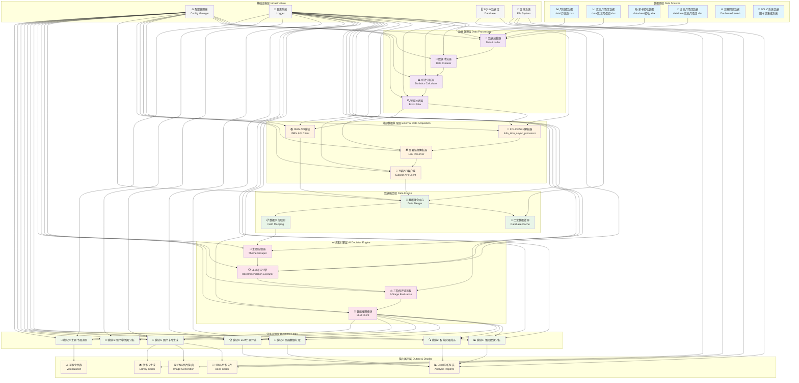
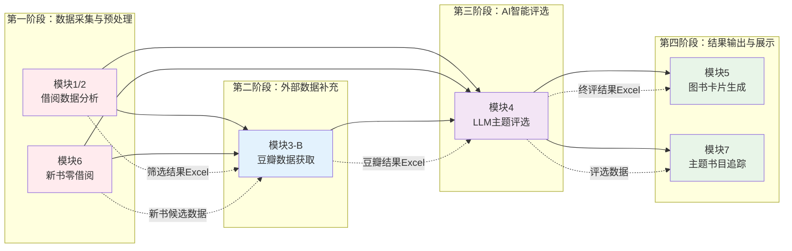
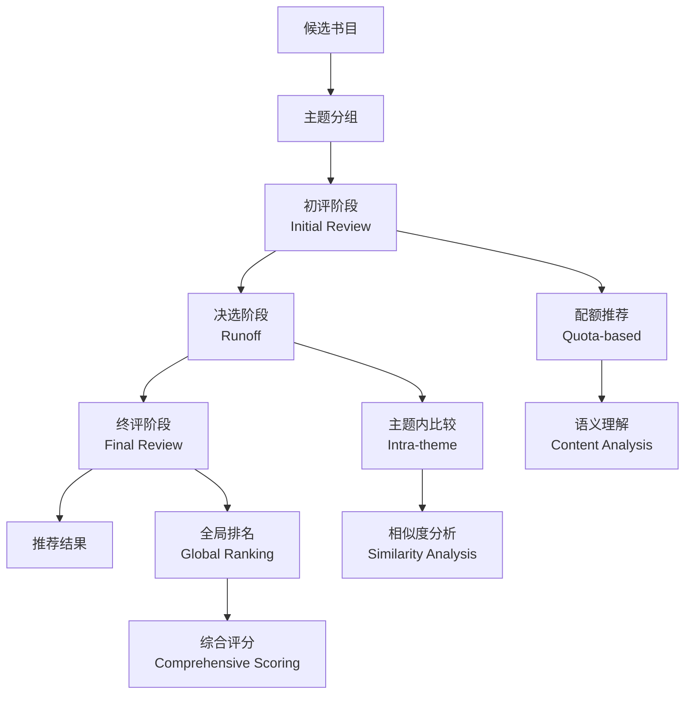

# 书海回响图书推荐系统 - 系统架构分析报告

## 系统概述

"书海回响"是一个基于数据驱动和AI技术的图书馆图书推荐系统，通过多模块协同工作，实现从原始借阅数据到智能推荐的全流程自动化处理。

## 核心系统架构流程图



## 模块间依赖关系图



## AI介入点详细分析

### 1. LLM评选引擎 (核心AI模块)

**位置**: `src/core/recommendation/executor.py`

**功能**: 基于大语言模型的书籍智能评选系统

**技术实现**:
- **模型**: qwen3-max (主) / gpt-4.1 (备)
- **调用方式**: 结构化JSON响应
- **错误处理**: 指数退避重试机制
- **Mock模式**: 离线测试支持

**评选流程**:


### 2. 无评分书籍筛选模块

**位置**: `src/core/new_sleeping/rating_filter.py`

**功能**: 对没有豆瓣评分的书籍进行LLM智能筛选

**技术实现**:
- **触发条件**: 无评分候选数 > 80
- **批次处理**: 每批20本书，通过5本
- **三层过滤**: 预筛选 → LLM筛选 → 后处理

### 3. 主题书目分析模块

**位置**: `src/core/subject_bibliography/article_analyzer.py`

**功能**: 对网络文章进行主题分析和质量评估

**技术实现**:
- **数据源**: RSS订阅 + 网页抓取
- **分析维度**: 主题相关性、内容质量、时效性
- **输出**: 结构化分析报告

## 数据流处理链路分析

### 1. 借阅数据处理链路

```
Excel原始数据 → 数据清洗 → 统计分析 → 智能筛选 → 候选书目
```

**关键处理点**:
- **数据清洗**: 去除无效记录、统一字段格式
- **统计分析**: 计算近三个月借阅次数、借阅人数
- **智能筛选**: 多维度过滤规则（热门度、关键词、分类等）

### 2. 豆瓣数据补充链路

```
ISBN解析 → 链接搜索 → API调用 → 数据融合 → 质量评估
```

**关键技术**:
- **反爬策略**: 随机延迟、User-Agent轮换、批次冷却
- **容错机制**: 多重备用方案、进度保存、增量更新
- **数据质量**: 字段完整性验证、评分阈值过滤

### 3. LLM评选处理链路

```
主题分组 → 批次划分 → 模型调用 → 结果解析 → 质量检查 → 输出
```

**性能优化**:
- **批次控制**: 自适应批次大小，平衡效率与准确性
- **并发处理**: 多主题并行执行，提高处理速度
- **错误恢复**: 失败重试机制，确保数据完整性

## 系统创新点分析

### 1. 数据驱动的决策机制

- **多源数据融合**: 内部借阅数据 + 外部评价数据
- **动态阈值调整**: 根据数据分布自适应调整筛选标准
- **历史数据利用**: 建立查重机制，避免重复推荐

### 2. AI技术的创新应用

- **分层评选策略**: 初评→决选→终评的多层次筛选
- **语义理解能力**: 基于内容理解的智能推荐
- **人机协同模式**: AI初筛 + 人工审核的混合模式

### 3. 工程实践的优化

- **模块化设计**: 高内聚、低耦合的模块架构
- **配置化管理**: 通过配置文件控制所有业务逻辑
- **可观测性**: 完善的日志系统和进度跟踪

## 技术架构特点

### 优势
1. **可扩展性**: 模块化设计便于功能扩展
2. **可维护性**: 配置化管理降低维护成本
3. **可靠性**: 多重容错机制确保系统稳定
4. **灵活性**: 支持多种运行模式和参数调优

### 局限性
1. **依赖外部API**: 豆瓣服务稳定性影响系统可用性
2. **计算资源消耗**: LLM调用产生一定的API成本
3. **数据质量依赖**: 原始数据质量直接影响推荐效果
4. **冷启动问题**: 新书缺乏历史数据支持推荐

## 总结

"书海回响"系统通过数据驱动和AI技术的深度融合，实现了一个完整的图书馆智能推荐解决方案。系统架构设计合理，模块职责清晰，AI介入点恰当，是一个具有实际应用价值的学术研究原型。