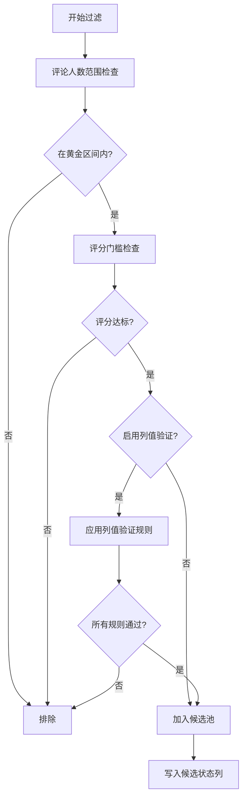

# 豆瓣数据过滤 - 列值验证功能演示

## 功能概述

为豆瓣数据动态阈值过滤系统新增了**列值验证规则**,可以在评分和评论人数过滤的基础上,额外检查Excel列值是否满足要求,从而更精准地筛选候选图书。

## 实现的功能

### 1. 配置驱动的验证规则

在 `config/setting.yaml` 中新增 `column_filters` 配置节,支持:

- ✅ **总开关**: 可一键启用/禁用所有列值验证
- ✅ **多规则支持**: 可配置多个独立的验证规则
- ✅ **两种验证类型**:
  - `not_empty`: 非空验证,排除空值、`None`、`NaN` 和空字符串
  - `regex`: 正则表达式验证,灵活匹配列值格式
- ✅ **独立启用控制**: 每个规则可单独启用/禁用

### 2. 代码实现

修改了以下文件:

#### [setting.yaml](file:///f:/Github/Library-AI-demos/book-echoes/config/setting.yaml)

在 `douban.analytics.theme_rating` 下新增配置:

```yaml
column_filters:
  enabled: true  # 总开关
  rules:
    # 规则1: 豆瓣封面图片链接必须有值
    - name: "豆瓣封面图片验证"
      enabled: true
      column: "豆瓣封面图片链接"
      filter_type: "not_empty"
      description: "排除没有封面图片的图书"
    
    # 规则2: 豆瓣内容简介必须有值
    - name: "豆瓣内容简介验证"
      enabled: true
      column: "豆瓣内容简介"
      filter_type: "not_empty"
      description: "排除没有内容简介的图书"
```

#### [dynamic_threshold_filter.py](file:///f:/Github/Library-AI-demos/book-echoes/src/core/douban/analytics/dynamic_threshold_filter.py)

**修改点**:
1. 更新 `DEFAULT_FILTERING_CONFIG`,添加 `column_filters` 默认配置
2. `__init__` 方法新增 `source_df` 参数,用于保存原始DataFrame引用
3. `analyze` 方法中集成列值验证,在候选筛选时调用 `_apply_column_filters`
4. 新增三个辅助方法:
   - `_apply_column_filters(index)`: 应用所有列值验证规则
   - `_check_not_empty(value)`: 检查值是否非空
   - `_check_regex(value, pattern)`: 检查值是否匹配正则表达式

#### [douban_rating_pipeline.py](file:///f:/Github/Library-AI-demos/book-echoes/src/core/douban/pipelines/douban_rating_pipeline.py)

在 `_apply_dynamic_filter` 方法中,调用 `analyze` 前设置原始DataFrame引用:

```python
# 设置原始DataFrame引用,用于列值验证
self.dynamic_filter._source_df = context.df

result = self.dynamic_filter.analyze(dataset_full)
```

#### [theme_rating_analyzer_logic.md](file:///f:/Github/Library-AI-demos/book-echoes/src/core/douban/analytics/theme_rating_analyzer_logic.md)

更新了逻辑说明文档,补充列值验证规则的说明。

---

## 使用示例

### 场景1: 过滤缺少封面图片或内容简介的图书

**配置** (默认已启用):

```yaml
column_filters:
  enabled: true
  rules:
    - name: "豆瓣封面图片验证"
      enabled: true
      column: "豆瓣封面图片链接"
      filter_type: "not_empty"
    - name: "豆瓣内容简介验证"
      enabled: true
      column: "豆瓣内容简介"
      filter_type: "not_empty"
```

**效果**: 
- 即使图书的评分和评论人数满足条件,如果缺少封面图片或内容简介,也会被排除出候选池
- `候选状态` 列不会标记为"候选"

### 场景2: 使用正则表达式验证ISBN格式

**配置**:

```yaml
column_filters:
  enabled: true
  rules:
    - name: "ISBN格式验证"
      enabled: true
      column: "豆瓣ISBN"
      filter_type: "regex"
      pattern: "^\\d{10}(\\d{3})?$"  # ISBN-10或ISBN-13格式
      description: "验证ISBN格式是否正确"
```

**效果**:
- 只有ISBN格式正确的图书才会进入候选池
- 支持 ISBN-10 (10位数字) 和 ISBN-13 (13位数字)

### 场景3: 临时禁用列值验证

如果想临时禁用所有列值验证,只需修改总开关:

```yaml
column_filters:
  enabled: false  # 禁用所有列值验证
  rules:
    # ... 规则配置保持不变
```

---

## 过滤逻辑流程



---

## 验证建议

### 1. 配置加载测试

运行以下代码验证配置正确加载:

```python
from src.core.douban.analytics.dynamic_threshold_filter import DynamicThresholdFilter

filter = DynamicThresholdFilter()
print("列值验证配置:", filter.config.get('column_filters'))
```

### 2. 功能测试

创建测试数据,验证过滤逻辑:

```python
import pandas as pd

# 创建测试数据
test_data = pd.DataFrame({
    '豆瓣评分': [8.5, 8.6, 8.7],
    '豆瓣评价人数': [1000, 1100, 1200],
    '豆瓣封面图片链接': ['http://example.com/1.jpg', '', 'http://example.com/3.jpg'],
    '豆瓣内容简介': ['简介1', '简介2', ''],
    '索书号': ['I247.5/123', 'I247.5/124', 'I247.5/125']
})

# 应用过滤
filter._source_df = test_data
# ... 运行过滤逻辑
```

**预期结果**:
- 第1条记录: ✅ 通过(有封面和简介)
- 第2条记录: ❌ 被过滤(缺少封面)
- 第3条记录: ❌ 被过滤(缺少简介)

### 3. 实际数据测试

在实际Excel文件上运行豆瓣评分流水线,检查:
- `候选状态` 列的标记是否正确
- 生成的主题评分报告中候选数量是否符合预期
- 日志中是否有列值验证相关的信息

---

## 配置参数说明

| 参数 | 类型 | 必填 | 说明 |
|------|------|------|------|
| `enabled` | boolean | 是 | 总开关,控制是否启用列值验证 |
| `rules` | array | 是 | 验证规则列表 |
| `rules[].name` | string | 是 | 规则名称,用于日志和调试 |
| `rules[].enabled` | boolean | 是 | 是否启用此规则 |
| `rules[].column` | string | 是 | 要验证的列名(需与Excel列名一致) |
| `rules[].filter_type` | string | 是 | 验证类型: `not_empty` 或 `regex` |
| `rules[].pattern` | string | 否 | 正则表达式(仅当 `filter_type` 为 `regex` 时需要) |
| `rules[].description` | string | 否 | 规则描述,用于文档说明 |

---

## 注意事项

1. **列名匹配**: `column` 参数必须与 `fields_mapping.douban` 中定义的列名完全一致
2. **正则表达式**: 使用 `regex` 类型时,注意YAML中的转义字符(使用 `\\` 而不是 `\`)
3. **性能影响**: 列值验证会对每条候选记录进行检查,大数据集可能有轻微性能影响
4. **规则顺序**: 规则按配置顺序执行,任一规则不通过即被过滤

---

## 总结

本次实现为豆瓣数据过滤系统添加了灵活的列值验证功能,可以:

✅ 通过配置文件轻松添加/修改验证规则  
✅ 支持非空验证和正则表达式验证两种类型  
✅ 每个规则可独立启用/禁用  
✅ 与现有的评分/评论人数过滤逻辑无缝集成  
✅ 完整的文档和配置注释

默认配置已启用豆瓣封面图片和内容简介的非空验证,可根据实际需求调整。
