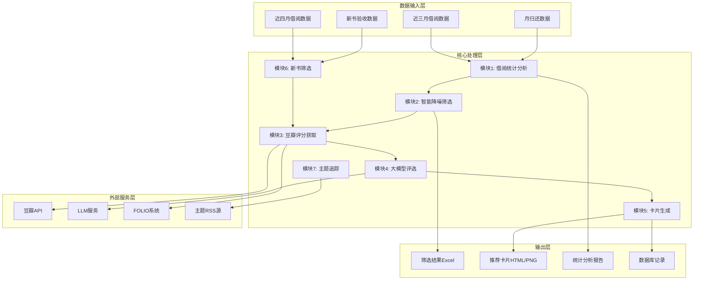
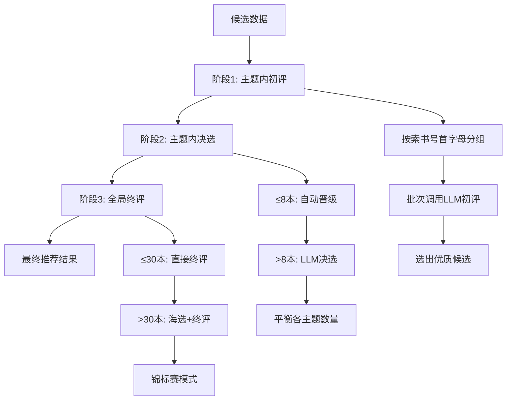
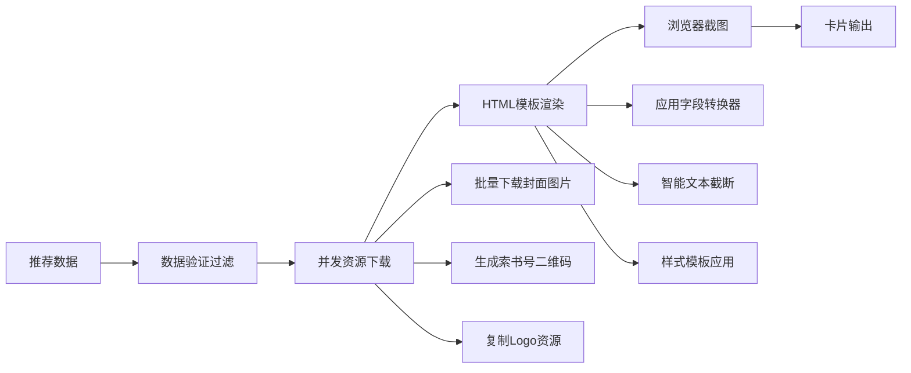

# 书海回响 - 图书推荐系统代码分析总结报告

## 项目概述

"书海回响"是一个智能图书推荐系统，专门为图书馆设计，用于分析借阅数据、发现优质图书并生成个性化推荐卡片。系统采用模块化架构，支持多种数据源和评选模式，是一个完整的端到端图书推荐解决方案。

### 项目定位
- **目标用户**：图书馆管理员、图书采购人员
- **核心功能**：借阅数据分析、智能筛选、豆瓣评分获取、大模型评选、推荐卡片生成
- **技术特色**：AI驱动的多阶段评选流程、可视化推荐输出

## 系统架构分析

### 整体架构设计



### 核心模块架构

#### 1. 数据处理层 (Data Processing Layer)
```
src/core/
├── data_loader.py      # 数据加载器 - 支持多格式Excel文件
├── data_cleaner.py     # 统一数据清洗器 - 标准化索书号、时间格式
├── statistics.py       # 借阅统计分析 - 近三个月借阅统计
└── data_filter.py      # 智能筛选引擎 - 多规则动态过滤
```

#### 2. 业务逻辑层 (Business Logic Layer)
```
src/core/
├── douban/            # 豆瓣模块 - ISBN获取、评分爬取
├── recommendation/    # 大模型评选 - 三阶段智能评选
├── card_generator/    # 卡片生成 - HTML转PNG、并发处理
├── new_sleeping/      # 新书模块 - 零借阅筛选
└── subject_bibliography/ # 主题追踪 - RSS解析、LLM评估
```

#### 3. 基础设施层 (Infrastructure Layer)
```
src/
├── utils/             # 通用工具 - 配置、日志、LLM客户端
└── filters/           # 筛选器注册表 - 可扩展的筛选规则
```

## 数据流程分析

### 主流程数据流


### 模块间数据传递

#### 数据传递格式
```python
# 标准数据格式
DataFrame {
    "书目条码": str,      # 唯一标识
    "索书号": str,        # 分类编号
    "书名": str,          # 图书标题
    "豆瓣评分": float,    # 豆瓣评分
    "近三个月总次数": int, # 借阅统计
    "初评结果": str,      # LLM评选结果
    "终评结果": str       # 最终推荐结果
}
```

#### 文件命名规范
- 筛选结果：`数据筛选结果_YYYYMMDD_HHMMSS.xlsx`
- 豆瓣结果：`数据筛选结果_YYYYMMDD_HHMMSS_豆瓣结果_YYYYMMDD_HHMMSS.xlsx`
- 被过滤数据：`被过滤数据_YYYYMMDD_HHMMSS.xlsx`

## 各模块详细分析

### 模块1: 借阅统计分析模块

**功能定位**: 基于近三月借阅数据，计算月归还数据的借阅统计信息

**核心逻辑**:
```python
def calculate_borrowing_statistics_from_borrowing_data(
    monthly_return_data: pd.DataFrame,    # 月归还数据
    borrowing_data: pd.DataFrame,         # 近三月借阅数据
) -> pd.DataFrame:
    # 1. 时间范围计算 (近三个月)
    # 2. 按索书号分组统计借阅次数
    # 3. 计算借阅人数 (唯一用户数)
    # 4. 映射回月归还数据
```

**技术创新**:
- 修正了原版本使用月归还数据而非借阅数据进行统计的错误
- 支持清理后索书号的智能匹配
- 优化的借阅人数统计算法 (使用groupby替代逐行搜索)

**输出字段**:
- `近三个月总次数`: 总借阅次数
- `第一个月借阅次数`: 第一月借阅次数
- `第二个月借阅次数`: 第二月借阅次数  
- `第三个月借阅次数`: 第三月借阅次数
- `借阅人数`: 唯一借阅用户数

### 模块2: 智能降噪筛选模块

**功能定位**: 多层次数据过滤，去除低质量、热门和无关图书

**筛选规则架构**:
```python
class BookFilterFinal:
    def __init__(self):
        self.filters = [
            ('hot_books', HotBooksFilter),      # 规则A: 热门书排除
            ('title_keywords', TitleFilter),    # 规则B: 题名关键词
            ('call_number', CallNumberFilter),  # 规则B: 索书号模式
            ('column_value', ColumnFilter),     # 规则C: 列值验证
            ('db_duplicate', DuplicateFilter)   # 规则D: 数据库查重
        ]
```

**筛选策略**:
1. **规则A - 热门书排除**: 基于分位数的动态阈值 (默认排除前15%)
2. **规则B - 内容过滤**: 
   - 题名关键词匹配 (支持contains/starts_with/regex)
   - 索书号/CLC号模式匹配 (支持正则表达式)
3. **规则C - 数据质量**: 
   - 附加信息格式校验 (9位数字)
   - 备注关键词排除
4. **规则D - 业务查重**: 查询已推荐数据库，避免重复推荐

**智能特性**:
- 配置驱动的动态筛选器创建
- 智能过滤原因生成和追踪
- 并行筛选执行，提高性能

### 模块3: 豆瓣评分获取模块

**功能定位**: 从FOLIO系统和豆瓣获取图书的ISBN、评分、简介等信息

**流水线架构**:


**核心组件**:
1. **FOLIO ISBN处理器**: 异步浏览器自动化，高并发ISBN查询
2. **豆瓣链接解析器**: 智能匹配图书页面，处理搜索结果
3. **豆瓣API客户端**: 移动版API调用，评分信息获取
4. **数据库管理器**: SQLite缓存，历史查重，增量更新

**性能优化**:
- 异步并发处理 (可配置并发数)
- 智能重试机制 (指数退避)
- 进度保存和断点续传
- 数据库缓存避免重复爬取

**配置管理**:
```yaml
douban:
  isbn_processor:
    strategy: "auto"  # auto/custom/preset
    max_concurrent: 3 # 并发浏览器数
    min_delay: 1.5    # 最小延迟
    retry_times: 3    # 重试次数
```

### 模块4: 大模型评选模块

**功能定位**: 基于LLM的三阶段智能评选，生成高质量推荐

**三阶段评选流程**:


**LLM任务配置**:
```yaml
tasks:
  theme_initial:    # 初评任务
    temperature: 0.45
    batch_size: 20
    recommend_quota: # 动态配额
      gt20: 6
      g15_20: 5
      g10_15: 4
  
  theme_runoff:     # 决选任务
    temperature: 0.40
    finalist_quota: 8
  
  theme_final:      # 终评任务
    temperature: 0.35
    top_n: 20
```

**智能特性**:
- 动态批次大小调整 (根据数据量自动优化)
- 配额自适应算法 (确保各主题平衡)
- 锦标赛模式处理大数据量 (海选→终评)
- 兜底重试机制 (处理LLM调用失败)

### 模块5: 图书卡片生成模块

**功能定位**: 将推荐结果转换为精美的HTML/PNG推荐卡片

**生成流程**:


**技术亮点**:
1. **并发处理**: ThreadPoolExecutor并行处理，多浏览器实例隔离
2. **资源管理**: 智能文件检查，避免重复下载和生成
3. **模板系统**: 多种HTML模板支持，可配置的字段转换器
4. **质量控制**: 多层数据验证，确保输出质量

**输出规格**:
- HTML文件: 可编辑的推荐卡片模板
- PNG图片: 高分辨率推荐卡片图片 (1200x1400, 2x缩放)
- 借书卡: 复古风格图书馆借书卡 (可选功能)

### 模块6: 新书零借阅筛选模块

**功能定位**: 识别近期验收但零借阅的"睡美人"图书

**筛选逻辑**:
```python
def filter_zero_borrowing_books(
    new_books_data: pd.DataFrame,    # 新书验收数据
    borrowing_data: pd.DataFrame     # 近四月借阅数据
) -> Tuple[pd.DataFrame, pd.DataFrame, dict]:
    # 1. 匹配新书与借阅记录
    # 2. 识别零借阅图书
    # 3. 应用常规过滤规则
    # 4. 生成筛选报告
```

**特殊处理**:
- 新书专用过滤规则 (更宽松的评分阈值)
- 无评分书籍LLM智能筛选 (三层判断逻辑)
- 出版年过滤 (优先推荐当年新书)

### 模块7: 主题书目每日追踪模块

**功能定位**: 自动抓取主题相关的网络文章，生成书目推荐

**三阶段处理**:
1. **RSS获取**: 多源RSS订阅，定时抓取新文章
2. **全文解析**: 智能内容提取，支持多家媒体平台
3. **LLM评估**: 文章质量评估，书目推荐生成

## 技术特点与创新

### 1. 模块化架构设计
- **高内聚低耦合**: 各模块职责清晰，接口标准化
- **配置驱动**: 通过YAML配置文件控制业务逻辑
- **可扩展性**: 新模块可通过注册机制无缝接入

### 2. 智能数据处理
- **自适应阈值**: 基于数据分布动态调整筛选参数
- **并发优化**: 多层次并发处理，提高系统吞吐量
- **容错机制**: 全链路的重试和降级策略

### 3. AI驱动评选
- **多阶段评选**: 初评→决选→终评，确保推荐质量
- **上下文感知**: LLM调用包含历史评选理由
- **公平性保障**: 主题平衡算法，避免分类偏向

### 4. 可视化输出
- **多格式输出**: Excel、HTML、PNG、PDF多种格式
- **并发生成**: 批量卡片生成，支持大工作量
- **模板系统**: 可配置的显示模板和样式

### 5. 企业级特性
- **进度保存**: 长时间任务的断点续传
- **日志监控**: 详细的执行日志和性能统计
- **错误恢复**: 智能重试和手动恢复机制

## 输入输出处理逻辑

### 数据输入规范

#### Excel文件格式要求
```python
# 月归还数据
required_columns = [
    '索书号',           # 索书号/分类号
    '类型/册数',        # 图书类型 (筛选中文图书)
    '提交时间',         # 归还时间
    '书目条码',         # 唯一标识
    '附加信息',         # 9位数字格式
    '备注'              # 排除关键词
]

# 近三月借阅数据  
required_columns = [
    '索书号',           # 索书号
    '提交时间',         # 借阅时间
    '读者卡号'          # 用户标识 (可选)
]
```

#### 配置参数验证
```python
def validate_config():
    # 路径配置验证
    # 数据源文件存在性检查
    # API密钥和权限验证
    # LLM服务可用性测试
```

### 数据输出规范

#### 筛选结果Excel格式
```python
output_columns = [
    '评选批次',         # YYYY-MM格式
    '数据来源',         # 月归还借阅/新书零借阅
    '书目条码',         # 原始标识
    '索书号',           # 分类信息
    '书名',            # 图书标题
    '豆瓣评分',        # 评分数据
    '近三个月总次数',   # 借阅统计
    '初评结果',        # LLM初评
    '初评理由',        # 推荐理由
    '终评结果',        # 最终结果
    '人工评选'         # 人工确认
]
```

#### 性能输出指标
```python
performance_metrics = {
    "处理数据量": "原始记录数",
    "筛选保留率": "保留记录数/原始记录数", 
    "豆瓣成功率": "成功获取评分数/总记录数",
    "LLM评选效率": "平均评选时间/批次",
    "卡片生成速度": "生成卡片数/小时"
}
```

## 部署和运维

### 环境依赖
```txt
Python 3.8+
pandas >= 1.5.0
playwright >= 1.30.0  # 浏览器自动化
openpyxl >= 3.0.0     # Excel处理
PyYAML >= 6.0         # 配置文件
sqlite3               # 数据缓存
```

### 目录结构
```
book-echoes/
├── config/           # 配置文件
│   ├── setting.yaml  # 主配置
│   ├── llm.yaml      # LLM配置
│   └── filters/      # 过滤规则
├── data/             # 输入数据
├── runtime/          # 运行时文件
│   ├── outputs/      # 输出结果
│   ├── logs/         # 日志文件
│   └── database/     # SQLite缓存
├── src/              # 源代码
└── docs/             # 文档说明
```

### 运行模式
```bash
# 单模块运行
python main.py          # 交互式菜单
python main.py 1        # 模块1: 借阅分析
python main.py 4        # 模块4: 大模型评选

# 命令行模式
python src/core/douban/douban_main.py isbn --excel-file data.xlsx
python src/core/card_generator/card_main.py --excel-file results.xlsx
```

## 项目亮点总结

### 1. 业务价值
- **提高选书效率**: 自动化筛选减少人工工作量
- **提升推荐质量**: AI驱动的多阶段评选确保推荐精准度
- **增强用户体验**: 可视化推荐卡片提升读者参与度
- **数据驱动决策**: 详细的统计分析支持采购决策

### 2. 技术创新
- **异步处理架构**: 高并发数据处理能力
- **智能评选算法**: LLM+规则的多层次评选机制
- **可视化生成**: HTML模板+浏览器截图的高质量输出
- **容错设计**: 全链路的错误处理和恢复机制

### 3. 可维护性
- **配置化管理**: 业务逻辑参数化，易于调整
- **模块化设计**: 清晰的模块边界和接口规范
- **详细文档**: 完整的代码注释和使用说明
- **监控日志**: 全方位的执行监控和错误追踪

### 4. 扩展性
- **插件化筛选器**: 新筛选规则可快速接入
- **多数据源支持**: 易于扩展新的数据源
- **模板系统**: 可配置的输出格式和样式
- **API集成**: 标准化的外部服务集成接口

## 改进建议

### 1. 性能优化
- **数据库优化**: 升级到PostgreSQL，提升大数据量处理能力
- **缓存机制**: 引入Redis缓存热点数据
- **分布式处理**: 支持多机器并行处理

### 2. 功能增强
- **实时监控**: Web界面监控任务执行状态
- **API服务**: 提供RESTful API供外部系统调用
- **移动端支持**: 生成移动端友好的推荐展示

### 3. 用户体验
- **可视化配置**: Web界面配置参数，降低使用门槛
- **批量操作**: 支持批量文件处理和结果导出
- **模板定制**: 更丰富的卡片模板和样式选择

### 4. 数据质量
- **数据验证**: 增强输入数据的格式验证和清洗
- **质量监控**: 数据质量指标监控和预警
- **版本管理**: 数据版本控制和回滚机制

## 结论

"书海回响"项目是一个设计精良的图书推荐系统，具有以下核心优势：

1. **架构清晰**: 模块化设计，职责分离，接口规范
2. **技术先进**: 融合AI、异步处理、并发优化等现代技术
3. **功能完整**: 覆盖数据处理、智能评选、可视化输出全流程
4. **易于维护**: 配置化管理，详细文档，良好的扩展性

该系统为图书馆提供了一个高效、智能、可视化的图书推荐解决方案，能够显著提升选书效率和推荐质量，具有很强的实用价值和推广意义。

---

**报告生成时间**: 2025-12-22  
**分析范围**: 完整项目代码库  
**文档版本**: v1.0
