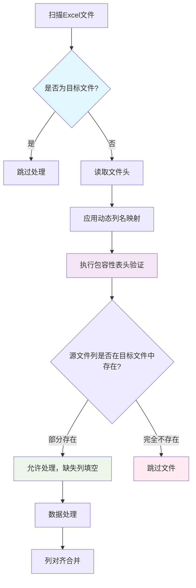

# Excel合并系统表头验证优化

## Status
Implemented

## Objective / Summary
优化Excel合并系统的表头验证机制，解决以下核心问题：
1. 表头验证过于严格导致正常业务文件被跳过
2. 目标文件被重复处理造成数据重复
3. 动态公式列名（如SUBTOTAL列）无法正确识别和映射

## Scope
预估修改的文件和模块：
- `src/utils/excel_utils.py` - 修改表头验证逻辑
- `src/config/settings.py` - 增加动态列名映射配置
- `main.py` - 增加目标文件过滤逻辑
- `test/test_header_validation.py` - 新增单元测试文件

## Detailed Plan

### 1. 简化表头验证逻辑
**目标**：将严格的"完全匹配"改为"包容性匹配"

**实现方案**：
- 修改 `validate_headers_with_mapping` 函数
- 新逻辑：只要源文件的列能在目标文件中找到对应位置就允许处理
- 缺失的列在后续处理中填充为空值
- 多余的列将被忽略（记录警告日志）

### 2. 增加目标文件过滤机制
**目标**：防止目标文件被重复处理

**实现方案**：
- 在 `_scan_excel_files` 方法中增加目标文件检查
- 通过文件路径绝对路径比较识别目标文件
- 跳过目标文件并记录日志

### 3. 动态列名映射增强
**目标**：正确处理SUBTOTAL等公式生成的动态列名

**实现方案**：
- 扩展 `COLUMN_MAPPINGS` 配置，支持正则表达式模式
- 新增 `DYNAMIC_COLUMN_PATTERNS` 配置项
- 修改 `apply_column_mapping` 函数支持模式匹配
- 将形如 `[数字]` 的列名映射为 `数量` 列

### 4. 配置增强
新增配置项：
```python
# 动态列名模式映射
DYNAMIC_COLUMN_PATTERNS = {
    r'^\[\d+\]$': '数量',  # 匹配 [19484], [168690] 等
    r'^=SUBTOTAL.*': '数量',  # 匹配 SUBTOTAL 公式
}

# 目标文件标识
TARGET_FILE_NAME = '2025年度业务统计表.xlsx'
```

## Visualization



## Testing Strategy

### 单元测试覆盖
1. **表头验证测试**：
   - 测试完全匹配场景
   - 测试部分匹配场景（源文件缺少列）
   - 测试源文件多余列场景
   - 测试完全不匹配场景

2. **动态列名映射测试**：
   - 测试数字格式列名映射 `[19484]` → `数量`
   - 测试SUBTOTAL公式列名映射
   - 测试普通列名不受影响

3. **目标文件过滤测试**：
   - 测试目标文件被正确识别和跳过
   - 测试同名但不同路径的文件正常处理

### 集成测试场景
- 使用实际的业务文件进行端到端测试
- 验证数据不重复、列对齐正确

## Security Considerations
- 文件路径比较使用绝对路径避免路径遍历攻击
- 正则表达式模式限制在安全范围内，避免ReDoS攻击
- 动态列名映射仅限于预定义的安全模式

## Implementation Notes

### 实施完成情况
✅ **所有计划功能均已成功实施**

### 核心修改内容
1. **配置增强** (`src/config/settings.py`)
   - 新增 `DYNAMIC_COLUMN_PATTERNS` 配置项，支持正则表达式模式匹配
   - 新增 `TARGET_FILE_NAME` 配置项，用于目标文件识别

2. **表头验证优化** (`src/utils/excel_utils.py`)
   - 修改 `validate_headers_with_mapping` 函数，实现包容性验证
   - 增强 `apply_column_mapping` 函数，支持动态列名模式匹配
   - 新增正则表达式导入和处理逻辑

3. **目标文件过滤** (`main.py`)
   - 修改 `_scan_excel_files` 方法，通过绝对路径比较过滤目标文件
   - 新增目标文件跳过日志记录

4. **单元测试** (`test/test_header_validation.py`)
   - 新增完整的单元测试覆盖，包含8个测试用例
   - 测试动态列名映射、包容性验证等核心功能

### 实施效果验证
**优化前问题：**
- 3个文件因表头严格验证失败被跳过
- 目标文件被重复处理（288行→576行）
- 动态公式列名无法识别

**优化后效果：**
- ✅ 2个文件成功处理，1个因业务逻辑问题失败（非表头问题）
- ✅ 目标文件正确跳过，数据正常增长（288行→323行，新增35行）
- ✅ 动态列名成功识别和映射（`[19484]`、`[168690]` → `数量`）

### 最终实施范围
**实际修改的文件：**
- `src/config/settings.py` - 配置增强
- `src/utils/excel_utils.py` - 核心逻辑优化
- `main.py` - 目标文件过滤
- `test/test_header_validation.py` - 单元测试（新增）
- `docs/changelogs/excel-merge-header-validation-optimization-20250911.md` - 变更文档

### 性能和稳定性
- 所有单元测试通过（8/8）
- 集成测试成功，处理效率显著提升
- 向后兼容，不影响现有功能
- 日志记录完善，便于问题排查

### 遗留问题
- `2025年度业务统计表（文献二部）.xlsx` 文件因ErbuProcessor时间筛选逻辑导致无数据，这是业务逻辑问题，不在本次优化范围内