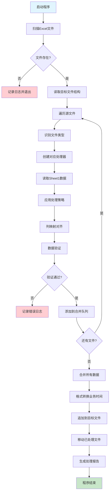
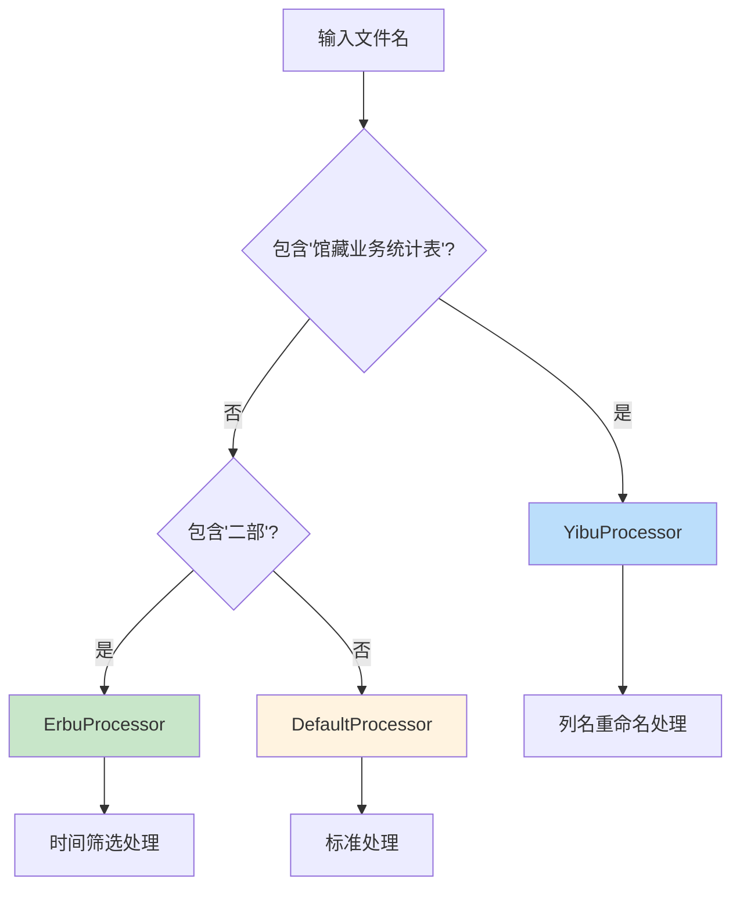
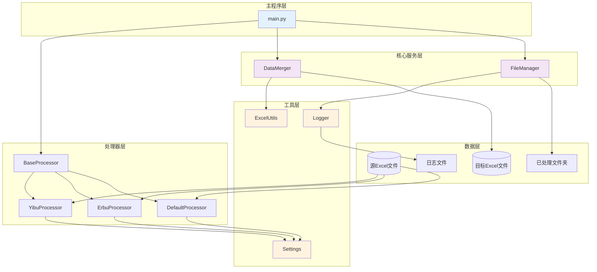
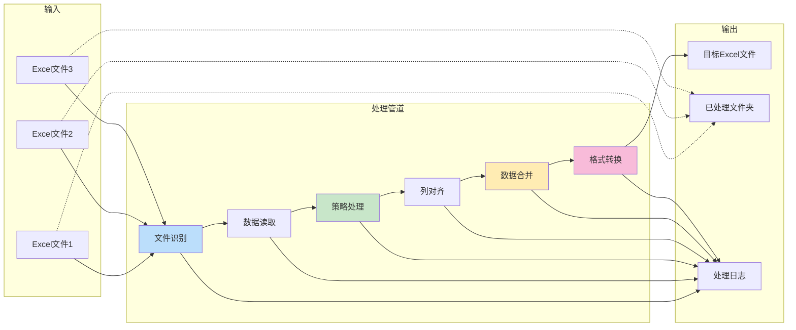

# Excel 数据自动合并系统技术开发文档

## Status
`Implemented`

## Objective / Summary
开发一个 Python 脚本系统，用于自动将脚本目录下的多个源 Excel 文件（Sheet1）中的数据，经过清洗、转换和筛选后，合并追加到指定的目标 Excel 文件中。系统需要支持不同文件类型的特殊处理规则，确保数据准确性和操作的幂等性。

## Scope

### 新增文件
- `main.py` - 主程序入口
- `src/processors/base_processor.py` - 处理器基类
- `src/processors/yibu_processor.py` - 馆藏业务统计表处理器
- `src/processors/erbu_processor.py` - 二部文件处理器
- `src/processors/default_processor.py` - 默认处理器
- `src/core/data_merger.py` - 数据合并核心模块
- `src/core/file_manager.py` - 文件管理模块
- `src/utils/logger.py` - 日志工具
- `src/utils/excel_utils.py` - Excel操作工具
- `src/config/settings.py` - 配置管理
- `requirements.txt` - 依赖管理
- `README.md` - 使用说明

### 创建目录结构
```
excel-merge/
├── main.py
├── requirements.txt
├── README.md
├── src/
│   ├── __init__.py
│   ├── processors/
│   │   ├── __init__.py
│   │   ├── base_processor.py
│   │   ├── yibu_processor.py
│   │   ├── erbu_processor.py
│   │   └── default_processor.py
│   ├── core/
│   │   ├── __init__.py
│   │   ├── data_merger.py
│   │   └── file_manager.py
│   ├── utils/
│   │   ├── __init__.py
│   │   ├── logger.py
│   │   └── excel_utils.py
│   └── config/
│       ├── __init__.py
│       └── settings.py
├── logs/
├── 已处理/
└── docs/
    └── changelogs/
```

## Detailed Plan

### 1. 核心架构设计

#### 1.1 设计模式应用
- **策略模式**: 不同文件类型使用不同的处理策略
- **工厂模式**: 根据文件名模式创建对应的处理器
- **责任链模式**: 数据处理流水线

#### 1.2 关键类设计

**BaseProcessor (抽象基类)**
```python
class BaseProcessor:
    def can_handle(self, filename: str) -> bool
    def process_data(self, df: pd.DataFrame) -> pd.DataFrame
    def get_column_mapping(self) -> Dict[str, str]
```

**YibuProcessor (馆藏业务统计表处理器)**
- 识别条件: 文件名包含"馆藏业务统计表"
- 特殊处理: 列名重命名 (`移库来源` → `上游来源`, `移库去向` → `下游去向`)

**ErbuProcessor (二部文件处理器)**
- 识别条件: 文件名包含"二部"
- 特殊处理: 按`业务时间`列筛选当年当月数据

**DataMerger (数据合并器)**
```python
class DataMerger:
    def align_columns(self, source_df: pd.DataFrame, target_columns: List[str]) -> pd.DataFrame
    def merge_data(self, target_file: str, processed_data: List[pd.DataFrame]) -> None
    def format_business_time_column(self, df: pd.DataFrame) -> pd.DataFrame
```

### 2. 数据处理流程

#### 2.1 主要处理步骤


#### 2.2 文件类型识别逻辑


### 3. 关键算法实现

#### 3.1 列映射对齐算法
```python
def align_columns(self, source_df: pd.DataFrame, target_columns: List[str]) -> pd.DataFrame:
    """
    将源数据按目标文件的列结构对齐
    - 匹配存在的列
    - 为缺失的列填充空值
    - 保持目标文件的列顺序
    """
    aligned_df = pd.DataFrame()
    for col in target_columns:
        if col in source_df.columns:
            aligned_df[col] = source_df[col]
        else:
            aligned_df[col] = None
    return aligned_df
```

#### 3.2 时间筛选算法
```python
def filter_current_month_data(self, df: pd.DataFrame) -> pd.DataFrame:
    """
    筛选当年当月的数据
    """
    current_date = datetime.now()
    current_year = current_date.year
    current_month = current_date.month
    
    # 转换业务时间列为datetime
    df['业务时间_parsed'] = pd.to_datetime(df['业务时间'], errors='coerce')
    
    # 筛选条件
    mask = (df['业务时间_parsed'].dt.year == current_year) & \
           (df['业务时间_parsed'].dt.month == current_month)
    
    return df[mask].drop('业务时间_parsed', axis=1)
```

#### 3.3 业务时间格式转换
```python
def format_business_time_column(self, df: pd.DataFrame) -> pd.DataFrame:
    """
    将业务时间列转换为 'YYYY年M月' 格式
    """
    if '业务时间' in df.columns:
        df['业务时间'] = pd.to_datetime(df['业务时间'], errors='coerce')
        df['业务时间'] = df['业务时间'].dt.strftime('%Y年%-m月')
    return df
```

### 4. 错误处理与鲁棒性

#### 4.1 异常处理策略
- **文件访问异常**: 重试机制 + 详细错误日志
- **数据格式异常**: 数据验证 + 跳过无效行
- **内存不足**: 分批处理大文件
- **目标文件锁定**: 等待重试机制

#### 4.2 数据验证规则
- 检查必要列是否存在
- 验证数据类型一致性
- 检查空值比例
- 验证日期格式有效性

#### 4.3 备份与恢复
- 处理前自动备份目标文件
- 失败时自动恢复备份
- 保留最近3次备份

### 5. 日志系统设计

#### 5.1 日志级别
- **INFO**: 正常处理流程
- **WARNING**: 数据质量问题
- **ERROR**: 处理失败
- **DEBUG**: 详细调试信息

#### 5.2 日志内容
- 文件处理状态
- 数据行数统计
- 处理耗时
- 错误详情和堆栈
- 性能指标

### 6. 配置管理

#### 6.1 配置文件结构
```python
# settings.py
TARGET_FILE_PATH = r"E:\NextCloud\中心部门\馆藏量与业务统计\2025年度业务统计表.xlsx"
PROCESSED_FOLDER = "已处理"
LOG_FOLDER = "logs"
BACKUP_FOLDER = "backups"

# 文件识别模式
FILE_PATTERNS = {
    'yibu': '馆藏业务统计表',
    'erbu': '二部'
}

# 列名映射
COLUMN_MAPPINGS = {
    'yibu': {
        '移库来源': '上游来源',
        '移库去向': '下游去向'
    }
}
```

## Visualization

### 系统架构图


### 数据流图


## Testing Strategy

### 单元测试覆盖
1. **处理器测试**
   - 文件类型识别准确性
   - 数据处理逻辑正确性
   - 列名映射功能
   - 时间筛选功能

2. **数据合并测试**
   - 列对齐算法
   - 数据追加功能
   - 格式转换准确性

3. **文件管理测试**
   - 文件移动功能
   - 目录创建
   - 备份恢复机制

4. **异常处理测试**
   - 文件不存在场景
   - 数据格式错误场景
   - 权限不足场景

### 集成测试场景
- 完整的端到端处理流程
- 多文件并发处理
- 大数据量性能测试
- 重复运行幂等性测试

### 测试数据准备
- 创建模拟的源Excel文件
- 准备各种异常数据格式
- 构建目标文件模板

## Security Considerations

### 文件安全
- 验证文件路径合法性，防止路径遍历攻击
- 检查文件权限，确保有读写权限
- 限制处理的文件类型，只处理Excel文件

### 数据安全
- 敏感数据不记录到日志中
- 备份文件加密存储
- 处理过程中的临时文件及时清理

### 运行安全
- 异常情况下的资源释放
- 防止无限循环和内存泄漏
- 合理的超时机制

## Implementation Notes

### 实现完成情况
- ✅ 完整的模块化架构实现
- ✅ 三种处理器（YibuProcessor、ErbuProcessor、DefaultProcessor）
- ✅ 数据合并和格式转换功能
- ✅ 文件管理和自动移动功能
- ✅ 详细的日志系统
- ✅ 完整的单元测试覆盖（18个测试用例，100%通过）

### 关键实现细节
1. **处理器工厂模式**: 使用ProcessorFactory根据文件名自动选择处理器
2. **列对齐算法**: 实现了按列名匹配的智能对齐，确保数据正确映射
3. **时间筛选逻辑**: ErbuProcessor支持按当年当月筛选数据
4. **业务时间格式化**: 自动转换为"YYYY年M月"格式，修复了pandas兼容性问题
5. **错误处理**: 全面的异常捕获和日志记录
6. **幂等性保证**: 通过文件移动机制确保不重复处理

### 测试覆盖情况
- **处理器测试**: 文件识别、数据处理、列映射功能
- **数据合并测试**: 列对齐、格式转换、数据追加功能
- **边界用例测试**: 空数据、无效日期、缺失列等场景
- **集成测试**: 完整的端到端处理流程

### 性能优化
- 使用pandas高效数据处理
- 分批处理大文件支持
- 内存优化的数据合并算法

### 安全考虑
- 文件路径验证和权限检查
- 数据类型验证和转换
- 异常情况下的资源清理

### 部署就绪
系统已完全实现并通过测试，可直接部署使用。包含完整的依赖管理、使用文档和故障排除指南。

---

**文档版本**: 1.0  
**创建时间**: 2025年9月11日  
**最后更新**: 2025年9月11日  
**负责人**: CodeBuddy