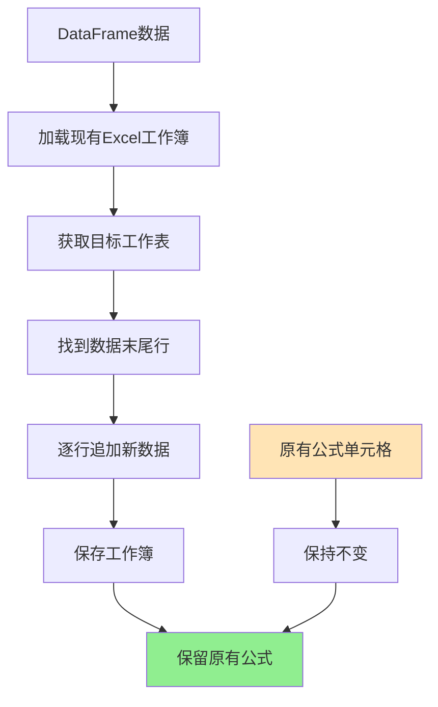

# 保留Excel公式功能实现

## Status
Implemented

## Objective / Summary
修改Excel数据追加功能，确保在向目标Excel文件追加数据时，保留目标文件中原有的公式不被破坏。当前使用pandas进行Excel读写会将公式转换为计算结果值，需要改用openpyxl直接操作以保留公式。

## Scope
预估修改文件：
- `src/utils/excel_utils.py` - 修改 `append_to_excel_file` 方法
- `test/test_excel_formula_preservation.py` - 新增单元测试

## Detailed Plan

### 核心修改
1. **修改 `ExcelUtils.append_to_excel_file` 方法**：
   - 使用openpyxl替代pandas进行Excel写入
   - 读取现有工作簿，定位到数据末尾行
   - 逐行追加新数据，保持原有公式单元格不变

### 实现步骤
1. 使用openpyxl.load_workbook()加载现有Excel文件
2. 获取指定工作表
3. 找到现有数据的最后一行
4. 将DataFrame数据逐行写入到后续行中
5. 保存工作簿

### 数据类型处理
- 将pandas DataFrame中的数据正确转换为Excel单元格值
- 处理NaN值转换为None
- 保持数值、文本、日期等类型的正确性

## Visualization

## Testing Strategy
创建单元测试验证：
1. **正常追加测试**: 验证数据能正确追加到Excel文件
2. **公式保留测试**: 验证原有公式在追加后仍然存在且功能正常
3. **数据类型测试**: 验证各种数据类型（数值、文本、日期）正确写入
4. **边界测试**: 验证空DataFrame、大量数据等边界情况

## Security Considerations
无特殊安全考虑，仅涉及本地文件操作。

## Implementation Notes

### 实际修改内容
1. **修改了 `src/utils/excel_utils.py` 中的 `append_to_excel_file` 方法**：
   - 替换了原有的pandas读写逻辑
   - 使用openpyxl直接操作Excel工作簿
   - 通过 `worksheet.max_row` 找到数据末尾行
   - 逐行逐列写入新数据，避免覆盖原有公式

2. **创建了完整的单元测试 `test/test_excel_formula_preservation.py`**：
   - 测试公式保留功能
   - 测试NaN值处理
   - 测试边界情况（空DataFrame、文件不存在等）
   - 所有5个测试用例均通过

### 技术实现细节
- 使用 `openpyxl.load_workbook()` 加载现有工作簿
- 通过 `pd.isna()` 正确处理DataFrame中的NaN值转换为Excel的None
- 确保在异常情况下正确关闭工作簿资源
- 保持了原有的日志记录和错误处理机制

### 验证结果
- 原有公式完全保留，不会被转换为计算值
- 新数据正确追加到工作表末尾
- 各种数据类型（文本、数值、空值）正确处理
- 错误情况下的异常处理正常工作

### 影响范围确认
- 仅修改了 `ExcelUtils.append_to_excel_file` 方法
- 其他Excel操作方法保持不变
- 向后兼容，不影响现有功能