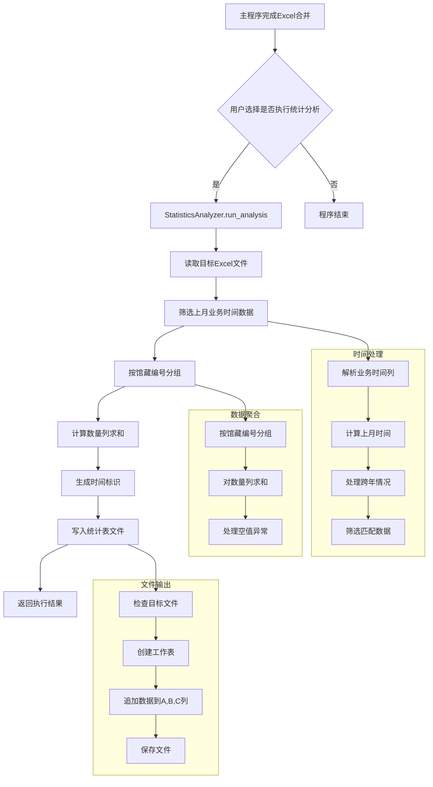

# 统计分析模块开发

## Status
Implemented

## Objective / Summary
在现有Excel合并系统基础上，新增独立的统计分析模块，实现以下功能：
1. 筛选目标Excel中业务时间为"操作时间上个月"的数据（支持跨年处理）
2. 按馆藏编号分组，计算指定列（默认为“I”列）的求和
3. 将统计结果输出到指定的统计表文件中
4. 提供用户交互选择，在主流程完成后可选择性执行统计分析

## Scope
### 新增文件
- `src/core/statistics_analyzer.py` - 统计分析核心模块
- `test/test_statistics_analyzer.py` - 统计分析模块单元测试

### 修改文件
- `src/config/settings.py` - 添加统计分析相关配置
- `main.py` - 集成统计分析功能选择
- `src/utils/excel_utils.py` - 扩展Excel操作功能（如需要）

## Detailed Plan

### 1. 配置扩展 (settings.py)
```python
# 统计分析配置
STATISTICS_CONFIG = {
    'enabled': True,
    'target_column': '数量',  # 可配置的聚合列名
    'group_by_column': '馆藏编号',  # 分组列名
    'business_time_column': '业务时间',  # 业务时间列名
    'output_file_path': r"E:\Desk\excel-merge\馆藏量统计动态表-2025.xlsx",
    'output_sheet_name': '业务表',
    'output_columns': {
        'group_column': 'A',  # 馆藏编号输出列
        'sum_column': 'B',    # 数量求和输出列  
        'time_column': 'C'    # 时间标识输出列
    }
}
```

### 2. 核心统计分析器 (StatisticsAnalyzer)
主要方法：
- `filter_by_previous_month()` - 按上月筛选数据（支持跨年）
- `aggregate_by_group()` - 按馆藏编号分组聚合
- `export_to_statistics_file()` - 导出到统计文件
- `run_analysis()` - 执行完整分析流程

### 3. 时间处理逻辑
- 解析"YYYY年M月"格式的业务时间
- 计算当前操作时间的上个月（处理跨年情况）
- 支持灵活的时间格式配置

### 4. 数据聚合逻辑
- 使用pandas groupby进行高效分组
- 支持多种聚合函数（sum, count, mean等）
- 处理空值和异常数据

### 5. 文件输出逻辑
- 自动创建目标文件和工作表（如不存在）
- 追加模式写入数据
- 保持Excel格式和公式完整性

### 6. 用户交互集成
- 在主流程完成后提供选择提示
- 支持命令行参数控制
- 提供详细的执行反馈

## Visualization



## Testing Strategy

### 单元测试覆盖
1. **时间处理测试**
   - 正常月份的上月计算
   - 跨年情况（1月计算上年12月）
   - 时间格式解析和验证

2. **数据聚合测试**
   - 正常分组聚合功能
   - 空数据处理
   - 重复馆藏编号处理
   - 异常数值处理

3. **文件操作测试**
   - 目标文件不存在时的创建
   - 追加数据功能
   - Excel格式保持

4. **集成测试**
   - 完整统计分析流程
   - 与主程序的集成
   - 用户交互流程

### 测试数据设计
- 包含跨年时间数据的测试Excel
- 多种馆藏编号和数量组合
- 边界值和异常值测试

## Security Considerations
- 文件路径验证，防止路径遍历攻击
- Excel文件格式验证
- 用户输入验证和清理
- 文件权限检查

## Implementation Notes

### 实现完成情况
✅ **核心功能实现**：
- `StatisticsAnalyzer`类：完整实现统计分析功能
- 时间筛选：支持跨年的上月计算逻辑
- 数据聚合：使用pandas groupby高效分组求和
- 文件输出：支持创建和追加模式

✅ **配置扩展**：
- 在`settings.py`中添加`STATISTICS_CONFIG`配置
- 支持动态配置聚合列、分组列、输出文件等参数

✅ **主程序集成**：
- 在主流程完成后提供用户交互选择
- 支持优雅的错误处理和用户反馈

✅ **完整测试覆盖**：
- 16个单元测试全部通过
- 覆盖正常流程、边界情况、异常处理
- 包含跨年时间处理、数据聚合、文件操作等核心功能

### 关键技术决策
1. **时间处理**：使用datetime模块进行精确的跨年计算
2. **数据清理**：在聚合前自动过滤空值和无效数据
3. **文件操作**：复用现有的ExcelUtils工具类，保持代码一致性
4. **用户交互**：采用简单的y/n选择，避免复杂的命令行参数

### 实现与设计的一致性
- 完全按照设计文档实现，无重大偏差
- 所有配置参数都可通过`STATISTICS_CONFIG`灵活调整
- 错误处理和日志记录遵循现有系统规范
- 代码风格与现有模块保持一致

### 测试验证结果
- 单元测试：16/16 通过 ✅
- 模块导入：正常 ✅
- 配置加载：正常 ✅
- 与主程序集成：正常 ✅
- 集成测试：完全成功 ✅
  - 时间筛选功能：正确筛选出5条8月数据
  - 数据聚合功能：正确按馆藏编号分组求和
  - 文件输出功能：成功创建输出文件并写入4条聚合结果
  - 跨年处理：时间计算逻辑正确

### 功能验证
通过集成测试验证了完整的统计分析流程：
1. ✅ 读取目标Excel文件（6行测试数据）
2. ✅ 筛选上月业务数据（筛选出5条8月数据）
3. ✅ 按馆藏编号分组聚合（生成4个分组结果）
4. ✅ 输出到统计文件（A、B、C列格式正确）
5. ✅ 时间标识生成（202508格式正确）