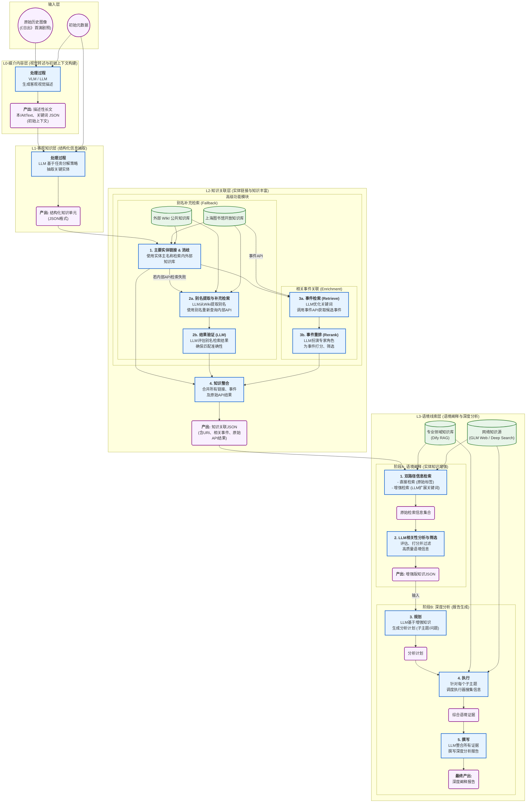

# 历史图像多维深度描述框架

## 1. 关于项目

本项目是一个先进的自动化工具，旨在利用多层级的人工智能（AI）技术，为历史图像生成丰富、多维度的深度描述信息。框架通过一个分层的处理流水线（L0-L3），将简单的图像和元数据，转化为包含结构化知识、关联实体和深度分析的丰富数据集。

该工具旨在帮助图书馆、档案馆、博物馆等机构高效地深化其数字馆藏的描述维度，极大地提升馆藏数据的知识密度、可发现性和研究价值。

## 2. 系统架构

本框架采用分层架构，每一层在前一层的基础上进行深化处理，逐级提升信息的价值密度。

### L0 - 媒介内容层 (Image Description)

*   **功能**：作为流水线的起点，本层接收一张图像作为输入，利用视觉语言模型（VLM）生成基础的文本描述。
*   **主要输出**：
    *   **长描述 (Long Description)**：一份对图像内容客观、详尽的文本描述。
    *   **替换文本 (Alt Text)**：一份用于网页无障碍访问的简洁描述。
    *   **关键词 (Keywords)**：一组概括图像核心内容的关键词（JSON 格式）。

### L1 - 客观知识层 (Structured Extraction)

*   **功能**：本层将 L0 生成的非结构化文本与原始元数据（如题名）相结合，利用大语言模型（LLM）从中抽取出结构化的、机器可读的知识实体。
*   **主要输出**：
    *   **结构化信息JSON**：一个包含核心实体（如剧名、人物、时间、地点、团体）的 JSON 对象。

### L2 - 知识关联层 (Knowledge Linking)

*   **功能**：本层是连接文本实体与权威知识库的桥梁。它接收 L1 提取的实体，通过调用外部知识库（如 Wikidata, Wikipedia）和内部 API（如上图开放数据），对实体进行链接和消歧。为了提升关联的准确性和深度，L2 包含了两个高级功能模块：

    *   **别名补充检索 (Alias Search)**：这是一个智能的补充检索机制。当使用实体的主要名称在内部 API 中找不到理想结果时，此功能会被触发。它首先利用大模型（LLM）从该实体的 Wikipedia 描述中自动提取各种可能的别名（如简称、旧称、外文名等），然后依次使用这些别名重新进行 API 检索。最后，再次利用 LLM 对别名检索出的结果进行相关性验证，确保匹配的准确性，从而显著提高实体的关联成功率。

    *   **相关事件关联 (Related Event Search)**：此功能旨在为核心实体（特别是人物、组织和作品）关联相关的历史事件，极大地丰富了实体的上下文。它采用一个“检索-重排”工作流：首先，利用 LLM 将实体名称优化为更适合检索的关键词；然后，使用关键词调用事件 API 获取一批候选事件；最后，再次动用 LLM 扮演“事件分析专家”，对所有候选事件进行深度分析和相关性打分，筛选出最相关的几个事件并附上置信度。

*   **主要输出**：
    *   **知识关联JSON**：在 L1 的 JSON 基础上，为每个实体增加了指向权威知识库的唯一标识符（URI）、关联到的相关事件，并保留了所有 API 的原始返回结果以供追溯。

### L3 - 语境阐释层 (Context Interpretation & Deep Analysis)

*   **功能**：作为流水线的最高层，本层在前序阶段生成的结构化和关联化数据的基础上，通过一个两阶段过程进行深度的语境分析和知识挖掘，最终产出综合性的分析报告。

*   **阶段 A: 语境阐释 (Context Interpretation)**
    此阶段的核心目标是围绕 L2 输出的每个知识实体，搜集并关联丰富的上下文信息。它采用双路径检索策略，以确保信息的广度和深度：
    *   **直接检索 (Direct Retrieval)**：使用实体原始标签，直接在专业知识库（通过 RAG）和 Web 上进行一轮基础信息检索。
    *   **增强检索 (Enhanced Retrieval)**：首先，利用大语言模型（LLM）对原始实体标签进行分析、改写和扩展，生成更优化的检索关键词；然后，使用这些增强后的关键词执行第二轮更深入的 RAG 和 Web 检索。
    *   **相关性分析 (Relevance Analysis)**：将上述两轮检索获得的所有信息交由 LLM进行相关性评估和打分。只有高于预设阈值的高质量、高相关性信息才会被筛选出来，并写回知识关联 JSON 文件中，完成对实体的“增强”。

*   **阶段 B: 深度分析 (Deep Analysis)**
    此阶段是知识的综合与升华。它利用阶段 A 生成的增强版知识 JSON，执行一个“规划-执行-报告”的复杂工作流：
    *   **规划 (Planning)**：基于实体及其丰富的上下文信息，由 LLM 规划出一系列有待深入研究的子主题和问题。
    *   **执行 (Execution)**：针对规划好的每个问题，调度不同的执行器（如 `GLM` Web Search, `Dify` RAG）分头搜集信息。
    *   **撰写 (Reporting)**：最后，整合所有检索到的信息，由 LLM 撰写一份结构清晰、内容详实的综合性分析报告（Markdown 格式）。

## 3. 安装与配置

### 步骤 1: 克隆代码库

```bash
git clone <your-repository-url>
cd historical-image-deep-description
```

### 步骤 2: 安装依赖

确保您已安装 Python (推荐 3.8+)。然后运行以下命令安装所有必需的库：

```bash
pip install -r requirements.txt
```
*注意：L2 模块可能需要额外的库，如 `langchain-community` 和 `wikipedia-api`。如果遇到相关错误，请手动安装。*

### 步骤 3: 设置API密钥

1.  将项目根目录下的 `.env.example` 文件复制一份，并重命名为 `.env`。
2.  用文本编辑器打开 `.env` 文件，填入您自己的 API 密钥。这些密钥用于驱动 AI 模型和访问各种数据服务。

```ini
# .env
ZHIPUAI_API_KEY="您的智谱AI API Key"
SHL_API_KEY="您的上海图书馆API Key"
DIFY_ENTITY_RETRIEVAL_KEY="您的Dify RAG任务Key"
# ... 其他需要的密钥
```

### 步骤 4: 准备数据和配置

1.  **图片**: 将需要处理的图片文件放入 `pics` 文件夹。
2.  **元数据**: 将包含元数据的 Excel 文件命名为 `metadata.xlsx` 并放置在项目根目录。确保其中有“编号”列，且值与图片文件名（不含后缀）对应。
3.  **修改配置**: 打开 `config/settings.yaml` 文件，检查并修改以下核心配置，确保与您的文件和需求匹配：
    *   `data.paths`: 图片和 Excel 文件的路径。
    *   `data.excel.columns`: **极其重要**，用于映射程序内部字段名与您 Excel 文件中的实际列标题。

## 4. 使用方法

所有操作都在项目根目录下通过命令行执行。

### 4.1. 运行完整流水线 (推荐)

如果您想一站式完成从 L0 到 L3 的所有处理，只需运行：

```bash
python main.py
```
程序将自动按 L0 → L1 → L2 → L3 的顺序处理所有数据。

### 4.2. 分步执行或运行特定任务

您可以通过 `--tasks` 参数精确控制要执行的任务，多个任务用逗号分隔。

**示例：**

```bash
# 仅执行 L0 的长描述和关键词任务
python main.py --tasks long_description,keywords

# 仅执行 L1 结构化抽取
python main.py --tasks l1

# 仅执行 L2 知识关联
python main.py --tasks l2

# 执行 L3 的增强RAG检索和Web搜索
python main.py --tasks rag+,web
```

### 4.3. 执行 L3 深度分析 (Deep Analysis)

`deep_analysis` 是一个特殊的 L3 任务，通常针对单个数据条目进行，需要通过 `--row-id` 指定目标编号。

**常用指令：**

```bash
# 对编号为 "2202_001" 的条目执行完整的深度分析（规划、执行、报告）
python main.py --tasks deep_all --row-id 2202_001

# 也可以分阶段执行
# 1. 仅生成规划文件 (_deep.json)
python main.py --tasks deep_planning --row-id 2202_001

# 2. 执行规划中的所有检索任务 (GLM + Dify)
python main.py --tasks deep_glm,deep_dify --row-id 2202_001

# 3. 最后，根据检索结果生成报告 (_deep.md)
python main.py --tasks deep_report --row-id 2202_001
```

*   `--limit <number>`：可以配合任何指令，用于限制处理的条目数量，方便调试。

## 5. 输出说明

*   **Excel 文件 (`metadata.xlsx`)**: 程序运行后，AI 生成的内容（如长描述、结构化JSON、关联知识JSON）会自动填写到您在 `settings.yaml` 中指定的列。
*   **运行时输出 (`runtime/outputs/`)**:
    *   `{编号}.json`: L1 阶段生成的结构化信息 JSON 文件。
    *   `{编号}_deep.json`: L3 `deep_planning` 阶段生成的规划文件，包含了子主题和待检索的问题。
    *   `{编号}_deep.md`: L3 `deep_report` 阶段生成的最终分析报告。
*   **日志 (`runtime/logs/app.log`)**: 记录了详细的运行过程和潜在错误，是排查问题的重要依据。

## 6. 项目框架图

