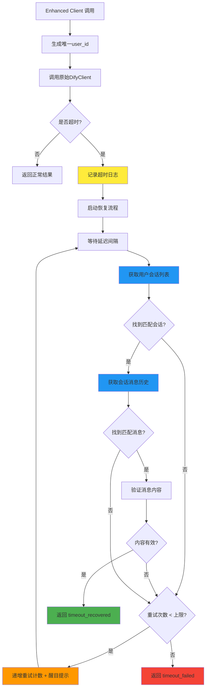

# Dify超时恢复机制实现

## Status
Implemented

## Objective / Summary
为Dify blocking模式实现超时恢复机制。当请求因Cloudflare 100秒限制而超时时，通过获取会话历史消息来恢复实际的回答结果，提高系统鲁棒性。

## Scope
新增或修改的文件：
- `src/core/l3_context_interpretation/dify_timeout_recovery.py` (新增)
- `src/core/l3_context_interpretation/dify_enhanced_client.py` (新增)  
- `src/core/l3_context_interpretation/rag_processor.py` (修改，替换客户端)
- `config/settings.yaml` (修改，新增恢复配置)
- `tests/core/l3_context_interpretation/test_dify_timeout_recovery.py` (新增)

## Detailed Plan

### 1. 核心恢复模块设计 (`dify_timeout_recovery.py`)
- **职责**：处理超时后的消息历史获取和匹配逻辑
- **主要方法**：
  - `get_conversation_messages()`: 调用GET /messages API获取会话历史
  - `find_matching_response()`: 基于时间窗口和用户ID匹配响应消息
  - `validate_response_content()`: 验证响应内容的有效性
- **匹配策略**：
  - 时间窗口：默认120秒内的消息
  - 用户ID精确匹配
  - 消息创建时间倒序查找

### 2. 增强客户端封装 (`dify_enhanced_client.py`)  
- **设计模式**：装饰器模式，包装原始[DifyClient](file://f:\Github\Library-AI-demos\historical-image-deep-description\src\core\l3_context_interpretation\dify_client.py#L26-L255)
- **核心逻辑**：
  - 生成唯一时间戳用户ID
  - 正常调用原始客户端
  - 捕获超时异常，触发恢复流程
  - 返回特殊状态码(`timeout_recovered`、`timeout_failed`)

### 3. 用户ID策略
- **格式**：`l3_rag_user_{timestamp_ms}`
- **示例**：`l3_rag_user_1703123456789`
- **唯一性**：基于毫秒级时间戳确保唯一性

### 4. 配置扩展
```yaml
timeout_recovery:
  enabled: true              # 启用超时恢复
  max_attempts: 3            # 最大重试次数  
  delay_seconds: 10          # 重试间隔
  match_time_window: 120     # 消息匹配时间窗口(秒)
```

### 5. 状态码扩展
- `timeout_recovered`: 超时后成功恢复
- `timeout_failed`: 超时且恢复失败
- 保持原有状态码不变

## Visualization



## Testing Strategy

### 单元测试覆盖：
1. **正常流程测试**：验证无超时时的正常工作
2. **超时恢复测试**：模拟超时并验证恢复成功
3. **多次重试测试**：验证重试逻辑和最大次数限制
4. **消息匹配测试**：验证历史消息的正确匹配
5. **配置测试**：验证各种配置组合的行为
6. **边界情况测试**：空响应、格式错误等异常场景

### 集成测试：
- 与[RagProcessor](file://f:\Github\Library-AI-demos\historical-image-deep-description\src\core\l3_context_interpretation\rag_processor.py)的集成测试
- 真实超时场景的端到端测试

## Security Considerations
- API密钥安全：继承原有安全机制
- 用户ID隐私：时间戳ID不包含敏感信息
- 重试频率限制：避免过度请求导致的API限制

## Implementation Notes

### 关键问题解决
1. **恢复流程调整**：原方案直接调用`/messages` API，但实际需要先通过`/conversations` API获取用户会话列表，再根据时间窗口匹配正确的会话
2. **API调用顺序**：
   - 步骤1：调用`GET /conversations?user={user_id}` 获取用户会话列表
   - 步骤2：根据时间窗口匹配目标会话（检查created_at和updated_at）
   - 步骤3：调用`GET /messages?conversation_id={id}&user={user_id}` 获取具体消息
   - 步骤4：基于查询内容相似性匹配最终响应

### 技术细节
- **时间窗口匹配**：同时检查会话的`created_at`和`updated_at`字段，提高匹配准确性
- **会话排序**：按`updated_at`倒序查找，优先处理最新的会话
- **查询匹配**：基于L3 RAG查询格式中的`label`字段进行精确匹配
- **错误处理**：完整的异常捕获和重试机制，避免单次失败影响整体流程

### 实际验证
经实际测试验证，Dify平台确实会正常生成响应并显示SUCCESS状态，超时恢复机制能够成功获取到这些结果，提高了系统的可靠性。