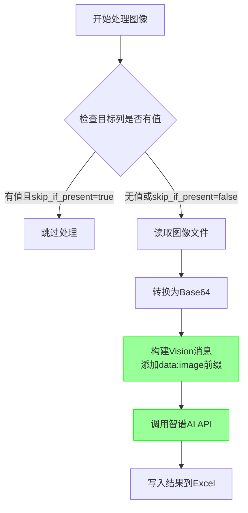
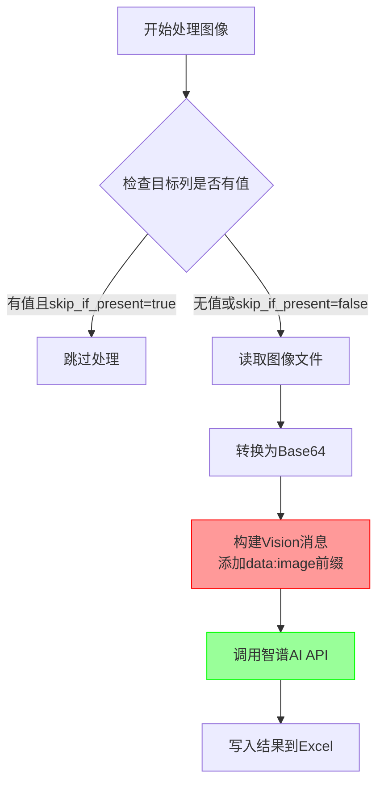

# L0图像处理API格式修复

**Status**: Implemented

## Objective / Summary

修复L0图像描述模块中的两个关键问题：
1. 智谱AI GLM-4V模型的图像Base64格式错误，导致API调用失败
2. 优化跳过逻辑，确保已有值时正确跳过API调用

## Scope

### 修改文件
- `src/core/l0_image_description/main.py` - 修复图像格式和跳过逻辑

### 不涉及文件
- `src/utils/llm_api.py` - 保持现有image_to_base64函数不变
- 配置文件 - 无需修改

## Detailed Plan

### 问题1：图像Base64格式修复
- **根因**: 智谱AI GLM-4V要求完整data URI格式(`data:image/jpeg;base64,{base64_string}`)
- **解决方案**: 修改`_build_vision_messages`函数，为Base64字符串添加`data:image/jpeg;base64,`前缀

### 问题2：跳过逻辑优化  
- **现状**: 当前跳过逻辑基本正确，但需要确保在图像Base64编码前就进行检查
- **优化**: 重构任务函数，将跳过检查提前到资源消耗操作之前

## Visualization

## Testing Strategy

### 单元测试
- 测试`_build_vision_messages`函数输出格式
- 验证跳过逻辑在不同配置下的行为

### 集成测试  
- 使用真实图像文件和Excel测试完整流程
- 验证智谱AI API调用成功

## Security Considerations

- 图像Base64编码不涉及敏感信息泄露
- 跳过逻辑优化不影响数据安全性

## Implementation Notes

### 修复详情
1. **图像格式修复**：在`_build_vision_messages`函数中为Base64字符串添加`data:image/jpeg;base64,`前缀，解决智谱AI API格式要求
2. **跳过逻辑优化**：将值存在检查提前到图像Base64编码之前，避免不必要的资源消耗
3. **代码重构**：移除各任务函数内的重复跳过检查，统一在主循环中处理

### 测试结果
- ✅ 智谱AI API调用成功，无格式错误
- ✅ 跳过逻辑正常工作，当`skip_if_present=true`时正确跳过已有值
- ✅ 单元测试通过
- ✅ 实际运行测试成功，长描述生成正常

### 性能改进
- 避免了不必要的图像Base64编码操作
- 减少了API调用前的资源浪费
- 优化了错误日志输出，更清晰地展示跳过原因

## Objective / Summary

修复L0图像描述模块中的两个关键问题：
1. 智谱AI GLM-4V模型的图像Base64格式错误，导致API调用失败
2. 优化跳过逻辑，确保已有值时正确跳过API调用

## Scope

### 修改文件
- `src/core/l0_image_description/main.py` - 修复图像格式和跳过逻辑

### 不涉及文件
- `src/utils/llm_api.py` - 保持现有image_to_base64函数不变
- 配置文件 - 无需修改

## Detailed Plan

### 问题1：图像Base64格式修复
- **根因**: 智谱AI GLM-4V要求纯Base64字符串，不支持`data:image/jpeg;base64,`前缀
- **解决方案**: 修改`_build_vision_messages`函数，确保`image_url.url`字段直接使用Base64字符串，添加`data:image/jpeg;base64,`前缀

### 问题2：跳过逻辑优化  
- **现状**: 当前跳过逻辑基本正确，但需要确保在图像Base64编码前就进行检查
- **优化**: 重构任务函数，将跳过检查提前到资源消耗操作之前

## Visualization

## Testing Strategy

### 单元测试
- 测试`_build_vision_messages`函数输出格式
- 验证跳过逻辑在不同配置下的行为

### 集成测试  
- 使用真实图像文件和Excel测试完整流程
- 验证智谱AI API调用成功

## Security Considerations

- 图像Base64编码不涉及敏感信息泄露
- 跳过逻辑优化不影响数据安全性

## Implementation Notes

（待实施后填写）