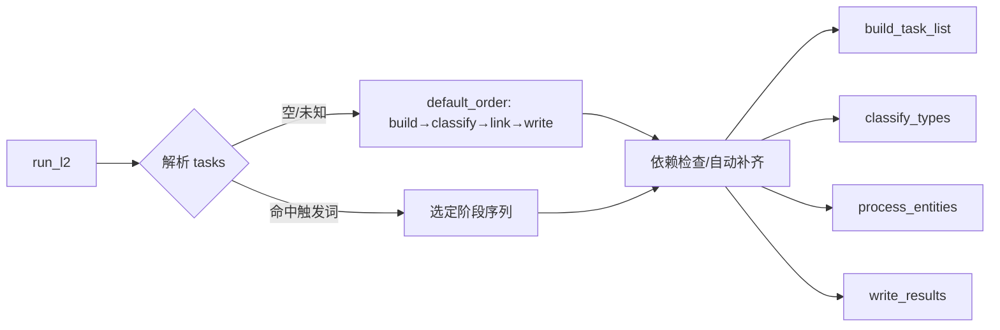

# L2 新增实体类型判断阶段（classify）与编排调整

Status: Proposal  
Date: 2025-10-04

## Objective / Summary
- 在 L2（knowledge_linking）阶段新增独立的“实体类型判断”阶段（classify），对 task_builder 产出的实体清单中每个实体进行类型重判（无视原有 type 值），并将结果覆盖写回同一份 JSON 的 `type` 字段。
- 将原本嵌入在 `entity_processor.py` 的类型判断逻辑移除，保持其余 Wiki 检索与消歧流程不变。
- 在 L2 任务编排中注册新阶段 `classify`，并将默认顺序更新为 `["build","classify","link","write"]`，确保后续消歧阶段使用最新类型信息。
- 在触发机制文档中新增 `classify` 的触发关键词（待确认）。

## Scope
- 新增：
  - `src/core/l2_knowledge_linking/type_classifier.py`：实现分类阶段逻辑；扫描 `runtime/outputs` 下目标 JSON 并原地更新 `type`。
- 修改：
  - `src/core/l2_knowledge_linking/entity_processor.py`：删除类型判断相关代码与提示词读取，保留 Wiki 检索、全文写入与消歧逻辑。
  - `src/core/l2_knowledge_linking/main.py`：注册 `classify` 阶段；默认顺序调整为 `["build","classify","link","write"]`；依赖关系设定为 `classify -> build`、`link -> classify`（当按默认顺序执行时自然满足）。
  - `docs/changelogs/L2阶段任务触发关键词-20251004.md`：新增 `classify` 触发词与依赖说明（在本 Proposal 批准后更新）。
- 不改动：
  - 现有提示词文件路径与内容（复用 `src/prompts/l2_entity_classification.md` 进行类型判定）。
  - 现有 Wikidata/Wikipedia 客户端与消歧提示词实现。

## Detailed Plan
- 新阶段 `classify` 行为
  - 输入：`runtime/outputs` 下由 `task_builder` 生成的任务 JSON 文件；命名规则（优先）为“当前行编号-题名前5字符-行号”。同时支持通过函数参数显式传入文件路径列表。
  - 处理：
    - 读取 JSON（保持结构不变），遍历 `entities` 数组中每个实体项，抽取 `label`、`context_hint`、`rows` 等上下文。
    - 无视原有 `type` 值，调用大模型（系统提示词 `l2_entity_classification.md`）进行类型判断，要求输出 JSON（至少包含 `type`；推荐包含 `confidence` 与 `reason`）。
    - 更新策略：覆盖 `ent["type"] = parsed["type"]`；是否写入 `ent["_type_meta"] = {"confidence": x, "reason": "..."}` 由设置开关控制（默认建议开启，待确认）。
  - 输出：原地更新同一 JSON 文件。采用原子化写入（.tmp 替换），防止中断损坏。
  - 日志：中文结构化日志，记录文件路径、实体计数、异常项数量；不记录敏感信息。
- 任务编排与触发
  - 在 `main.py` 的阶段注册中新增：
    - `classify`: `func = "classify_types"`（位于 `type_classifier.py`），`requires = ["build"]`
    - 触发词（待确认，推荐）：`["classify","type","分类","类型"]`
  - 默认顺序：更新为 `["build","classify","link","write"]`
  - 依赖补齐：
    - 选择 `link` 时，如未存在分类结果则自动补齐 `classify` 与 `build`（与默认顺序保持一致）。
    - 选择 `write` 时，如未存在 `enriched` 则自动执行 `link`（会进一步触发 `classify` 与 `build`）。
- entity_processor 调整
  - 删除“当 type 为空时才调用分类提示词”的逻辑与相关提示词读取。
  - 后续逻辑（候选收集、Wikipedia 全文写入 MD、消歧与 URI 产出）保持不变。

## Visualization

## Testing Strategy
- 单元测试（tests/core/l2_knowledge_linking/）：
  - 分类阶段：
    - JSON 中原有 type ≠ 新模型判断：应被覆盖。
    - JSON 中 type = null：应被填充为模型结果。
    - 文件级处理：多文件批量扫描与显式路径列表两种模式。
    - 容错：模型输出非 JSON 或缺少字段时的降级与日志。
  - 触发解析与依赖：
    - 输入 ["classify"] → 执行 classify（自动补 build）。
    - 输入 ["LINK"] → 自动补 classify→build 后再 link。
    - 默认行为：未传 tasks → 按 ["build","classify","link","write"]。
- 集成冒烟：
  - 使用示例 JSON（如 `runtime/outputs/2202_001.json`）运行 build→classify→link 全链路，确认类型覆盖与后续消歧不报错。

## Security Considerations
- 不写入或打印敏感信息；仅记录路径与数量级别摘要。
- 原子化写入避免产生半写入损坏文件。

## Open Questions（待确认）
1. classify 触发词集合：是否采用 `["classify","type","分类","类型"]`？
2. 是否在 JSON 实体上写入 `_type_meta`（包含 `confidence` 与 `reason`）用于审计？（建议开启，可通过 settings 开关禁用）

## Implementation Notes
- 复用现有工具模块：`utils/logger.get_logger`、`utils/llm_api.load_settings/invoke_model`。
- 提示词路径：`src/prompts/l2_entity_classification.md`。
- 变更完成后，将在 `docs/changelogs/L2阶段任务触发关键词-20251004.md` 中追加 `classify` 阶段配置与默认顺序更新，保持文档一致性。