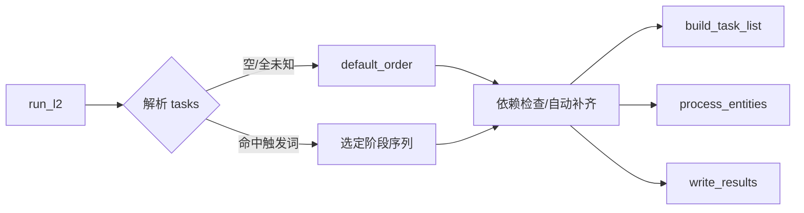

# L2 阶段任务触发关键词与可扩展编排

Status: Implemented  
Date: 2025-10-04

## Objective / Summary
- 在 L2（knowledge_linking）阶段引入“任务触发关键词”机制，使各阶段任务（如构建实体清单、实体消歧与分类、写回结果）可被关键词灵活触发与组合执行。
- 保持对上层主入口的兼容：不指定时仍按默认全流程顺序执行；指定触发词时仅执行选定阶段，并自动补齐必要前置依赖。
- 具备可扩展性：未来新增 L2 任务时，只需注册阶段与触发词，无需大改主流程。

## Scope
- 修改：
  - `src/core/l2_knowledge_linking/main.py`（新增“阶段注册表 + 触发解析 + 按需执行器”；`run_l2` 增加 `tasks: Optional[List[str]]` 参数，默认 `None`）
- 不修改（除非评审后需要）：
  - `src/core/l2_knowledge_linking/task_builder.py`（保持函数签名；作为阶段实现被注册）
  - `src/core/l2_knowledge_linking/entity_processor.py`
  - `src/core/l2_knowledge_linking/result_writer.py`
  - `docs/changelogs/主入口任务编排-20251002.md`（主入口整体策略不变）

## Detailed Plan
- 阶段注册（默认内置，支持 settings 覆盖触发词与默认顺序）：
  - phases（逻辑ID → 函数与触发集）：
    - build → `build_task_list`，默认触发词：["build","entities","tasks"]
    - classify → `classify_types`，默认触发词：["classify","type","分类","类型"]
    - link → `process_entities`，默认触发词：["link","resolve","disambiguate","关联","消歧"]
    - write → `write_results`，默认触发词：["write","emit","save","写回","输出"]
  - default_order：["build","classify","link","write"]
  - 配置覆盖位置：
    ```yaml
    l2_knowledge_linking:
      phases:
        - id: "build"
          triggers: ["build","entities","tasks"]
        - id: "link"
          triggers: ["link","resolve","disambiguate","关联","消歧"]
        - id: "write"
          triggers: ["write","emit","save","写回","输出"]
      default_order: ["build","link","write"]
    ```
- 触发解析：
  - 输入：`tasks: Optional[List[str]]` 或 本模块 CLI 参数 `--l2 "build,link"`（仅调试用）
  - 规则：大小写不敏感、去空白；命中任一阶段的 `id` 或任意触发词即选中该阶段；未知项加入 `unknown`，记录 WARNING，不中断。
  - 若最终无选中阶段，则使用 `default_order`。
- 执行流程与依赖：
  - 维护上下文对象：`xio`, `settings`, 以及跨阶段产物 `task_list`, `enriched`。
  - 执行某阶段前，若其依赖产物缺失则自动补齐前置阶段：
    - link 依赖 task_list（若未生成则先执行 build）
    - write 依赖 enriched（若未生成则先执行 link；link 又会触发 build 如有需要）
  - 全流程统一中文结构化日志（包含：选择阶段、未知触发词、最终执行顺序）。
- 兼容性：
  - `run_l2(excel_path=None, images_dir=None, limit=None, tasks=None)`：保留旧调用方式不变；未传入任务与触发词则执行默认顺序，行为与当前实现一致。
  - `_tb_*` 调试辅助函数保持不变。
- 本模块 CLI（仅用于本地调试）：
  - 新增参数：`--l2 "build,link,write"`，解析为 `tasks` 传入 `run_l2`。
  - 不影响仓库顶层主入口的既有参数与行为。

## Visualization


## Testing Strategy
- 单元测试（tests/core/l2_knowledge_linking/）：
  - 触发解析：
    - 输入 ["build"] → 执行 build
    - 输入 ["LINK"]（大小写混合）→ 执行 link（并自动补 build）
    - 输入 ["写回"]（中文别名）→ 执行 write（并自动补 link→build）
    - 输入 ["foo"] → Warning，最终使用 default_order
  - 依赖自动补齐：
    - 仅选 link → 自动先 build
    - 仅选 write → 自动 link→build
  - 默认行为：
    - 不传 tasks → 使用 default_order，顺序 build→link→write
- 集成冒烟：
  - 从真实 settings 与 Excel 运行，确认日志顺序与产物（runtime/outputs）生成符合预期。

## Security Considerations
- 不记录敏感信息；日志仅包含阶段选择、数量与文件路径的非敏感摘要。
- 配置读取遵循现有 load_settings 流程。

## Implementation Notes
- 默认在 `main.py` 内实现注册表与解析器，避免新增文件，遵循“优先编辑现有文件”的项目规范。
- 所有新增注释与日志使用中文，遵循项目“日志与注释规范”。