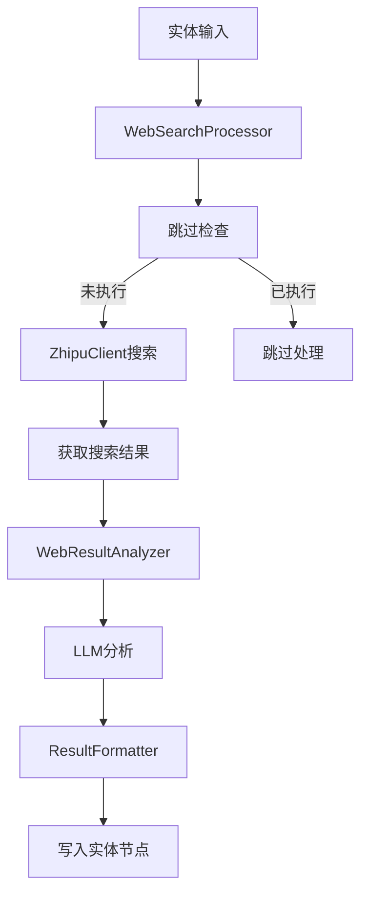

# L3 Web搜索功能实现

## 状态：Implemented

## 目标摘要

实现L3语境线索层的Web搜索功能，通过智谱AI搜索API获取网络资料，结合LLM分析生成历史文化阐释，为历史图像提供深度的网络知识补充。

## 范围 (Scope)

### 新增文件
- `src/core/l3_context_interpretation/web_search_processor.py` - Web搜索主处理器
- `src/core/l3_context_interpretation/zhipu_client.py` - 智谱AI客户端
- `src/core/l3_context_interpretation/web_result_analyzer.py` - 搜索结果分析器
- `src/prompts/l3_web_search_analysis.md` - Web搜索分析系统提示词

### 修改文件
- `config/settings.yaml` - 添加Web搜索配置
- `src/core/l3_context_interpretation/main.py` - 集成Web搜索任务
- `main.py` - 添加任务别名映射
- `requirements.txt` - 添加智谱AI SDK依赖

## 详细计划

### 1. 核心架构
- **ZhipuClient**: 封装智谱AI搜索API调用
- **WebResultAnalyzer**: 调用LLM分析搜索结果
- **WebSearchProcessor**: 主协调器，整合完整流程

### 2. 关键特性
- 直接使用实体label进行搜索（无查询优化）
- 系统提示词严格限定分析依据
- 与L2模块一致的失败状态存储模式
- 支持`python main.py --tasks "l3:web"`触发

### 3. 数据流
实体信息 → 智谱AI搜索 → LLM分析 → 结果存储

### 4. 存储格式
```json
{
  "l3_web_search": {
    "content": "分析结果",
    "meta": {"status": "success", ...}
  }
}
```

失败时：
```json
{
  "l3_web_search": null,
  "metadata": {
    "l3_web_search": {
      "status": "no_results",
      "error": "错误信息",
      ...
    }
  }
}
```

## 可视化



## 测试策略

1. **单元测试**
   - ZhipuClient API调用测试
   - WebResultAnalyzer分析逻辑测试
   - 结果格式化和存储测试

2. **集成测试**
   - 完整Web搜索流程测试
   - 任务触发和跳过机制测试
   - 错误处理和重试机制测试

## 实施说明

### 实际实现
已成功实现所有计划的功能模块：

1. **智谱AI客户端** (`zhipu_client.py`): 完成API封装和异常处理
2. **Web结果分析器** (`web_result_analyzer.py`): 实现LLM分析和系统提示词严格限定
3. **Web搜索处理器** (`web_search_processor.py`): 完整流程协调和结果存储
4. **系统提示词** (`l3_web_search_analysis.md`): 严格限定分析依据
5. **主流程集成**: 支持`python main.py --tasks "l3:web"`触发
6. **配置系统**: 完整的Web搜索配置和参数管理
7. **依赖管理**: 添加智谱AI SDK到requirements.txt
8. **单元测试**: 实现核心功能的测试覆盖

### 存储模式一致性
成功修复了存储模式问题，确保与L2模块一致：
- 成功时：写入实体字段中
- 失败时：实体字段设为`null`，状态信息写入`metadata`中

### 配置化特性
- 所有智谱AI参数可配置（搜索引擎、结果数、内容大小等）
- LLM分析参数可配置（模型、温度、最大token数等）
- 符合项目模型名称获取规范

### 技术要点
- 复用EntityExtractor的跳过检查逻辑，保持一致性
- 使用现有的llm_api.py进行LLM调用
- 遵循项目统一的日志和错误处理规范
- 高内聚低耦合的模块化设计

---

**文档版本**: v1.1  
**创建时间**: 2025-10-07  
**完成时间**: 2025-10-07  
**状态**: Implemented