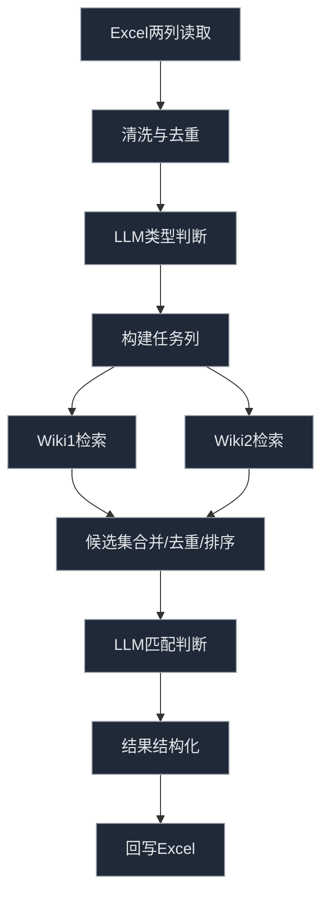

# L2 知识关联 阶段A 单元测试计划 - 20251003

Status: Proposal

## Objective / Summary
为“阶段A：Wiki优先的端到端实现”制定系统化的单元测试计划，覆盖以下四个环节：
1. 从 Excel 两列提取实体、去重后调用大模型判断类型并构建任务列。
2. 对待检索实体在两个 Wiki 数据源进行检索。
3. 对检索结果调用大模型进行匹配判断。
4. 最终结果回写至 Excel。

该计划以可测试性为核心，明确测试用例、Mock 策略、目录结构与执行方式，指导后续逐个实现测试与被测代码。

## Scope
- 测试代码（建议路径，镜像 src 结构）：
  - tests/core/l2_knowledge_linking/test_entity_extraction.py
  - tests/core/l2_knowledge_linking/test_llm_type_classification.py
  - tests/core/l2_knowledge_linking/test_dual_wiki_search.py
  - tests/core/l2_knowledge_linking/test_llm_match_decision.py
  - tests/core/l2_knowledge_linking/test_excel_write_back.py
- 夹具与样例数据：
  - tests/fixtures/l2_knowledge_linking/entities.xlsx（或 CSV/JSON 等便于加载的格式）
  - tests/fixtures/l2_knowledge_linking/wiki1_results.json
  - tests/fixtures/l2_knowledge_linking/wiki2_results.json
  - tests/fixtures/l2_knowledge_linking/llm_responses.json
- 被测模块（参考路径，实际以项目为准）：
  - src/core/l2_knowledge_linking/entity_extraction.py
  - src/core/l2_knowledge_linking/type_classification.py
  - src/core/l2_knowledge_linking/wiki_search.py
  - src/core/l2_knowledge_linking/match_decision.py
  - src/core/l2_knowledge_linking/excel_io.py

## Detailed Plan

### 1) Excel 提取 + 去重 + LLM 类型判断 + 构建任务列
- 目标：从 Excel 两列（如 A/B）读取实体，清洗（去空、去噪）、规范化与去重；对唯一实体调用 LLM 进行类型判断；生成“任务列”（包含实体、类型、后续检索需求等）。
- 测试用例（示例编号：E- 系列）
  - E-01 正常用例：两列实体有重复与大小写差异，去重后唯一集正确；LLM 返回稳定类型；任务列生成字段完整。
  - E-02 边界用例：含空单元格、仅空白字符、包含特殊符号（如括号、破折号）；应被忽略或规范化。
  - E-03 边界用例：同形异义（如“Apple”既公司亦水果）；LLM 类型判定需根据上下文或策略选择期望值（通过 Mock 固定）。
  - E-04 异常用例：Excel 文件缺失、路径错误、工作表命名变化；应抛出明确异常或返回错误信息。
  - E-05 异常用例：LLM 接口超时/异常；应降级（重试/回退类型为“未知”）并记录日志。
- Mock 策略：
  - LLM：使用可配置的假响应（tests/fixtures/.../llm_responses.json），根据输入实体返回预期类型，确保测试可重复。
  - I/O：Excel 使用临时目录与小规模样例文件，或用 in-memory 表结构（如 pandas DataFrame）替代真实读写。

### 2) 双 Wiki 检索
- 目标：对待检索实体在两个不同 Wiki 数据源进行查询（如 Wiki1=中文维基，Wiki2=英文维基，或两个内部镜像），返回候选条目列表与基础元数据。
- 测试用例（示例编号：W- 系列）
  - W-01 正常用例：实体在两个 Wiki 均有命中；合并候选列表与去重策略正确。
  - W-02 边界用例：仅在其一 Wiki 命中；结果结构仍完整，另一数据源为空处理。
  - W-03 边界用例：多义词大量候选（>N）；截断/排序（基于得分/相关度）符合预期。
  - W-04 异常用例：网络异常/接口 5xx；应重试或返回带错误上下文的结果对象。
- Mock 策略：
  - 外部检索：以 fixtures 的 JSON 作为响应快照，通过依赖注入或 monkeypatch 替换网络层，避免真实请求。

### 3) 检索结果 LLM 匹配判断
- 目标：对候选条目调用 LLM，判定与目标实体是否匹配（或给出相似度/匹配标签），输出最终匹配结果。
- 测试用例（示例编号：M- 系列）
  - M-01 正常用例：单个候选明显匹配；LLM 返回“匹配”，最终选择正确。
  - M-02 边界用例：多个候选相近；应根据策略（置信度/打分）选择最优或返回多候选并标注。
  - M-03 边界用例：实体为歧义项；LLM 返回“不确定”，系统应有回退策略（人工复核标记或保留待定）。
  - M-04 异常用例：LLM 返回错误格式或空响应；应进行格式校验与容错。
- Mock 策略：
  - LLM：使用固定判定矩阵（fixtures），按候选内容与目标实体映射到“匹配/不匹配/待定”。

### 4) 结果回写 Excel
- 目标：将最终匹配结果（含来源、得分、类型、备注等）写回到 Excel 指定列，保持原有数据不被破坏，字段位置与格式符合规范。
- 测试用例（示例编号：X- 系列）
  - X-01 正常用例：多行写回，列映射正确、数据类型一致（文本/数值）。
  - X-02 边界用例：部分行无匹配结果；写入“未匹配/待定”并保留上下文信息。
  - X-03 异常用例：目标文件被占用/只读；应报错或写入到备份文件。
  - X-04 异常用例：列名/索引变更；应有显式的列配置与校验，报错并记录日志。
- Mock/环境策略：
  - 使用临时目录输出（runtime/outputs/ 下或 pytest tmp_path），清理策略在测试 teardown 中完成。

### 统一设计要点与质量要求
- 日志：中文信息、避免敏感数据；ERROR/WARNING 覆盖异常与降级路径。
- 配置：Wiki 数据源、LLM 提示模板、列映射等通过配置项或参数注入，便于测试重写。
- 纯函数化：尽可能将核心逻辑与 I/O 分离，提升单元测试可控性与可复用性。
- 失败可复现：异常用例以固定的 Mock 场景触发，确保稳定失败后被修复为通过。

## Visualization


## Testing Strategy
- 测试框架：pytest（建议在 Windows PowerShell 下执行）
  - 运行单个模块：`pytest -q tests/core/l2_knowledge_linking/test_entity_extraction.py`
  - 运行阶段A全套：`pytest -q tests/core/l2_knowledge_linking`
- 目录镜像原则：tests 结构应镜像 src/core/l2_knowledge_linking 下的模块。
- 夹具与数据：
  - 使用 `tests/fixtures/l2_knowledge_linking` 存放 Excel 样例与 JSON 响应。
  - 使用 `pytest` 的 `tmp_path` 管理临时输出与文件回写。
- Mock 技术：
  - `monkeypatch` 替换网络调用或 LLM 客户端。
  - 通过依赖注入，将外部服务句柄传入业务函数，测试中传入 Mock 实现。
- 覆盖要求：
  - 对关键分支（异常与降级逻辑）必须覆盖。
  - 数据清洗与规范化函数需覆盖大小写、空白、特殊符号与去重策略。
  - LLM 交互的输入输出格式校验必须包含错误格式用例。
- 命名规范：
  - 用例 ID 前缀对应环节：E-, W-, M-, X-。
  - 每个测试函数名包含用例 ID 与目的，如 `test_E_02_handles_blank_cells`.

## Security Considerations
- 禁止在日志与测试数据中记录任何敏感信息（如密钥、Token）。
- 外部请求全部以 Mock 替代，避免真实访问与数据泄漏。

## Implementation Notes（编写测试时参考）
- 优先从 E-01, W-01, M-01, X-01 四个“快乐路径”开始，确保整体链路可验证。
- 随后补充边界与异常用例，逐步引入 Mock 的失败场景，验证降级与回退策略。
- 若现有代码的可测试性不足（I/O 与逻辑耦合），建议先小幅重构以便注入依赖、分离纯函数。

---

## 真实数据驱动与产物约定（新增 Proposal）

为满足“使用根目录 metadata.xlsx，分步落盘并在后续测试中级联传递”的需求，阶段A在真实数据模式下新增如下统一约定：

### 输入约定
- Excel 源文件：项目根目录 `metadata.xlsx`（若配置 `data.paths.metadata_excel` 指向其它路径，则以配置为准）。
- 工作表：如未在配置 `data.excel.sheet_name` 指定，默认使用首个工作表。
- 列名默认（可在配置中覆盖）：
  - 编号列：`编号`
  - 关键词JSON列：`关键词JSON`
  - L1结构化JSON列：`L1结构化JSON`
  - L2写回列：`L2知识关联JSON`（不存在时由代码自动创建）

### 分步产物（均写入 `runtime/outputs/`）
- Step 1（任务构建）：
  - 文件：`runtime/outputs/step1_task_list.json`
  - 结构：
    - `generated_at`: ISO 时间
    - `count`: 任务数
    - `items`: 列表，元素字段：
      - `label`（实体名）
      - `type`（可为空）
      - `rows`（出现的编号/行标识）
      - `sources`（来源集合：keywords/l1）
      - `context_hint`（行级元数据上下文摘要）
- Step 2（实体处理与候选/消歧）：
  - 文件：`runtime/outputs/step2_enriched.json`
  - 结构：列表，每项：
    - `label`, `type`
    - `wikidata_uri`, `wikipedia_uri`
    - `status`（SUCCESS_BOTH/SUCCESS_WIKI/NOT_FOUND）
    - `_raw_api_responses`：
      - `wikidata`: 候选数组（含 `id`, `url`, `raw`）
      - `wikipedia`: 候选数组（含 `title`, `canonicalurl`, `summary`）
    - `rows`: 行标识列表
  - 说明：Wikipedia 全文仍按现有实现写入 `runtime/outputs/*.md`（文件名含标题与时间戳）。
- Step 3（匹配结果的行级聚合，用于写回前的测试断言）：
  - 文件：`runtime/outputs/step3_row_entities.json`
  - 结构：字典，键为 `row_id`，值为：
    - `entities`: 列表（过滤后的实体对象，字段与写回一致：`label`, `type`, `wikidata_uri`, `wikipedia_uri`, `status`, `_raw_api_responses`）
- Step 4（Excel写回）：
  - 主要写回：将行级JSON字符串写入列 `L2知识关联JSON` 并保存。
  - 备份/副本（推荐，避免覆盖原件）：`runtime/outputs/metadata.output.xlsx`（或沿用已有自动备份策略 `metadata.xlsx.bak-YYYYMMDD-HHmmss`）。

### 执行与测试策略
- 单步/全链路执行：
  - 建议提供统一入口：`python -m src.core.l2_knowledge_linking.main --excel metadata.xlsx --limit N`（limit 可选）
  - 在主流水线中按步骤写出上述产物文件；测试用例逐步读取这些文件进行断言与级联。
- 集成测试（新增）：
  - `tests/core/l2_knowledge_linking/test_stage_a_pipeline.py`（拟新增）
  - 测试顺序：读取 Step1→断言→读取 Step2→断言→读取 Step3→断言→校验 Excel 写回（或副本）。
- 日志：
  - 继续输出中文结构化日志；错误/降级路径必须记录。

### 配置示例（settings.yaml要点）
```yaml
data:
  paths:
    metadata_excel: "metadata.xlsx"
  excel:
    sheet_name: ""
    columns:
      id_col: "编号"
      outputs:
        keywords_json: "关键词JSON"
        l1_structured_json: "L1结构化JSON"
  outputs:
    dir: "runtime/outputs"
    enabled: true
write_policy:
  skip_if_present: true
  create_backup: true
```

### 后续实现计划（待批准后执行）
- 在 `src/core/l2_knowledge_linking/main.py`：
  - Step 1 完成后写出 `step1_task_list.json`
  - Step 2 完成后写出 `step2_enriched.json`
  - Step 3 写回前构建行级映射并写出 `step3_row_entities.json`
  - Step 4 保存Excel后，另存副本到 `runtime/outputs/metadata.output.xlsx`（如允许）
- 在 `tests/core/l2_knowledge_linking/`：
  - 新增 `test_stage_a_pipeline.py`，顺序消费这些产物文件并断言字段完整性与数量一致性。
- 文档状态：
  - 当前为 Proposal；获得批准后更新为 In Progress，完成实现与测试后更新为 Implemented 并补充 Implementation Notes。