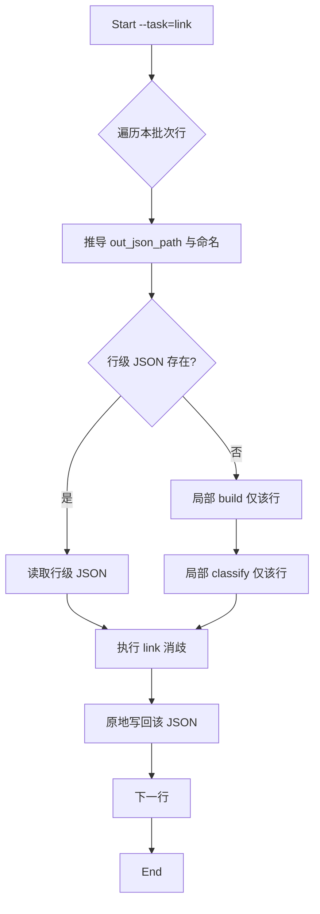

# L2 link 按需执行与行级 JSON 原地更新

Status: In Progress
Date: 2025-10-04
Owner: l2_knowledge_linking

## Objective / Summary
当 --task=link 时，实现“按需最小执行”：
- 若当前批次内某行（基于编号命名规则推导的行级 JSON）已存在，则跳过 build 和 classify，只执行 link，直接读取该行 JSON 并将结果写回同一 JSON 的对应实体节点。
- 若该行的 JSON 不存在，则仅为该行补跑必要的前置（build → classify），随后再执行 link；新建的 JSON 文件名须与 build 流程命名规则完全一致。

不再在 link 路径上全量重建/覆盖 runtime/outputs/task_list.json（除非后续另有需求），避免“全量重跑”的副作用与时间成本。

## Scope
受影响模块与文件（拟定）：
- src/core/l2_knowledge_linking/main.py
  - 在 --task=link 分支内增加“按需跳过/补跑”的控制逻辑（逐行判断是否存在行级 JSON）
  - 为单行执行时，使用与 task_builder 一致的文件命名推导
- src/core/l2_knowledge_linking/entity_processor.py
  - 暴露仅执行 link 的入口（从行级 JSON 读取 entities/context，完成 wikidata/wikipedia 消歧与字段写回）
  - 保证写回为“原地更新”，不破坏已有字段
- src/core/l2_knowledge_linking/task_builder.py
  - 无需修改逻辑，仅复用其命名规则（可提取为共享的小工具函数，或在 main 中复刻一份严格一致的规则）
- 不修改：runtime/outputs/task_list.json 在 link-only 路径下不再更新（保持最小写入范围）

不在本次范围内：
- 新增 --id 单条执行参数（暂保持现状，仍由 --limit/--offset 控制批次）
- 指纹/过期判断机制（暂不加入）
- 反向写回 Excel

## Detailed Plan

1) 文件命名与定位（与 build 完全一致）
- 命名规则回顾（源自 task_builder）：
  - 优先使用“编号”列值作为文件名
  - 若编号为空，则取“题名”前5个字符
  - 若仍不可得，则使用 row_{row_idx}
  - 经过 _safe_filename 处理并落盘到 runtime/outputs/{name}.json
- 方案：
  - 在 main 的 link 分支中实现与上面相同的推导逻辑（建议抽出 utils 以避免规则飘移；若不抽取，则逐字对齐实现）
  - 针对本批次内每一行，推导其 out_json_path。

2) link 执行控制（逐行按需）
- 若 out_json_path 存在：
  - 直接读取该 JSON，调用 entity_processor 的 link-only 入口进行消歧
  - 将消歧结果写回同一 JSON 的实体节点（原地更新，保留已有字段）
  - 跳过 build 与 classify
- 若 out_json_path 不存在：
  - 对该行补跑：
    - 局部 build：仅构建该行的实体列表并生成该行 JSON（不做全量构建与重写 task_list.json）
    - 局部 classify：仅为该行的实体更新 type 信息（必要时读取同一 JSON）
  - 然后执行 link，并写回该行 JSON
- 日志清晰标注：skip_build/skip_classify=true/false，path=..., action=link_only|build_then_classify_then_link

3) 写回策略与数据结构
- 写回目标：行级 JSON（如 2202_001.json）
- 写回方式：读取 → 合并 link 相关字段 → 写回（缩进2、ensure_ascii=False）
- 保留字段：
  - row_id, entities[*].label, type, sources, context_hint
  - link 产生的字段（例如 wikidata_uri、wikipedia_uri、choices、reasons）仅追加/覆盖对应实体项
- 不在 link-only 路径中更新 runtime/outputs/task_list.json

4) 幂等与错误恢复
- 同一行重复执行 link 时为幂等操作（覆盖相同键）
- 消歧失败则仅写入失败原因/空链接，不影响其它实体
- 不影响其它行的处理

## Visualization

## Testing Strategy

单元测试（tests/core/l2_knowledge_linking）：
- test_link_skip_when_json_exists:
  - 预先放置一份行级 JSON，运行 --task=link，断言未触发 build/classify 的日志标记，且 JSON 被原地更新（如新增 wikidata_uri 字段）
- test_link_build_when_json_missing:
  - 删除该行 JSON，运行 --task=link，断言触发“局部 build → classify → link”，最终行级 JSON 创建并包含 link 字段
- test_filename_rule_parity:
  - 构造含编号/无编号有题名/均无的三种行，断言 main 的推导文件名与 task_builder 一致
- test_idempotent_link:
  - 连续两次 link，断言结果稳定且没有重复意外字段

集成测试（可选）：
- 批次内混合存在与缺失 JSON 的多行，验证按需跳过与补跑并存

## Security Considerations
- 不记录敏感信息（遵循现有日志规范）
- 仍使用受限的 HTTP 工具查询公共接口；超时与错误已由现有封装处理

## Implementation Notes（交付时补充）
- 记录是否最终抽取了命名规则到共享工具
- 说明是否保留对 task_list.json 的任何变更（本案不修改）