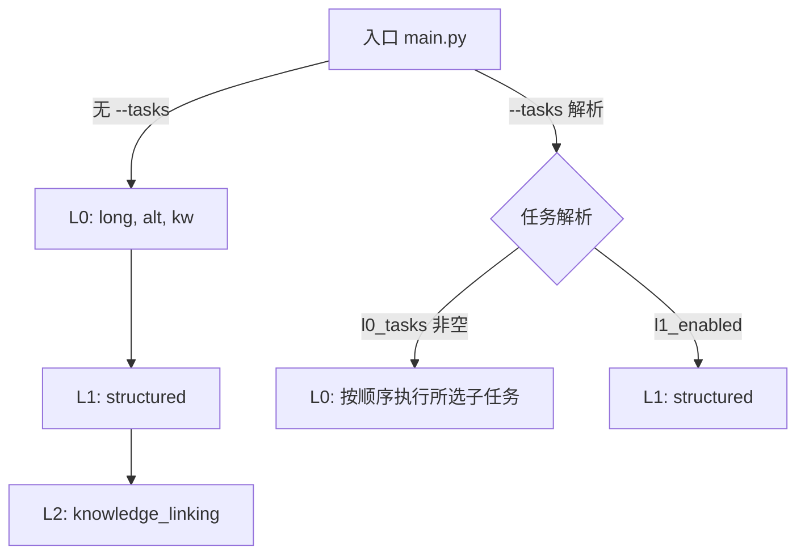

# 主入口任务编排改造

Status: Implemented  
Date: 2025-10-02

## Objective / Summary
- 将主入口 `main.py` 从“单模块 L0 入口”升级为“统一流水线编排入口”，支持：
  - 默认流水线：不带参数时，按顺序执行 L0 全部任务 → L1 结构化抽取 → L2 知识关联。
  - 跨模块任务选择：`--tasks` 支持简单名与命名空间（`module:task`），可多任务组合。
  - 移除命令行中的 Excel/图片路径参数，路径从配置读取。

## Scope
- 修改：
  - `main.py`
- 新增：
  - `docs/changelogs/主入口任务编排-20251002.md`
- 不修改：
  - `src/core/l0_image_description/main.py`
  - `src/core/l1_structured_extraction/main.py`
  - 配置文件（默认从现有 `settings.yaml` 读取路径）

## Detailed Plan
- CLI 形态：
  - `python main.py` → 执行 L0（long_description, alt_text, keywords）然后 L1（structured）再 L2（knowledge_linking）。
  - `python main.py --tasks "alt_text,structured"` → 执行 L0:alt_text 与 L1。
  - `python main.py --tasks "l0:long_description,l1:structured"` → 使用命名空间明确指派。
  - 仍保留 `--limit` 作为限流调试参数。
- 任务解析：
  - 简单名别名映射（部分示例）：
    - L0：`long_description|long`、`alt_text|alt`、`keywords|kw`
    - L1：`structured|structured_json|l1_structured|l1`
  - 命名空间：`l0:alt_text`、`l1:structured`、`l2:knowledge_linking`
  - 解析输出：
    - `l0_tasks: List[str]`（顺序保留）
    - `l1_enabled: bool`
    - `unknown: List[str]`（记录 WARNING，不中断）
- 执行顺序：
  - 默认：L0 全部 → L1 → L2
  - 指定任务：先 L0（若有选中任务则按顺序执行），后 L1（若启用）
- 与现有模块的接口：
  - `run_l0(excel_path=None, images_dir=None, tasks=None|List[str], limit=...)`
  - `run_l1(excel_path=None, images_dir=None, limit=...)`
  - `run_l2(excel_path=None, images_dir=None, limit=...)`
  - 路径从配置读取（由各模块内部现有逻辑处理）。

## Visualization

## Testing Strategy
- 手动与自动化结合（后续可补 tests/ 入口级测试）：
  - 无参数：验证按顺序触发 L0→L1→L2；日志包含 `pipeline_default`。
  - `--tasks alt_text`：仅运行 L0:alt_text；日志包含 `pipeline_l1_skipped`。
  - `--tasks structured`：仅运行 L1；日志包含 `pipeline_l0_skipped`。
  - `--tasks "alt_text,structured"`：运行 L0:alt_text 后 L1。
  - `--tasks "l0:long,l1:structured"`：命名空间解析正确。
  - 未知任务：如 `--tasks foo`，日志 WARNING 且不中断。
- 兼容性：保留原 L0 用法（`--tasks` 仅含 L0 名称时等价旧行为）。

## Security Considerations
- 不暴露敏感信息；仍由模块内部从配置读取路径和模型设置。
- 日志不记录敏感数据；仅输出任务选择与简要状态。

## Implementation Notes
- 主入口完成方案 A 的实现：
  - CLI 精简：移除 --stage、--excel、--images；保留 --tasks、--limit。
  - 默认无参执行按流水线顺序：L0 全部任务（long_description, alt_text, keywords）后执行 L1（structured）。
  - 任务解析：支持简单名与命名空间（module:task），未识别任务仅 Warning 不中断。
  - 路径与模型均从配置读取，未改变核心模块逻辑。
- 自测用例：
  - python main.py → 观察日志 pipeline_default；L0 后接 L1 再接 L2。
  - python main.py --tasks alt_text → 仅 L0:alt_text；日志 pipeline_l1_skipped。
  - python main.py --tasks structured → 仅 L1；日志 pipeline_l0_skipped。
  - python main.py --tasks "alt_text,structured" → 先 L0:alt_text 再 L1。
  - python main.py --tasks "l0:long_description,l1:structured" → 命名空间解析正确。
- 无对 settings.yaml 的结构性依赖变更；后续可考虑将流水线顺序外置到配置增强灵活性。