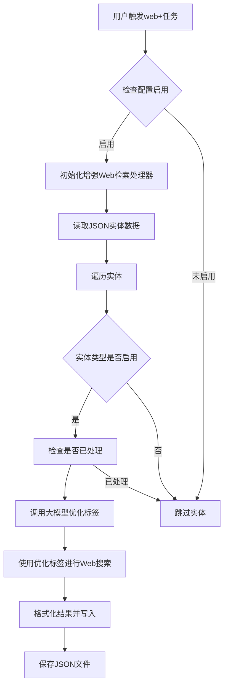

# 增强Web检索功能设计与实现

## Status
Implemented

## Objective / Summary
在L3阶段新增一个增强Web检索功能，该功能需要：
1. 参照现有的增强RAG检索逻辑（继承BaseEnhancedRAGProcessor）
2. 先调用大模型将原始实体label改造增强后，再进行检索
3. 任务触发词为`web+`

## Scope
- 新增增强Web检索处理器类
- 在L3主流程中集成增强Web检索功能
- 添加相应的配置项
- 实现任务触发机制

## Detailed Plan
### 1. 设计增强Web检索处理器
创建`EnhancedWebRetrieval`类，继承[BaseEnhancedRAGProcessor](file:///F:/Github/Library-AI-demos/historical-image-deep-description/src/core/l3_context_interpretation/base_enhanced_rag_processor.py#L54-L121)，实现以下功能：
- 实现[_build_user_prompt](file:///F:/Github/Library-AI-demos/historical-image-deep-description/src/core/l3_context_interpretation/base_enhanced_rag_processor.py#L209-L218)方法，构建适用于Web检索的用户提示词
- 实现[get_task_name](file:///F:/Github/Library-AI-demos/historical-image-deep-description/src/core/l3_context_interpretation/base_enhanced_rag_processor.py#L220-L225)方法，返回任务名称"enhanced_web_retrieval"
- 重写处理逻辑，使用增强后的标签调用Web搜索而不是Dify RAG

### 2. 集成到L3主流程
- 在[main.py](file:///F:/Github/Library-AI-demos/historical-image-deep-description/src/core/l3_context_interpretation/main.py)中添加增强Web检索处理器的初始化
- 在任务处理逻辑中添加对增强Web检索的支持
- 在任务确定逻辑中添加对`web+`触发词的支持

### 3. 配置管理
- 在[settings.yaml](file:///F:/Github/Library-AI-demos/historical-image-deep-description/config/settings.yaml)中添加增强Web检索的相关配置项
- 支持按实体类型启用/禁用增强Web检索

### 4. 提示词设计
- 创建适用于Web检索的提示词模板，指导大模型如何优化标签用于Web搜索

## Visualization

## Testing Strategy
- 编写单元测试验证增强Web检索处理器的基本功能
- 测试不同实体类型的标签优化逻辑
- 验证任务触发机制的正确性
- 测试配置管理功能

## Security Considerations
- 确保API密钥通过环境变量管理
- 遵循现有的错误处理和日志记录规范
- 保持与现有Web搜索功能一致的安全实践

## Implementation Notes
- 已创建`EnhancedWebRetrieval`类，继承[BaseEnhancedRAGProcessor](file:///F:/Github/Library-AI-demos/historical-image-deep-description/src/core/l3_context_interpretation/base_enhanced_rag_processor.py#L54-L121)
- 已在[main.py](file:///F:/Github/Library-AI-demos/historical-image-deep-description/src/core/l3_context_interpretation/main.py)中集成增强Web检索功能
- 已在[settings.yaml](file:///F:/Github/Library-AI-demos/historical-image-deep-description/config/settings.yaml)中添加相关配置
- 已创建Web搜索关键词提取的提示词模板
- 已编写并运行单元测试和集成测试，所有测试均通过
- 实现了完整的任务处理流程，包括标签增强、Web搜索、结果分析和存储
- 支持通过`web+`触发词启用增强Web检索功能