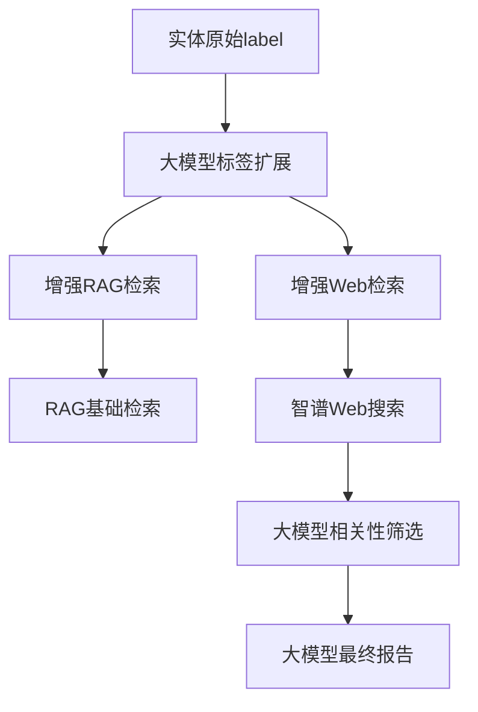

# 增强Web检索和RAG检索架构重构

## Status
Implemented

## Objective / Summary
重构增强Web检索和增强RAG检索的架构，使其符合用户提出的设计要求：
1. 实体原始label调用大模型进行扩展，替换原来的label作为检索词
2. 增强RAG和增强Web检索的前置代码（标签扩展）完全相同
3. 后面的检索使用不同的基础检索方式（RAG vs Web搜索+大模型相关性筛选+大模型最终报告）

## Scope
- `src/core/l3_context_interpretation/base_label_enhancer.py` - 创建标签扩展基类
- `src/core/l3_context_interpretation/base_enhanced_rag_processor.py` - 重构增强RAG处理器
- `src/core/l3_context_interpretation/enhanced_web_retrieval.py` - 重构增强Web检索处理器
- `src/core/l3_context_interpretation/main.py` - 修复调用逻辑
- `config/settings.yaml` - 更新配置

## Detailed Plan
### 1. 创建统一的标签扩展基类
创建[BaseLabelEnhancer](file:///F:/Github/Library-AI-demos/historical-image-deep-description/src/core/l3_context_interpretation/base_label_enhancer.py#L25-L116)类，专门处理标签扩展逻辑：
- 统一的大模型调用管理
- 标准化的结果处理流程
- 可扩展的label增强策略

### 2. 重构增强检索类
- [BaseEnhancedRAGProcessor](file:///F:/Github/Library-AI-demos/historical-image-deep-description/src/core/l3_context_interpretation/base_enhanced_rag_processor.py#L56-L321)继承[BaseLabelEnhancer](file:///F:/Github/Library-AI-demos/historical-image-deep-description/src/core/l3_context_interpretation/base_label_enhancer.py#L25-L116)
- [EnhancedWebRetrieval](file:///F:/Github/Library-AI-demos/historical-image-deep-description/src/core/l3_context_interpretation/enhanced_web_retrieval.py#L36-L379)继承[BaseLabelEnhancer](file:///F:/Github/Library-AI-demos/historical-image-deep-description/src/core/l3_context_interpretation/base_label_enhancer.py#L25-L116)，不再继承[BaseEnhancedRAGProcessor](file:///F:/Github/Library-AI-demos/historical-image-deep-description/src/core/l3_context_interpretation/base_enhanced_rag_processor.py#L56-L321)
- 两个类都使用相同的标签扩展逻辑

### 3. 修复调用逻辑
- 在主处理文件中统一增强Web检索和增强RAG检索的调用方式
- 确保两者使用相同的前置处理逻辑

### 4. 配置优化
- 修正增强Web检索配置，确保不同实体类型使用正确的任务
- 清理增强Web检索配置中的冗余`task_name`配置
- 更新配置文件注释，准确反映统一标签扩展架构

## Visualization

## Testing Strategy
- 验证增强RAG检索和增强Web检索都能正确调用标签扩展功能
- 验证两者使用相同的前置处理逻辑
- 验证配置文件中的task_name配置正确
- 验证主处理文件中的调用逻辑正确

## Security Considerations
无特殊安全考虑。

## Implementation Notes
1. 在[BaseLabelEnhancer](file:///F:/Github/Library-AI-demos/historical-image-deep-description/src/core/l3_context_interpretation/base_label_enhancer.py#L25-L116)类中添加了[should_skip_entity](file:///F:/Github/Library-AI-demos/historical-image-deep-description/src/core/l3_context_interpretation/entity_extractor.py#L73-L107)方法，供所有增强检索任务使用
2. 修复了主处理文件中增强Web检索的调用逻辑，确保与增强RAG检索保持一致
3. 修正了增强Web检索配置，确保事件实体使用`event_keyword_extraction`任务，作品实体使用`work_label_enhancement`任务
4. 清理了增强Web检索配置中的冗余`task_name`配置，只在启用的实体类型中保留该配置
5. 更新了配置文件中的注释，准确反映统一标签扩展架构