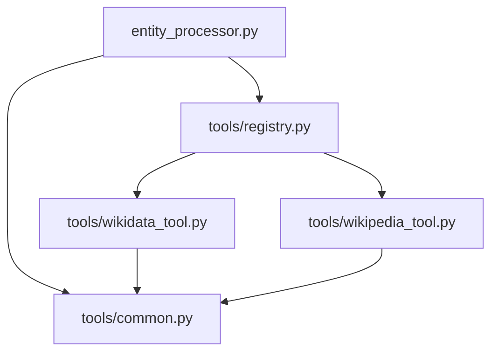

# 工具拆分与注册（Wiki API 函数转函数式 Tools 并引入注册表）

Status: Implemented  
Date: 2025-10-04  
Owner: L2 知识关联模块

## Objective / Summary
- 将现有 src/core/l2_knowledge_linking/api_clients.py 中的两个 Wiki API 调用从类封装迁移为独立函数式工具，置于 tools 子目录，并通过注册表进行统一管理。
- 目标是提升工具接入的灵活性与可扩展性：后续新增工具无需改动 entity_processor，仅新增文件并在 registry 中注册即可。
- 保持现有对外行为（返回结构）兼容，不引入语义变更；将 Wikipedia 全文写入的职责统一放在 entity_processor，避免工具内产生额外 I/O 副作用。

## Scope
新增文件：
- src/core/l2_knowledge_linking/tools/common.py（提取 sanitize_filename 等通用工具）
- src/core/l2_knowledge_linking/tools/wikidata_tool.py（提供 search_wikidata 函数）
- src/core/l2_knowledge_linking/tools/wikipedia_tool.py（提供 search_wikipedia 函数）
- src/core/l2_knowledge_linking/tools/registry.py（提供 TOOL_REGISTRY 与 get_tool(name)）

修改文件：
- src/core/l2_knowledge_linking/entity_processor.py
  - 改为通过 registry 动态调用工具（如 "wikidata"、"wikipedia"）
  - 保持返回结构消费逻辑不变
  - 统一承担 Wikipedia MD 写入职责（工具不再写 MD）
- （暂不修改）src/core/l2_knowledge_linking/api_clients.py
  - 先保持原文件不动以免影响外部引用，后续可在独立变更中标记废弃或删除

测试：
- tests/core/l2_knowledge_linking/test_tools_registry.py（注册表解析与选择）
- tests/core/l2_knowledge_linking/test_wikidata_tool.py（以 httpx mock 验证结构与超时处理）
- tests/core/l2_knowledge_linking/test_wikipedia_tool.py（以 wikipediaapi mock 验证结构与长度截断）
- tests/core/l2_knowledge_linking/test_entity_processor_integration.py（通过注入假工具或 mock 验证整体流程）

## Detailed Plan

### 工具函数接口约定
- 所有工具函数签名统一：
  - def search_xxx(entity_label: str, lang: str = "zh", type_hint: Optional[str] = None) -> List[Dict[str, Any]]
- 返回结构：
  - wikidata_tool.search_wikidata:
    - [{"id": "Qxxx", "url": "https://www.wikidata.org/wiki/Qxxx", "raw": "label | description"}]
  - wikipedia_tool.search_wikipedia:
    - [{"title": str, "canonicalurl": str, "summary": str, "_page": Any}] 其中 _page 用于 entity_processor 写 MD，写入时不透传到最终 JSON

### 具体实现要点
- wikidata_tool:
  - 默认使用官方 wbsearchentities API（httpx，timeout 10s，limit=2）
  - 环境变量 WD_USE_LC=1 时回退到 LangChain WikidataQueryRun 行为，解析文本结果构造相同结构
  - 日志保持中文与原级别一致；错误时返回 []
- wikipedia_tool:
  - 使用 wikipediaapi（user_agent='HPD (wzjlxy@gmail.com)'）
  - 仅返回 title/canonicalurl/summary（截断至 1000 字）与 _page（供上层写 MD），工具内不写任何文件
  - wikipediaapi 未安装或异常时返回 []
- common.sanitize_filename:
  - 从现有实现提取，保持行为一致

### 注册表
- registry.py:
  - TOOL_REGISTRY = {"wikidata": search_wikidata, "wikipedia": search_wikipedia}
  - get_tool(name: str) -> Callable or None
  - 后续新增工具只需在对应文件实现 search_xxx 并在注册表中登记

### entity_processor 重构
- 通过 registry 获取工具函数并调用：
  - wikidata_candidates = get_tool("wikidata")(label, lang="zh", type_hint=final_type)
  - wikipedia_candidates = get_tool("wikipedia")(label, lang="zh", type_hint=final_type)
- MD 写入逻辑：
  - 使用 Wikipedia 返回的 _page（若存在）与 meta 信息写入 runtime/outputs/{row_id}-{label}.md
  - 构造消歧输入时不包含 _page 字段（与现有行为一致）
- 保持其余流程不变（构建 disambiguation 输入、调用 LLM 消歧、汇总结果）

## Visualization

## Testing Strategy
- 单元测试（mock 外部依赖）：
  - wikidata_tool: mock httpx responses（正常返回、空、异常、超时）
  - wikipedia_tool: mock wikipediaapi.page（存在/不存在、长 summary 截断）
  - registry: 校验已注册工具可被检索，未知工具返回 None
  - entity_processor: 注入 fake 工具（或 monkeypatch registry）验证 end-to-end 行为、MD 写入、_page 去除
- 边界与异常：
  - label 含非法字符，文件名清洗正确
  - WD_USE_LC=1 时的回退行为
  - wikipediaapi 未安装/异常路径
- 集成冒烟：
  - 运行 L2 的 link 阶段，对比迁移前后 enriched 数据形态一致（忽略日志/时间差异）

## Security Considerations
- 禁止日志中记录敏感数据
- 文件写入路径固定 runtime/outputs，避免目录穿越
- 网络请求设置合理超时，不重试风暴

## Implementation Notes
- 已实现方案B：函数式工具与注册表。entity_processor 通过 registry 动态调用，不再直接依赖具体实现。
- 新增文件：
  - src/core/l2_knowledge_linking/tools/common.py
  - src/core/l2_knowledge_linking/tools/wikidata_tool.py
  - src/core/l2_knowledge_linking/tools/wikipedia_tool.py
  - src/core/l2_knowledge_linking/tools/registry.py
- 修改文件：
  - src/core/l2_knowledge_linking/entity_processor.py：替换导入与调用为注册表方式；Wikipedia MD 由此处统一写入。
- 行为一致性：
  - Wikidata 返回结构保持 {id,url,raw}。
  - Wikipedia 返回 {title,canonicalurl,summary,_page}；消歧输入时移除 _page，与改造前一致。
- 兼容性：
  - 保留 api_clients.py 未改动，便于渐进迁移与外部兼容。
- 后续建议：
  - 如需要完全弃用 api_clients.py，可在独立变更中添加 Deprecation 警告并转发到 registry。