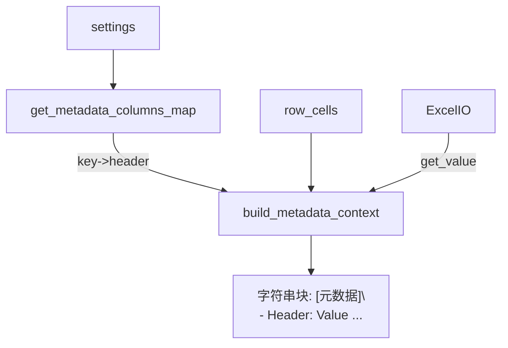

Status: In Progress

Objective / Summary
- 将 src/core/l0_image_description/main.py 中的 build_metadata_context 及其依赖抽取为 src/utils/metadata_context.py，作为共享能力，供多个模块复用。
- 保持对现有调用点的非破坏性（向后兼容相同函数签名与输出格式）。

Scope
- 新增: src/utils/metadata_context.py
- 修改: src/core/l0_image_description/main.py（删除私有实现，改为从 utils 导入）
- 新增测试: tests/utils/test_metadata_context.py（覆盖 Happy/Boundary/Error 场景）
- 可能受影响的使用点: 后续其他任务模块可直接 from src.utils.metadata_context import build_metadata_context

Detailed Plan
- 提取与改名（去私有前缀，统一命名）:
  - get_metadata_columns_map(settings: Dict) -> Dict[str, str]
    - 从 settings.data.excel.columns.metadata 读取新结构；回退兼容旧键（id_col/title_col/desc_col/persons_col/topic_col）。
  - recommended_metadata_order() -> List[str]
    - 默认顺序: ["id","title","desc","persons","topic","year","location","author","source"]
  - build_metadata_context(row_cells, cols: Dict[str,str], xio: ExcelIO, settings: Dict) -> str
    - 读取 key->header 映射
    - 字段顺序: tasks.long_description.metadata_fields 优先，否则按 recommended + 其余键自然顺序
    - 值读取: 使用 xio.get_value(row_cells, header)
    - 渲染: "[元数据]" 标题 + "- {header}: {val}" 列表
    - 日志: 记录非空字段计数与键集合
- main.py 迁移方式:
  - 删除 _get_metadata_columns_map 与 _recommended_order 的私有实现
  - 从 utils.metadata_context 导入 get_metadata_columns_map/recommended_metadata_order/build_metadata_context（仅实际使用 build_metadata_context 即可）
  - 其他逻辑不变
- 依赖与导入:
  - 复用现有 src/utils/excel_io.py 中的 ExcelIO、ExcelConfig
  - 复用 src/utils/logger.py 的 get_logger
- 可扩展性预留:
  - 后续可在 utils/metadata_context.py 中增加 build_unified_context 的共享实现（若有跨模块需求）

Visualization

Testing Strategy
- 单元测试 tests/utils/test_metadata_context.py：
  - Happy Path:
    - 提供包含 metadata 映射与若干非空值的假行，期望渲染出正确的文本块与顺序
  - Boundary:
    - 空映射 / 无任何非空值时返回空字符串
    - metadata_fields 包含不存在的键，应记录跳过且不报错
    - 旧结构（id_col 等）回退验证
  - Error:
    - 行中缺失列头时的容错（get_value 返回 None，不渲染）
- 现有任务流程的烟囱测试（可选，若成本可控）：
  - run 流程在读取同一 Excel 时，长描述/AltText/Keywords 的输入上下文与现状保持一致

Security Considerations
- 不记录敏感信息；日志仅包含键名与计数。严格避免输出 Excel 实际内容到日志以免信息泄露。

Implementation Notes
- 待开发阶段填写。