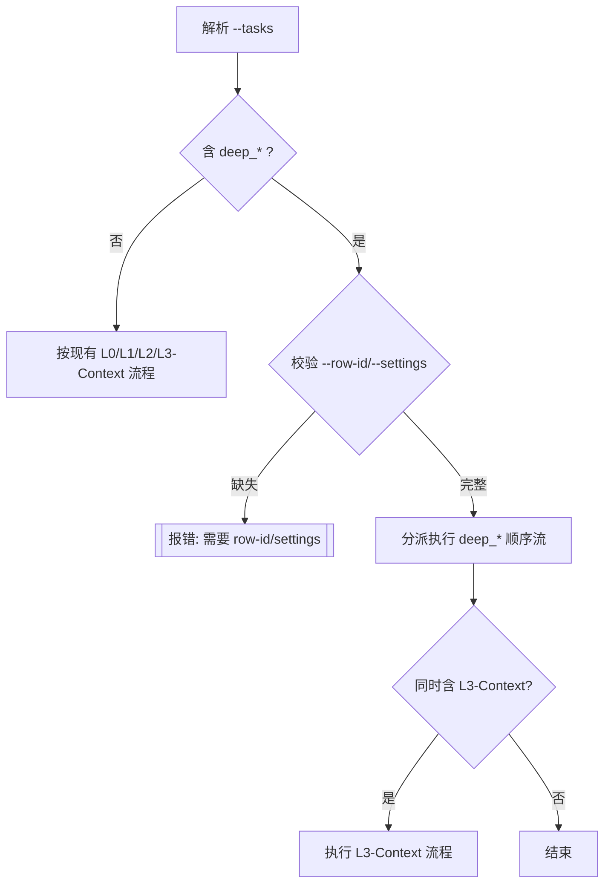

# 统一 deep_analysis 任务入口到 --tasks（L3 命名空间）

Status: Implemented
Date: 2025-10-08
Owner: assistant

## Objective / Summary
将 deep_analysis 的启动方式与项目其他模块统一，支持通过 `--tasks` 参数选择 `l3:deep_*` 任务，避免需要单独使用 `--task`。保留 `--task` 作为向后兼容。

## Scope
- 修改 `main.py`
  - 扩展 `--tasks` 的解析逻辑，识别 `l3:deep_planning / deep_jina / deep_dify / deep_report / deep_all`
  - 增加对 deepa 任务的分派与执行入口（与现有 `--task` 分支复用相同内部函数）
  - 改进帮助文本与日志提示
- 文档：本提案文档（新增）

## Detailed Plan
- 参数与兼容
  - `--tasks`：新增支持 `l3:deep_planning, l3:deep_jina, l3:deep_dify, l3:deep_report, l3:deep_all`
  - `--row-id` 与 `--settings` 继续作为全局参数保留，用于 deepa 分支
  - `--task` 旧参数保持不变，标注“兼容模式”，推荐统一到 `--tasks`
- 解析实现
  - 扩展 `_parse_tasks`：
    - 增加 `deep_phases: List[str]` 返回项（或在现有结构中额外返回）
    - 识别 `mod == "l3"` 且 `name_key` 以 `deep_` 开头时，归入 `deep_phases`
    - 不将 `deep_*` 纳入 `l3_phases`，避免与 `l3_context_interpretation` 混淆
  - 主流程：
    - 解析后，如 `deep_phases` 非空：
      - 校验 `--row-id` 与 `--settings`，缺失则抛出带操作建议的错误
      - 按顺序执行：
        - `deep_all`：调用 `run_deep_all(row_id, settings)`
        - 其他：逐个映射到 `_task_deep_planning/_task_deep_jina/_task_deep_dify/_task_deep_report`
      - 日志：`pipeline_l3_deep_enabled true phases=[...]`
    - 若同时存在 `l3_phases`（如 `rag`）与 `deep_phases`，则两者均执行，顺序为：
      - 既有的 L0/L1/L2
      - L3-Context（`run_l3`）
      - L3-Deepa（`deep_phases` 分派）
- 帮助与日志
  - `--tasks` 帮助追加示例：`"l3:deep_planning,l3:deep_report"`
  - 错误提示：缺 `--row-id` 时输出 `需要 --row-id（例如 2202_001）与 --settings` 的中文提示
- 兼容性
  - 继续支持 `--task deep_*`，内部逻辑与新入口共享同一实现

## Visualization

## Testing Strategy
- 单元测试（建议新增/调整）：
  - 正常：`--tasks "l3:deep_planning" --row-id 2202_001 --settings config/settings.yaml` 触发 `_task_deep_planning`
  - 组合：`--tasks "l3:rag,l3:deep_report"` 先 `run_l3` 再 `_task_deep_report`
  - 边界：缺 `--row-id` 时抛出清晰错误
  - 兼容：`--task deep_all` 仍可运行
  - 冲突去重：`--tasks "l3:deep_planning,l3:deep_planning"` 只执行一次
- 回归：确保原有 `l0/l1/l2/l3_context` 流程不受影响

## Security Considerations
- 不记录敏感信息（API Key/Token）到日志
- 继续沿用集中式日志器，统一输出到 `runtime/logs/`

## Implementation Notes
- main.py
  - 删除旧的 `--task deep_*` 参数与独立分派分支，统一从 `--tasks` 进入
  - 扩展 `_parse_tasks` 返回签名，新增 `deep_enabled, deep_phases`
  - 在 `mod == "l3"` 分支识别 `deep_planning/deep_jina/deep_dify/deep_report/deep_all`，与 `l3_context` 阶段解耦
  - 主流程在 L3 段之后新增 deepa 执行段：加载 `--settings`，顺序去重执行；支持 `deep_all`
  - `--row-id` 非必填：若未提供，自动从 `deep_analysis.output_dir` 推断
    - 对 `deep_planning/deep_all`：从单个实体 JSON（不以 `_deep.json` 结尾）推断
    - 对 `deep_jina/deep_dify/deep_report`：从单个 `_deep.json` 推断
    - 歧义或缺失时输出明确错误，提示显式提供 `--row-id`
- 日志
  - 新增 `deep_row_id_inferred` 与 `pipeline_l3_deep_enabled` 输出，风格与既有流水线一致
- 帮助
  - `--tasks` 帮助字符串补充示例：`l3:deep_planning`
  - `--row-id` 帮助标注“可选；未提供时尝试推断”
- 测试建议
  - 覆盖 `--tasks "l3:deep_planning"`、组合 `l3:rag,l3:deep_report`、无 `--row-id` 的推断成功/失败用例