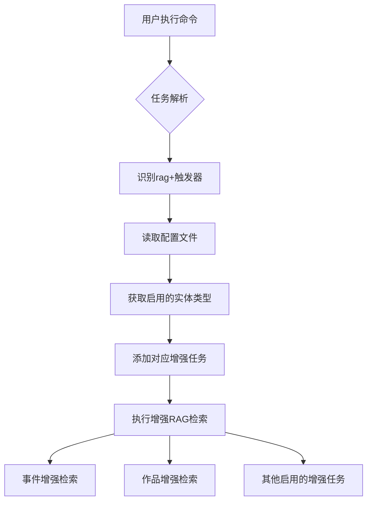

# 统一增强RAG检索触发器

## Status
Implemented

## Objective / Summary
为L3阶段的增强RAG检索功能添加统一的触发器`rag+`，简化用户操作。用户无需再记住具体的任务名称（如`enhanced_event`、`enhanced_work`等），只需使用`python main.py --tasks "rag+"`即可触发所有在配置文件中启用的增强RAG检索任务。

## Scope
- 修改了 [main.py](file:///f:/Github/Library-AI-demos/historical-image-deep-description/src/core/l3_context_interpretation/main.py) 文件，添加对`rag+`别名的支持
- 修改了 [src/core/l3_context_interpretation/main.py](file:///f:/Github/Library-AI-demos/historical-image-deep-description/src/core/l3_context_interpretation/main.py) 文件，增强任务解析逻辑以支持`rag+`统一触发器
- 更新了 [README.md](file:///f:/Github/Library-AI-demos/historical-image-deep-description/README.md) 文档，添加使用说明

## Detailed Plan
1. 在主程序的任务别名映射中添加`rag+`支持
2. 在任务解析逻辑中识别`rag+`并将其添加到L3阶段列表
3. 在L3模块的任务确定逻辑中实现`rag+`触发器功能：
   - 根据配置文件中的设置自动识别启用的增强RAG检索任务
   - 自动添加所有启用的增强任务到执行列表
4. 更新文档说明，指导用户如何使用`rag+`触发器

## Visualization

## Testing Strategy
创建了专门的测试脚本验证以下场景：
1. 传统任务触发（`enhanced_event`, `enhanced_work`）
2. `rag+`统一触发器功能
3. 混合任务触发（`rag+`与其他任务组合）
4. 配置禁用时的行为
5. 部分实体类型禁用时的行为
6. main.py集成测试

所有测试均已通过，验证了功能的正确性。

## Security Considerations
无特殊安全考虑。此功能仅是对现有任务触发机制的简化，不涉及新的安全风险。

## Implementation Notes
1. `rag+`触发器的设计遵循了配置驱动的原则，具体的任务启用/禁用完全由配置文件控制
2. 实现了向后兼容性，原有的任务名称仍然可以正常使用
3. 在配置禁用增强RAG检索时，`rag+`会输出警告信息但不会执行任何任务
4. 日志记录完整，便于调试和监控